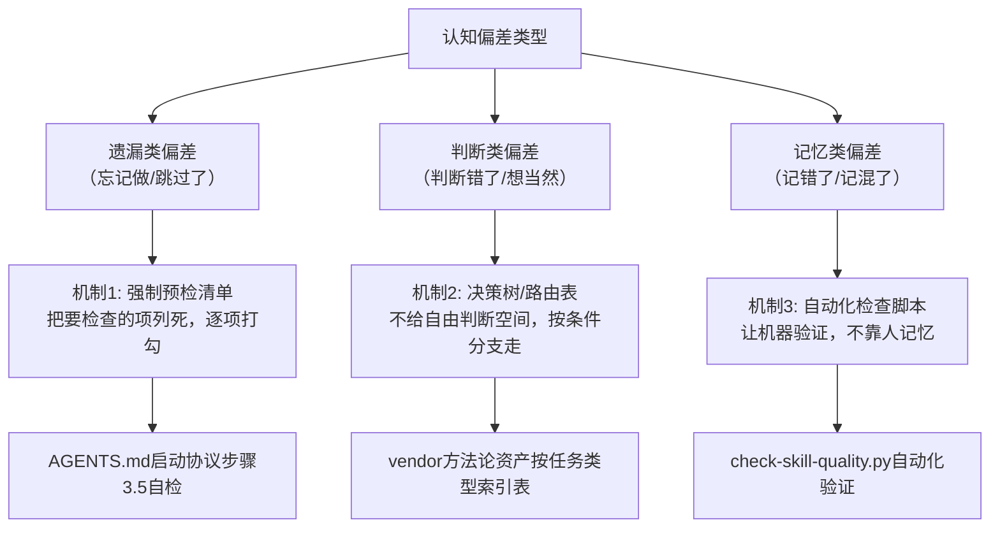

> **提炼自**：[insight-extraction.md](../../../reports/project-governance/tools-and-automation/retrospective-forum-posting-skill-optimization-20260629/insight-extraction.md) —— forum-posting Skill 优化复盘

# 可得性启发结构性防范模式（Availability Heuristic Structural Guard）

## 模式类型

方法论模式（治理策略/认知偏差对抗）

## 成熟度

L1 首次提炼（forum-posting Skill 优化实践验证）

## 适用场景

对抗"就近直觉"、"我记得没问题"、"上次就是这么做的"等系统性认知偏差；设计流程规范、检查清单、启动协议时，需要考虑到人/Agent会天然倾向于走捷径、跳过"看起来不重要"的步骤。

## 问题背景

**可得性启发（Availability Heuristic）**是认知心理学中的经典偏差：人们判断事情发生的概率时，会依赖"记忆中容易提取的例子"而非真实统计概率。

在AI协作和开发流程中，这表现为：
1. **就近直觉**：工作目录在根目录，就觉得"不需要检查vendor资产"
2. **路径依赖**：上次跳过某个步骤没出事，这次也觉得"没问题"
3. **浅尝辄止**：读了个开头就觉得"我知道了"，没仔细看路由表
4. **过度自信**："我记得规范内容，不用再读一遍"

这些**不是粗心，不是态度问题，是人类（和当前AI模型）天生的认知偏差**。靠"下次更认真"、"要注意啊"是解决不了的——必须用**结构性机制**来防范。

## 核心规则

### 规则 1：认知偏差不能靠意志力对抗，必须靠结构

| 错误做法（靠人自觉） | 正确做法（靠结构防范） |
|-------------------|---------------------|
| "要记得读vendor规范啊" | 启动协议增加步骤2.0"任务类型预检"，**强制**检查vendor资产映射表 |
| "读完规范要确认没遗漏" | 步骤3.5增加**自检清单**，逐项打勾才能继续 |
| "长会话后要重新读规范" | Context恢复时**自动触发**启动协议重执行提示 |
| "Description要写触发词啊" | check-skill-quality.py**自动检测**，没写直接扣分 |

> **为什么？** 意志力和注意力是有限资源，而流程执行应该是"无脑过检查清单"，不需要每次都消耗认知资源去判断"我要不要做这步"。

### 规则 2：三种结构性防范机制

针对不同类型的认知偏差，有三种有效的结构机制：

#### 机制1：强制预检清单（对抗遗漏类偏差）
- **应用场景**：容易忘记做、容易跳过的步骤
- **设计原则**：
  - 检查项≤7个（超过了人会跳过不看）
  - 是/否二元判断，不要开放问题
  - 放在流程的**必经节点**，无法绕过
- **实例**：AGENTS.md 步骤3.5自检清单

#### 机制2：决策树/路由表（对抗判断类偏差）
- **应用场景**：需要判断"我现在该做什么/该读什么"的场景
- **设计原则**：
  - 按**任务类型**索引，而非按资产类型组织（"如果任务是X，就读Y"）
  - 不超过3层判断
  - 给默认选项，减少决策负担
- **实例**：AGENTS.md vendor方法论资产表——按任务类型直接映射到必读资产，不需要Agent自己想"我应该找哪个文件"

#### 机制3：自动化检查脚本（对抗记忆类偏差）
- **应用场景**：规则明确、可以程序化验证的质量标准
- **设计原则**：
  - 给出0-100分量化评分，而非模糊的"不错"
  - 不仅指出问题，还给改进指引
  - 支持CI集成，作为提交前的质量门禁
- **实例**：check-skill-quality.py——自动检查五要素完整性

### 规则 3："默认做"比"选择做"有效

设置流程默认值时，应该让"正确的事"成为默认选项：
- ❌ 错误默认："你可以选择是否读vendor规范"（大多数人选不读）
- ✅ 正确默认："**必须**执行任务类型预检，以下是检查清单"（不做就违反协议）

> **为什么？** 惰性是强大的驱动力，让正确的路径成为阻力最小的路径。

### 规则 4：流程不是越多越好，要精准打击偏差点

不要为了"严谨"加一堆没用的流程：
- 只在**已经出过问题**、或者**出错成本极高**的节点加检查
- 每个检查点都要有明确对应的偏差类型
- 定期复盘检查点是否还有必要，如果长期不出问题可以考虑移除

## 实施检查清单

设计流程/检查点时自问：
- [ ] 这个检查点是在对抗什么具体的认知偏差？
- [ ] 它是强制预检/决策树/自动化检查三种机制中的哪一种？
- [ ] 检查项是否≤7个，是二元判断？
- [ ] 正确的事是不是默认选项？
- [ ] 有没有让Agent"自由判断"的模糊地带？（如果有，改成决策树）
- [ ] 这个检查点的执行成本是多少？成本>收益吗？

## 反例警示

| 反模式 | 为什么没用 | 改进方案 |
|-------|-----------|---------|
| "大家要注意啊，别忘了X" | 靠注意力和自觉，听一遍就忘 | 把X加到强制检查清单 |
| "相关规范在.agents/目录下，大家自己去看" | 人不知道该看哪个文件，容易错过 | 按任务类型做路由表，任务X直接映射到文件Y |
| "写Skill的时候description要写好" | 什么叫"写好"？没有标准 | 写自动化检查脚本，明确"必须包含必须使用此技能"等硬标准 |
| 20项的检查清单 | 太长了人会直接跳过 | 砍到≤7项，其他用自动化脚本检查 |

## 正例

本次forum-posting优化后建立的三重防护：
1. **强制预检**：AGENTS.md步骤2.0任务类型预检（不管工作目录在哪，都检查是否需要vendor资产）
2. **路由表**：vendor方法论资产按任务类型索引（优化Skill→必须读skill-creator）
3. **自检清单**：步骤3.5三个是/否问题，不确认不能继续
4. **自动化门禁**：check-skill-quality.py脚本验证质量

这四层结构共同对抗"就近直觉"、"我记得不用读"等认知偏差，不靠"更认真"，靠结构保证流程被正确执行。

## 与现有模式的关系

- `process-vs-experience-intuition.md`：本模式解释了为什么人/Agent会天然倾向于凭经验直觉——这是认知偏差，不是态度问题
- `nonlinear-correction-cost.md`：本模式解释了为什么值得花成本做结构防范——因为非线性返工成本远高于结构设计成本
- `three-layer-rule-enforcement.md`：本模式的三种结构机制对应三层规则执行的不同层面
