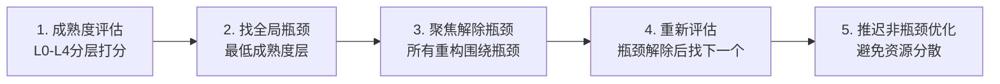

# 瓶颈优先重构法：按全局瓶颈而非实施难度排序重构优先级

## 模式概述

架构重构时容易陷入两个极端：要么"先改最容易的"（追求短期成就感），要么"全面重构"（追求完美）。瓶颈优先重构法要求先用成熟度模型评估各层，找到全局瓶颈（最低成熟度的层），所有重构围绕解除瓶颈展开，非瓶颈层的优化推迟。

## 问题现象

架构成熟度呈"倒瓶颈"分布：上层规范/角色/流程很成熟，底层基础设施完全缺失。此时即使上层做得再好，整体效能仍受限于最底层的缺失。但因为改底层"不直观"、"见效慢"，团队倾向于先改进已经不错的上层，陷入"锦上添花"陷阱。

## 解决方案：五步法



### 成熟度分层模型

| 等级 | 定义 | 特征 |
|------|------|------|
| **L0 缺失** | 完全没有，是空白 | Agent无法发现/使用该层能力 |
| **L1 规划** | 有概念/文档/定义 | 人类理解但Agent不可执行 |
| **L2 起步** | 有部分实现 | 可用但不稳定，缺乏标准化 |
| **L3 可用** | 完整实现+测试 | 稳定可用，有验证机制 |
| **L4 成熟** | 可复用+文档化+示例 | 成为基础设施，其他模块依赖 |

### 核心原则

1. **瓶颈优先级 > 实施难度**：不要因为瓶颈"难改"就跳过它去改容易的
2. **单瓶颈聚焦**：一次只解决一个瓶颈，避免平行推进导致资源分散
3. **瓶颈可迁移**：当前瓶颈解除后，原来的次瓶颈变成新瓶颈
4. **非瓶颈保护**：已经是L3/L4的层，除非必要不做重构

## 适用场景

- **架构升级**：从0到1建设规范体系时
- **技术债务偿还**：决定先还哪笔债时
- **平台能力建设**：多层级系统中确定建设顺序时
- **重构Sprint规划**：有限迭代周期内确定优先级时

## 实际案例

### 案例1：能力注册中心建设（首次验证）
架构成熟度评估结果：
- 角色/规则/工作流：L3-L4（成熟）
- Skill门面：L1（有定义未标准化）
- 能力发现/注册中心：**L0（完全缺失）← 全局瓶颈**

决策：先建注册中心（.agents/capabilities/），再封装Skill到注册中心。如果反过来先做Skill封装但没有注册中心，Agent仍然无法发现能力。

### 案例2：CLI编码鲁棒性修复（第二次验证）
测试体系中：
- 功能测试：L3（覆盖happy path）
- 性能基准：L2（已建立基线）
- **边界测试：L0（几乎没有）← 全局瓶颈**

决策：系统性补充边界测试（从17→50个cli测试），而非继续扩展功能测试用例。

## 反模式

### 反模式1：容易的先改
```
Sprint规划：
- [x] 改进日志输出格式（1天）← 容易，先做了
- [x] 优化命令行提示（2天）← 也不难
- [ ] 建立能力注册中心（2周）← 太难了，下个Sprint吧
```
结果：2个Sprint后日志和提示已经很美观，但Agent仍然找不到要用哪个Skill。

### 反模式2：全面重构
"既然要改，就一次性把所有层都重构了。"
结果：范围蔓延，所有层都改到一半，没有一个可用，反而降低了整体成熟度。

### 反模式3：局部优化
在L4成熟的层上继续投入资源做锦上添花的优化，而忽视L0/L1的瓶颈层。例如在角色定义已经很完善的情况下继续增加角色细分，但Agent根本发现不了这些角色。

## 与其他模式的关系

- **与no-touch-list互补**：瓶颈优先决定"改什么"，不重构清单决定"不改什么"，两者配合使用
- **与governance-tier-priority配合**：治理层级优先级提供了自底向上的参考顺序
- **以methodology-five-level-maturity为评估工具**：L0-L4成熟度模型是瓶颈识别的基础
- **triangular-source-verification提供评估输入**：三角验证法为成熟度打分提供多源证据

## 边界与选型

瓶颈优先法适用于"层级依赖明确"的系统（上层依赖下层能力）。对于网络效应系统（如社交平台、市场），各层互相依赖不形成单向瓶颈链，此模式不适用——此时应优先考虑"最痛点驱动"而非"最底层驱动"。

判断信号：
- ✅ 系统存在明显的层级依赖关系
- ✅ 可以对各层独立评估成熟度
- ✅ 资源有限需要排序
- ❌ 各模块平等协作无依赖关系
- ❌ 紧急线上bug（此时直接修bug而非系统重构）
