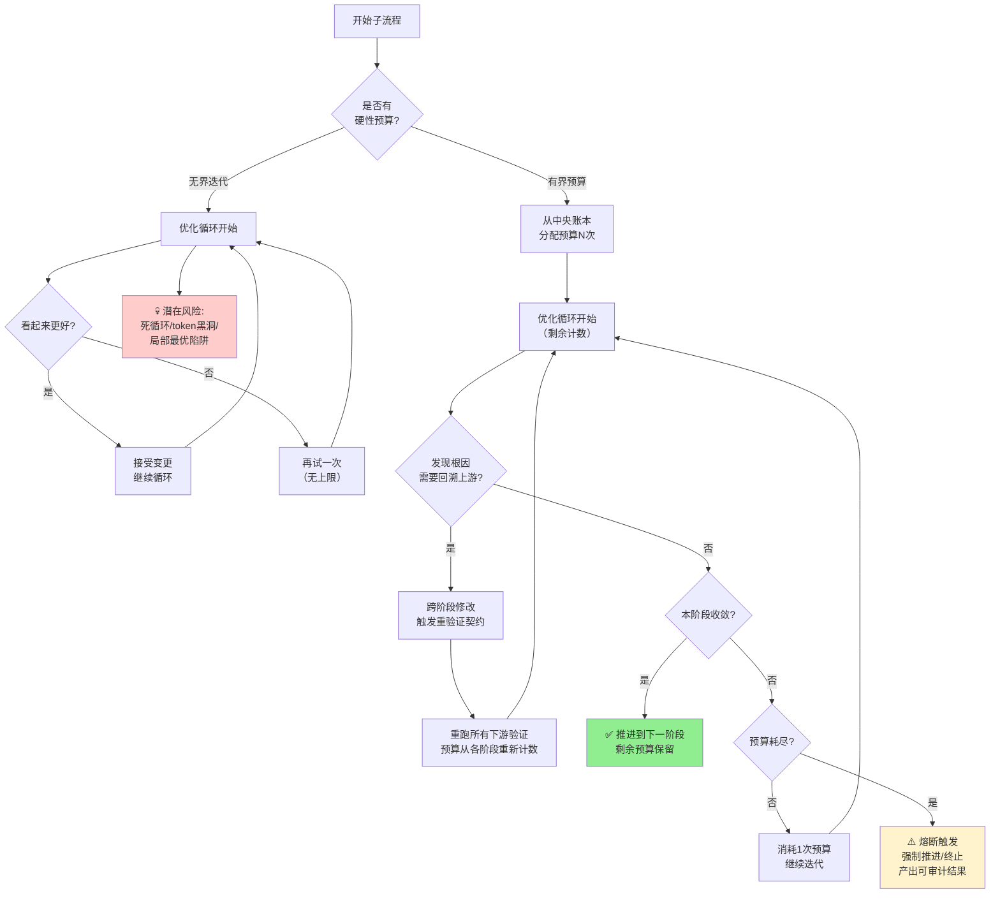

> **来源**：Agentrys AI多智能体芯片设计工作流洞察萃取（2026-07-28）——AgentCore芯片收敛过程中三个受治理迭代循环的设计分析
> **验证次数**：1次实战验证（ASAP7 7.5T工艺上AgentCore芯片36.34 MXLOPS/W、零DRC违规收敛）

# 有界迭代预算：长时程自主系统的强制收敛契约

## 模式概述

在设计长时程运行（数小时到数天）、无人值守的自主系统（多智能体工作流、自动化优化流水线、CI/CD自动修复机器人）时，**必须为每个可能进入循环的子流程设置明确的、强制执行的硬性迭代预算，配合中央预算账本统一管理，并允许跨阶段回溯反馈但要求修改后重验证**。迭代预算的核心作用不是"限制优化"，而是"强制收敛契约"——从机制上杜绝无限循环、token消耗黑洞、局部最优陷阱，确保无论优化是否找到全局最优，流程都会在预算耗尽时推进到下一阶段或终止。反直觉的是：预算的主要价值不是"被用完"，而是"作为安全垫存在"——上游质量足够好时，下游修复预算可以原封不动（0次消耗恰恰证明上游质量达标）。

## 核心命题

| 设计选择 | 收敛性 | 资源消耗 | 风险 | 典型场景 |
|---------|-------|---------|------|---------|
| **有界迭代预算（Bounded Budget）** | 必然收敛（预算耗尽强制推进） | 可控（有上限） | 可能未找到最优解，但保证有可交付结果 | 每个子系统预设N次迭代，预算耗尽熔断 |
| **无限优化（Unbounded Iteration）** | 可能不收敛（死循环/局部最优徘徊） | 无上限（token黑洞） | 无人值守时可能永远卡住，零产出 | "再优化一轮"例外、while(true)直到更好 |
| **简单重试（Simple Retry）** | 低概率收敛 | 快速消耗 | 重复同样错误，不学习不改进 | 失败后重试相同动作N次 |

**核心洞察**：长时程自主系统的核心矛盾不是"优化不够"，而是"无法停止"。传统思维认为"给智能体更多迭代次数总能得到更好结果"，但无人值守场景下真正的风险是局部最优陷阱、死循环、token消耗黑洞——智能体可能在一个无收益的方向上无限消耗。硬预算不是妥协，而是**强制收敛契约**：它给系统装上了"刹车"，确保流程有界、可预测、必然终止。

## 问题现象：无界迭代的典型特征

1. **"再试一次"的例外机制**：代码中到处是"如果没变好就再优化一轮"的逻辑，没有全局上限
2. **循环退出条件主观模糊**："足够好"、"看起来没问题"、"收敛了"等主观判断作为退出条件，机器无法验证
3. **token消耗无上限**：工作流运行时间越长成本越高，没有熔断机制，可能跑出天价账单
4. **阶段间硬隔离**："各阶段做好自己的事"，下游发现问题只能在本阶段绕圈子，无法回溯修改上游根因
5. **回溯后不重验证**：允许跨阶段修改但修改后不重跑下游验证，导致正确性被破坏
6. **无中央账本**：每个循环自己计数，没有全局视角看哪个阶段消耗了多少预算、哪个阶段0消耗说明上游质量好

## Agentrys实战案例：AgentCore芯片三个受治理循环

| 要素 | 内容 |
|------|------|
| 系统 | 五个子系统端到端自主芯片设计流程 |
| 三个受治理循环 | 设计验证·RCA修复：预算8次；后端·PPA收敛：预算12次；Sign-off·DRC修复：预算15次 |
| 实际消耗 | RCA修复0/8次，PPA收敛9/12次，DRC修复0/15次 |
| 中央账本 | 统一记录每个子系统的预算总额、已消耗、剩余次数 |
| 跨阶段反馈 | 后端发现PPA瓶颈可回溯修改前端微架构/RTL，修改后自动重跑完整验证套件 |
| 重验证契约 | 任何前序阶段修改后，必须重走所有下游关卡，在确认收益前重新建立位精确性 |
| 结果 | 数小时到数天无人值守运行，零DRC/天线违规，达到PASS-WITH-LIBRARY-WAIVERS Sign-off状态 |
| 关键观察 | 两个循环0次消耗——预算存在的价值是"吸收从未出现的问题"，而非必须用完 |

### 收敛机制对比

## 反模式：什么时候"灵活迭代"实际上是失控隐患

| 反模式做法 | 看起来 | 实际上 | 芯片设计案例 | 软件工程类比 |
|-----------|--------|--------|-------------|-------------|
| **"再优化一轮"例外机制** | "灵活，不僵化，给优化机会" | 每次"一轮"可能变成无数轮，例外变成常态，预算形同虚设 | "PPA还差一点，再跑3次搜索"→ 3次变30次，token消耗超预算10倍 | "测试还有 flaky，再重跑一次CI"→ 重跑掩盖真实问题，永远不修根因 |
| **阶段内闭环禁止回溯** | "解耦清晰，各管一段，边界明确" | 下游问题只能在本阶段打补丁，根因在上游却无法修复，越改越脏 | 后端发现时序问题只能在布线阶段绕线，无法回溯修改RTL微架构，导致面积膨胀30% | 测试发现bug只能在测试代码里workaround，不修复产品代码，技术债务越积越多 |
| **回溯后不重验证** | "快速迭代，节省时间，只重测相关部分" | 修改引入新问题但未被发现，正确性基础被破坏，下游基于错误制品继续工作 | 修改RTL后只重跑失败的测试用例，不跑完整回归→ 其他模块被破坏，Sign-off时才发现 | 修复一个bug后只跑相关单元测试，不跑集成测试→ 其他模块受影响，上线后出故障 |
| **预算大小拍脑袋** | "先设个大数，肯定够" | 预算太大等于没预算（1000次预算还是会无限跑）；预算太小导致过早熔断，错过收敛 | 给所有阶段统一设100次预算→ 简单阶段浪费资源，复杂阶段不够用 | 给所有修复任务统一设10次重试→ 简单修复浪费CI时间，复杂修复不够用 |
| **预算用完静默降级** | "预算耗尽就跳过，不阻塞主流程" | 跳过关键步骤产出有缺陷的制品，下游基于垃圾输入继续工作，污染扩大 | RCA修复预算耗尽直接通过→ 带bug的RTL进入后端，后端花3倍时间处理本可在前端修复的问题 | 代码检查预算耗尽直接merge→ 带lint错误/安全漏洞的代码进入主干，上线后出事 |

## 原则与规则

### 规则1：中央预算账本是唯一权威计数源

- 所有子系统/子流程的迭代预算统一登记在中央账本，包含：预算总额、已消耗次数、剩余次数、消耗原因
- 禁止各循环自己维护计数——全局视角才能看出哪个阶段0消耗、哪个阶段消耗超预期（上游有问题）
- 预算消耗率是**辅助**质量信号，不能单独作为质量判断依据：某修复循环0次消耗可能是上游质量好，**也可能是下游验证不充分、问题未被触发**，必须配合验证覆盖率、检查工具可信度等指标综合判断
- 0次消耗需要额外审计：确认验证充分性后才可认定为"上游质量达标"

### 规则2：预算是硬约束，没有"再优化一轮"的例外

- 预算耗尽时强制触发熔断：要么推进到下一阶段（带着当前最好结果），要么终止并输出可审计的失败报告
- 禁止代码中出现"if not good_enough: iterate_again()"这种无上限循环——所有循环必须绑定预算计数器
- 熔断不是"失败"，而是"有界终止"：产出当前能得到的最好结果，附带完整的迭代历史和溯源清单供人工介入

### 规则3：允许跨阶段回溯，但必须附带重验证契约

- 不搞"铁路警察各管一段"的阶段硬隔离：下游发现根因在上游时，允许自动回溯修改前序制品
- 回溯不是"回退"，而是"跨阶段修复"：修改后必须自动重跑**所有**下游验证关卡，不能只重跑失败的用例
- 重验证的预算从各下游阶段的预算中重新计数，不是免费的——回溯有成本，这天然抑制了不必要的回溯

### 规则4：预算大小按阶段风险预设，而非统一拍脑袋

- 高风险阶段（如芯片DRC修复、生产环境bug修复）分配较大预算
- 低风险阶段（如代码风格修复、文档格式检查）分配较小预算
- 修复类预算 > 优化类预算（修复错误比锦上添花更重要）
- 首次运行后根据实际消耗调整预算：某阶段连续3次0消耗 → 可以缩小该阶段预算；某阶段连续熔断 → 需要增大预算或改进上游质量

#### 初始预算参考值（冷启动适用）

| 阶段类型 | 风险等级 | 初始预算参考范围 | 说明 |
|---------|---------|----------------|------|
| 硬错误修复（DRC/编译错误/测试失败/生产bug） | 高 | 8-15次 | 必须修复才能推进，预算耗尽需熔断人工介入 |
| 指标优化（PPA/性能/覆盖率） | 中 | 5-12次 | 指标提升类，耗尽可用当前结果推进 |
| 根因定位与诊断 | 中 | 3-5次 | 用不同方法分析定位问题，超过则需人工辅助 |
| 代码/配置修改 | 中 | 3-8次 | 生成patch→验证的循环次数 |
| 回归测试/重验证 | 低 | 2-3次 | 修改后完整重跑验证套件的次数 |
| 风格/格式/文档类修复 | 低 | 2-3次 | 低风险快速修复，耗尽可跳过不阻塞 |

#### 冷启动策略

首次应用本模式时：
1. 使用上表的参考范围中值作为初始预算（如硬错误修复先设10次）
2. 连续运行3次后，根据实际消耗数据校准：
   - 平均消耗 < 预算的30% → 预算可下调30%
   - 平均消耗 > 预算的80% → 预算需上调50%
   - 熔断率 > 20% → 说明上游质量有问题，应改进上游而非单纯加大预算
3. 校准3-5次后预算进入稳定区间，后续仅在流程/工具/团队发生重大变化时重新校准

### 规则5：迭代历史完整保留，不丢弃任何尝试

- 每次迭代的输入、输出、决策理由、评分结果全部记录在仅追加日志中（配合[溯源驱动信任模式](../../architecture-patterns/provenance-driven-trust.md)使用）
- 熔断时必须输出：迭代了多少次、尝试了哪些方向、为什么没收敛、当前最好结果是什么、建议人工介入做什么
- 历史迭代数据是知识库的宝贵来源——系统从每次运行中学习，下次遇到类似场景可以更快收敛

### 规则6：区分"优化预算"和"修复预算"

| 预算类型 | 用途 | 耗尽后动作 | 例子 |
|---------|------|-----------|------|
| **优化预算** | 锦上添花，提升指标（PPA、性能、覆盖率） | 接受当前结果，推进到下一阶段（"足够好"是可以接受的） | PPA收敛预算耗尽→ 用当前最好的PPA结果继续Sign-off |
| **修复预算** | 必须修复的硬错误（DRC违规、测试失败、构建错误） | 熔断终止，输出完整报告请求人工介入（硬错误不允许带病推进） | DRC修复预算耗尽→ 不能Sign-off，必须人工介入 |

### 规则7：设置回溯风暴防护机制，防止连锁重验证导致预算雪崩

- **回溯深度限制**：单次运行中跨阶段回溯的最大深度不超过3层（如D→C→B→A是3层回溯，禁止更深），超过则熔断请求人工介入——过深的回溯说明问题根因不在局部，需要全局分析而非自动反复尝试
- **全局回溯预算**：除各阶段自身预算外，设置全局回溯总预算（建议为总阶段数的2倍），整个流程中跨阶段回溯总次数耗尽则终止
- **回溯成本预估**：触发回溯前先估算重验证成本（需要重跑多少下游阶段、预计消耗多少预算），如果预估成本超过剩余全局预算的50%，则不自动回溯而是直接告警请求人工决策
- **相同根因回溯抑制**：如果同一问题触发回溯≥2次且未解决，说明自动修复能力不足，第三次不再自动回溯而是熔断——避免在同一个根因上反复消耗预算

## 实现检查清单

在设计长时程自主工作流时，检查：

- [ ] 每个可能进入循环的子流程都有明确的硬性迭代预算（不是"足够好"这种主观条件）？
- [ ] 是否有中央预算账本统一记录所有阶段的预算和消耗情况？
- [ ] 预算耗尽时是否有明确的熔断机制（强制推进或终止），没有"再试一次"的例外代码路径？
- [ ] 是否允许跨阶段回溯修改上游制品？如果允许，修改后是否自动重跑所有下游验证？
- [ ] 重验证是否重新计算各阶段预算，而非"免费"修改？
- [ ] 预算大小是否根据阶段风险/类型预设（修复>优化，高风险>低风险），而非统一拍脑袋？
- [ ] 是否有初始预算参考值和冷启动校准策略？
- [ ] 每次迭代的完整历史是否都被记录（输入、输出、决策理由、评分）？
- [ ] 熔断时是否输出足够的审计信息（迭代次数、尝试方向、当前最好结果、未收敛原因）？
- [ ] 是否区分优化预算（耗尽可推进）和修复预算（耗尽需终止）？
- [ ] 预算消耗率是否仅作为辅助质量信号（需配合验证充分性审计）？
- [ ] 是否设置了回溯深度限制和全局回溯预算防止回溯风暴？

## 与其他模式的关系

| 关联模式 | 关系 | 说明 |
|---------|------|------|
| [multi-agent-closed-loop-execution.md](../../architecture-patterns/multi-agent-closed-loop-execution.md) | 互补（战略层vs战术层） | 闭环执行模式是**战术层**：解决单个智能体在单个步骤中的交互可靠性（秒/分钟级OODA循环，处理UI变化、动作失败等即时不确定性）；本模式是**战略层**：解决多智能体团队在长时程端到端流程中的收敛治理（小时/天级，处理无限循环、token黑洞、跨阶段依赖问题）。一个完整的长时程自主系统两者都需要：战术层确保每一步可靠执行，战略层确保整个流程最终收敛。闭环执行的replan机制在本模式的预算约束下运行——replan消耗迭代次数，不是无限重规划。 |
| [provenance-driven-trust.md](../../architecture-patterns/provenance-driven-trust.md) | 互相依赖 | 本模式的每次迭代历史、跨阶段修改记录、熔断审计信息需要溯源系统来保证完整性和不可篡改性；溯源系统为本模式的跨阶段重验证提供制品完整性校验基础。两者一起构成"有界+可信"的长时程自主治理基础设施。 |
| [fail-loud-over-silent-fallback.md](fail-loud-over-silent-fallback.md) | 思想同源 | 预算耗尽时的熔断显式报错（而非静默跳过有问题的阶段）是"显式报错优于静默降级"在长时程治理场景的具体应用。修复预算耗尽时不能"带病推进"，必须显式熔断请求介入。 |
| [nonlinear-correction-cost.md](nonlinear-correction-cost.md) | 理论基础 | 非线性修复成本是跨阶段回溯机制的理论依据：问题发现越晚修复成本越高，因此允许下游发现问题时回溯上游修复（即使重验证有成本），总比在下游打补丁的成本低。 |
| [root-cause-diagnosis.md](root-cause-diagnosis.md) | 配套使用 | 跨阶段回溯需要根因诊断能力支撑：不是发现问题就回溯，而是通过根因分析定位到真正的问题所在阶段后再触发回溯修改，避免盲目回溯浪费预算。 |

## 推广场景

本模式适用于所有长时程运行、无人值守的自主系统，不限于芯片/EDA领域：

| 推广场景 | 无界迭代的危害 | 有界预算的做法 |
|---------|--------------|--------------|
| **AI辅助软件工程（SpecWeave类系统）** | Agent写代码时陷入"改一个bug引入两个新bug"的无限循环；CI flaky时无限重跑掩盖真实问题；自动重构时在一个方向上无限优化越改越复杂 | 为需求分析、设计、编码、测试、修复各阶段设预算：自动修复bug设5次预算，5次修不好就停下来报告；CI重跑设2次预算，2次都失败就标记为需要人工看；重构优化设3次预算，3次没有明显改进就接受当前状态；允许测试阶段发现bug回溯修改设计/代码，但修改后必须重跑完整测试套件 |
| **DevOps自动化运维** | 自动扩缩容在阈值附近来回震荡无限次；自动故障切换在两个节点间乒乓切换；自动配置修复反复apply相同配置不收敛 | 自动扩缩容冷却机制+每日最大调整次数预算；故障切换设最大切换次数（如3次），超过就告警人工介入；配置收敛设N次尝试预算，没成功就回滚并告警 |
| **内容生成流水线（AI写作/视频生成）** | AI写文案反复修改越改越差；视频渲染参数搜索无限跑；A/B测试无限延长永远不选最优版本 | 文案修改设3次预算，3次不满意就用当前版本或请求人工提示优化；参数搜索设时间/迭代次数预算，到点用当前最好参数；A/B测试设固定样本量/时间预算，到点必须决策 |
| **自动化测试与Fuzzing** | Fuzzing无限跑永远不停止；自动生成测试用例无限生成不收敛；Flaky测试自动重试无限次 | Fuzzing设时间预算（如跑24小时），到点停止并输出找到的所有bug；测试用例生成设覆盖率目标+最大用例数预算，达到任一条件就停止；Flaky重试设2次上限，超过就标记为Flaky并创建ticket |
| **超参数优化（AutoML）** | 网格搜索/贝叶斯优化无限搜索不收敛；训练过程早停机制失效无限跑epoch | 设最大搜索次数/时间预算；训练设最大epoch+早停，但早停本身也有耐心度上限（如连续10轮没提升就停）；嵌套优化（搜索+训练）各层都要有预算 |

### 迁移示例详解：AI代码自动修复工作流

以AI辅助代码修复（如SWE-agent、AutoCodeRover类系统）为例，详细说明如何应用本模式：

1. **中央预算账本**：
   - 根因定位预算：3次（用不同方法分析堆栈/trace/日志定位根因）
   - 代码修改预算：5次（生成patch→运行测试→失败再改）
   - 回归测试预算：2次（修改后完整重跑测试套件）
   - 跨阶段回溯：允许测试发现根因是设计问题→ 回溯修改设计→ 重新生成代码→ 重跑测试（消耗各阶段预算）

2. **预算类型区分**：
   - 功能bug修复（修复预算）：5次改不好→ 熔断，输出完整诊断报告请求人工
   - 性能优化（优化预算）：5次没提升→ 接受当前代码，推进到下一阶段
   - Lint/格式问题（低风险）：2次预算，耗尽直接跳过不阻塞

3. **跨阶段回溯+重验证契约**：
   - 测试阶段发现"修改A导致B模块失败"→ 根因定位判断是设计问题→ 回溯到设计阶段修改→ 重新生成代码→ 完整重跑所有测试（不是只跑B模块）

4. **预算消耗率作为质量信号**：
   - 某类bug平均修复消耗0.5次预算→ Agent能力强，这类bug可以全自动处理
   - 某类bug平均消耗4.8次预算（接近上限）→ Agent在这类问题上能力不足，需要人工介入或改进prompt

5. **熔断处理**：
   - 修复预算耗尽→ 输出：尝试了哪些patch、每个patch为什么失败、当前最好的patch是什么、建议人工从哪个方向入手
   - 不静默标记为"修复失败"就跳过→ 显式告警，附带完整溯源历史

## Changelog

- 2026-07-28 | revise | 对抗性审查修正：(1)补充规则1中"0次消耗"指标的使用前提与审计要求；(2)在规则4后增加初始预算参考值表与冷启动策略；(3)新增规则7回溯风暴防护机制；(4)更新实现检查清单
- 2026-07-28 | create | 初始版本，从Agentrys AI芯片设计工作流洞察1+洞察2提炼，L1成熟度
