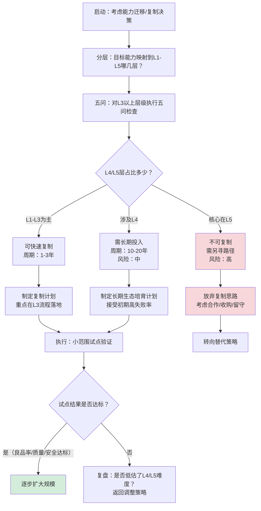

> **来源**：从华商韬略苹果630GB泄密事件洞察中萃取
> **原始案例**：苹果试图将iPhone产能从中国转移到印度，复制了工厂、设备、工人培训，却未能复制工业生态体系，导致50%良品率和大规模数据泄露

# 能力复制边界判断法

## 一、来源

苹果用20年两代人打造的供应链保密体系，在中国富士康26年不破，在印度塔塔合作不到3年即发生630GB核心数据泄露。同时，塔塔工厂iPhone外壳良品率仅50%（苹果标准是零缺陷），被迫将部分产线搬回中国，召回300名中国工程师救场。

这一事件揭示了一个被广泛忽视的规律：**能力是分层的，不同层级的能力复制难度有天壤之别**。厂房可以建，设备可以买，工人可以培训，但信任网络、生态密度、失败经验库和文化韧性无法通过招商引资或技术转移快速获得。

## 二、核心思想

在进行能力迁移（产业转移、组织扩张、方法论输出、中台复制、连锁扩张等）决策前，必须先判断目标能力属于哪一层，再评估复制的可行性和时间周期。避免"看到别人成功就以为可以快速复制"的认知偏差。

能力从易到难分为五层：

| 层级 | 名称 | 内容 | 复制难度 | 典型周期 |
|------|------|------|---------|---------|
| L1 | 硬件层 | 厂房、设备、流水线、工具、有形资产 | ⭐ 极低 | 1年 |
| L2 | 人力层 | 工人招聘、工程师招聘、基础人员配置 | ⭐⭐ 低 | 2-3年 |
| L3 | 流程层 | SOP、质量体系、保密制度、流程文档 | ⭐⭐⭐ 中 | 5-10年 |
| L4 | 生态层 | 供应商网络、信任关系、响应速度、地理聚集 | ⭐⭐⭐⭐ 高 | 20-30年 |
| L5 | 文化层 | 对高标准的敬畏、失败经验库、组织韧性、共生默契 | ⭐⭐⭐⭐⭐ 极高 | 一代人 |

**核心反常识结论**：大家以为的"优势=廉价劳动力/先进设备/完美SOP"是认知误区——**L1-L3层能力可以流动和采购，但L4-L5层能力必须靠时间在失败中生长**。

## 三、五问判断法

在做出复制/迁移决策前，依次问以下五个问题。只要有一个答案为"是"，就意味着该能力无法在短期内（<5年）复制，需要重新评估迁移策略。

```
决策前 → 五问检查 → 评估风险 → 决定是否迁移/如何迁移
```

| # | 判断问题 | 如果"是"意味着 |
|---|---------|--------------|
| 1 | 这个能力是否需要**长期信任关系**才能运转？ | 信任需要时间沉淀，无法靠合同/制度快速建立 |
| 2 | 这个能力是否依赖**地理聚集密度**（上下游一小时车程内）？ | 生态密度需要几十年产业演化，无法靠规划快速建成 |
| 3 | 这个能力是否包含大量**隐性失败经验**（踩过的坑、交过的学费）？ | 失败经验库是组织记忆，无法通过文档/SOP传递 |
| 4 | 这个能力是否需要**跨组织协同默契**（不用多说就知道怎么配合）？ | 协同默契需要无数次磨合，无法靠培训快速获得 |
| 5 | 这个能力是否涉及**文化/敬畏心层面**（对质量/标准的极致追求）？ | 文化是价值观和行为习惯的总和，一代人只能做一代人的事 |

## 四、操作步骤



## 五、典型误判与反模式

### 反模式1：成本账本谬误

**表现**：只算人力成本、土地成本、税收优惠，不算生态缺失成本、质量失败成本、信任重建成本、响应速度损失。

**案例**：苹果算印度人工成本比中国低30%，但没算良品率从99.9%降到50%的报废成本、数据泄露的品牌损失、72小时响应变成7天响应的机会成本。

**纠正**：做决策时必须做「全成本核算」，L4-L5层能力缺失的隐性成本，往往是L1-L3层显性成本节约的5-10倍。

### 反模式2：SOP万能论

**表现**：认为"只要把流程文档写清楚，招一批人培训3个月就能干"。

**纠正**：SOP只能写"正确的做法是什么"，但写不了"什么情况下会出问题"、"出了问题怎么救火"、"哪些微妙信号需要注意"——这些都在失败经验库里，只能靠踩坑获得。

### 反模式3：招商引资速成论

**表现**：政府/企业认为"给土地、给税收、给政策，3-5年就能复制一个硅谷/东莞"。

**纠正**：深圳/东莞从90年代到2020年代，用了30年才形成今天的生态密度；其中前15年都是在交学费、被客户骂、工厂倒闭再重来。想跳过这15年直接摘果子，是对工业规律的傲慢。

## 六、迁移案例库

### 案例A：制造业产能转移（原始案例）

- **决策**：苹果2018年开始将iPhone产能从中国转移到印度
- **五问检查结果**：
  1. 长期信任？✅ 是（苹果与中国供应商26年共生关系）
  2. 地理密度？✅ 是（深圳/东莞一小时供应链圈）
  3. 失败经验？✅ 是（30年被客户骂出来的质量敬畏）
  4. 协同默契？✅ 是（72小时响应的跨厂配合）
  5. 文化敬畏？✅ 是（对零缺陷标准的极致追求）
- **结果**：塔塔良品率50%，630GB数据泄露，部分产线迁回中国

### 案例B：互联网公司中台复制

- **决策**：某大厂把中台部门的"成功方法论"复制到新业务线
- **五问检查结果**：
  1. 长期信任？✅ 是（中台与业务线多年磨合）
  2. 地理密度？N/A（互联网线上协作）
  3. 失败经验？✅ 是（中台踩过无数坑才形成今天的方案）
  4. 协同默契？✅ 是（中台知道业务线"不说也懂"的需求）
  5. 文化敬畏？✅ 是（对技术债务、架构腐化的警惕）
- **结果**：新业务线用同样的SOP和工具，效率只有原团队的30%，因为没有那些"踩过坑的人"

### 案例C：咨询公司方法论交付

- **决策**：咨询公司给客户交付"最佳实践"PPT和SOP
- **五问检查结果**：
  1. 长期信任？N/A
  2. 地理密度？N/A
  3. 失败经验？✅ 是（咨询顾问知道哪些方案在什么情况下会死，但PPT里不会写）
  4. 协同默契？✅ 是（顾问团队内部知道怎么配合，但客户团队不知道）
  5. 文化敬畏？✅ 是（顾问对行业规律的敬畏，客户往往没有）
- **结果**：SOP落不了地，客户说"咨询顾问都是骗子，PPT好看没用"——不是方法不对，是L4-L5层没复制过去

### 案例D：连锁企业标准化扩张

- **决策**：某网红餐饮品牌开放加盟，3年开1000家店
- **五问检查结果**：
  1. 长期信任？✅ 是（创始团队与早期店长的信任）
  2. 地理密度？部分是（中央厨房辐射范围）
  3. 失败经验？✅ 是（早期店踩过的供应链、服务坑）
  4. 协同默契？✅ 是（创始团队对"什么情况该怎么处理"的直觉）
  5. 文化敬畏？✅ 是（对产品品质的坚持）
- **结果**：加盟店品质参差不齐，品牌口碑快速下滑，从网红变成"坑"

## 七、对个人发展的启示

这个模式不仅适用于组织决策，也适用于个人职业发展：

1. **打造个人L4-L5层能力**：不要只停留在"会用工具/懂流程"（L1-L3），要积累：
   - 行业人脉的信任网络（L4）
   - 自己踩过坑的"失败经验库"（L4）
   - 对专业标准的敬畏心（L5）
   这些才是真正不可替代的护城河。

2. **识别"速成陷阱"**：凡是告诉你"3个月精通XX"、"一年年薪百万"的课程，本质上都只能教你L1-L3层的东西。真正值钱的L4-L5层，没有速成。

3. **重视地理生态**：想做什么领域，就去那个领域的"东莞/深圳"（比如做AI去北京/上海，做电商去杭州，做硬件去深圳）——生态密度带来的信息优势和响应速度，是孤立个体无法比拟的。

## 八、验证标准

使用本模式后，决策质量提升的标志：

| 标志 | 说明 |
|------|------|
| 决策前明确标注能力层级 | 不再笼统说"复制XX能力"，而是清楚说"我们要复制的是L1-L3层，L4-L5层需要本地化重建" |
| 时间预期合理 | 不再相信"3年赶英超美"，而是给出符合层级规律的时间预期（L1=1年，L3=5年，L4=20年） |
| 风险预案充分 | 针对L4-L5层缺失有明确的应对方案（比如派老员工驻场、接受初期高失败率、分阶段推进） |
| 不盲目追求"自主可控" | 对L5层能力，放弃"全部自己做"的执念，考虑通过合作、收购、保留原有团队等方式获取 |

## 九、关联模式

- [root-cause-diagnosis.md](root-cause-diagnosis.md) — 根因诊断模式：能力复制失败后，用5-Whys追溯是否误判了能力层级
- [three-level-problem-solving.md](three-level-problem-solving.md) — 三层问题解决法：与能力五层模型对应，不同层级问题用不同解法
- [learn-validate-adopt.md](learn-validate-adopt.md) — 学习-验证-采用循环：能力引入时不能直接照搬，必须经过小范围验证
- [nonlinear-correction-cost.md](nonlinear-correction-cost.md) — 非线性修正成本：L5层问题越晚发现，修正成本呈指数级上升

> 来源验证：本模式从苹果印度泄密事件单一案例萃取，maturity=L1。需要在更多产业转移、组织扩张、方法论输出场景中验证和完善。
