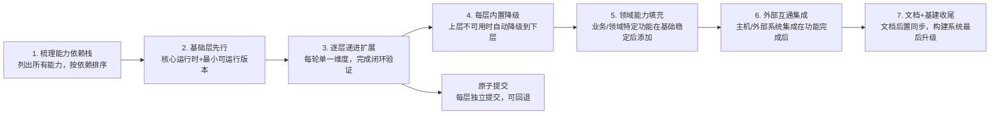

# 能力栈渐进构建（Capability-Stack-Progressive-Building）

## 模式概述

构建复杂工具/平台/系统时最常见的失败模式是"大爆炸式集成"：试图在一个版本中同时实现运行时、API、业务逻辑、文档、构建系统等所有能力，结果因为多维度同时变更导致问题定位困难、回退代价巨大、文档与代码不一致。

能力栈渐进构建模式要求：**先梳理能力依赖栈，按"被依赖者优先"的顺序逐层实现，每轮只添加一个能力维度，完成一个闭环后再进入下一层；文档后置、基建最后、原子提交可回退**。

## 触发场景

- 当构建新的开发工具、容器环境、CLI平台、SDK框架等需要多维度能力的系统时
- 当需要为现有系统增量添加多个独立能力维度时
- 当项目需要经历"从0到1→从1到N"的多轮迭代，且每轮迭代需要可验证、可回退时
- 适用于：工具类项目、开发环境、平台框架、集成系统
- 不适用于：紧急Hotfix、纯重构（不改变行为）、 trivial功能添加、纯文档更新

## 核心做法（七步法）



### 步骤详解

| 步骤 | 目标 | 关键原则 | 验证方式 |
|------|------|---------|---------|
| **1. 梳理能力依赖栈** | 列出所有需要的能力维度，绘制依赖关系图 | 被依赖的能力在栈的下层，依赖其他能力的在上层 | 依赖图无循环依赖，每层依赖明确 |
| **2. 基础层先行** | 实现核心运行环境，建立最小可运行版本（MVP） | 只包含最基础的运行时+入口，不添加任何业务能力 | `invoke run`/`hello world` 可正常工作 |
| **3. 逐层递进扩展** | 按依赖顺序，每轮只添加一个能力维度 | 每轮完成后必须形成可验证的闭环（测试+可运行），再进入下一轮 | 每轮提交后现有功能全部正常，新能力可演示 |
| **4. 每层内置降级** | 为每层能力提供降级方案，提高环境适应性 | SDK→声明式编排→CLI 三层优先级，上层不可用时自动降级 | 在缺少依赖的环境中工具仍能以降级模式工作 |
| **5. 领域能力填充** | 添加业务/领域特定功能 | 领域能力依赖下层基础能力，不要与基础层混写 | 领域功能模块化，与基础运行时代码分离 |
| **6. 外部互通集成** | 实现与主机/外部系统的互通 | 开发模式透传、volume mount、API集成等在内部功能稳定后添加 | 主机-容器/系统-外部文件互通正常工作 |
| **7. 文档+基建收尾** | 功能全部稳定后同步文档、升级构建系统 | 文档在功能完成后统一更新（避免边写边改不一致）；构建系统迁移在功能冻结后进行 | README/AGENTS.md 与实际功能一致；构建系统升级后所有测试通过 |

### 依赖栈分层参考（工具类项目通用）

从下到上（下层先做，上层后做）：

```
7. 构建系统层（最后升级）
   └── 构建后端、打包、发布配置
6. 文档层（功能稳定后同步）
   └── README、AGENTS.md、使用指南
5. 外部互通层（功能完成后）
   └── 主机透传、外部系统集成、volume mount
4. 领域能力层（基础稳定后）
   └── 业务特定功能、领域工具集成
3. 声明式编排层（API层之后）
   └── YAML配置、compose、多组件编排
2. 程序化API层（基础层之后）
   └── SDK封装、API接口、可编程能力
1. 基础运行时层（最先做）
   └── 核心运行环境、入口命令、基础配置
0. CLI兜底层（贯穿始终）
   └── 命令行调用作为所有上层的降级备选
```

**关键原则**：
- **单一维度原则**：每轮迭代只添加一个能力维度，不要同时改SDK+编排+业务逻辑
- **闭环验证原则**：每轮完成后必须有可运行、可验证的产出，不能"半拉子"进入下一轮
- **原子回退原则**：每轮变更对应一个原子提交，出问题可快速回退到上一稳定状态
- **文档后置原则**：功能稳定后再统一写文档，避免边开发边改文档导致不一致
- **基建最后原则**：构建系统、工具链等基础设施升级在功能冻结后进行，不要在功能快速迭代期改构建

## 反模式（不要这么做）

### ❌ 反模式1：大爆炸式集成
```
// 错误：第一次提交就包含运行时+SDK+compose+ML模型+文档+构建系统
// 同时修改20+文件，出问题时无法定位是哪一层的问题
R0: Initial commit (all features in one)
```
问题：多维度同时变更，调试空间爆炸；回退必须回退所有功能；哪个功能在哪个提交里完全不清楚。

### ❌ 反模式2：先迁移构建系统再做功能
```
// 错误：项目第一天就把setuptools改成scikit-build-core，然后在功能迭代中反复调整构建配置
R0: Migrate to scikit-build-core
R1: Add SDK (broken build, need to adjust CMake again)
R2: Add compose (broken build again)
```
问题：功能快速迭代期构建配置会反复变化，提前迁移做无用功；构建问题阻塞功能开发。

### ❌ 反模式3：文档与代码并行
```
// 错误：每轮功能迭代都同步更新文档
R1: Add SDK + update README
R2: Add compose + update README
R3: 发现R1的SDK API设计错了需要改，但README里已经按错误API写了文档
```
问题：API和功能在迭代中会调整，边写边改文档导致大量重复修改；容易出现文档与最终代码不一致。

### ❌ 反模式4：无降级机制
```python
# 错误：只提供podman-py SDK，没有CLI降级
import podman
client = podman.from_env()  # 环境中没装podman-py直接崩溃，没有fallback
```
问题：在SDK不可用的环境（如服务器、CI、用户没装依赖）中工具完全无法工作，环境适应性差。

### ❌ 反模式5：跳步（领域能力先行）
```
// 错误：基础运行时还没稳定就开始写ML模型逻辑
R0: Initial framework
R1: Add OMLMD ML model integration （跳过SDK/compose层）
R2: 发现ML模型逻辑直接调用subprocess，难以测试和扩展，需要重构成SDK模式
```
问题：下层能力缺失时上层只能用临时方案（如直接subprocess调用），后续重构成本高。

## 检验标准

做完之后怎么知道做对了？

1. **提交历史清晰**：`git log` 中每个提交对应一个能力维度，提交信息明确说明"添加XX能力"，可以通过 `git show <commit>` 清晰看到该层添加了什么
2. **每轮可独立运行**：任意相邻两个提交之间checkout出来都能正常工作，不会出现"中间提交是broken状态"
3. **回退演练成功**：发现某层有问题时，`git revert <commit>` 可以干净回退该层，不影响其他层功能
4. **降级机制有效**：卸载SDK依赖后工具能自动降级到CLI模式正常工作；缺少compose时能直接调用Podman
5. **文档与代码一致**：功能全部完成后一次性更新文档，文档中描述的命令/配置都能在代码中找到对应实现
6. **构建系统稳定**：构建系统迁移后不再需要为了适配新功能而修改构建配置

## 迁移示例（跨领域验证）

这个模式还能用在什么其他场景？

### 示例1：Web应用开发（非容器领域）
- L1 基础层：Web框架+数据库连接+健康检查接口可运行
- L2 API层：ORM封装、Service层、REST API基类
- L3 编排层：中间件、路由组织、依赖注入
- L4 领域层：用户、订单、商品等业务模块
- L5 互通层：第三方登录、支付、消息队列集成
- L6 文档层：API文档、部署文档、用户手册
- L7 构建层：Docker镜像、CI/CD流水线、性能优化

### 示例2：CLI工具开发
- L1 基础层：参数解析、help命令、基础日志可运行
- L2 API层：核心功能封装为可调用函数/类
- L3 配置层：配置文件支持、环境变量、多环境配置
- L4 插件层：插件系统、第三方扩展机制
- L5 互通层：shell补全、与编辑器/IDE集成
- L6 文档层：man page、tutorial、cookbook
- L7 打包层：PyPI/RPM/Homebrew发布、签名、自动更新

### 示例3：数据分析/ML项目
- L1 基础层：数据加载、验证、可运行的最小pipeline
- L2 API层：特征工程API、模型训练API封装
- L3 编排层：DAG/流水线编排、实验追踪
- L4 领域层：具体模型、业务特征、评估指标
- L5 互通层：模型服务化、A/B测试、数据回流
- L6 文档层：模型卡片、实验报告、部署指南
- L7 构建层：训练镜像、推理镜像、MLOps流水线

### 示例4：个人知识管理系统（非软件领域）
- L1 基础层：笔记存放目录、命名规范、基础编辑器可写
- L2 API层：笔记模板、标签体系、链接约定
- L3 编排层：目录结构、索引页、MOC（Map of Content）
- L4 领域层：各领域笔记（工作/学习/生活）
- L5 互通层：与日历/任务管理/网页剪藏集成
- L6 文档层：使用指南、工作流说明
- L7 基建层：同步备份、全文搜索、发布流程

## 边界条件与不适用场景

| 场景类型 | 为什么不适用 | 替代方案 |
|---------|-------------|---------|
| **紧急Hotfix/P0线上故障** | 线上故障需要分钟级修复，分层迭代的时间成本不可接受 | 直接修复+事后补测试；修复后再做预防 |
| **纯重构/代码风格调整** | 不改变行为的重构（重命名、提取函数）所有改动语义等价，无"能力维度"区分 | 使用机械重构工具+回归测试即可 |
| **配置/参数调优** | 超参数调整、阈值改变等不涉及能力维度增减，回滚只需改配置 | A/B测试，单PR即可 |
| **trivial功能（≤50行代码）** | 简单功能添加（如加一个命令、加一个配置项）风险极低，分层是过度工程 | 直接实现+测试+提交，遵循原子提交即可 |
| **Hackathon/原型验证** | 原型验证阶段目标是快速验证想法，不需要长期可维护性 | 怎么快怎么来，原型验证通过后如果要产品化再按本模式重构 |
| **Spike/技术调研** | 技术调研的目标是探索未知，产出是结论而非可交付产品 | 调研完成后根据结论决定是否产品化，产品化时再按本模式 |

## 早期预警信号

以下信号出现时，说明你正在偏离能力栈渐进构建模式：

| 信号 | 含义 | 应采取行动 |
|------|------|-----------|
| 单次PR同时修改了运行时+API+业务逻辑 | 多维度同时变更，违反单一维度原则 | 拆分为多个独立PR，每个PR只加一个能力维度 |
| 文档在多个提交中反复修改同一功能 | 功能没定型就写文档，导致文档随代码反复变 | 回退文档修改，等功能稳定后一次性更新 |
| 构建配置在功能迭代期频繁修改 | 构建系统提前迁移或与功能并行开发 | 构建配置冻结，功能完成后再统一升级 |
| 缺少某个依赖时工具直接崩溃无提示 | 没有降级机制，环境适应性差 | 添加降级逻辑和友好的错误提示 |
| 某个提交checkout出来无法运行 | 没有做到每轮闭环验证，存在broken commit | 修复该提交或拆分为更小的原子提交 |
| 想回退某个功能但必须连带回退其他功能 | 提交不是原子化的，功能间耦合太紧 | 重新组织提交，确保每个功能维度独立可回退 |

## 来源

- 复盘报告：[retrospective-jupyter-podman-rootless-seven-rounds-20260827](../../../reports/build-engineering/retrospective-jupyter-podman-rootless-seven-rounds-20260827/README.md)（R0-R7七轮迭代实践）
- 相关洞察：I1「渐进式能力扩展优于大爆炸式集成」
- 相关模式：[phased-incremental-optimization](phased-incremental-optimization.md)（性能优化场景的渐进策略）

## Changelog

<!-- changelog -->
- 2026-08-27 | feat | 从Jupyter Podman Rootless七轮优化复盘萃取，L1-draft单案例待验证
