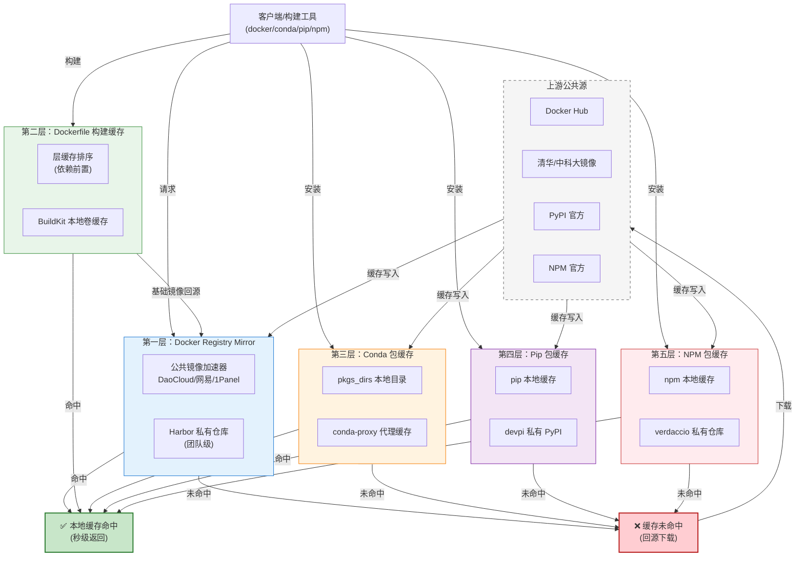

# 本地依赖缓存代理体系 - 五层缓存架构图

## 图例

| 颜色 | 层级 | 说明 |
|------|------|------|
| 🔵 蓝色 | 第一层 | Docker Registry Mirror - 镜像层缓存 |
| 🟢 绿色 | 第二层 | Dockerfile 构建缓存 - 指令层缓存 |
| 🟠 橙色 | 第三层 | Conda 包缓存 - Python 环境缓存 |
| 🟣 紫色 | 第四层 | Pip 包缓存 - Python 包缓存 |
| 🔴 红色 | 第五层 | NPM 包缓存 - Node.js 包缓存 |
| ✅ 绿色 | 快路径 | 本地缓存命中（秒级返回） |
| ❌ 红色 | 慢路径 | 缓存未命中（回源下载） |
| ⚪ 灰色虚线 | 上游源 | Docker Hub、清华镜像、PyPI、NPM 官方 |
