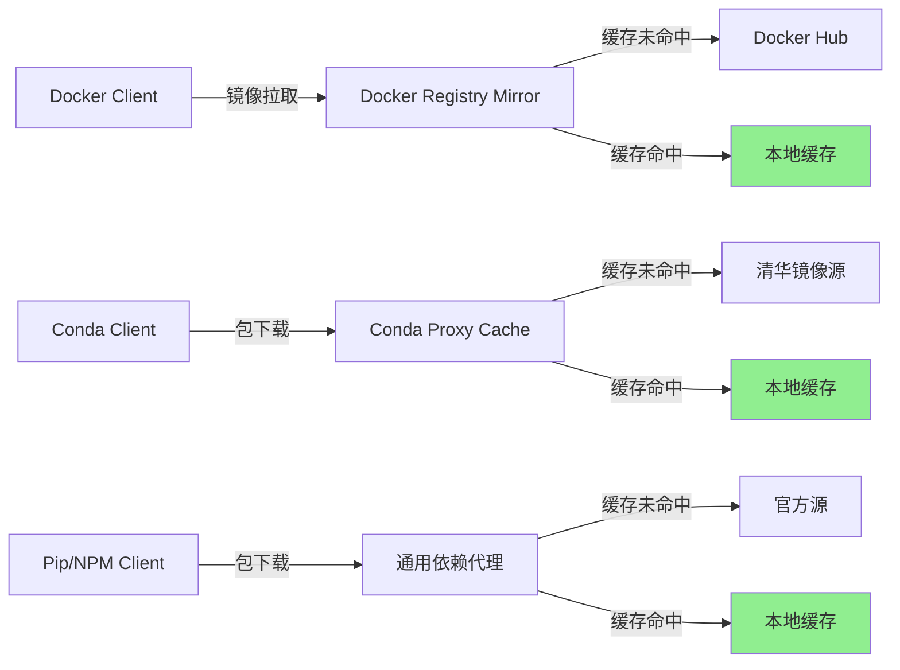

# 本地镜像缓存与依赖代理配置方案

## 一、背景与目标

### 1.1 问题背景

在 TVM 构建过程中，遇到以下网络相关问题：
- Docker 基础镜像拉取超时（`continuumio/miniconda3:latest`）
- Conda 依赖安装受网络波动影响（中科大源连接不稳定）
- 重复构建导致大量网络请求，浪费带宽和时间

### 1.2 目标

建立本地镜像缓存和依赖代理体系，实现：
- **缓存加速**：首次拉取后本地缓存，后续构建秒级完成
- **网络隔离**：减少对外部网络的依赖，提升构建稳定性
- **团队共享**：缓存可在团队内共享，降低整体网络开销

---

## 二、方案架构



---

## 三、Docker Registry Mirror 配置

### 3.1 使用 Docker Hub 官方镜像加速器

**配置文件**：`/etc/docker/daemon.json`（Linux）或 `C:\ProgramData\docker\config\daemon.json`（Windows）

```json
{
  "registry-mirrors": [
    "https://docker.m.daocloud.io",
    "https://docker.1panel.live",
    "https://hub-mirror.c.163.com"
  ],
  "insecure-registries": [],
  "log-driver": "json-file",
  "log-opts": {
    "max-size": "100m",
    "max-file": "3"
  }
}
```

**配置说明**：
- `docker.m.daocloud.io`：DaoCloud 镜像加速器（推荐）
- `docker.1panel.live`：1Panel 镜像加速器
- `hub-mirror.c.163.com`：网易镜像加速器

**生效命令**：

```bash
# Linux
sudo systemctl daemon-reload
sudo systemctl restart docker

# Windows (PowerShell)
Restart-Service docker
```

### 3.2 使用 Harbor 自建私有仓库

**部署 Harbor**：

```yaml
# docker-compose.yml
version: '3.8'
services:
  harbor:
    image: goharbor/harbor-offline-installer:v2.11.0
    container_name: harbor
    restart: always
    ports:
      - "80:80"
      - "443:443"
      - "5000:5000"
    volumes:
      - ./harbor-data:/data
      - ./harbor-config:/config
```

**配置 Docker 使用 Harbor**：

```json
{
  "registry-mirrors": [
    "https://harbor.example.com"
  ],
  "insecure-registries": [
    "harbor.example.com:5000"
  ]
}
```

**推送镜像到 Harbor**：

```bash
docker tag npu-tvm-build:latest harbor.example.com/tvm/npu-tvm-build:latest
docker push harbor.example.com/tvm/npu-tvm-build:latest
```

---

## 四、Conda 镜像缓存配置

### 4.1 使用 Conda 本地缓存目录

**修改 Conda 配置**：

```yaml
# ~/.condarc
channels:
  - defaults
show_channel_urls: true
channel_priority: flexible
default_channels:
  - https://mirrors.tuna.tsinghua.edu.cn/anaconda/pkgs/main
  - https://mirrors.tuna.tsinghua.edu.cn/anaconda/pkgs/r
  - https://mirrors.tuna.tsinghua.edu.cn/anaconda/pkgs/msys2
custom_channels:
  conda-forge: https://mirrors.tuna.tsinghua.edu.cn/anaconda/cloud
remote_connect_timeout_secs: 60
remote_read_timeout_secs: 300
remote_max_retries: 10

# 本地缓存配置
pkgs_dirs:
  - /path/to/local/conda-cache
```

**配置说明**：
- `pkgs_dirs`：指定本地缓存目录，多个路径按顺序查找
- 首次安装时下载到缓存目录，后续安装直接使用缓存

### 4.2 使用 Conda-Proxy 自建代理

**安装 conda-proxy**：

```bash
pip install conda-proxy
```

**启动代理服务**：

```bash
conda-proxy serve \
  --port 8080 \
  --cache-dir /path/to/conda-proxy-cache \
  --backend-url https://mirrors.tuna.tsinghua.edu.cn/anaconda
```

**配置 Conda 使用代理**：

```yaml
# ~/.condarc
default_channels:
  - http://localhost:8080/anaconda/pkgs/main
  - http://localhost:8080/anaconda/pkgs/r
  - http://localhost:8080/anaconda/pkgs/msys2
custom_channels:
  conda-forge: http://localhost:8080/anaconda/cloud
```

---

## 五、Docker 镜像本地缓存方案

### 5.1 使用 Docker Build Cache

**修改 Dockerfile 优化缓存利用**：

```dockerfile
# 策略1：依赖层前置
FROM continuumio/miniconda3:latest

# 先复制 conda 配置，利用缓存
COPY docker/condarc /opt/conda/.condarc

# 先安装固定依赖，利用缓存
RUN conda create -n tvm-build python=3.14 -c conda-forge && \
    conda install -n tvm-build -c conda-forge \
        llvmdev=22 \
        llvm=22 \
        clang=22 \
        ninja \
        cmake>=3.18 && \
    conda clean -a -y

# 再复制项目文件（变化频繁）
COPY . /workspace/npu_tvm

# 最后执行编译（变化频繁）
RUN cd /workspace/npu_tvm && mkdir -p build && \
    cd build && \
    cmake .. -G Ninja && \
    ninja
```

**配置说明**：
- 将变化少的步骤放在前面，充分利用 Docker 构建缓存
- 依赖安装步骤在代码复制之前，避免代码变更导致依赖重新安装

### 5.2 使用 BuildKit 缓存挂载

**启用 BuildKit**：

```bash
export DOCKER_BUILDKIT=1
```

**修改 docker-compose.yml 使用缓存卷**：

```yaml
services:
  tvm-builder:
    build:
      context: ..
      dockerfile: docker/Dockerfile.conda
      cache_from:
        - npu-tvm-build:latest
        - type=local,src=/path/to/docker-build-cache
      cache_to:
        - type=local,dest=/path/to/docker-build-cache
```

**配置说明**：
- `cache_from`：从已有镜像或本地目录加载缓存
- `cache_to`：将构建缓存保存到本地目录

---

## 六、通用依赖代理配置

### 6.1 使用 squid 作为 HTTP 代理

**部署 squid**：

```yaml
# docker-compose.yml
services:
  squid:
    image: sameersbn/squid:3.5.27
    container_name: squid-proxy
    restart: always
    ports:
      - "3128:3128"
    volumes:
      - ./squid-cache:/var/spool/squid
      - ./squid.conf:/etc/squid/squid.conf
```

**squid.conf 关键配置**：

```conf
# 缓存目录
cache_dir aufs /var/spool/squid 10000 16 256

# 缓存大小限制（10GB）
maximum_object_size 1024 MB

# 允许访问的源
acl allowed_sources dstdomain .anaconda.com
acl allowed_sources dstdomain .pypi.org
acl allowed_sources dstdomain .npmjs.org
acl allowed_sources dstdomain .docker.io
http_access allow allowed_sources

# 日志配置
access_log /var/log/squid/access.log
cache_log /var/log/squid/cache.log
```

**配置系统使用代理**：

```bash
# Linux
export http_proxy=http://localhost:3128
export https_proxy=http://localhost:3128

# Docker 使用代理
echo '{
  "proxies": {
    "default": {
      "httpProxy": "http://localhost:3128",
      "httpsProxy": "http://localhost:3128"
    }
  }
}' > ~/.docker/config.json
```

### 6.2 使用 devpi 作为 PyPI 缓存

**部署 devpi**：

```yaml
# docker-compose.yml
services:
  devpi:
    image: devpi/server:6.5.0
    container_name: devpi-server
    restart: always
    ports:
      - "3141:3141"
    volumes:
      - ./devpi-data:/data
    environment:
      - DEVPI_SERVERDIR=/data
```

**配置 Pip 使用 devpi**：

```bash
pip install --index-url http://localhost:3141/root/pypi/+simple/ numpy
```

**配置 pip.conf**：

```ini
# ~/.pip/pip.conf
[global]
index-url = http://localhost:3141/root/pypi/+simple/
trusted-host = localhost
```

---

## 七、NPM 镜像缓存配置

### 7.1 使用 NPM 淘宝镜像

```bash
npm config set registry https://registry.npmmirror.com/
```

### 7.2 使用 verdaccio 自建 NPM 仓库

**部署 verdaccio**：

```yaml
# docker-compose.yml
services:
  verdaccio:
    image: verdaccio/verdaccio:5
    container_name: verdaccio
    restart: always
    ports:
      - "4873:4873"
    volumes:
      - ./verdaccio-data:/verdaccio/storage
```

**配置 NPM 使用 verdaccio**：

```bash
npm config set registry http://localhost:4873/
```

---

## 八、部署步骤

### 8.1 单节点快速部署（开发环境）

```bash
# 步骤1：配置 Docker Registry Mirror
echo '{
  "registry-mirrors": ["https://docker.m.daocloud.io"]
}' | sudo tee /etc/docker/daemon.json
sudo systemctl restart docker

# 步骤2：配置 Conda 镜像源
cat > ~/.condarc << 'EOF'
channels:
  - defaults
show_channel_urls: true
channel_priority: flexible
default_channels:
  - https://mirrors.tuna.tsinghua.edu.cn/anaconda/pkgs/main
  - https://mirrors.tuna.tsinghua.edu.cn/anaconda/pkgs/r
  - https://mirrors.tuna.tsinghua.edu.cn/anaconda/pkgs/msys2
custom_channels:
  conda-forge: https://mirrors.tuna.tsinghua.edu.cn/anaconda/cloud
EOF

# 步骤3：配置 Pip 镜像源
cat > ~/.pip/pip.conf << 'EOF'
[global]
index-url = https://pypi.tuna.tsinghua.edu.cn/simple
trusted-host = pypi.tuna.tsinghua.edu.cn
EOF

# 步骤4：配置 NPM 镜像源
npm config set registry https://registry.npmmirror.com/
```

### 8.2 团队环境部署

```bash
# 步骤1：部署 squid 代理
docker-compose up -d squid

# 步骤2：部署 devpi
docker-compose up -d devpi

# 步骤3：部署 Harbor（可选，需要域名和证书）
# 参考 Harbor 官方文档部署

# 步骤4：配置团队成员使用代理
echo 'export http_proxy=http://proxy.example.com:3128' >> /etc/profile
echo 'export https_proxy=http://proxy.example.com:3128' >> /etc/profile
source /etc/profile
```

---

## 九、验证与监控

### 9.1 验证 Docker 镜像缓存

```bash
# 查看镜像拉取日志
docker pull npu-tvm-build:latest

# 查看构建缓存命中情况
export DOCKER_BUILDKIT=1
docker build --progress=plain .
```

### 9.2 验证 Conda 缓存

```bash
# 查看 Conda 缓存目录
conda info --envs

# 查看缓存包数量
ls ~/miniconda3/pkgs/ | wc -l
```

### 9.3 监控 squid 缓存

```bash
# 查看缓存命中率
squidclient -h localhost mgr:info | grep "Cache hits"

# 查看缓存对象数量
squidclient -h localhost mgr:objects
```

---

## 十、注意事项

### 10.1 缓存清理

```bash
# 清理 Docker 无用镜像
docker system prune -a

# 清理 Conda 缓存
conda clean -a -y

# 清理 squid 缓存
squid -k rotate
squid -k reconfigure
```

### 10.2 缓存一致性

- **定期更新**：定期清理过期缓存，避免使用过期依赖
- **版本锁定**：在 Dockerfile 中明确指定依赖版本，避免缓存失效
- **缓存预热**：在团队环境中提前拉取常用镜像和依赖

### 10.3 安全考虑

- **私有仓库认证**：Harbor 等私有仓库需要配置认证
- **代理访问控制**：squid 等代理需要配置访问控制列表
- **镜像完整性验证**：使用 `docker verify` 验证镜像完整性

---

## 十一、配置文件清单

| 文件 | 用途 | 路径 |
|------|------|------|
| `daemon.json` | Docker Registry Mirror 配置 | `/etc/docker/daemon.json` |
| `.condarc` | Conda 镜像源配置 | `~/.condarc` |
| `pip.conf` | Pip 镜像源配置 | `~/.pip/pip.conf` |
| `docker-compose.yml` | 代理服务部署配置 | `docker/docker-compose.yml` |
| `squid.conf` | Squid 代理配置 | `./squid.conf` |

---

> **适用场景**：需要构建包含大量依赖的 Docker 镜像的团队或个人开发者
> **成熟度**：L1（单案例待验证）
> **建议**：在实际环境中验证后升级为 L2