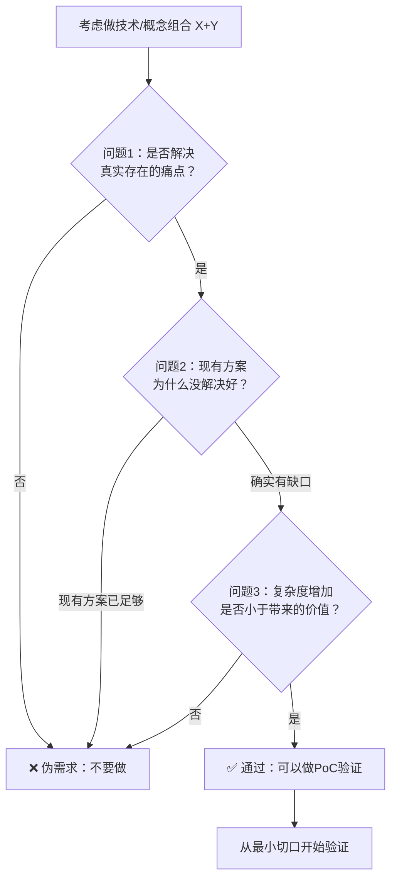

# 组合价值评估三原则（Combination Value Triple Test）

## 模式类型
方法论模式（治理策略/决策质量门禁）

## 成熟度
L1 草稿级（1次验证：Sphinx×GraphQL×OKF七概念分析会话，待更多案例验证升级）

## 问题陈述

技术/概念组合决策中存在三类系统性陷阱：

1. **技术拼盘陷阱（为组合而组合）**：把不同领域的技术（文档工具+API协议+开放理念）强行拼接在一起，认为"放一起就有价值"，实际上不解决任何真实痛点——历史上语义网运动等宏大架构的部分失败就源于此
2. **牛刀杀鸡陷阱（过度设计）**：用复杂方案解决简单问题，如为纯静态文档站搭运行时GraphQL服务器，而客户端搜索（Algolia/Meilisearch/Lunr.js）成本只有1/10且完全够用
3. **复杂度盲区（只看收益不看成本）**：只评估组合带来的理论价值，不评估增加的学习曲线、维护成本、认知负担——复杂度呈非线性增长（参见nonlinear-correction-cost），当复杂度超过阈值后会吃掉所有收益

这些陷阱共同作用时，会导致投入大量资源构建无人需要的"象牙塔架构"，机会成本极高——资源是有限的，投入伪需求意味着错失真正有价值的机会。

## 核心洞察（反常识）

> **方法论的价值不仅在于告诉你"应该做什么组合"，更在于告诉你"不应该做什么组合"。知道哪些组合是陷阱，比知道哪些组合有价值更重要。**

## 解决方案：三问测试

在决定投入资源实现任何技术/概念组合前，强制按顺序回答以下三个问题，**任何一个问题答"否"就不要做**：

### 三问测试流程



### 第一问：真实痛点测试（Pain Point Test）

| 检查维度 | 检查内容 | 通过标准 |
|---------|---------|---------|
| 痛点真实性 | 这个组合是否解决了一个真实存在的、有人愿意付费解决的痛点？ | 能说出具体是谁在什么场景下遇到什么问题，而不是"这个组合很酷/很先进" |
| 用户存在 | 有没有具体的目标用户在抱怨这个问题？ | 至少有1个真实用户表达过痛点，而不是"如果有人用的话会很好" |
| 付费意愿 | 是否有人/有团队愿意为这个解决方案投入资源（时间/金钱）？ | 有明确的需求方愿意承担成本，而不是"做完可能有人用" |

**❌ 不通过的典型信号**：
- "这个组合听起来很创新"
- "X和Y都是热门技术，放一起应该不错"
- "先做出来再说，总会有人用的"
- "为了开放/规范/未来而做，虽然现在没人用"

**✅ 通过的典型信号**：
- "XX用户反馈他们现在每次要花2小时手动查找这类信息"
- "我们团队内部每周都在这个问题上踩坑"
- "客户明确提出需要这个能力，愿意为此付费"

### 第二问：现有方案缺口测试（Gap Test）

| 检查维度 | 检查内容 | 通过标准 |
|---------|---------|---------|
| 替代方案 | 现有更简单的方案是什么？ | 能明确列出至少2种现有替代方案 |
| 缺口分析 | 现有方案为什么没解决好？是真的解决不了，还是我们不知道？ | 现有方案有明确的、具体的能力缺口，而非"不够新/不够酷" |
| 迁移成本 | 真的需要新组合吗？能不能在现有方案基础上小改解决？ | 现有方案确实无法通过增量改进解决问题 |

**❌ 不通过的典型信号**：
- "现有方案太老了，X技术更新更现代"
- "我就是想试试Y技术"
- 客户端搜索就能解决的问题，非要搭GraphQL服务器
- 文件级许可就够的场景，非要做行级许可嵌入

**✅ 通过的典型信号**：
- "现有方案需要跨多个服务聚合数据，REST需要N次调用，GraphQL联邦一次就能解决"
- "现有工具无法提供类型安全的查询，IDE无法自动补全，影响开发效率"
- "我们试过用XX方案改，但因为YY限制确实做不到"

### 第三问：复杂度-价值权衡测试（Complexity-Value Test）

| 检查维度 | 检查内容 | 通过标准 |
|---------|---------|---------|
| 价值量化 | 组合带来的价值是什么？能否大致量化（节省时间/减少错误/提升体验）？ | 能说出具体的收益，而非泛泛的"提升效率/更好体验" |
| 复杂度评估 | 增加了哪些复杂度？（学习曲线/维护成本/新依赖/认知负担） | 能明确列出增加的复杂度项，复杂度清单和价值清单都写下来对比 |
| ROI判断 | 复杂度增加是否小于带来的价值？ | 收益显著大于成本，而不是"差不多" |

**复杂度非线性警告**：
复杂度不是线性增长的——两个技术组合的复杂度不是1+1=2，而是接近乘法关系。因为：
- 你需要同时掌握两个技术
- 你需要处理两者之间的边界问题和集成bug
- 你需要调试跨技术栈的问题
- 团队每个人都需要理解整个组合
- 升级/维护任何一个都可能破坏组合

**❌ 不通过的典型信号**：
- 团队没人会GraphQL，要现学，但只是为了做个文档站
- 引入的新依赖树比现有项目所有依赖加起来还大
- 需要专门写文档解释这个组合怎么用，团队其他成员看不懂
- 维护这个组合需要一个人全职，而问题每周只发生一次

**✅ 通过的典型信号**：
- 团队已经熟悉X和Y，集成成本很低
- 解决的问题每周消耗团队10人时，而组合只需要1人周开发+每月0.5人天维护
- 现有用户强烈需要，愿意接受初期版本的不完美

## 伪需求清单（经验沉淀）

经过本次分析验证的典型伪需求：

| 伪需求类型 | 错误做法 | 正确替代方案 |
|-----------|---------|-------------|
| 运行时查询静态内容 | 搭GraphQL服务器查询静态文档 | 客户端搜索（Algolia/Meilisearch/Lunr.js） |
| 过度细粒度治理 | 许可信息嵌入每一行文档/代码 | 文件级/目录级许可即可 |
| 理念强制落地 | 把社会层协议（如开放理念）直接强制到写作/编码格式 | 工具层保证默认行为，不强制写作细节 |
| 为开放而开放 | 没有明确用户场景就做开放数据/开放API项目 | 先找到用户和痛点，再做开放设计 |
| 小项目宏大架构 | 小型项目用多技术全组合架构 | 继续用简单方案，知道"不做什么"更重要 |

## 适用场景

| 场景 | 适用度 | 说明 |
|------|--------|------|
| 跨领域技术组合（文档+API+开放协议） | 核心场景 | 本次验证场景，完美匹配 |
| 新技术引入评估（是否要引入XX框架） | 核心场景 | 三问同样适用 |
| 架构评审/技术方案评审 | 核心场景 | 作为评审检查清单使用 |
| 创业/产品想法验证 | 核心场景 | 痛点测试和现有方案缺口测试直接对应产品市场验证 |
| 个人项目技术选型 | 适用 | 防止自己过度设计做side project |
| 单一技术选型（选A还是B） | 部分适用 | 更推荐用tech-selection-three-checks（偏好-惯例-本质三查法） |
| 明确知道怎么做的常规任务 | 不适用 | 简单CRUD、常规功能开发不需要每次都过三问 |

## 不适用场景

- 已经有大量用户验证的成熟组合（如React+Redux、Python+Django）：不需要重新评估
- 时间盒约束的探索性Spike/原型：可以快速尝试再决定，但Spike结束后必须用三问评估是否要正式投入
- 纯研究/学习目的：为了学习技术而做的玩具项目不需要ROI评估，但不要把玩具项目当成生产方案

## 反模式警示

| 错误做法 | 后果 | 正确做法 |
|---------|------|---------|
| 跳过三问直接开始做组合 | 投入大量资源构建伪需求，做完发现没人用 | 动手前先过三问，写下来答案再开始 |
| 用"创新/未来/趋势"代替痛点论证 | 构建象牙塔架构，自我感动 | 创新必须落地到具体痛点上 |
| 三问顺序颠倒（先评估复杂度再找痛点） | 在错误方向上做精细的ROI分析，浪费时间 | 严格按痛点→缺口→复杂度顺序，前一个不通过直接终止 |
| 自我合理化（"虽然现在没痛点，但未来会有"） | YAGNI（You Aren't Gonna Need It）反模式 | 等痛点真的出现时再做，不要为假设的需求提前投入 |
| 只做技术不找用户 | 做出来没人用，然后怪用户"不懂技术" | 先找用户和痛点，再设计技术方案 |
| 认为"知道不做什么"是消极的 | 错失真正有价值的机会，资源被伪需求消耗 | 过滤掉坏选择本身就是高价值决策——资源有限，说"不"比说"是"更重要 |

## 决策记录模板

完成三问测试后，记录决策依据：

```markdown
## 组合评估记录：[组合名称]
- **评估日期**：YYYY-MM-DD
- **评估人**：[姓名]

### 第一问：真实痛点测试
- 具体痛点：[描述谁在什么场景下遇到什么问题]
- 目标用户：[具体用户/团队]
- 付费/投入意愿：[证据]
- **结论**：✅ 通过 / ❌ 不通过

### 第二问：现有方案缺口测试
- 现有方案1：[方案名称]，能解决到什么程度，缺口是什么
- 现有方案2：[方案名称]，能解决到什么程度，缺口是什么
- 缺口分析：[为什么现有方案不够]
- **结论**：✅ 通过 / ❌ 不通过

### 第三问：复杂度-价值权衡测试
- 预期价值：[具体收益，尽量量化]
- 增加的复杂度：[学习/维护/依赖/认知负担，列清单]
- ROI判断：[价值是否显著大于复杂度]
- **结论**：✅ 通过 / ❌ 不通过

### 最终决策
- **总体结论**：✅ 可以做PoC / ❌ 不做（伪需求/现有方案足够/复杂度太高）
- 理由：[简述]
- 如通过，下一步建议：[最小切口PoC方向]
```

## 与其他决策模式的关系

| 维度 | 本模式（组合价值三问） | tech-selection-three-checks | prove-usefulness-check |
|------|----------------------|----------------------------|-----------------------|
| 决策类型 | 多个技术/概念**组合**是否值得做 | 多个选项中**选一个**技术/格式/框架 | 单个组件**是否必要**（减法思维） |
| 核心方法 | 痛点→缺口→复杂度三问测试 | 偏好→惯例→本质三查法 | 去掉X后系统是否仍成立 |
| 认知负荷 | 中（三问+反模式清单） | 低（三步检查清单） | 极低（一个问题） |
| 适用时机 | 跨领域组合、宏大架构、创新方案 | 日常技术选型（格式/框架/风格） | 设计评审、冗余检查 |
| 防止的陷阱 | 技术拼盘、过度设计、复杂度盲区 | 偏好盲区、惯例破坏、本质误判 | 冗余设计、装饰性功能 |
| 思维方向 | 加法评估（做不做这个组合） | 选择决策（选A还是B） | 减法评估（要不要去掉X） |

**组合使用建议**：
1. 考虑做组合时先用本模式（三问测试）判断值不值得做
2. 如果决定做且需要选具体技术，再用tech-selection-three-checks选技术
3. 做完设计后用prove-usefulness-check检查每个组件是否真的必要

## 验证来源

- **验证1：Sphinx×GraphQL×OKF七概念分析**（2026-08-05）：
  - 7个潜在组合中2个被识别为伪需求（运行时GraphQL查静态文档、OKF理念嵌入写作细节）
  - 组合价值评估矩阵显示ROI从1/10到9/10差异巨大，验证了不是所有组合都有价值
  - 反洞察结论："知道哪些组合是陷阱，比知道哪些组合有价值更重要"
  - 三原则从本次分析的V阶段对抗审查和I阶段反洞察中提炼

## 迁移验证（跨场景示例）

本模式不仅适用于技术架构，还能迁移到其他领域：

- **产品功能组合**：要不要做"社交+电商+内容"的全功能App？三问：用户真的需要吗？现有电商App/社交App不够吗？增加的复杂度（三个领域都要做好）是否小于价值？
- **企业数字化转型**：要不要上"AI+大数据+云原生"全套？三问：具体解决什么业务痛点？现有系统改改不行吗？转型成本（组织/技术/人才）是否小于收益？
- **个人学习规划**：要不要同时学"Rust+WebAssembly+AI大模型"？三问：学了要解决什么问题？先学一个再逐步扩展不行吗？同时学三个的认知负担是否超过收益？
- **创业方向选择**：要不要做"XX+YY+ZZ"的组合式创新？三问：谁有痛点？现有玩家为什么没做好？团队同时搞定三个领域的复杂度是否可控？

## 核心公理

1. **资源有限公理**：任何团队/个人的时间、注意力、资源都是有限的，投入A就不能投入B，伪需求的机会成本是错失真正的机会
2. **复杂度非线性公理**：多组件组合的复杂度是乘法关系而非加法关系，两个中等复杂度技术组合可能产生极高的综合复杂度
3. **痛点先于方案公理**：先有真实痛点，再设计技术方案；反过来先有技术组合再找痛点，大概率是伪需求
4. **简单方案优先公理**：如果简单方案能解决80%的问题，就不要用复杂方案追求100%——最后20%的成本往往远超收益
