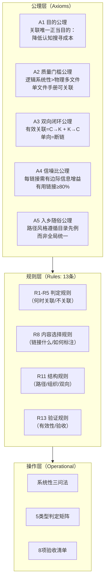

# 指令集↔知识库关联对应性前提（Command-Knowledge Link Pattern）

## 模式类型
治理策略模式（规范层/知识关联治理）—— [spec-reference-validation.md](spec-reference-validation.md)在指令集↔知识库场景的公理化特化

## 成熟度
L2 已验证（2次正向验证：first-principles、mermaid；7次反向验证；第一性原理公理化重构）

## 问题场景

在 `.agents/commands/` 指令集与 `docs/knowledge/` 知识库之间建立双向关联时，除通用引用验证原则外，还面临特定的判定难题：

1. **何时应该建立关联？** 并非所有指令集都需要知识库关联——7个现有指令集正确地没有建立关联
2. **什么算"系统性资料"？** 原有的三标准（完整流程/检查清单/项目验证）缺乏第一性原理根基，"物理多文件=系统性"谬误反复出现
3. **链接到README还是具体文件？** 链接选择缺乏优先级规则，有时README够用有时需要指向具体操作文件
4. **关联资源章节应该包含哪些内容？** 缺乏内容选择规则导致要么太少（遗漏关键参考）要么太多（噪声化）

本模式通过第一性原理演绎推导，从5条不证自明的公理出发，建立13条可操作的关联规则，解决上述判定难题。

## 公理体系

以下5条公理通过第一性原理六步分析法（问题定义→假设质疑→要素拆解→公理提炼→规则演绎→案例验证）推导得出。公理是不可再分的根本前提，规则由公理演绎产生。



### A1 目的公理（🟢高可信）
> 指令集↔知识库关联的唯一正当目的是**降低执行者的认知搜寻成本**。任何不能降低搜寻成本的关联都是噪声。

- 验证依据：信息论（信号vs噪声）、认知科学（认知负荷理论）
- 推论：如果执行者不需要离开指令集就能完成任务，则不需要关联

### A2 质量门槛公理（🟢高可信）
> 关联目标必须具备逻辑系统性。**逻辑系统性 > 物理多文件**——单文件结构化操作手册可以是系统性资料，多文件零散笔记不是。

- 验证依据：知识工程（知识组织原则）、软件架构（内聚性原则）
- 推论：系统性判断看内容结构，不看文件数量

### A3 双向闭环公理（🟢高可信）
> 有效关联必须是双向的：指令集侧有知识库链接（C→K），知识库侧有反向引用（K→C）。单向链接构成导航断链。

- 验证依据：图论（有向图可达性）、知识管理（双向链接知识图谱）
- 推论：建立C→K链接后必须在合理时间内建立K→C反向链接

### A4 信噪比公理（🔵中可信）
> 关联资源章节中，每一个链接都应提供边际信息增益。建议有用链接比例≥80%（经验阈值，待更多案例验证）。

- 验证依据：信息检索（precision@k）、UI/UX设计（Hick's Law选择时间与选项数正相关）
- 推论：1个高质量核心参考 > 5个低质量链接堆砌

### A5 入乡随俗公理（🔵中可信）
> 路径风格遵循被引用目录的先例约定，而非追求全局统一。不同子目录可以有不同的路径风格。

- 验证依据：软件架构（约定优于配置、入乡随俗反模式）、维护成本分析
- 推论：在`.agents/commands/`用相对路径，在`docs/knowledge/`用`.agents/`前缀

## 规则体系

### 一、判定规则（R1-R5）：何时建立关联

**R1 前置验证规则** ← A1 + A2
建立关联前必须先验证目标知识库是否存在系统性资料。验证顺序：
1. Grep搜索`docs/knowledge/`下是否存在相关主题目录或文件
2. 对候选目标应用系统性三问法（见操作工具）
3. 仅当三问全部通过时才建立关联

**R2 资料类型判定矩阵** ← A2
| 资料类型 | 结构问 | 操作问 | 自包含问 | 是否关联 | 示例 |
|---------|--------|--------|---------|---------|------|
| 类型1：多文件系统性档案 | ✅ | ✅ | ✅ | ✅ 关联（链接README） | first-principles知识档案（12文件） |
| 类型2：单文件操作手册 | ✅ | ✅ | ✅ | ✅ 关联（直接链接该文件） | mermaid-guide.md（9章节） |
| 类型3：单篇概念文章 | ❌ | ❌ | ✅ | ⚠️ 边界情况（文章为唯一系统资料且有检查清单时可关联） | — |
| 类型4：零散笔记集合 | ❌ | ❌ | ❌ | ❌ 不关联 | 多文件但无统一结构 |
| 类型5：未完成草稿/空README | ❌/❓ | ❌ | ❓ | ❌ 不关联 | 目录存在但内容不足 |

**R3 反向判定规则** ← A1 + A4
若指令集本身是自包含的（执行不需要离开指令集参考外部资料），不应强行建立关联。7个正确未关联的指令集验证了此规则：retrospective.md、insight.md、atomization.md、atomic-commit.md、export-report.md、file-creation.md、home-assistant.md。

**R4 系统性三问法** ← A2（核心操作工具）
```
问1（结构问）：资料是否覆盖完整的操作流程/知识体系？
  → 检查是否有有序的步骤/章节序列（如6步执行法、9章节手册）
  → 零散知识点罗列≠完整流程

问2（操作问）：资料是否包含可执行的检查清单/验证点/操作指南？
  → 检查是否有可勾选项、验收标准、代码示例
  → 纯理论描述≠可操作指南

问3（自包含问）：资料是否经过端到端项目验证（validation_count≥1）？
  → 检查是否有实际项目应用记录
  → 未验证的初稿≠系统性资料
```
三问全部通过→类型1或2，建立关联；任一不通过→不关联或先完善再关联。

**R5 禁止项规则** ← A1 + A4
禁止以下关联行为：
1. ❌ "先建链后验证"——必须先验证再建链
2. ❌ "数量优先堆砌"——不为了"看起来完整"而添加低价值链接
3. ❌ "物理多文件=系统性"——不因为目录下有多个文件就判定为系统性
4. ❌ "单一文件=非系统性"——不因为是单个文件就拒绝关联
5. ❌ "路径风格创新"——不发明新的路径风格
6. ❌ "单向链接了事"——不只建C→K不建K→C
7. ❌ "猜测性引用"——不引用未确认存在的文件

### 二、内容选择规则（R6-R8）：链接什么

**R6 文件优先级规则** ← A1 + A4
链接目标选择优先级：
1. 具体操作文件 > README索引文件（如果具体文件是执行者实际需要的参考）
2. 若知识库目录以README为入口组织（如first-principles/），链接README
3. 若知识库是单文件手册（如mermaid-guide.md），直接链接该文件
4. 不链接目录本身（必须链接到具体.md文件）
5. 最多链接8个文件（经验上限，保证信噪比）

**R7 链接标注规则** ← A1
每个链接应附带简要标注说明其用途，格式：`- [描述性标题](路径) — 用途说明`
- 用途说明一句话即可：执行者看到后能判断是否需要点击
- 标注内容：该文件对指令集执行者的价值（如"六步执行法详解"而非"相关文档"）

**R8 数量指导规则** ← A4
- 核心参考：1-3个（执行者完成任务必须查阅的资料）
- 扩展参考：0-5个（深入理解可选的资料）
- 总计建议不超过8个链接
- 如果超过8个，考虑是否有噪声链接可移除，或知识库是否需要重构为更内聚的档案

### 三、结构规则（R9-R11）：如何组织

**R9 双向链接结构规则** ← A3
- **指令集侧（C→K）**：在"知识库资料档案"或"关联资源"子章节添加链接
  - 子章节位置：指令集末尾（RACI矩阵之后、Changelog之前）
  - 子章节标题：统一使用"## 知识库资料档案"或"## 关联资源"
- **知识库侧（K→C）**：
  - 若知识库为README组织的档案：在README的"交叉引用"或"相关资源"章节添加反向链接
  - 若知识库为单文件手册：在文件末尾"相关模式"或"关联"章节添加反向链接
  - 反向链接标注：说明该指令集在什么场景下会引用本知识库

**R10 路径风格规则** ← A5
- `.agents/commands/`目录内的指令集：使用相对路径（如`../../docs/knowledge/learning/first-principles/README.md`）
- `.agents/commands/`内引用其他`.agents/`文件：使用相对路径
- `docs/knowledge/`内的知识库文件：使用`.agents/`前缀路径（如`.agents/commands/first-principles.md`）
- 建立前用Grep查询同目录先例：
  ```powershell
  Select-String -Path ".agents/commands/*.md" -Pattern "\.agents/|\.\./.*docs/" | Select-Object -First 5
  ```

**R11 子章节分离规则** ← A1
- 关联资源/知识库档案应作为独立子章节，不混入"相关模式"或"参考资料"
- 核心参考与扩展参考可分两个小节，但不是必须的

### 四、验证规则（R12-R13）：如何确认有效

**R12 四步验证规则** ← A2 + A3
建立关联后依次验证：
1. 链接有效性：运行`check-links.py`确认所有链接可达
2. 双向闭环：确认C→K和K→C都已建立
3. 路径风格：确认路径风格符合同目录先例
4. 内容质量：用R4三问法再次确认目标确实是系统性资料

**R13 验收清单** ← A1 + A2 + A3 + A4 + A5
- [ ] 关联目的明确：每个链接都能说明"降低什么搜寻成本"
- [ ] 系统性验证：三问法全部通过
- [ ] 无物理形式谬误：不因文件数量判断系统性
- [ ] 双向链接完成：C→K和K→C均已建立
- [ ] 路径风格一致：遵循同目录先例
- [ ] 链接标注清晰：每个链接有一句话用途说明
- [ ] 信噪合理：核心参考≤3个，总计≤8个
- [ ] check-links通过：所有链接有效

## 验证案例

### 正向案例1：first-principles指令集↔知识库

| 维度 | 内容 | 规则符合度 |
|------|------|-----------|
| **关联方向** | `.agents/commands/first-principles.md` ↔ `docs/knowledge/learning/first-principles/README.md` | R9 ✅ |
| **资料类型** | 类型1：12文件多文件系统性档案 | R2 ✅ |
| **系统性验证** | ✅ 完整6步执行流程（08文件）、✅ 28项检查清单、✅ validation_count≥1 | R4 三问全过 ✅ |
| **链接选择** | 核心参考6个具体文件链接（非仅README），每个有简要说明 | R6+R7 ✅ |
| **路径风格** | 指令集侧用`../../docs/knowledge/...`相对路径（遵循.agents/目录先例） | R10 ✅ |
| **双向闭环** | C→K：first-principles.md的"知识库资料档案"章节；K→C：README有反向引用 | R3+R9 ✅ |
| **信噪** | 6个链接，均为核心操作参考，无噪声 | R8 ✅ |
| **验证结果** | 全部通过 | R12+R13 ✅ |

### 正向案例2：mermaid指令集↔知识库（关键单文件验证）

| 维度 | 内容 | 规则符合度 |
|------|------|-----------|
| **关联方向** | `.agents/commands/mermaid.md` ↔ `docs/knowledge/best-practices/mermaid-guide.md` | R9 ✅ |
| **资料类型** | 类型2：单文件9章节操作手册 | R2 ✅ |
| **初始判断偏差** | 初版认为"单文件=非系统性资料"（违反A2），准备不建立关联 | R5-4❌→修正 |
| **修正后判断** | ✅ 9章节覆盖完整编码→检查→修复→验证流程、✅ 安全编码六规则等检查清单、✅ validation_count≥5→三问全过 | R4 ✅ |
| **路径风格** | 遵循.agents/目录相对路径约定（查询first-principles.md先例） | R10 ✅ |
| **关键意义** | 验证了"逻辑系统性>物理多文件"核心命题——单文件操作手册完全满足系统性标准 | A2公理实证实例 |

### 反向验证：7个正确未关联的指令集

程序化Grep验证以下指令集正确未建立关联（知识库无对应系统性资料）：
- `retrospective.md`、`insight.md`、`atomization.md`、`atomic-commit.md`
- `export-report.md`、`file-creation.md`、`home-assistant.md`

这些指令集要么本身自包含（R3），要么知识库中尚无对应的系统性资料档案。

## 反模式（特定于指令集↔知识库场景）

| 反模式 | 表现 | 违反规则 | 后果 |
|--------|------|---------|------|
| **README万能论** | 不管知识库结构如何都只链接README | R6 | 执行者需要再点击一次才能找到实际操作文件，增加搜寻成本 |
| **百科全书式堆砌** | 列出所有相关文件，不管是否核心 | R4+R8 | 信噪比<50%，执行者无法判断重点 |
| **半闭环关联** | 只在指令集侧加链接，知识库侧不加反向引用 | R9 | 导航闭环断裂，从知识库侧无法发现对应指令集 |
| **目录引用** | 链接到目录路径而非具体文件 | R6-4 | 不同渲染器对目录链接处理不一致，可能404 |
| **"以后再补"** | 先放一个空的"关联资源"章节占位，以后再填内容 | R1 | 空章节增加认知负担但无信息增益 |

## 实施流程

```
步骤1：判定是否需要关联
  → 执行R4系统性三问法
  → 三问全过→继续；任一不过→不关联或先完善知识库

步骤2：确定链接目标
  → R2判定资料类型（类型1→README；类型2→直接链接文件）
  → R6选择具体链接文件（优先级排序）
  → R8控制数量（核心≤3，总计≤8）

步骤3：建立双向链接
  → 指令集侧：按R9在"知识库资料档案"章节添加链接（带标注）
  → 知识库侧：按R9添加反向引用
  → 路径风格：按R10遵循先例

步骤4：验证
  → R12四步验证
  → R13验收清单逐项检查
  → 运行check-links.py
```

## 关联模式

- [spec-reference-validation.md](spec-reference-validation.md)：通用引用验证原则，本模式是其在指令集↔知识库场景的公理化特化
- [spec-discoverability-guarantee.md](spec-discoverability-guarantee.md)：确保Spec可发现是关联的前提，本模式确保关联目标满足质量门槛
- [cross-wiki-reference-directory-first.md](cross-wiki-reference-directory-first.md)：跨目录引用路径策略，与R10路径风格规则互补
- [wiki-pre-creation-three-checks.md](wiki-pre-creation-three-checks.md)：创建新文档前的预检，R4三问法是关联场景的预检方法
- [reference-as-trigger.md](reference-as-trigger.md)：引用可以触发动作，有效引用的前提是引用目标通过R1验证
- [methodology-constructive-validation.md](methodology-constructive-validation.md)：构造性验证方法论，本模式的公理体系通过构造性方法验证

## 局限性与待验证假设

1. **A4信噪比公理的80%阈值**：基于经验推断，需要更多案例验证精确阈值
2. **R8的8个链接上限**：经验值，可能需要根据指令集复杂度调整
3. **验证案例数量**：目前仅2个正向案例+7个反向案例，建议积累第3+个正向案例后迭代
4. **R3自包含判定**："指令集自包含"的判定标准仍较主观，需要更多边界案例明确
5. **类型3边界情况**：单篇概念文章何时可关联的判定标准需要更多案例细化

## 成熟度评估

| 维度 | 评级 | 说明 |
|------|------|------|
| 验证次数 | 2次正向+7次反向（L2） | first-principles和mermaid两个正向案例验证，7个反向案例验证不关联规则 |
| 方法论基础 | 第一性原理公理化推导 | 5条公理独立且完备，13条规则均可追溯到公理来源 |
| 文档完整度 | 综合级 | 包含公理体系、规则集、操作工具、验证案例、反模式、实施流程 |
| 升级路径 | 积累第3+个正向案例后可升级至L3 | 关键验证点：公理在新案例中是否成立、规则是否需要调整 |

## 模式溯源

- **来源复盘1**：[retrospective-first-principles-knowledge-link-20260709](../../../reports/task-reports/retrospective-first-principles-knowledge-link-20260709.md)（首次建立关联任务）
- **来源复盘2**：[retrospective-first-principles-comprehensive-research-20260709](../../../reports/insight-extraction/external-learning/retrospective-first-principles-comprehensive-research-20260709/README.md)（外学习复盘，发现重复条目问题）
- **第一性原理分析**：[analysis-report.md](../../../reports/task-reports/retrospective-first-principles-pattern-split-20260709/analysis-report.md)（六步公理化分析报告）
- **前身模式**：[spec-reference-validation.md v1.0](spec-reference-validation.md)（合并版本，v2.0拆分为通用+特化两层架构）
- **提取日期**：2026-07-09
- **公理化重构日期**：2026-07-09
