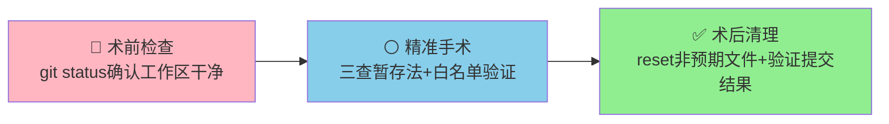
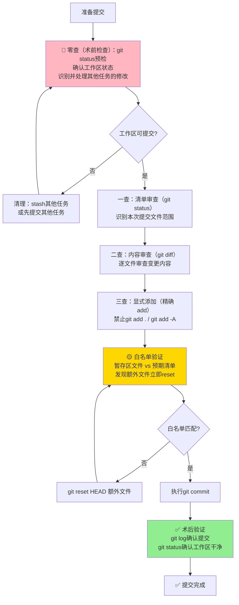

> **来源**：从 `docs/retrospective/reports/competitive-analysis/retrospective-text-to-cad-learning-20260704/insight-extraction.md` 洞察4 提炼，基于多次原子提交实践验证（含forum-posting Skill优化、text-to-cad wiki教程、2026-07-04知识沉淀工作流元复盘）

# 提交质量门——三查暂存法（Commit Quality Gate: Three-Check Staging Inspection）

## 模式类型
方法论模式（治理策略）

## 成熟度
L2 已验证（3次成功案例：forum-posting Skill优化原子提交、text-to-cad wiki教程提交、2026-07-04知识沉淀工作流元复盘验证）

## Git暂存区卫生原则——外科手术式操作模型

Git暂存区（index/staging area）是一个**全局共享的可变状态**——任何代理、脚本、IDE操作都可能修改它，而它不会自动隔离不同任务的修改。这就像一个共享的外科手术台，如果每个人用完都不清理，下一个人使用时就会面对一堆别人的器械和污染。

Git操作必须像外科手术一样遵循"术前消毒→精准操作→术后清理"的卫生流程：



| 阶段 | 类比 | 核心动作 | 目的 |
|------|------|---------|------|
| 术前检查 | 消毒/铺巾 | git status预检 | 确保工作区没有其他任务的遗留物 |
| 精准操作 | 手术执行 | 三查暂存+白名单 | 只add需要的文件，确认无额外文件 |
| 术后清理 | 清点器械/缝合 | reset清理+提交后验证 | 确保没有遗留物，提交结果正确 |

## 适用场景
所有代码/文档提交场景，特别是：
- 工作区存在多个任务变更时
- 子代理执行任务后主代理验收提交时
- 任务间隔较长、可能忘记之前改了什么时
- 需要确保提交边界清晰、可独立回滚时

## 问题背景

原子提交的核心价值不仅是"提交信息清晰"，更重要的是**git add阶段强制审查每个文件**，防止脏提交。直接使用`git add .`或`git add -A`会绕过这个质量门，导致：
- 临时变更、实验性代码意外混入
- 无关修改污染版本历史
- 提交无法独立revert
- 审查者需要理解不相关的上下文

子代理执行任务后尤其危险——盲目信任子代理输出"已创建文件X"而不验证实际变更，可能将子代理产生的临时文件或错误修改一并提交。

## 与session-boundary-commit的关系

本模式与`session-boundary-commit.md`是互补关系：
- **session-boundary-commit**解决"多会话变更混合时如何分组"的问题（会话边界）
- **本模式（三查暂存法）**解决"add阶段如何审查文件边界"的问题（文件边界）

执行顺序：先用session-boundary-commit做归属分析和会话筛选，再用三查暂存法逐一审查每个拟提交文件的内容。

## 核心方法：增强版五步法（术前检查→三查暂存→白名单验证→术后清理→提交后验证）



### 零查：术前检查（工作区预检）—— 新增

**这是2026-07-04元复盘新增的关键步骤，原三查暂存法缺失此环节。**

在开始任何git add操作**之前**，必须先执行工作区预检：

1. 运行`git status`查看完整工作区状态
2. 识别所有变更（修改的、新增的、删除的、未跟踪的）
3. 区分：
   - **属于本次提交**的文件 → 列入白名单
   - **属于其他任务**的修改 → 执行`git stash`暂存，或先提交其他任务
   - **临时文件/垃圾文件** → 删除或加入.gitignore
4. 确认预检通过后才进入后续步骤

**为什么必须有术前检查？**
- 2026-07-04知识沉淀工作流中，因跳过此步骤，sunlogin competitive-analysis相关文件一直残留在工作区，后续多次污染暂存区，导致2轮reset清理，耗时8分钟。

### 一查：清单审查（git status）
运行`git status`查看全部变更文件清单，识别：
- 哪些文件属于本次提交（列入白名单）
- 哪些文件属于其他会话（留给对应会话提交）
- 哪些是临时文件/实验性修改（不应提交）

**术前检查是更宏观的工作区状态确认，一查是聚焦本次提交文件范围的确认。**

### 二查：内容审查（git diff）
对拟提交的**每个文件**运行`git diff`审查变更内容，确认：
- 变更与本次任务直接相关
- 没有遗留的调试代码、注释掉的代码、console.log等
- 没有意外的格式大面积变更
- 子代理创建的文件内容符合预期
- frontmatter、链接等元数据正确（文档文件）
- **x-toml-ref 自动化验证**（文档文件）：提交前运行 `python .agents/scripts/fix-x-toml-ref.py --dir <目录> --write --create-toml`，确保所有 x-toml-ref 路径正确、TOML 元数据文件完整。LongCat 案例验证：9个文件0个需修复，防止了常见的路径层级错误

### 三查：显式添加（精确路径git add + 二次确认）
- 使用`git add <file1> <file2> ...`**逐个文件**显式添加，必须使用完整精确路径
- **绝对禁止**`git add .`、`git add -A`、`git add --all`等批量添加命令
- **绝对禁止**`git add docs/`、`git add *.md`等通配符批量添加（除非100%确定目录下只有本次提交的文件）
- add后立即运行`git status`确认暂存区文件列表
- 子代理说"创建了X文件"不能直接信任，必须验证文件确实存在且内容正确后再add

### 白名单验证 —— 新增

**这是2026-07-04元复盘新增的质量门禁。**

在git add之后、git commit之前，必须执行白名单验证：

1. **明确白名单**：在纸上/评论中/脑海中列出本次提交计划包含的**所有文件的精确路径**
2. **对比暂存区**：运行`git status`，将"Changes to be committed"下的文件列表与白名单逐一对比
3. **清理额外文件**：如果暂存区出现白名单外的文件，对每个额外文件执行：
   ```
   git reset HEAD <extra-file-path>
   ```
4. **二次确认**：再次运行`git status`，确认暂存区文件与白名单完全一致
5. **疑问处理**：如果不确定某个文件"好像应该提交？"——**先reset**，想清楚、查清楚后再加。带着疑问commit是脏提交的主要来源。

### 术后清理与提交后验证 —— 新增

**这是2026-07-04元复盘新增的收尾步骤。**

commit执行完成后，立即执行：

1. **提交记录验证**：运行`git log --oneline -n 3`确认新提交存在、commit message正确
2. **提交内容验证**：运行`git show --stat HEAD`确认提交包含的文件与白名单一致
3. **工作区清理验证**：运行`git status`确认工作区干净（没有遗留的未提交修改）
4. **暂存区确认**：确认暂存区为空（如果有文件意外留在暂存区，执行`git reset HEAD`清理）

## 反模式（禁止做法）

| 反模式 | 风险 |
|-------|------|
| ① `git add .`/`git add -A`盲目添加 | 临时文件、无关变更混入（最高频错误） |
| ② `git add docs/`、`git add *.md`等通配符批量添加 | 目录下其他任务的文件被误add |
| ③ 跳过术前检查直接开始add | 工作区已有的其他任务修改污染暂存区 |
| ④ 信任子代理输出直接add子代理说"创建了"的文件而不验证 | 子代理可能创建了错误文件、遗漏文件或擅自执行了git操作 |
| ⑤ 跳过`git diff`审查直接提交 | 调试代码、错误修改被提交 |
| ⑥ 混合多个任务的变更到一个提交 | 无法独立revert，责任混乱 |
| ⑦ 长时间间隔后凭记忆提交 | 忘记之前改了什么，遗漏或误提文件 |
| ⑧ add后不做白名单验证就commit | 暂存区的额外文件未被发现，造成脏提交 |
| ⑨ commit后不验证直接继续 | commit失败或提交了错误文件不能及时发现 |
| ⑩ 发现暂存区有额外文件时"懒得清理"，带着侥幸心理commit | "就这一次没关系"→脏提交进入历史，后患无穷 |

## Windows平台特殊注意事项

Windows环境下Git操作有一些特殊陷阱需要额外注意：

1. **路径分隔符问题**：
   - Git Bash中使用正斜杠`/`或双反斜杠`\\`
   - PowerShell中使用正斜杠`/`或单反斜杠`\`（不需要转义）
   - 建议统一使用正斜杠`/`以避免跨平台问题

2. **编码问题**：
   - Windows默认编码可能是GBK/CP936，而非UTF-8
   - commit message包含中文时，使用`git commit -F <message-file>`并确保message-file是UTF-8编码（带BOM或不带BOM均可，但需统一）
   - 或使用辅助脚本如`.agents/scripts/git-commit-utf8.py`处理UTF-8 commit message

3. **文件锁问题**：
   - Windows下文件可能被IDE、编辑器或其他进程锁定
   - 执行git reset/checkout前确保相关文件已关闭
   - 遇到"Permission denied"错误时，检查是否有程序占用该文件

4. **行尾符问题**：
   - Windows默认CRLF，Linux/macOS默认LF
   - 确保.gitattributes配置正确，避免行尾符噪音diff
   - 如果看到整个文件显示为修改但内容看起来没变，检查行尾符变化

5. **长路径问题**：
   - Windows默认路径长度限制260字符
   - 深层嵌套目录可能触发此问题，可通过Git配置`core.longpaths true`解决

6. **PowerShell执行策略**：
   - 运行Git hook脚本或辅助脚本时可能遇到执行策略限制
   - 临时绕过：`PowerShell -ExecutionPolicy Bypass -File <script>`

## 价值

1. **防止脏提交**：每个提交只包含本次任务相关变更
2. **独立可回滚**：每个提交可独立revert，不影响其他功能
3. **自检即审查**：git diff审查本身就是一次self code review
4. **聚焦审查**：审查阶段能够聚焦于本次任务的变更，而非在噪音中找问题
5. **子代理安全**：为主代理验收子代理工作提供了标准化检查流程
6. **工作区卫生**：术前检查和术后清理确保Git操作不污染共享工作区
7. **问题早发现**：白名单验证在commit前拦截额外文件，避免脏提交进入历史

## 正例

### 正例1：text-to-cad-wiki提交（commit 9083c788）

- 变更规模：5个文件，774行新增，9行删除
- 通过三查暂存法：一查确认文件清单，二查逐文件diff确认内容全部与text-to-cad wiki任务相关，三查显式add后再次status确认
- 结果：提交边界非常清晰，无任何无关变更混入，可独立revert

### 反例→正例：2026-07-04知识沉淀工作流提交（commit 068dc668）

**问题过程**（反例部分）：
- 跳过术前检查，工作区残留sunlogin competitive-analysis文件
- 子代理擅自提交了模式文件（74130f30），未通过三查
- git add时无关文件反复进入暂存区
- 2轮reset清理才把暂存区弄干净
- 提交阶段耗时8分钟（占总时长16%）

**纠正措施**（正例部分）：
- 使用python脚本`.agents/scripts/git-commit-utf8.py`执行精确提交
- 最终提交068dc668只包含复盘报告文件，无无关变更混入
- 元复盘后提炼出本增强版五步法，补充了术前检查、白名单验证、术后清理

## 与其他模式关系

- `session-boundary-commit.md`：互补模式——先做会话边界分组，再做文件边界审查
- `atomic-commit-cmd` Skill：本模式的工具实现，封装了三查暂存法+白名单验证的完整流程
- `process-vs-experience-intuition.md`：三查暂存法是"流程合规"的典型实践——凭记忆"我改的都对"是经验直觉，按流程走才是可预测的质量保证
- `subagent-git-three-prohibitions.md`：前置依赖——子代理三不准规范确保子代理不会擅自add/commit污染暂存区，本模式在主代理侧提供最终的暂存区卫生把关
- `knowledge-sedimentation-workflow-sop.md`：组成部分——本模式是知识沉淀工作流SOP中提交阶段的具体操作规范
