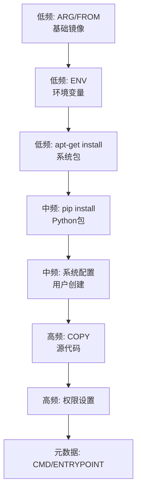

# 开发环境 Dockerfile 优化法：优先排序而非最小化

## 模式概述

开发环境 Dockerfile 的优化目标与生产环境截然不同：生产环境追求最小镜像体积（多阶段构建、scratch基础镜像、逐层清理），而开发环境应追求**最大构建效率和功能完整性**。核心原则是按变化频率排序指令以最大化层缓存命中，而非删除内容减小体积。

本模式整合三条子原则：
1. **反直觉原则**：开发镜像的首要优化目标是"改一行脚本后多快能重新构建"，而非"镜像多小"
2. **.dockerignore 三重价值**：性能（减小上下文）、正确性（防止缓存失效）、安全（防止泄露）
3. **层缓存涟漪效应**：第 N 层变化导致 N+1 层到最后全部重建，顺序错误代价被线性放大

## 问题现象

开发环境 Dockerfile 常见三类错误：

| 错误类型 | 表现 | 代价 |
|---------|------|------|
| COPY 放在 apt 安装之前 | 每次改入口脚本都重装 16 个 apt 包 | 约131秒/次 |
| COPY 放在 pip 安装之前 | 每次改脚本都重装 7 个 pip 包 | 约27秒/次 |
| 缺少 .dockerignore | 整个项目目录（含 .git/）被发送到构建上下文 | 缓存意外失效 + 安全风险 |

在每天重建10次的开发节奏下，一个"COPY放错位置"的顺序错误每天浪费约26分钟，每月浪费约13小时。

## 解决方案

### 1. 按变化频率分层排序



### 2. .dockerignore 作为第一个文件

| 层面 | 价值 | 具体表现 |
|------|------|---------|
| 性能 | 减小构建上下文传输体积 | 上下文从整个目录缩减到 4.62kB |
| 正确性 | 防止缓存意外失效 | `.pytest_cache/` 被COPY进镜像会导致每次测试后缓存失效 |
| 安全 | 防止敏感文件泄露 | `.git/` 包含提交历史，IDE配置可能含密钥 |

**原则**：一个没有 .dockerignore 的 Docker 项目，等同于没有 .gitignore 的代码项目。

### 3. 黄金公式

```dockerfile
# apt 安装：-qq 安静模式 + 同层清理缓存
RUN set -eux && \
    apt-get update && \
    apt-get install -y --no-install-recommends -qq <packages> && \
    rm -rf /var/lib/apt/lists/*

# pip 安装：无缓存
RUN set -eux && \
    pip install --no-cache-dir <packages>

# COPY 尽可能靠后
COPY --chown=<user>:<group> <src> <dest>
```

### 4. 兼容性决策矩阵

| 特性 | 兼容性 | 决策 |
|------|--------|------|
| COPY --chmod | 仅 BuildKit | 不使用 |
| --mount=type=cache | 仅 BuildKit | 不使用 |
| set -eux | POSIX 标准 | 使用 |
| --no-install-recommends | apt 标准 | 使用 |

## 适用场景

- **开发环境镜像**：频繁修改、需完整工具链、通过SSH交互使用
- **CI 构建镜像**：需要快速增量构建的持续集成环境
- **团队共享开发环境**：多人协作、频繁更新的开发容器

**不适用**：生产环境部署镜像（应优先最小化体积）

## 实际案例

### 案例1：llvm-dev Dockerfile 优化（首次验证）

| 指标 | 优化前 | 优化后 | 提升 |
|------|--------|--------|------|
| Dockerfile 行数 | 98行 | 91行 | -7行 |
| RUN 层数 | 5个 | 4个 | -1层 |
| 增量构建时间 | 约158秒 | 约0.4秒 | **约400倍** |
| 镜像体积 | 4.21GB | 4.21GB | 持平（无增加） |
| 构建上下文 | 整个目录 | 4.62kB | 大幅缩减 |

关键操作：创建 .dockerignore + 按变化频率重排指令 + apt/pip 黄金公式 + 统一 set -eux

## 反模式

### 反模式1：套用生产环境优化策略
```
追求最小镜像 → 删除基础镜像中的"无用"包 → 开发时缺少工具 → 重新安装 → 更大更慢
```

### 反模式2：忽略 .dockerignore
```
不创建 .dockerignore → .git/ .pytest_cache/ 进入构建上下文 → COPY 时缓存失效 → 每次全量重建
```

### 反模式3：使用 BuildKit 专属特性
```
COPY --chmod=755 entrypoint.sh / → 在非 BuildKit 环境构建失败 → 兼容性问题
```

## 与其他模式的关系

- **与 bottleneck-first-refactoring 互补**：瓶颈优先决定"改什么"，本模式决定开发环境"怎么改"
- **与 no-touch-list 配合**：不重构清单决定"不改什么"（基础镜像内容），本模式决定"怎么排序"
- **与 spec-driven-development 衔接**：Spec 模式规划优化任务，本模式执行 Dockerfile 优化

## 边界与选型

本模式仅适用于**开发环境镜像**。判断信号：
- ✅ 频繁修改入口脚本或配置文件
- ✅ 需要完整工具链（编译器、调试器、IDE）
- ✅ 通过 SSH 或容器交互使用
- ✅ 增量构建频率高（每天多次）
- ❌ 生产部署镜像（应使用多阶段构建最小化）
- ❌ 一次性构建的临时容器（优化ROI不足）
