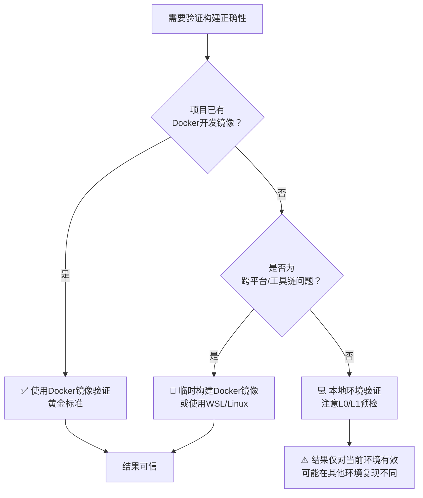
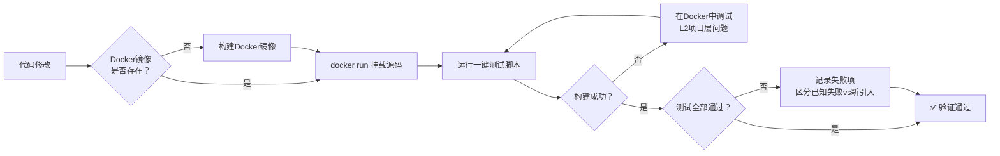

# Docker 作为规范构建环境——构建验证的黄金标准

## 触发场景

- C/C++/Rust/CUDA 等编译型项目需要在**多平台**上验证构建正确性
- 团队成员使用**不同操作系统**（Windows/macOS/Linux）导致"在我机器上能跑"问题
- 本地环境存在**工具链版本冲突**（MSVC 预览版 Bug、protobuf 版本不兼容、conda 环境污染）
- CI/CD 构建失败但本地成功，或反过来
- 需要快速验证某个 CMake/构建脚本修改是否正确
- 项目提供了 Docker 开发镜像但团队成员仍在本地原生环境上反复踩坑
- 构建失败排查耗时超过 10 分钟仍未定位根因

## 问题本质

编译型项目构建失败的根因分布呈现明显的**倒金字塔**特征：

| 层级 | 占比 | 排查成本 | 解决成本 |
|------|------|----------|----------|
| **L0 环境层** | ~50% | 30秒 | 5分钟（换环境） |
| **L1 工具链层** | ~30% | 2分钟 | 10分钟（统一版本） |
| **L2 项目层** | ~20% | 5分钟+ | 正常调试 |

开发者最常犯的错误是直接从 L2（项目代码层）开始排查，在 L0/L1 问题上浪费数小时。更根本的问题是：**本地环境是不可控变量**——MSVC 预览版、conda 环境穿透、Windows/WSL 路径混用、系统库版本差异等问题，在本地环境上排查成本极高，且修复后无法保证其他团队成员不复现。

Docker 镜像提供了**可复现、可审计、零配置**的规范构建环境：
- 编译器版本固定（gcc 14.3.0，非预览版）
- 依赖库版本固定（protobuf 7.x，与链接库一致）
- 文件系统隔离（无跨环境污染）
- 团队内所有成员使用完全相同的环境
- 验证命令可脚本化、可自动化

## 核心原则

### 原则1：Docker 是构建验证的"黄金标准"（Golden Standard）

当需要验证构建是否正确时，**优先使用已有的 Docker 镜像**，而不是在本地原生环境上反复尝试。本地环境适合日常开发和快速迭代，但**最终构建验证必须在 Docker 中进行**。

决策顺序：



### 原则2：Docker 优先于 WSL，WSL 优先于 Windows 原生

在 Windows 开发环境上，环境可靠性排序：

| 环境 | 可靠性 | 适用场景 | 典型陷阱 |
|------|:------:|----------|----------|
| **Docker (caffe-ffi-jupyter)** | ⭐⭐⭐⭐⭐ | 构建验证、CI、最终测试 | 需挂载源码、注意entrypoint editable install |
| **WSL2 Ubuntu** | ⭐⭐⭐⭐ | Linux原生开发、无Docker时 | conda穿透、protobuf版本、/mnt/性能 |
| **Windows 原生 MSVC** | ⭐⭐ | Windows特定开发、DLL调试 | 预览版Bug、环境变量、PDB锁定 |

### 原则3：本地环境失败 ≠ 代码有问题；Docker 失败 = 代码有问题

- **本地构建失败但 Docker 构建成功** → 本地环境问题，按 [构建失败分层排查法](../../code-patterns/build-failure-layered-triage.md) 排查 L0/L1
- **Docker 构建失败** → 项目代码/CMake 配置问题，直接进入 L2 排查
- **本地和 Docker 都失败** → 先在 Docker 中修复（环境一致，调试更高效），修复后本地自然通过

### 原则4：验证命令可一键执行

项目应提供一键脚本在 Docker 中运行完整测试套件，不需要手动配置环境变量或记住复杂的 CMake 参数。

## 标准方案

### 方案A：已有 Docker 开发镜像（首选）

以 caffe-ffi 项目为例，`caffe-ffi-jupyter` 镜像已预装完整构建环境：

```bash
# 1. 确保容器已运行（或启动临时容器）
# 如果已有运行中的容器：
docker exec -it caffe-ffi-jupyter bash

# 如果没有，一次性运行（挂载源码 + 构建卷）：
cd /path/to/SpecWeave
docker run --rm \
  -v "$(pwd):/SpecWeave" \
  -v caffe-ffi-workspace:/workspace \
  caffe-ffi-jupyter:latest \
  bash -c "cp /SpecWeave/apps/caffe-ffi-jupyter/scripts/test-cpp-tests.sh /workspace/ && bash /workspace/test-cpp-tests.sh"
```

**关键要点**：
- 使用 Docker volume（`-v caffe-ffi-workspace:/workspace`）存放构建产物，避免跨文件系统 I/O 性能问题
- 源码以 bind mount 方式挂载（`-v $(pwd):/SpecWeave`），修改即时生效
- 使用 `--rm` 自动清理临时容器
- 使用 `--entrypoint bash` 绕过 entrypoint 的 editable install（当本地源码需要独立构建时）

### 方案B：在 Docker 中手动构建（调试用）

需要交互式调试时，启动一个持久容器：

```bash
# 启动容器并挂载源码
docker run -it --rm \
  -v "$(pwd):/SpecWeave" \
  -v caffe-ffi-build:/workspace \
  --entrypoint bash \
  caffe-ffi-jupyter:latest

# 在容器内手动构建
source /opt/conda/etc/profile.d/conda.sh
conda activate caffe-ffi

# 配置CMake
cmake -S /SpecWeave/projects/xuanspace/libs/caffe-ffi \
      -B /workspace/caffe-ffi-cpp-build \
      -G Ninja \
      -DCMAKE_BUILD_TYPE=Release \
      -DCAFFE_FFI_BUILD_TESTS=ON \
      -DTVM_FFI_USE_LIBBACKTRACE=OFF

# 构建
cmake --build /workspace/caffe-ffi-cpp-build -j$(nproc)

# 运行测试
cd /workspace/caffe-ffi-cpp-build
LD_LIBRARY_PATH=/opt/conda/envs/caffe-ffi/lib:$(pwd):$(pwd)/lib ./caffe_ffi_tests
```

### 方案C：WSL2 原生环境（Docker 不可用时的备选）

当 Docker 不可用但需要 Linux 环境时：

```bash
# 1. 确认 GCC 是稳定版
gcc --version | head -1  # 不含 svn/git/trunk/RC/Preview

# 2. 确认 protoc 不是 Windows 路径穿透
which protoc  # 不应指向 /mnt/c/Users/...

# 3. 使用独立的 build 目录（不要复用 Windows 的 build）
mkdir -p build-wsl && cd build-wsl

# 4. 使用 conda 环境中的一致版本
conda activate caffe-ffi-dev
cmake .. -G Ninja -DCAFFE_FFI_BUILD_TESTS=ON
ninja -j$(nproc)
```

## Docker 构建验证的标准流程



## Docker 环境的已知陷阱与规避

| 陷阱 | 现象 | 规避方法 |
|------|------|----------|
| **Entrypoint editable install 失败** | 容器启动时 libbacktrace 等依赖编译失败，caffe-ffi 未安装 | 使用 `--entrypoint bash` 绕过 entrypoint，手动激活 conda 环境 |
| **CRLF 行 endings** | Windows 上 Git 自动转换 CRLF，Linux 容器内脚本无法执行 | 测试脚本中包含 `dos2unix` 或 `sed -i 's/\r$//'` 修复步骤 |
| **源码未挂载** | 容器内修改的代码未反映，运行的是旧版本 | 确认 `-v $(pwd):/SpecWeave` 挂载正确，`ls` 验证文件时间戳 |
| **CMake 缓存跨环境** | 复用 Windows/WSL 的 build 目录导致路径格式冲突 | 使用 Docker volume（`caffe-ffi-workspace`）存放构建产物，不与宿主机共享 build 目录 |
| **Protobuf 版本不一致** | 容器内 protoc 版本与 libprotobuf 不一致 | 使用预构建镜像（版本已固定），不手动升级容器内包 |
| **LD_LIBRARY_PATH 未设置** | 运行测试时找不到 `_caffe_ffi.so` 或 `libtvm_ffi.so` | 测试脚本中设置完整的 `LD_LIBRARY_PATH`，包含 conda lib 目录和构建目录 |

## 快速检查清单

在 Docker 中进行构建验证时，按顺序确认：

- [ ] **D1** Docker 镜像存在且为最新：`docker images caffe-ffi-jupyter`
- [ ] **D2** 源码正确挂载：`docker exec <container> ls /SpecWeave/projects/xuanspace/libs/caffe-ffi/CMakeLists.txt`
- [ ] **D3** 构建目录使用 Docker volume（不是 bind mount 到 Windows 盘）
- [ ] **D4** 容器内 conda 环境激活：`which cmake` 指向 `/opt/conda/envs/caffe-ffi/bin/cmake`
- [ ] **D5** protoc 版本正确：`protoc --version` 显示 libprotoc 3.x+，Python protobuf 7.x+
- [ ] **D6** 使用项目提供的一键测试脚本（如 `test-cpp-tests.sh`），不手动拼 CMake 命令
- [ ] **D7** 构建完成后检查产物：`_caffe_ffi.so` 和 `caffe_ffi_tests` 存在
- [ ] **D8** 运行测试后记录通过率和失败项，区分已知失败和新引入的失败

## 与"构建失败分层排查法"的整合

Docker 是分层排查法的**终极 L0 修复手段**：

1. 遇到构建失败 → 先按 L0（30秒）检查本地环境
2. L0 发现问题（预览版编译器、环境变量缺失等）→ 切换到 Docker 验证
3. L1 发现问题（版本不匹配、跨环境污染）→ 切换到 Docker 验证
4. Docker 中构建成功 → 确认是本地环境问题，按分层排查法修复本地或直接使用 Docker
5. Docker 中构建失败 → 直接进入 L2 项目层排查，无需再怀疑环境

```
本地构建失败
    │
    ├── L0检查（30秒）
    │   ├── 预览版编译器？ ──→ 🐳 Docker验证
    │   ├── 环境变量缺失？ ──→ 修复后重试 或 🐳 Docker
    │   └── 工具路径错误？ ──→ 修复后重试 或 🐳 Docker
    │
    ├── L1检查（2分钟）
    │   ├── 版本不匹配？ ──→ 🐳 Docker验证（版本一致）
    │   ├── 跨环境污染？ ──→ 🐳 Docker验证（环境隔离）
    │   └── 工具版本过旧？ ──→ 升级 或 🐳 Docker
    │
    └── L0+L1无法快速解决 ──→ 🐳 Docker（黄金标准，5分钟内得到可信结果）
         │
         ├── Docker构建成功 → 本地环境问题，可继续在本地排查或直接用Docker开发
         └── Docker构建失败 → 代码问题，进入L2排查
```

## 团队协作规范

### 提交代码前

如果修改涉及 CMake 配置、C++ 源码、构建脚本等，提交前必须在 Docker 中验证构建通过：

```bash
# 一键命令（在WSL或有Docker的终端中执行）
cd /path/to/SpecWeave
docker run --rm \
  -v "$(pwd):/SpecWeave" \
  -v caffe-ffi-workspace:/workspace \
  caffe-ffi-jupyter:latest \
  bash -c "bash /SpecWeave/apps/caffe-ffi-jupyter/scripts/test-cpp-tests.sh"
```

### CI/CD 流水线

CI 构建应使用与开发相同的 Docker 镜像，确保"在我机器上能跑"="在CI上能跑"：

```yaml
# GitHub Actions 示例
jobs:
  build-and-test:
    runs-on: ubuntu-latest
    container:
      image: caffe-ffi-jupyter:latest
    steps:
      - uses: actions/checkout@v4
      - name: Run C++ tests
        run: bash apps/caffe-ffi-jupyter/scripts/test-cpp-tests.sh
```

### Code Review 时

Reviewer 可以直接在 Docker 中验证构建结果，无需配置本地环境：

```bash
# fetch PR分支后一键验证
git fetch origin pull/<PR>/head:pr-<PR>
git checkout pr-<PR>
# 然后运行上述 Docker 验证命令
```

## 反模式

- ❌ **在本地 Windows MSVC 上折腾2小时后才想起用Docker**：预览版Bug、PDB锁定、环境变量等问题在Docker中完全不存在，5分钟就能得到结果
- ❌ **"我本地能跑"作为代码正确的证据**：本地环境不是黄金标准，Docker才是
- ❌ **在Docker中手动apt/pip install新依赖后不更新Dockerfile**：导致其他团队成员拉取镜像后缺少依赖
- ❌ **把Windows的build目录bind mount到Docker容器**：路径格式不兼容、文件权限问题、CRLF问题
- ❌ **Docker构建失败后回到本地环境尝试"曲线救国"**：Docker失败说明代码有问题，在本地绕过去只是掩盖了问题
- ❌ **认为"Docker太慢"而拒绝使用**：caffe-ffi完整C++测试套件在Docker中构建+运行仅需约30秒（增量构建更快），远少于在本地排查环境问题的时间
- ❌ **在容器内修改代码后不docker commit或更新Dockerfile**：容器是临时的，修改不会持久化

## 验证方法

1. **Docker验证通过的标志**：一键测试脚本退出码为0，所有非已知失败的测试用例通过
2. **已知失败项管理**：项目维护一份已知失败项清单（如COW Phase3的25个失败测试），与新引入的失败区分
3. **跨环境一致性**：Docker中通过的构建，在WSL中也应通过（可能需要额外配置）；Windows原生环境可能因MSVC差异有额外问题
4. **镜像可复现性**：从Dockerfile重新构建镜像应得到相同的构建结果和测试通过率

## 跨项目迁移

| 项目类型 | Docker方案要点 |
|----------|---------------|
| **C/C++ CMake项目** | 固定gcc/clang版本、固定所有依赖库版本、预置ninja/cmake |
| **Python C扩展** | 固定Python版本、固定编译器版本（ABI兼容）、使用manylinux基础镜像 |
| **Rust项目** | 固定rustc版本（rust-toolchain.toml）、使用官方rust镜像作为基础 |
| **CUDA项目** | 使用nvidia/cuda基础镜像、固定CUDA版本、确保nvidia-container-toolkit |
| **Go项目** | 多阶段构建（builder + runtime）、使用distroless最小镜像 |
| **Java项目** | 固定JDK版本（Eclipse Temurin而非OpenJDK）、固定Maven/Gradle版本 |

核心原则通用：**Docker镜像是团队的"共同语言"，确保所有人看到相同的构建结果。**

## 实际案例

### 案例1：caffe-ffi MSVC C1041 → Docker 5分钟解决（2026-08-01）

- **问题**：Windows MSVC 19.50 Insiders 预览版 C1041 PDB锁定错误
- **错误路径**：本地L2排查40分钟（-j1、清理缓存、杀进程均无效）
- **Docker路径**：`docker run --rm -v ... caffe-ffi-jupyter test-cpp-tests.sh` → 5分钟内构建成功，237个测试运行
- **结论**：编译器预览版Bug，Docker环境使用gcc 14.3.0稳定版，完全规避

### 案例2：caffe-ffi WSL protobuf版本冲突 → Docker版本一致（2026-08-01）

- **问题**：WSL中Windows conda的protoc穿透，导致v33 protoc与v3 libprotobuf版本不匹配
- **错误路径**：L2排查caffe.pb.h编译错误30分钟
- **Docker路径**：容器内protobuf 7.35.1，protoc与libprotobuf完全一致，零配置构建成功
- **结论**：代码生成器版本一致性在Docker中天然保证

### 案例3：CMake列表修改验证（2026-08-01）

- **修改**：删除Tests.cmake中的`list(REMOVE_ITEM)`块，恢复test_net.cpp和test_insert_splits.cpp
- **本地WSL环境**：protobuf版本问题导致无法构建
- **Docker验证**：构建产物确认test_net.cpp([67/71])和test_insert_splits.cpp([68/71])均被编译，NetTest 17个测试和InsertSplitsTest 24个测试全部运行
- **结论**：Docker提供可信、快速的验证环境，修改正确性得到确认
