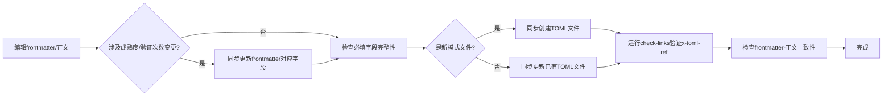

# 双轨元数据一致性模式：Frontmatter-正文漂移与TOML双星同步

## 模式类型
治理策略/文档质量保证模式

## 成熟度
L1 实验性（1次验证：并发安全检查器复盘原子化元层自举验证发现R1/R2缺陷）

## 适用场景
所有包含YAML frontmatter和外部TOML元数据的Markdown文档（模式文件、复盘报告、知识文档、规范文件）；自动化工具依赖frontmatter元数据做统计/索引/检索的场景。

## 问题背景

文档中存在两类元数据位置，它们与正文之间天然存在漂移风险：

1. **Frontmatter-正文双源漂移**：frontmatter中的结构化字段（如`maturity: "L1"`）与正文中的叙述（如"成熟度L2，经2次验证"）不一致
2. **TOML-Frontmatter双星失同步**：外部TOML元数据文件缺失或与frontmatter字段不一致，形成"孤儿元数据"或"断链引用"

**漂移类型对比**：

| 维度 | 正文数据漂移 | Frontmatter元数据漂移 | TOML双星失同步 |
|------|------------|---------------------|---------------|
| 可见性 | 正文中的数字，阅读时可见 | 文件顶部折叠区，人眼盲区 | 完全外部文件，正文不可见 |
| 检测方式 | wc -l/grep等脚本统计 | 需要专门检查frontmatter字段 | 需要文件系统检查+路径验证 |
| 危害对象 | 读者理解偏差 | 自动化工具读取错误元数据 | 自动化统计遗漏、x-toml-ref断链 |
| 典型案例 | visitor行数465→840 | maturity L1 vs L2 | 3个模式文件未创建TOML |
| 隐蔽程度 | ⭐⭐（较明显） | ⭐⭐⭐⭐（很隐蔽） | ⭐⭐⭐⭐⭐（最隐蔽） |

## 核心洞察

### 洞察A：Frontmatter是人眼盲区

Markdown编辑器默认折叠frontmatter，人眼阅读从正文开始不会回看顶部，导致：
- `maturity`、`validation_count`等结构化字段更新后，正文的成熟度叙述不同步
- 缺少`x-toml-ref`、`validation_count`、`reuse_count`、`related_patterns`等标准字段时不易发现
- 自动化工具依赖frontmatter做统计（如pattern-maturity.py），错误元数据导致系统性统计失真

### 洞察B：TOML是伴生产物而非附属品

TOML文件不是模式文件的"可选附属"，而是**双星系统**的必要组成部分：
- 创建模式文件时必须同步创建TOML
- 更新frontmatter时必须同步更新TOML
- 缺失TOML会导致：自动化统计遗漏、`x-toml-ref`成为断链、元数据不一致无法被工具检测

## 解决方案

### 标准检查清单（12项必过门禁）

新模式文件创建或frontmatter更新时，必须逐项检查：

#### Frontmatter完整性检查（9个必填字段）

| # | 字段 | 必选 | 检查标准 |
|---|------|:----:|---------|
| 1 | `id` | ✅ | kebab-case英文唯一标识，与文件名一致 |
| 2 | `title` | ✅ | 中文完整标题，与H1标题一致 |
| 3 | `source` | ✅ | 来源溯源（复盘报告路径+锚点/父文档） |
| 4 | `x-toml-ref` | ✅ | TOML文件的相对路径，路径必须真实存在 |
| 5 | `maturity` | ✅ | L1/L2/L3/L4，必须与正文描述一致 |
| 6 | `validation_count` | ✅ | 整数，实际验证次数 |
| 7 | `reuse_count` | ✅ | 整数，被独立任务复用次数 |
| 8 | `related_patterns` | ✅ | 嵌套列表格式`-   - "pattern-id"`，列出相关模式 |
| 9 | `tags` | ✅ | 标签数组，覆盖核心关键词 |

#### Frontmatter-正文一致性检查

- [ ] **成熟度一致**：frontmatter的`maturity`值与正文"成熟度"章节描述完全一致
- [ ] **验证次数一致**：frontmatter的`validation_count`与正文叙述的验证次数一致
- [ ] **ID引用一致**：正文引用自身或其他模式时使用的ID与frontmatter的`id`一致

#### TOML双星同步检查

- [ ] **TOML文件存在**：`x-toml-ref`指向的TOML文件在文件系统中真实存在
- [ ] **双向同步**：frontmatter字段更新时，TOML文件对应字段同步更新

### 实施SOP

### 自动化建议

1. **Frontmatter字段完整性**：编写脚本检查模式文件是否包含9个必填字段
2. **成熟度一致性**：正则匹配正文中的"成熟度：Lx"与frontmatter的`maturity`字段
3. **TOML存在性检查**：验证`x-toml-ref`指向的文件是否存在
4. **与edit-verify-separation集成**：在验证阶段（Step 5）作为第2项"frontmatter完整性"固定检查

## 实际案例

### 案例：并发安全检查器复盘原子化元层自举验证

**场景**：创建3个新模式文件（spec-narrative-separation、data-validation-four-checks、edit-verify-separation）后，应用meta-verification-checklist进行递归自举验证。

**发现的问题**：
- **R1（frontmatter成熟度漂移）**：edit-verify-separation模式正文已声明L2（2次验证），但frontmatter的`maturity`字段仍为L1
- **R2（标准字段+TOML缺失）**：3个新模式文件都缺少`x-toml-ref`、`validation_count`、`reuse_count`、`related_patterns`等标准字段，对应的TOML文件也未创建

**修正内容**：
1. 所有模式文件frontmatter补全9个必填字段
2. maturity从L1修正为L2，validation_count设为2/3
3. 创建对应的TOML元数据文件
4. 验证阶段Step 5从7类9项扩展为8类11项，新增frontmatter完整性和TOML同步检查

## 反模式

### 反模式1：凭记忆更新frontmatter

只改正文中的成熟度叙述，忘记更新frontmatter的`maturity`字段。

**问题**：自动化统计工具读取frontmatter得到过时数据，成熟度分布统计失真。

**修正**：任何涉及成熟度/验证次数的变更，必须同时更新frontmatter和正文。

### 反模式2：事后补建TOML

模式文件创建时不建TOML，"等以后再说"。

**问题**：多个模式积累后批量补建容易遗漏路径计算，x-toml-ref路径断链。

**修正**：创建模式文件时立即创建TOML文件，TOML是伴生产物不是附属品。

### 反模式3：frontmatter字段随意添加

根据"感觉有用"添加`author`、`version`、`category`等不在标准中的字段。

**问题**：字段膨胀导致维护负担，不同模式字段集不一致，工具无法统一解析。

**修正**：遵循9个必填字段标准，额外字段需经评审纳入标准后才能添加。

## 与其他模式的关系

| 相关模式 | 关系 | 说明 |
|---------|------|------|
| wiki-dual-track-frontmatter | 领域特例 | 前者是Wiki双轨frontmatter（单文件vs原子化），本模式是通用双轨一致性（frontmatter-正文-TOML） |
| data-validation-four-checks | 上层依赖 | 四查法验证正文数据，本模式扩展验证元数据层一致性 |
| edit-verify-separation | 配套流程 | 本模式的检查清单是验证阶段（Step 5）的固定组成部分 |
| meta-verification-checklist | 元层验证 | 递归自举验证时发现本模式要解决的问题 |
| methodology-evolution-cross-refs | 配套使用 | 演进记录更新时需同步更新frontmatter的validation_count |

## 检查清单

创建或更新模式文件后，逐项检查：
- [ ] frontmatter包含9个必填字段（id/title/source/x-toml-ref/maturity/validation_count/reuse_count/related_patterns/tags）？
- [ ] `maturity`值与正文成熟度叙述一致？
- [ ] `validation_count`值与正文验证次数一致？
- [ ] `x-toml-ref`指向的TOML文件真实存在？
- [ ] TOML文件内容与frontmatter同步更新？
- [ ] 新增/修改模式时同步创建/更新TOML（非事后补建）？
- [ ] 没有随意添加不在标准中的字段？
- [ ] `related_patterns`使用正确的嵌套列表格式（`-   - "id"`）？
