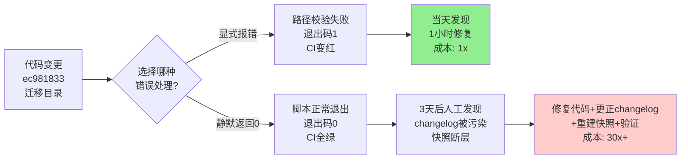

> **来源**：SpecWeave全项目复盘（2026-07-19）——docgen stats路径断链3天无人发现的根因分析
> **验证次数**：1次实战验证（docgen stats静默返回0污染3天changelog）

# 显式报错优于静默降级：自动化系统故障显性化原则

## 模式概述

在自动化系统（脚本、CI工作流、数据采集、监控告警）设计中，**当遇到错误/异常/缺失输入时，显式报错（抛出异常、返回非零退出码、输出ERROR日志）永远优于静默降级（返回默认值、零值、空数据并正常退出）**。静默降级让错误隐身，污染正式数据和档案；显式报错让错误立即暴露，当天修复。两者的成本差距不是线性的，而是指数级的——静默1天可能只需修复1行代码，静默3天就需要修复数据、回滚changelog、重建快照。

## 核心命题

| 设计选择 | 发现时机 | 修复成本 | 数据污染 | 典型场景 |
|---------|---------|---------|---------|---------|
| **显式报错（Fail Loud）** | 当天（CI红/退出码非零） | 1x（改代码） | 无 | 路径不存在→抛异常退出码1 |
| **静默降级（Silent Fallback）** | N天后（人工发现/数据异常） | 10x-100x（修数据+回滚+重建+解释） | N天正式档案 | 路径不存在→返回0，退出码0 |

**核心洞察**："静默降级"（如路径不存在→返回0）比显性报错危害大10-100倍。显性报错当天发现当天修复；静默0值污染正式档案N天，修复需要追溯数据、更正档案、重建快照。

## 问题现象：静默降级的典型特征

1. **返回哨兵值而非报错**：路径不存在返回0或空列表，网络超时返回缓存数据，配置缺失使用默认值
2. **退出码正常**：脚本执行完成返回退出码0，CI全绿，但产出数据已完全错误
3. **错误只在debug日志中**：stderr有WARN但没人看，stdout正常输出导致下游消费方无感知
4. **"优雅降级"被滥用**：以用户体验为名隐藏错误，但在自动化链路中没有"用户"来发现异常
5. **缺失等于零的语义混淆**：`count = 0` 既可能是"真的没有"也可能是"出错了没数到"，语义二义性是定时炸弹

## SpecWeave实战案例：docgen stats路径断链

| 要素 | 内容 |
|------|------|
| 时间 | 2026-07-15 ~ 2026-07-19（3天） |
| 静默降级代码 | `count = len(list((root / "docs" / "retrospective" / "patterns").glob("*.md")))` — 路径不存在时 `glob()` 返回空迭代器，`len=0` |
| 退出码 | 0（正常） |
| CI状态 | ✅ 全绿 |
| 后果 | changelog中"模式数"从493+变为0+，持续3天无人发现；错误数据进入AGENTS.md正式档案 |
| 修复成本 | 当天修复只需改1行路径；3天后修复需：改路径+重建快照+更正changelog+验证历史数据 |
| 修复方案 | 改为显式校验：路径不存在时抛 `StatsSourceError` 并返回退出码1 |

### 成本对比

## 反模式：什么时候"看起来优雅"的降级实际上是隐患

| 反模式代码 | 看起来 | 实际上 |
|-----------|--------|--------|
| `data = cache.get(key, [])` | "缓存miss返回空列表，不崩溃" | 如果缓存是数据源而非可选加速层，空列表意味着数据丢失 |
| `count = len(glob(path)) or 0` | "路径不存在就0，很安全" | 0既可能是"真的没有"也可能是"路径错了"，语义模糊 |
| `try: fetch() except: return None` | "网络异常就返回None，不崩溃" | None在下游可能被当作合法值处理，错误扩散 |
| `if not os.path.exists(p): return []` | "防御性编程，不报错" | 防御了崩溃但没防御错误数据——这是"防御用户体验"而非"防御数据正确性" |
| CI步骤 `continue-on-error: true` | "这个步骤不重要，失败不阻塞" | 如果这个步骤产出物被下游依赖，静默失败导致连锁污染 |

## 原则与规则

### 规则1：区分"用户体验降级"和"自动化链路降级"

| 场景 | 适合降级？ | 处理方式 |
|------|-----------|---------|
| 面向用户的UI（加载失败显示"加载失败，请重试"） | ✅ 可以有降级 | 用户能看到错误，可以重试 |
| 自动化脚本/CI/数据采集 | ❌ **禁止静默降级** | 必须显式报错，让自动化链路感知到失败 |
| 可选功能/增强特性 | ⚠️ 可以降级但必须打WARN日志 | 用明确的日志标记降级状态 |
| 核心数据/统计/监控 | ❌ **绝对禁止静默降级** | 任何异常都必须显性化（退出码非零或告警） |

### 规则2：哨兵值必须在类型层面与正常值区分

- ❌ 错误：`0`、`""`、`[]`、`None` 同时表示"正常结果为空"和"出错了"
- ✅ 正确：使用 `Result<T, E>` 类型、抛出异常、返回 `(value, error)` 元组、或使用明确的哨兵对象 `SENTINEL_ERROR`

### 规则3：降级必须伴随显性信号

如果确实需要降级（非核心链路），必须同时满足：
1. stderr输出 `[ERROR]` 或 `[WARN]` 级别日志
2. 在产出物中标记降级状态（如JSON中加 `"degraded": true`）
3. 如果是CI，考虑使用 `continue-on-error: true` 但必须在后续步骤检查该步骤的结果
4. 有监控/告警机制能捕获到降级事件

### 规则4：测试"不存在路径"的情况

任何涉及文件系统路径、网络请求、外部依赖的函数，必须有测试用例覆盖"依赖不存在/不可用"的场景，验证：
- 返回值语义是否清晰（不会与合法空值混淆）
- 退出码/异常是否正确抛出
- 错误消息是否包含足够的诊断信息（路径、原因、建议）

## 实现检查清单

在编写自动化脚本/CI步骤时，检查：

- [ ] 文件路径操作前是否校验路径存在性？
- [ ] 网络请求/外部调用失败时是否抛出异常而非返回默认值？
- [ ] 返回0/空/None时是否有明确的语义区分（这是真的0还是出错了）？
- [ ] CI步骤中是否有 `continue-on-error: true`？如果有，下游是否检查了该步骤的结果？
- [ ] 错误消息是否包含足够的诊断信息？
- [ ] 是否有测试用例覆盖"依赖不可用"的场景？

## 与其他模式的关系

| 关联模式 | 关系 | 说明 |
|---------|------|------|
| [automated-stats-three-defense-lines.md](automated-stats-three-defense-lines.md) | 被包含 | 三防线模式的防线1（路径存在性校验）是本原则在stats场景的具体实现 |
| [nonlinear-correction-cost.md](nonlinear-correction-cost.md) | 理论基础 | 静默降级的修复成本是非线性增长的——发现越晚成本越高，这正是显性报错ROI极高的原因 |
| [tool-failure-three-tier-degradation.md](../tools-automation/tool-failure-three-tier-degradation.md) | 适用域区分 | 工具故障降级处理的是"工具调用时出故障怎么办"（运行时容错），本模式处理的是"代码设计时如何处理错误"（设计时防御）；互补不冲突 |
| [git-hooks-three-tier-trust.md](../tools-automation/git-hooks-three-tier-trust.md) | 思想同源 | Git hooks三级信任的核心思想是"不信任必须显性化"，与本模式"错误必须显性化"一致 |
| [first-principles-decision-quality-gate.md](first-principles-decision-quality-gate.md) | 防御层 | 第一性原理决策门禁要求显性化隐性假设，本模式要求显性化错误状态 |

## 推广场景

本原则适用于所有自动化系统设计：

| 推广场景 | 静默降级的危害 | 显式报错的做法 |
|---------|--------------|--------------|
| **API健康检查** | 超时返回"healthy"导致流量进入故障实例 | 超时返回unhealthy，触发告警 |
| **数据库备份脚本** | 备份失败但退出码0，以为备份成功 | 备份失败返回非零退出码，触发告警 |
| **依赖更新检查** | 检查失败返回"全部最新" | 检查失败返回非零，阻止自动合并 |
| **测试覆盖率统计** | 统计失败覆盖率显示0%，以为没写测试 | 统计失败报错，不更新覆盖率徽章 |
| **文档构建脚本** | 构建失败但生成空文档 | 构建失败中断CI，阻止部署空文档 |
| **监控数据采集** | 采集失败返回0，监控图表显示为0而非断点 | 采集失败上报NaN/error，监控显示断点 |

## Changelog

- 2026-07-19 | create | 初始版本，从SpecWeave全项目复盘提炼，L1成熟度
