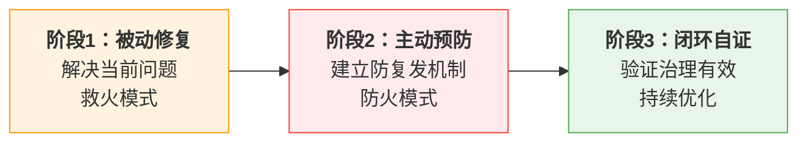

# 治理演化三阶段：修复→预防→闭环

## 模式类型
方法论模式（元方法论）

## 成熟度
L2 已验证（Mermaid治理、断链治理、事实表述一致性治理等多个场景验证）

## 问题场景
问题反复出现（如Mermaid兼容性问题、断链问题、事实表述漂移），"点修复"（只解决眼前问题）无法根除——每次修复后问题以变体形式复发，投入大量时间救火但问题越来越多。

## 核心定义

所有质量治理、流程治理、规范治理必须严格经历三个阶段才能真正闭环，**禁止跳过任何阶段**：

| 阶段 | 目标 | 核心问题 | 典型动作 |
|------|------|---------|---------|
| **被动修复** | 解决当前暴露的问题 | "怎么让现在的问题消失？" | 定位根因、实施修复、验证有效 |
| **主动预防** | 确保同类问题不再以任何形式出现 | "怎么防止下次再发生？" | 写检查脚本、加规则、加测试、更新反模式清单 |
| **闭环自证** | 证明治理机制确实有效 | "怎么知道预防机制在工作？" | 一站式入口、定期审计、验证拦截记录、治理熵减 |

## 解决方案

### 阶段1：被动修复（Fix）
- 明确定义问题现象和复现条件
- 使用5-Whys或等价方法定位根因（而非表面原因）
- 实施修复并验证当前问题不再出现
- **注意**：此阶段完成≠问题解决，只是救火完成

### 阶段2：主动预防（Prevent）
**此阶段禁止跳过——只做阶段1不算完成治理。**

按优先级选择预防措施（至少一项）：
1. **自动化检查脚本**：问题可静态检测→写脚本加入CI/pre-commit
2. **规则/规范更新**：问题源于流程缺失→更新规则文档和SOP
3. **单元测试用例**：代码逻辑问题→添加测试用例覆盖Bug场景
4. **反模式清单**：常见陷阱→加入反模式清单附正例对比
5. **架构/设计调整**：设计缺陷→从根源消除问题产生可能性

**关键原则**：预防措施必须能自动或半自动检测同类问题，不能仅靠"以后注意"。

### 阶段3：闭环自证（Close）
满足任一验证方式：
1. **自动验证**：检查脚本/测试用例运行确认能检测问题模式
2. **实战验证**：24小时内或下次同类操作时观察到预防机制成功拦截
3. **回归验证**：故意引入同类错误确认能被检测

同时需要：
- 一站式入口文档（让治理规则可被发现）
- 定期治理审计（防止治理规则自身熵增）
- 将经验沉淀到模式库（非平凡问题）

## 支撑证据

### 验证案例1：Mermaid治理
- **阶段1**：修复中文ID子图语法问题（渲染修复）
- **阶段2**：制定Mermaid安全编码六规则 + 开发check-mermaid.py检查脚本
- **阶段3**：一站式Mermaid治理入口 + 本次复盘验证治理闭环有效

### 验证案例2：断链治理
- **阶段1**：批量修复81处断链
- **阶段2**：开发check-links.py脚本 + 路径引用规范 + 重构前影响范围分析流程
- **阶段3**：finalize-atomization.py一键收尾 + 每次重构自动验证链接

### 验证案例3：事实表述漂移治理
- **阶段1**：修正角色数/协议数/统计数字不一致
- **阶段2**：建立单一数据源原则 + synthetic-stats-source-of-truth模式
- **阶段3**：看板自动生成脚本（规划中）

## 复用场景
- 所有质量治理场景（代码质量、文档质量、流程质量）
- Bug修复流程（必须遵循三阶段）
- 问题驱动的治理演化（每个治理规则都来自真实问题）

## 反模式

| 反模式 | 表现 | 后果 |
|--------|------|------|
| **点修复偏误** | "这个问题修好了，以后注意就行"，不加预防措施 | 问题以变体形式复发，永远在救火 |
| **跳过预防直接做闭环** | 没有检查脚本就开始写"治理白皮书" | 空中楼阁，没有实际预防能力 |
| **预防即文档** | 只在文档里写"请注意不要XXX" | 人非圣贤，靠"注意"无法防止错误 |
| **治理膨胀** | 一直加规则不做审计和废止 | 治理规则熵增，规则之间冲突，执行度下降 |

## 实施检查清单

- [ ] 阶段1：当前问题已修复，复现验证通过
- [ ] 阶段2：已实施至少一项可验证的预防措施（不是纯文档说明）
- [ ] 阶段3：有证据证明预防机制生效（检查脚本输出/拦截日志/测试通过）
- [ ] 有治理入口文档，规则可被发现
- [ ] 定期治理审计（每季度）防止规则熵增

## 关联模式

- [fix-prevent-close-loop.md](../../../../../rules/fix-prevent-close-loop.md)：本模式在Bug修复领域的具体SOP（已作为全局规则执行）
- [three-stage-universal-principle.md](../../../../../rules/three-stage-universal-principle.md)：三阶段是普遍规律，治理三阶段是其中一个领域
- [three-tier-governance.md](three-tier-governance.md)：三层治理模型（原子化→自动化→验证）
- [meta-retrospective-closed-loop.md](meta-retrospective-closed-loop.md)：元复盘闭环
