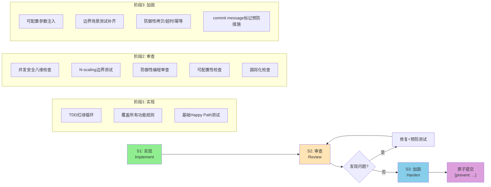

# "实现→审查→加固"三段式SOP：核心机制类代码开发流程

## 模式概述

从多智能体冲突解决机制开发中萃取的核心机制类代码开发流程。初始实现+TDD测试全绿（26个测试通过）后，主动代码审查发现8个问题（含2个高风险死锁/活锁缺陷），全部修复并新增13个预防测试，最终39个测试全部通过。

**核心洞察**："测试通过"是最低标准，不是完成标准。核心机制类代码（锁、资源分配、状态机、调度器等）在功能实现+测试通过后，必须经过主动安全审查环节，检查非功能需求。

## 问题场景

开发者完成核心机制代码编写，单元测试全部通过（绿条），认为任务完成直接提交。但代码中隐藏着：
- 锁无超时导致永久死锁
- 重复消息无幂等检查导致活锁
- N≥3的边界场景未覆盖导致饥饿
- 可变参数无防御性拷贝导致竞态
- 业务规则硬编码导致扩展性差
- 文本处理未考虑多语言导致匹配失效

这些缺陷在Happy Path测试中完全无法暴露，只在异常路径和边界条件下触发。

## SOP流程图



## 三阶段详解

### 阶段1：实现（Implement）——功能正确

**目标**：功能逻辑正确，Happy Path测试全绿。

**关键动作**：
1. **TDD红绿循环**：先写测试再写代码，覆盖所有业务规则
2. **功能规则全覆盖**：每个仲裁规则/业务逻辑至少1个测试
3. **基础场景验证**：N=2的典型场景测试通过

**退出标准**：所有功能测试通过，代码覆盖率≥80%。

**注意**：此阶段结束时，代码可能仍然"看起来正确但用起来危险"。

---

### 阶段2：审查（Review）——主动安全审计

**目标**：系统性发现非功能缺陷，而非依赖用户反馈或线上故障。

**审查清单（八维检查法）**：

| 维度 | 检查项 | 典型缺陷案例 |
|------|--------|-------------|
| 1. **超时** | 所有等待/锁/阻塞操作是否有超时？ | 资源锁无超时→持有者崩溃永久死锁（D1） |
| 2. **幂等** | 重复消息/重复操作是否安全？ | rejected_by重复添加→绕过升级检查→逻辑活锁（D2） |
| 3. **边界** | N≥3的场景是否覆盖？ | 负载均衡只比前2个agent→多agent场景低负载被忽略（D3） |
| 4. **防御** | 传入的可变参数是否会被外部修改？ | agents dict无拷贝→并发环境外部修改导致竞态（D7） |
| 5. **配置** | 规则/阈值/关键词是否可注入？ | 技术分歧硬编码关键词→无法扩展（D5） |
| 6. **国际化** | 文本处理是否支持多语言？ | 按空格分词→中文无空格匹配失效（D8） |
| 7. **死锁顺序** | 多锁获取是否有固定顺序？ | （八维扩展项） |
| 8. **资源泄漏** | 获取的资源是否保证释放？ | （八维扩展项） |

**审查方法**：
- 对每个锁/等待点问："如果对方永远不回应怎么办？"
- 对每个状态更新问："如果收到重复消息怎么办？"
- 对每个选择/排序算法问："N=3时结果正确吗？N=5呢？"
- 对每个传入参数问："调用方在我返回后修改它会怎么样？"
- 对每个常量问："不同场景需要不同值时怎么改？"
- 对每个字符串操作问："如果是中文/日文没有空格分词怎么办？"

**退出标准**：八维检查全部通过，无高/中风险问题。

---

### 阶段3：加固（Harden）——预防未来回归

**目标**：不仅修复当前Bug，还要防止同类问题在未来重构中再次引入。

**加固措施（按fix-prevent-close-loop规范）**：

1. **1修复+N预防测试公式**：
   - 每个Bug修复必须包含：1个代码修复 + ≥1个回归测试 + 同类场景泛化测试
   - 例：修复N=2的负载均衡bug，加N=3/N=5/N=10的测试
   - 例：修复锁无超时bug，加自定义超时配置测试+优先级调度中的锁超时测试

2. **可配置性默认原则**：
   - 所有业务规则、阈值、关键词通过构造函数注入
   - 提供合理默认值，但允许覆盖
   - 参考：[configurable-by-default-principle.md](../../code-patterns/configurable-by-default-principle.md)

3. **commit message预防标记**：
   ```
   fix(conflict-resolution): 修复资源锁超时和拒绝去重问题
   
   [prevent: test-case] 新增6个死锁预防测试
   [prevent: architecture] 所有锁默认带超时，拒绝列表自动去重
   ```

4. **边界场景测试矩阵**：
   - 对调度/选择/仲裁类代码，必须覆盖N=0/1/2/3/5/10
   - 参考：N-scaling测试矩阵方法论

**退出标准**：修复+测试+commit标记全部完成，所有测试（含新增预防测试）通过。

## 关键决策点

| 决策点 | 选择 | 理由 |
|--------|------|------|
| 审查时机 | 功能完成+测试通过后立即审查 | 此时代码上下文最新，审查效率最高 |
| 审查方式 | 主动自我审查，非等待他人review | 作者最了解代码风险点，主动审查比被动review发现更多深层问题 |
| 修复优先级 | 高风险死锁/活锁 > 中风险正确性 > 低风险性能/体验 | 死锁类问题线上难以调试，必须零容忍 |
| 测试策略 | Bug修复必须附带预防测试，而非只修复代码 | 防止未来重构时同样的Bug再次引入 |

## 反模式

1. **❌ "测试全绿=完成"**：测试通过只能证明测试覆盖的路径正确，不能证明所有路径正确
2. **❌ "只修不防"**：修复代码但不写预防测试，等于给未来的自己留坑
3. **❌ "只测N=2"**：排序/选择算法在N=2时正确不代表N≥3时正确，D3/D4就是教训
4. **❌ "硬编码快速上线"**：硬编码的规则上线后每次调整都要改代码发版，技术债利息很高
5. **❌ "假设英文环境"**：中文用户的文本没有空格分词，按空格分词的匹配逻辑直接失效

## 验证清单

提交核心机制代码前，逐项确认：

- [ ] 阶段1：所有功能测试通过
- [ ] 阶段2：八维检查逐项完成
  - [ ] 超时：所有锁/等待有超时
  - [ ] 幂等：重复消息/操作安全
  - [ ] 边界：N≥3场景测试覆盖
  - [ ] 防御：可变参数有防御性拷贝
  - [ ] 配置：规则/阈值可注入
  - [ ] 国际化：文本处理不依赖空格分词
  - [ ] 死锁：多锁获取顺序一致（如适用）
  - [ ] 泄漏：资源获取有对应释放（如适用）
- [ ] 阶段3：加固措施落实
  - [ ] 每个修复附带≥1个预防测试
  - [ ] commit message标记`[prevent: ...]`
  - [ ] 所有测试（含新增）全部通过

## 适用场景

- 锁机制、资源分配器、调度器
- 多参与者状态机、仲裁模块
- 并发/并行执行框架
- 任何"测试通过但感觉不放心"的核心基础代码

## 相关模式

- [防御性编程第一性原理](defensive-programming-first-principles.md)：阶段2/3的底层原则
- [fix-prevent-close-loop](../../../../../rules/fix-prevent-close-loop.md)：Bug修复闭环规范
- [可配置性默认原则](../../code-patterns/configurable-by-default-principle.md)：阶段3的加固措施之一
