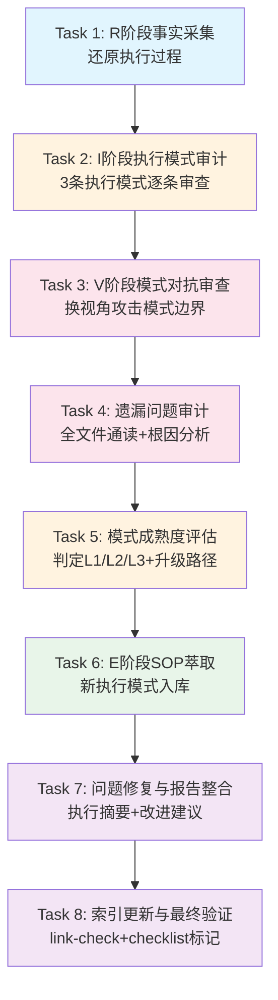

> **来源**：从 `retrospective-i-have-adhd-second-round-validation` 元复盘实践中萃取——对i-have-adhd知识沉淀任务进行二次验证复盘（R→I→E→V全链路），验证了单案例L2模式携带确认偏误的结构性缺陷

# 知识沉淀二次验证SOP

## 速查表（核心层）

| 维度 | 内容 |
|------|------|
| **一句话** | 新萃取的L2模式入库后，在新spec中执行R→I→V→E四阶段二次验证，暴露单案例确认偏误盲区，将模式从"看起来对"提升到"经得起攻击" |
| **触发时机** | L2模式入库后1-2周内；或模式将在高风险场景（可能伤害用户的设计/规范类）使用前 |
| **输出** | validation-report.md（8个章节）、模式文档V2更新、新发现的执行模式入库 |
| **核心数** | 8个Task、4个阶段（R/I/V/E）、6类必查维度、3个5-Whys根因分析 |

---

## 一、为什么需要二次验证

### 问题现象

单案例萃取的知识沉淀存在结构性的"确认偏误闭环"：

```
R（采集成功案例事实）→ I（从成功中提炼洞察）→ E（从成功中萃取模式）→ V（检查模式内部一致性）
                                        ↑                                            ↓
                                        └────── 没有强制环节要求找失败反例 ←─────────────┘
```

第一次V审查通常由执行同一任务的同一代理在同一上下文中完成，天然存在认知盲区：
- 非目标用户的体验盲区（如为技术用户设计的模式未考虑非技术用户）
- 创意/探索场景的适用性盲区（行动导向模式抑制创意发散）
- 失败案例的幸存者偏差（只看到成功迁移，未看到失败教训）
- 执行过程中的合规性盲区（后半段验证闭环是否真的执行）

i-have-adhd二次验证实证：第一轮V审查产出9条意见（聚焦分析逻辑），第二轮V审查又发现4个边界盲区+4个真实失败案例+3个遗漏必要前提+9项P0文件级错误，且发现3条执行模式未独立入库的半闭环问题。

### 二次验证的价值

二次验证不是"重做一遍"，而是换视角、换上下文、换审查重点进行对抗：

| 对比维度 | 第一次V审查 | 第二次验证（本SOP） |
|---------|-----------|------------------|
| 审查对象 | 分析报告+源文件质量 | 已入库模式本身的边界+执行过程合规性 |
| 审查视角 | 内部逻辑一致性 | 外部边界+失败案例+执行遵循度 |
| 典型发现 | 错别字、逻辑跳跃、论证不充分 | 边界盲区、失败案例、前提遗漏、执行模式未入库 |
| 发现问题数（实证）| 9条（i-have-adhd V1） | 4条V2意见+4失败案例+9项P0+3个系统性根因 |

## 二、触发条件

满足以下任一条件应触发二次验证：

1. **新L2模式入库后**：从单案例萃取的L2模式（尤其是创新/设计/规范类），入库后1-2周内安排二次验证
2. **高风险场景前**：模式将用于可能产生实际伤害的场景（如面向用户的产品设计、安全规则、团队强约束规范）
3. **执行过程异常后**：第一次任务执行中出现≥3个修复记录、质量门勉强通过、或子代理产出有明显问题
4. **跨领域复用前**：模式将在不同于萃取场景的新领域中首次使用前
5. **积累到3个以上L2模式时**：批量验证多个同期入库模式的一致性和互操作性

**不触发条件**：
- L1实验性模式（尚未稳定，二次验证收益低）
- L3标准化模式（已通过多案例验证，有自动化检查）
- 纯事实性文档（无规则/方法论内容，不存在适用边界问题）

## 三、标准流程（8个Task）



### Task 1：R阶段——执行过程完整回溯与事实采集

**目标**：还原第一次任务的完整执行过程，建立客观事实基础。

**操作步骤**：
1. 收集第一次任务的完整上下文：spec.md/tasks.md/checklist.md/所有产出文件/第一次元复盘报告
2. 基于tasks.md状态记录还原执行时间线：跨会话节点、子代理委托时序、质量门检查点、修复记录
3. 梳理客观事实清单：任务规模数据（文件数/行数/子代理次数/质量门数量/修复问题数）、执行流程节点、关键决策点
4. 创建validation-report.md，完成第一章（任务概览+执行时间线）

**质量门G1**：事实描述无因果推断词（"因为/导致/所以/因此"等），纯客观可验证。

### Task 2：I阶段——执行模式有效性审计

**目标**：逐条审计第一次任务中应用的执行模式（编排-执行分层/风格锚定/强约束自检）的实际遵循度。

**操作步骤**：
1. 对照"编排-执行分层法"5个核心步骤，逐项审计遵循度（遵循/部分遵循/未遵循）+具体证据
2. 对照"风格锚定法"5个维度（章节结构/YAML/表格/语言/深度），对比锚点文件评分
3. 对照"强约束自检启发式"4步，执行Grep强约束审计
4. 每个模式给出遵循度评分+≥2个优势点+≥1个待改进点
5. 完成validation-report.md第二章

### Task 3：V阶段——L2模式第二轮对抗审查

**目标**：用第一次V阶段未使用的新视角攻击每个L2模式，寻找边界盲区和失败案例。

**必查6个视角**（每个模式至少覆盖3个）：

| 视角 | 追问问题 | 适用模式类型 |
|------|---------|------------|
| 非目标用户 | 对非目标用户群体是否适用？是否造成困扰？ | 通用类模式 |
| 长对话/多轮 | 超过N轮交互后，规则是否反而增加认知负担？ | 交互/输出类模式 |
| 创意/探索场景 | 结论前置/规则约束是否抑制发散思维？ | 行动导向/规范类模式 |
| 高风险决策 | 快速行动/默认方案是否可能忽略关键风险？ | 决策/行动类模式 |
| 失败案例检索 | 该方法是否有已知的失败案例？失败根因是什么？ | 创新/设计/迁移类模式 |
| 前提条件 | 模式成立的隐含前提是什么？前提不满足时会怎样？ | 所有模式 |

**审查产出要求**：
- 每个模式≥3条新审查意见（不重复第一次V阶段）
- ≥2个新边界场景/反例
- 采纳意见直接更新到模式文档，记录Changelog
- 完成validation-report.md第三章

### Task 4：遗漏问题审计与根因分析

**目标**：以第三方审计者视角通读所有产出文件，发现文件级问题，对系统性问题做5-Whys根因分析。

**检查维度**：
- 错别字/语法错误
- 链接有效性（相对路径正确性、x-toml-ref可达性）
- 逻辑自相矛盾
- 事实不准确
- YAML frontmatter完整性
- 强约束词残留
- TOML元数据文件是否存在
- 风格一致性（同目录内对比）

**问题分级**：
- P0（必须修复）：断链、事实错误、逻辑矛盾、影响理解的错别字、TOML缺失
- P1（建议修复）：表述不通顺、格式不美观、提示词模板未同步
- P2（后续优化）：风格改进、结构优化建议

**5-Whys根因分析**：对Task2-3发现的≥2个系统性问题做5-Whys分析，追溯到流程/方法论层面（而非"粗心""没注意"）。

完成validation-report.md第四章。

### Task 5：模式成熟度评估与I阶段洞察整合

**目标**：评估所有涉及模式的成熟度等级，提炼核心洞察。

**操作步骤**：
1. 对照[pattern-maturity-levels.md](../../concepts/pattern-maturity-levels.md)的L1-L3标准，逐个评估模式当前等级
2. 给出每个模式的L2/L3升级条件和可执行路径
3. 提炼≥3条核心洞察（G2四元组：现象+根因+影响+建议）
4. 完成validation-report.md第五章

### Task 6：E阶段——SOP萃取与新模式入库

**目标**：将二次验证过程本身沉淀为可复用模式；将第一次任务中萃取但未独立入库的执行模式入库。

**操作步骤**：
1. 基于本次二次验证执行过程，更新/完善本SOP模式文档
2. 将Task2审计的执行模式（若未独立入库）创建独立模式文档，风格锚定同目录现有模式
3. 新模式文档采用"核心层+扩展层"分层架构（开头速查表+详细章节）
4. 为每个新入库模式创建TOML元数据文件
5. 完成validation-report.md第六章

### Task 7：问题修复与报告整合

**目标**：修复所有P0问题，整合报告，撰写执行摘要和改进建议。

**操作步骤**：
1. 修复Task4识别的所有P0问题，可修复的P1问题同步修复
2. 撰写validation-report.md执行摘要（300字以内）
3. 撰写改进建议章节（≥5条，具体可执行，明确修改位置/内容/验证方法）
4. 添加范式自体验章节（诚实记录本次交互中行动优先范式的优缺点）
5. 更新Changelog

### Task 8：索引更新与最终验证收尾

**目标**：更新索引，运行自动化检查，标记checklist完成。

**操作步骤**：
1. 更新对应目录的README.md索引，添加新条目
2. 更新retrospectives-insights/README.md登记本spec
3. 运行link-check验证所有链接有效性
4. Grep检查无file:///绝对路径引用
5. 通读检查错别字
6. 更新checklist.md所有检查点状态
7. 原子提交

## 四、质量标准

### G1（R阶段·事实无因果词）
- Grep检查事实描述章节无因果推断词
- 所有事实数据可通过对应文件验证

### G2（I阶段·洞察四元组完整）
- ≥3条核心洞察每条包含：现象描述+根因分析+影响评估+改进建议
- 根因分析追溯到流程/方法论层面

### G3（E阶段·SOP可迁移）
- SOP包含触发条件+标准流程+检查清单+反模式+迁移验证
- 不参考本次具体任务也能独立执行二次验证

### G-V1~G-V4（V阶段审查质量）
- G-V1：第二轮审查意见均为具体问题，非客套话
- G-V2：覆盖≥3个未在第一次V中使用的视角
- G-V3：≥2条审查意见被采纳并修改模式文档
- G-V4：未采纳意见有记录和理由

### 文件级标准
- 所有P0问题修复率100%
- link-check零错误
- YAML frontmatter完整
- 无file:///绝对路径

## 五、输出物清单

| 产出物 | 路径 | 说明 |
|--------|------|------|
| Spec三件套 | `.trae/specs/retrospectives-insights/retrospective-<name>-second-round-validation/` | spec.md/tasks.md/checklist.md |
| 验证报告 | 同上目录/validation-report.md | 8章完整报告 |
| 更新的模式文档 | `.agents/docs/retrospective/patterns/`对应目录 | V2更新（边界/失败案例/前提） |
| 新模式文档 | `.agents/docs/retrospective/patterns/methodology-patterns/governance-strategy/` | 若萃取了新执行模式 |
| TOML元数据 | `.meta/toml/`对应镜像目录 | 每个模式对应一个.toml |
| 索引更新 | 对应目录README.md | 添加新条目 |

## 六、反模式（二次验证常见误区）

| 反模式 | 表现 | 正确做法 |
|--------|------|---------|
| 重复第一次审查 | 再次检查分析报告中的逻辑问题，而非模式边界 | 聚焦已入库模式+执行过程合规性 |
| 只做文件检查不做根因分析 | P0问题修完就结束，不追问"为什么第一次遗漏" | 每个系统性问题做5-Whys分析 |
| 跨目录风格比较 | 选非同目录文件作为风格锚点，导致误判 | 严格同目录锚定，先确认目录惯例 |
| 执行模式不入库 | 新发现的执行经验只写在复盘报告表格中 | 创建独立模式文档+TOML，纳入成熟度追踪 |
| 假设V修正自动传播 | 源文件修正后认为下游模式文档已同步 | CP2/CP3检查点：入库前和模板同步时各做一次强约束自检 |
| 一次提交所有变更 | Task1-8所有完成后一次commit | 每完成一个大阶段原子提交一次 |

## 七、迁移验证

| 迁移场景 | 验证状态 |
|---------|---------|
| i-have-adhd知识沉淀二次验证 | ✅ 本SOP萃取来源，8个Task完整执行 |
| 其他文章分析类知识沉淀 | ⚠️ 待验证 |
| 代码重构类项目复盘 | ⚠️ 待验证 |
| 产品设计类创新验证 | ⚠️ 待验证 |

## 八、截断条件（防止无限递归）

二次验证本身是否需要三次验证？设截断规则：

1. **L2模式二次验证后如果成熟度仍为L2**：不再继续做三次验证，将升级条件记录为"需N次跨领域验证"，在后续实际复用中积累验证次数
2. **二次验证SOP本身的验证**：本SOP在1次应用中萃取（L1），在≥2次独立二次验证任务中成功应用后升级L2
3. **不做元元复盘**：二次验证的报告是终点，不再对二次验证本身做三次复盘——除非二次验证过程中发现SOP本身有重大结构性缺陷

> **关联模块**：
> - `docs/retrospective/patterns/methodology-patterns/governance-strategy/meta-retrospective-closed-loop.md`（元复盘闭环）
> - `docs/retrospective/patterns/methodology-patterns/governance-strategy/orchestration-execution-layering.md`（编排-执行分层法）
> - `docs/retrospective/patterns/methodology-patterns/governance-strategy/style-anchoring-consistency.md`（风格锚定法）
> - `docs/retrospective/patterns/methodology-patterns/governance-strategy/strong-constraint-self-check.md`（强约束自检法）
> - `docs/retrospective/patterns/methodology-patterns/governance-strategy/root-cause-diagnosis.md`（根因诊断模式）
