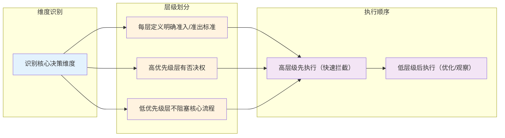

> **提炼自**：[Agent评测体系化建设方法论深度分析报告](../../../reports/insight-extraction/external-learning/retrospective-agent-eval-article-analysis-20260803/analysis-report.md)

# 分层分级降维模式（Layered Priority Dimension Reduction）

## 模式类型

方法论模式（治理策略/复杂系统工程/质量保障）

## 成熟度

L1 单案例验证（来源：孙敦灿《Agent评测体系化》文章方法论，待多场景验证）

## 适用场景

适用于任何具有开放状态空间、非确定性输出、多模块协作的复杂系统工程设计。核心适用场景：

| 场景 | 适用度 | 说明 |
|------|--------|------|
| AI/Agent质量保障体系设计 | ✅✅✅ 核心场景 | 非确定性系统必须用分层优先级收敛复杂度 |
| 指标体系设计 | ✅✅✅ 核心场景 | 区分门禁指标/优化指标/观察指标，避免"一刀切" |
| 评分/决策系统设计 | ✅✅✅ 核心场景 | 规则优先、模型辅助、人工兜底的分层决策 |
| 根因分析流程设计 | ✅✅ 推荐 | 现象层→模块层→责任层三层归因，避免无差别排查 |
| 发布门禁/CI/CD流程 | ✅✅ 推荐 | 按风险等级分层拦截，不是所有问题都阻塞发布 |
| 简单确定性系统 | ❌ 不适用 | 逻辑简单、输出确定的系统不需要多层分级 |

## 问题背景

复杂系统（尤其是AI/Agent系统）面临三个核心困难：
1. **状态空间开放**：输入输出不可穷举，无法用穷举测试覆盖
2. **非确定性**：同样输入不一定产生同样输出，单次通过不代表稳定
3. **错误级联**：多步链路中小偏差会被放大成严重错误

面对这类系统，常见的反模式是：
- "一刀切"：所有问题同等对待，要么全阻塞要么全放行
- "万能指标"：试图用一个总分/单一标准评判所有维度
- "无差别排查"：出问题时对所有模块逐个排查，效率极低
- "平均用力"：所有环节投入同等资源，关键路径没有得到足够保障

## 术语速查（新人必读）

| 术语 | 解释 |
|------|------|
| **P0/P1/P2** | 优先级分级：P0=生死线（不达标绝对不能发布），P1=质量线（影响版本对比和优化判断），P2=体验线（长期观察不阻塞） |
| **降维** | 将一个需要同时满足多个条件的复杂决策，拆解为多个按优先级顺序的简单决策，每层只判断一件事 |

## 思想溯源

本模式不是全新发明——核心思想来自传统软件工程中已经验证几十年的原则：
- 测试金字塔（单元测试→集成测试→端到端测试，成本从低到高，执行从先到后）
- 防御深度（Defense in Depth，多层安全防线而不是单层）
- 快速失败（Fail Fast，低级错误尽早拦截）

本模式的贡献是将这些分散的原则抽象为一套可复用的通用五步法，并明确了AI/Agent这类非确定性系统中的具体落地方式。

> **关于"2-3层"与"四层评测"的说明**："每个维度2-3层"是指**单个决策维度**（如优先级、评分可靠性、执行成本）分2-3层；而"对话Agent四层评测"是**四个独立维度**（Turn/Session/Trace/Outcome）的组合，每个维度内部仍然是2-3级优先级（如Trace关键路径错误是P0，Turn单轮小问题是P2），两者不矛盾。

## 核心原则：分层降低决策复杂度

**核心洞察**：分层看似增加了概念数量，实际上是通过明确优先级和边界，大幅降低每个环节的决策复杂度——把一个"既要又要还要"的复杂决策，拆解为多个"只判断一件事"的简单决策。

分层分级的通用设计原则：

| 设计原则 | 说明 | 反例 |
|---------|------|------|
| **优先级明确** | 每层有清晰的P0/P1/P2定位：P0是门禁（不达标不能发）、P1是优化（判断迭代是否有提升）、P2是观察（长期追踪不阻塞） | 所有指标同等重要，分不清哪些必须过哪些可以忍 |
| **单向否决权** | 高优先级层可以直接否决，不需要等低优先级结果；低优先级层不能推翻高优先级结论 | P0问题已经挂了，还在纠结P2体验分低了0.1 |
| **执行顺序分层** | 高优先级、低成本的检查先执行（快速拦截明显问题）；低优先级、高成本的检查后执行（精判/抽查） | 一开始就全量跑深度检查，大部分明显失败的样本浪费了大量资源 |
| **边界清晰** | 每层只负责一类决策，不跨层判断；层与层之间有明确的路由规则 | 评分器既判断对错又判断根因，职责混乱 |
| **可降级** | 资源紧张时可以只执行高优先级层，快速给出结论；资源充足时再执行完整层级 | 要么全做要么不做，无法灵活调整成本和质量的平衡 |

## 核心做法：分层分级五步法

### 第一步：识别3-5个核心决策维度

不要一开始就分很多层，先识别系统中最核心的3-5个独立决策维度：

**示例（Agent评测领域）**：
- 维度1：指标重要性（哪些是上线必须过的）
- 维度2：评分可靠性（哪些判断是确定性的，哪些需要模型/人工）
- 维度3：归因深度（从用户现象到代码模块的分层）
- 维度4：执行成本（从快速粗筛到深度精判的分层）

### 第二步：为每个维度划分2-3个优先级层级

每个维度分2-3层即可（超过3层会增加认知负担），给每层起清晰的名字：

**通用命名参考**：

| 层级 | 通用定位 | 门禁属性 | 处理方式 |
|------|---------|---------|---------|
| 第1层（最高） | 核心红线/生死线 | P0 阻塞门禁 | 100%覆盖，不达标绝对不能放行 |
| 第2层（中间） | 质量优化/版本对比 | P1 不阻塞但告警 | 常规覆盖，作为迭代质量判断依据 |
| 第3层（最低） | 体验改善/长期观察 | P2 不阻塞 | 抽样/长尾覆盖，持续追踪不紧急 |

### 第三步：定义每层的明确判定标准

每层必须有可执行、可验证的判定标准，不能是模糊描述：

| 层级 | 模糊标准（反例） | 可执行标准（正例） |
|------|----------------|------------------|
| P0 | "不能有严重错误" | "核心场景连续成功率≥95%；P0风险场景0容忍；关键工具参数正确率100%" |
| P1 | "质量要有提升" | "与基线版本对比，关键指标提升≥3%且统计显著（p<0.05）" |
| P2 | "体验要好" | "用户满意度≥4.2分；重复追问率≤15%" |

### 第四步：设计分层执行路由

定义什么情况进入哪一层，以及层与层之间的流转规则：

1. **快速路径**：第1层（P0）检查明显失败→直接拦截，不需要进入下一层
2. **存疑路径**：第1层通过但边界/低置信→进入第2层精判
3. **完整路径**：前两层都通过→第3层抽样/深度检查（可选）
4. **人工路由**：冲突/高风险/新场景→直接路由到人工兜底

### 第五步：建立层级间的映射关系

不同维度的层级之间要建立映射，形成完整的治理体系：

**示例（Agent评测）**：
- Outcome层（最终结果）P0风险 → 直接阻塞发布
- Trace层（执行过程）关键路径错误 → P0门禁（即使Outcome对也不行）
- Session层（多轮连贯）问题 → P1门禁
- Turn层（单轮体验）问题 → P2观察

## 反模式

| 反模式 | 为什么错误 | 正确做法 |
|--------|----------|---------|
| 万能指标/一个总分 | 不同维度的失败后果严重程度完全不同，加权平均会掩盖P0问题 | 分层分级门禁，每个层级有独立的通过/失败判定，不是算总分 |
| 所有检查全量执行 | 高成本的深度检查放在最前面，大量明显失败的样本浪费资源 | 高层级、低成本检查先执行（粗筛），快速拦截80%问题；低层级、高成本检查后执行（精判） |
| 层级之间职责不清 | 既做规则判断又做语义评分还做根因分析，每层都在做所有事 | 每层单一职责：规则层只判断硬条件，LLM层只评语义，人工只处理争议 |
| 低优先级阻塞高优先级 | P0还没解决就纠结P2体验细节，关键风险被次要问题淹没 | 高优先级有单向否决权，按P0→P1→P2顺序处理 |
| 分层过多过细 | 分了5层以上，每层差异很小，认知成本超过收益 | 每个维度2-3层即可，超过3层考虑合并 |
| 分层后没有降级策略 | 资源紧张时要么全做要么不做，无法快速给出结论 | 定义"最小可用集"（只跑P0），资源充足时再跑完整层级 |
| 为分层而分层 | 简单系统硬套分层，增加不必要的复杂度 | 评估复杂度：状态空间确定、输出可预测的简单系统不需要分层 |

## 检验标准

做完之后怎么知道做对了？

1. **维度独立**：识别的3-5个维度之间相互独立，没有重叠
2. **优先级清晰**：每层有明确的P0/P1/P2定位，团队能说清"哪些问题绝对不能发"
3. **单向否决**：高优先级层可以直接否决，流程上先执行高优先级检查
4. **成本分层**：执行成本从低到高，快速拦截明显问题，不浪费资源
5. **可灵活降级**：紧急情况下可以只跑P0层快速给出结论，不需要全量执行
6. **路由明确**：什么情况进哪一层、什么情况需要人工，有清晰的路由规则
7. **可验证标准**：每层的通过/失败有可量化、可执行的判定标准，不是主观判断

## 跨场景迁移示例

| 应用场景 | 第1层（P0门禁） | 第2层（P1优化） | 第3层（P2观察） | 分层收益 |
|---------|----------------|----------------|----------------|---------|
| **Agent评测体系** | 规则Scorer硬条件检查、P0风险场景、连续成功率 | LLM Judge语义评分、版本对比统计检验 | 人工抽查体验、长尾场景追踪 | 快速拦截80%硬错误，语义问题精判，体验问题抽样，成本降为全量人工的1/10 |
| **CI/CD发布门禁** | 单元测试、编译通过、安全扫描Critical问题 | 集成测试、性能基准、代码质量评分 | UI体验、文档完整性、非关键功能测试 | 编译/单测失败直接拦截，不用跑后面耗时的集成测试 |
| **客服工单分级** | 投诉/赔付/隐私合规问题→立即升级专家 | 常规业务问题→一线客服处理 | 咨询/建议类→机器人/自助 | 高风险问题第一时间得到处理，不被普通工单淹没 |
| **日志监控告警** | P0: 服务宕机/错误率>5%→电话告警 | P1: 错误率上升/延迟增加→短信/IM告警 | P2: 体验指标波动→仪表盘观察 | 半夜不会因为一个无关紧要的告警被叫醒，真宕机了一定能收到通知 |
| **代码审查** | 自动化检查（格式化/安全/单测）必须过 | 同事审查逻辑/架构/可维护性 | 架构师抽查核心模块、风格一致性讨论 | 机器能查的不用人查，人只审查机器判断不了的逻辑问题 |

## 实际案例

### 案例：Agent评分器三层设计（本模式来源）

**原始问题**：一开始想用LLM Judge做所有评分，结果发现：
- LLM评分不稳定，同样case两次分数可能不一样
- 成本很高，全量用LLM评太慢太贵
- 有些硬条件（工具参数对不对、格式对不对）LLM经常判错
- 争议case没人兜底，一直吵不清楚

**应用本模式后**：

| 层级 | 评分器类型 | 覆盖检查 | 优先级 | 特点 |
|------|-----------|---------|--------|------|
| 第1层 | 规则Scorer | 工具调用、字段校验、格式检查、禁用动作 | P0 | 100%确定、毫秒级、零成本，直接拦截硬错误 |
| 第2层 | LLM-as-Judge | 语义质量、策略妥当性、回复自然度 | P1 | 校准到与人工一致率85%后使用，处理非确定性判断 |
| 第3层 | 人工Scorer | 定标准、校准Judge、处理争议、高风险终判 | 兜底 | 不做日常全量，只做校准和兜底 |

**分层执行策略**：
1. 粗筛：规则+轻量LLM → 快速识别明显通过/明显失败/存疑
2. 精判：完整规则+完整LLM Judge → 确认badcase，输出分类和理由
3. 人工复核：高风险/低置信/冲突样本/新场景 → 终判

**效果**：
- 60-80%的样本规则层直接判定，不需要调LLM
- LLM只需要处理20-40%的存疑样本
- 人工只处理5-10%的争议/高风险样本
- 总体成本降低，稳定性大幅提升

## 分阶段落地建议

不要一开始就追求完美的五层十维度，按团队规模和产品阶段逐步落地：

| 阶段 | 推荐做什么 | 不推荐做什么 | 投入估算 |
|------|-----------|-------------|---------|
| **最小可行（1-2周）** | 只分2层（P0/P2）：先定义3-5个绝对不能发的P0红线，其他都是P2不阻塞 | 不要一开始就分3层，不要建复杂的路由，不要搞一堆指标 | 1-2人周，就能拦住80%的低级错误 |
| **基础版（1-2月）** | 增加P1层：明确版本对比的核心指标，建立简单的分层执行（先跑P0规则，再看P1） | 不要全量自动化，不要上LLM Judge，不要追求100%覆盖 | 3-5人月，基础质量门禁建立 |
| **完整版（3-6月）** | 完整3层，建立路由机制，LLM Judge校准上线，人工只做兜底和校准 | 不要为了分层而分层，不要让流程过重拖慢迭代 | 1-2个季度，成熟质量体系 |

## Hello World 最小示例

**场景**：我要做一个客服机器人的评测，第一步怎么做？

1. **识别核心维度**：只先做"评分可靠性"一个维度
2. **划分2层**：
   - P0（规则层）：格式对不对？有没有调用违禁工具？有没有输出敏感信息？（用代码能100%判断的）
   - P2（人工层）：回答得好不好？有没有解决问题？（人来看）
3. **定义判定标准**：
   - P0：只要有一条规则不通过，直接算badcase
   - P2：人工抽样20%看体验
4. **执行顺序**：先跑规则检查，规则过了再抽人工看
5. **先跑起来**：不要等完美，先把P0规则写出来跑起来，有问题再迭代

**关键**：最小可用版本只要1-2周就能上线，不是要等半年建完大而全的体系才开始。

## 什么情况下分层会"坏事"？

分层不是银弹，以下情况慎用或简化：
- 团队<5人，迭代速度优先于质量门禁：分层会增加沟通成本，P2可以直接省掉，只留最核心的P0红线
- 纯内部工具/非核心系统：故障影响范围小，不需要多层防御，简单测试即可
- 探索性原型/Demo阶段：快速验证想法，分层会拖慢速度，只需要最基本的冒烟测试

## 与其他模式的关系

| 关联模式 | 关系类型 | 关系说明 |
|---------|---------|---------|
| [dialog-agent-four-layer-evaluation.md](../ai-collaboration/dialog-agent-four-layer-evaluation.md) | 领域应用 | 四层评测是本模式在Agent评测领域的具体落地 |
| [three-layer-rule-enforcement.md](three-layer-rule-enforcement.md) | 同领域实例 | 规则>LLM>人工三层评分是本模式在评分维度的应用 |
| [quality-assurance-three-layer-model.md](quality-assurance-three-layer-model.md) | 上位模式 | 三层质量保障是本模式在质量领域的通用框架 |
| [commit-quality-gate-staging-inspection.md](commit-quality-gate-staging-inspection.md) | 领域应用 | 提交质量门禁三查是本模式在代码提交领域的应用 |

## Changelog

- 2026-08-05 | create | 初始版本，从孙敦灿《Agent评测体系化》文章分析沉淀，L1成熟度，单案例验证
