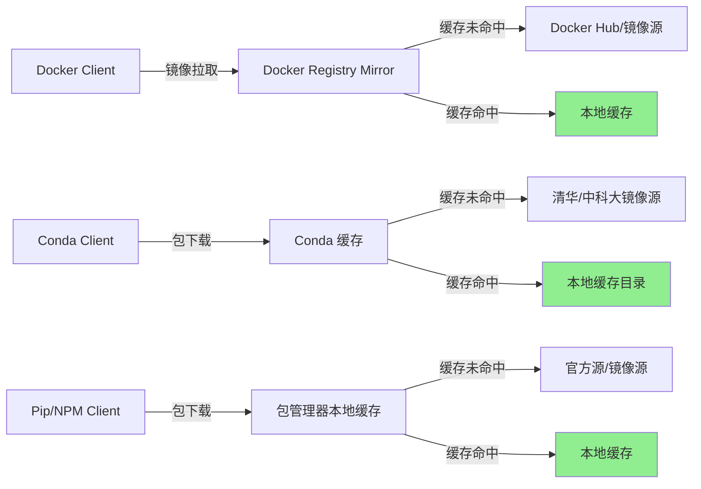

# 本地依赖缓存代理体系：多层缓存加速构建

## 模式概述

在网络不稳定或需要重复构建的开发环境中，通过建立多层次本地缓存代理体系，实现：
- **缓存加速**：首次拉取后本地缓存，后续构建秒级完成
- **网络隔离**：减少对外部网络的依赖，提升构建稳定性
- **团队共享**：缓存可在团队内共享，降低整体网络开销

本模式采用"分层缓存、逐级回源"架构，为 Docker 镜像、Conda/Pip/NPM 包、通用 HTTP 依赖提供统一的缓存加速方案。

## 触发场景

- 当构建环境网络不稳定，镜像/包拉取频繁超时
- 当需要多次重复构建包含大量依赖的镜像
- 当团队多人开发，需要共享依赖缓存减少重复下载
- 当需要离线或半离线环境进行开发构建
- 当 CI/CD 环境依赖下载成为构建瓶颈

**适用于**：开发环境构建、CI/CD 流水线、团队共享开发环境
**不适用于**：生产环境部署（追求最小化而非缓存）、单次临时构建（缓存 ROI 不足）

## 方案架构



## 核心做法（五层缓存配置）

### 第一层：Docker Registry Mirror 配置

**快速配置（使用公共镜像加速器）**：

配置文件：`/etc/docker/daemon.json`（Linux）或 `C:\ProgramData\docker\config\daemon.json`（Windows）

```json
{
  "registry-mirrors": [
    "https://docker.m.daocloud.io",
    "https://docker.1panel.live",
    "https://hub-mirror.c.163.com"
  ],
  "log-driver": "json-file",
  "log-opts": {
    "max-size": "100m",
    "max-file": "3"
  }
}
```

生效命令：
```bash
# Linux
sudo systemctl daemon-reload
sudo systemctl restart docker

# Windows (PowerShell)
Restart-Service docker
```

**进阶配置（Harbor 私有仓库）**：适用于团队环境，支持镜像推送和细粒度权限控制。

### 第二层：Dockerfile 构建缓存优化

与 [dev-env-dockerfile-optimization](dev-env-dockerfile-optimization.md) 模式配合使用：

```dockerfile
# 策略：按变化频率分层，依赖层前置
FROM continuumio/miniconda3:latest

# 先复制配置文件，利用缓存
COPY docker/condarc /opt/conda/.condarc

# 先安装固定依赖（变化少）
RUN conda create -n tvm-build python=3.14 -c conda-forge && \
    conda install -n tvm-build -c conda-forge \
        llvmdev=22 \
        llvm=22 \
        clang=22 \
        ninja \
        cmake>=3.18 && \
    conda clean -a -y

# 再复制项目文件（变化频繁）
COPY . /workspace/npu_tvm

# 最后执行编译（变化频繁）
RUN cd /workspace/npu_tvm && mkdir -p build && \
    cd build && \
    cmake .. -G Ninja && \
    ninja
```

**BuildKit 本地缓存挂载**（进阶）：
```yaml
services:
  builder:
    build:
      context: ..
      cache_from:
        - type=local,src=/path/to/docker-build-cache
      cache_to:
        - type=local,dest=/path/to/docker-build-cache
```

### 第三层：Conda 包缓存配置

```yaml
# ~/.condarc
channels:
  - defaults
show_channel_urls: true
channel_priority: flexible
default_channels:
  - https://mirrors.tuna.tsinghua.edu.cn/anaconda/pkgs/main
  - https://mirrors.tuna.tsinghua.edu.cn/anaconda/pkgs/r
  - https://mirrors.tuna.tsinghua.edu.cn/anaconda/pkgs/msys2
custom_channels:
  conda-forge: https://mirrors.tuna.tsinghua.edu.cn/anaconda/cloud
remote_connect_timeout_secs: 60
remote_read_timeout_secs: 300
remote_max_retries: 10

# 本地缓存目录配置
pkgs_dirs:
  - /path/to/local/conda-cache
```

### 第四层：Pip 包缓存配置

```ini
# ~/.pip/pip.conf
[global]
index-url = https://pypi.tuna.tsinghua.edu.cn/simple
trusted-host = pypi.tuna.tsinghua.edu.cn
```

**团队级方案**：使用 devpi 部署本地 PyPI 缓存服务。

### 第五层：NPM 包缓存配置

```bash
# 使用淘宝镜像
npm config set registry https://registry.npmmirror.com/
```

**团队级方案**：使用 verdaccio 部署本地 NPM 仓库。

## 快速部署（单节点开发环境）

```bash
# 步骤1：配置 Docker Registry Mirror
echo '{
  "registry-mirrors": ["https://docker.m.daocloud.io"]
}' | sudo tee /etc/docker/daemon.json
sudo systemctl restart docker

# 步骤2：配置 Conda 镜像源
cat > ~/.condarc << 'EOF'
channels:
  - defaults
show_channel_urls: true
channel_priority: flexible
default_channels:
  - https://mirrors.tuna.tsinghua.edu.cn/anaconda/pkgs/main
  - https://mirrors.tuna.tsinghua.edu.cn/anaconda/pkgs/r
  - https://mirrors.tuna.tsinghua.edu.cn/anaconda/pkgs/msys2
custom_channels:
  conda-forge: https://mirrors.tuna.tsinghua.edu.cn/anaconda/cloud
EOF

# 步骤3：配置 Pip 镜像源
mkdir -p ~/.pip
cat > ~/.pip/pip.conf << 'EOF'
[global]
index-url = https://pypi.tuna.tsinghua.edu.cn/simple
trusted-host = pypi.tuna.tsinghua.edu.cn
EOF

# 步骤4：配置 NPM 镜像源
npm config set registry https://registry.npmmirror.com/
```

## 验证与监控

### Docker 缓存验证
```bash
# 查看构建缓存命中情况
export DOCKER_BUILDKIT=1
docker build --progress=plain .
```

### Conda 缓存验证
```bash
# 查看缓存包数量
ls ~/miniconda3/pkgs/ | wc -l
conda info
```

## 反模式（不要这么做）

- ❌ **反模式1：在开发环境追求最小镜像体积**
  ```
  照搬生产环境多阶段构建 → 删除构建依赖 → 开发时缺少工具 → 重新安装 → 更大更慢
  ```
  开发环境首要目标是构建速度，不是镜像大小。

- ❌ **反模式2：只配置镜像源不做本地缓存**
  ```
  只换国内镜像源 → 仍然每次从公网下载 → 网络波动时仍然超时
  ```
  镜像源解决"速度"问题，本地缓存解决"重复"问题，二者需要配合。

- ❌ **反模式3：COPY 指令放在依赖安装之前**
  ```
  先 COPY 源代码再 RUN pip install → 每次改代码都重新安装所有依赖 → 增量构建变成全量构建
  ```
  必须将变化少的依赖层放在前面，变化频繁的代码层放在后面。

- ❌ **反模式4：不清理过期缓存**
  ```
  只缓存不清理 → 磁盘空间耗尽 → 构建失败 → 被迫清理所有缓存 → 缓存冷启动
  ```
  需要定期清理策略（见注意事项）。

## 检验标准

做完之后怎么知道做对了？
- ✅ 第二次构建时间显著缩短（增量构建 < 10秒 vs 首次构建数分钟）
- ✅ 断网环境下可以执行构建（冷缓存完成后）
- ✅ Docker 构建日志显示 `CACHED` 而非重新执行 RUN 指令
- ✅ Conda/Pip 提示 "Using cached" 而非重新下载
- ✅ 团队多人使用时，后构建的人速度明显快于第一个人

## 注意事项

### 缓存清理
```bash
# 清理 Docker 无用镜像
docker system prune -a

# 清理 Conda 缓存
conda clean -a -y
```

### 缓存一致性
- **定期更新**：定期清理过期缓存，避免使用过期依赖
- **版本锁定**：在 Dockerfile 中明确指定依赖版本，避免缓存版本漂移
- **缓存预热**：团队环境中提前拉取常用镜像和依赖

### 安全考虑
- **私有仓库认证**：Harbor 等私有仓库需要配置认证
- **代理访问控制**：Squid 等代理需要配置访问控制列表
- **镜像完整性验证**：关键镜像使用 `docker verify` 验证完整性

## 迁移示例

这个模式还能用在什么其他场景？
- **场景1（CI/CD 流水线）**：在 CI runner 上配置持久化缓存卷，每次流水线构建复用依赖
- **场景2（离线开发环境）**：在有网络的环境预热缓存后，将缓存目录拷贝到离线环境使用
- **场景3（多架构交叉编译）**：为不同架构的工具链分别建立缓存，避免重复下载交叉编译工具
- **场景4（教育/培训环境）**：学员统一使用缓存代理，避免教室网络拥塞
- **场景5（数据分析环境）**：JupyterHub 多用户环境共享 Conda/R 包缓存

## 实际案例

> 📁 **案例材料归档**：完整的配置参考手册、架构图、部署指南等原始材料已归档至 [cases/local-dependency-cache-proxy/](cases/local-dependency-cache-proxy/README.md)（含案例索引 README.md）

### 案例1：TVM Python 3.14 + LLVM 22 构建环境（首次验证）

| 指标 | 优化前 | 优化后 |
|------|--------|--------|
| Docker 基础镜像拉取 | 超时失败率 > 50% | 首次拉取 < 30秒，后续秒级 |
| Conda 依赖安装 | 5-15分钟（受网络影响波动大） | 首次 3-5分钟，后续 < 10秒 |
| 增量构建（改代码后重新编译） | 8-12分钟 | < 1分钟（依赖层全部缓存命中） |
| 网络依赖 | 构建全程需要稳定外网 | 冷缓存完成后可半离线构建 |

关键配置：Docker Registry Mirror + Conda 清华源 + Dockerfile 分层优化。

## 与其他模式的关系

- **与 [dev-env-dockerfile-optimization](dev-env-dockerfile-optimization.md) 互补**：本模式解决"依赖从哪里来（缓存）"，Dockerfile 优化模式解决"层顺序怎么排（缓存命中）"
- **与 [content-hash-build-cache](../../code-patterns/content-hash-build-cache.md) 配合**：代码层使用内容哈希缓存，依赖层使用本模式的代理缓存
- **与 [four-negatives-external-dependency](four-negatives-external-dependency.md) 相关**：本地缓存是缓解外部依赖风险的手段之一，但不能替代四不原则

## 配置文件清单

| 文件 | 用途 | 路径 |
|------|------|------|
| `daemon.json` | Docker Registry Mirror 配置 | `/etc/docker/daemon.json` |
| `.condarc` | Conda 镜像源配置 | `~/.condarc` |
| `pip.conf` | Pip 镜像源配置 | `~/.pip/pip.conf` |
| `.npmrc` | NPM 镜像源配置 | `~/.npmrc` |

---

> **成熟度说明**：L1（单案例验证）——本模式在 TVM 构建项目中验证有效，但需要更多不同技术栈的项目验证才能升级为 L2。
> **验证建议**：在 Node.js 前端项目、Python Web 项目、C++ 编译项目中分别验证后可升级 L2。
