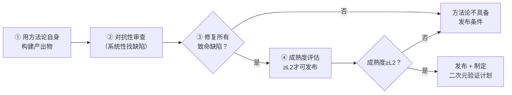

# 元方法论自举模式（Meta-Methodology Bootstrap）

## 模式类型
方法论模式（治理策略/元方法论层）

## 成熟度
L2 已验证（2个独立案例，满足二次验证三条标准：使用核心流程+发挥预期价值+有数据支撑）

| 验证指标 | 案例1：七概念方法论整合（2026-07-10） | 案例2：seven-concepts-trigger CLI验证（2026-07-11） |
|---|---|---|
| 验证场景 | 元方法论构建（自身构建自身） | 日常功能开发（非方法论构建） |
| 对抗审查发现问题 | 15个（2致命/8重要/5建议） | 1个真实Bug（关键词泛化误判） |
| 已修复缺陷 | 10个 | 1个 |
| 验证结论 | 元方法论自举能在发布前系统性发现逻辑矛盾和定义模糊 | V对抗审查在非方法论场景同样有真实价值，能发现正向测试覆盖不到的边界问题 |

## 问题场景

新方法论/框架/规范发布前的典型质量风险：

1. **逻辑矛盾**：不同模块的定义互相冲突（如术语不一致、层级定位矛盾）
2. **边界模糊**：什么场景该用、什么场景不该用没有明确界定
3. **可操作性盲区**：文档写了原则，但缺少具体执行步骤和检查清单
4. **自指悖论**：方法论要求别人做到X，但自身构建过程没有做到X
5. **发布后返工**：发布后被使用者发现基础逻辑错误，方法论可信度严重受损

这些问题的共同根因：方法论构建完成后直接发布，缺少"用方法论自身验证方法论"的闭环环节。

## 核心定义

```
元方法论自举（Meta-Methodology Bootstrap）= 新方法论/框架/规范发布前，必须使用该方法论自身定义的完整流程来构建方法论本身，通过对抗性审查发现并修复所有致命缺陷后，达到成熟度≥L2才可发布
```

与构造性验证的关系：本模式是构造性验证在元方法论场景的具体化应用，增加了"对抗性审查作为内建质量门"和"成熟度门槛"两个关键要素。

## 解决方案

### 自举四步法



### 步骤详解

**Step 1：用方法论自身构建产出物**
- 严格按照待验证方法论定义的完整流程执行，不要跳过任何步骤
- 记录执行过程中遇到的"卡壳点"——这些就是方法论的可操作性盲区
- 不要因为"这是在构建方法论本身"就降低标准，反而要更严格执行
- 如果方法论要求"每个任务后做复盘"，那构建方法论的每个任务后也必须做复盘

**Step 2：对抗性审查（内建质量门）**
- 作为独立步骤，系统性攻击方法论的逻辑自洽性
- 四个攻击向量：
  1. **逻辑矛盾**：不同模块的术语/定义/规则是否互相冲突？
  2. **边界反例**：构造方法论应该失效的场景，检查是否有明确的"不应使用"界定
  3. **隐含假设**：方法论是否依赖了未明确说明的前提条件？
  4. **数据证伪**：方法论的核心断言是否能被构造的反例击破？
- 产出：问题清单，按致命/重要/建议分级

**Step 3：修复所有致命缺陷**
- 致命缺陷必须100%修复才能进入下一步
- 重要缺陷应尽量修复，确实无法立即修复的要明确标注为已知限制
- 建议性缺陷可记录待后续版本处理
- 修复后要重新审查，确保修复没有引入新的矛盾

**Step 4：成熟度评估与发布门槛**
- 按L1-L4标准评估方法论成熟度
- **发布门槛：成熟度≥L2**
  - L2要求：核心逻辑自洽，有1个完整自举案例，主要场景有明确操作流程
  - L1不可发布：仅为概念框架，未经过自举验证
- 发布时必须同时制定"二次元验证计划"——在实战场景中再次验证方法论有效性

## 七概念自举案例详情（2026-07-10）

### 自举执行流程
1. 使用Spec模式（PRD→tasks.md→checklist.md）规划整个方法论构建任务
2. 8个原子任务通过子代理委派流水线并行执行
3. Task 7专门执行对抗性审查（V概念的自举应用）
4. 审查发现15个问题，子代理主动修复10个并回写源文件
5. 最终评估方法论成熟度L2.8，达到发布门槛

### 发现的致命缺陷示例
| 缺陷类型 | 具体问题 | 修复方式 |
|---------|---------|---------|
| 术语矛盾 | 洞察三元组/四元组表述不一致，有的地方说C→M→A，有的地方说C→M→A→B | 统一为四元组格式，所有文档同步修正 |
| 层级定位矛盾 | V概念在五层模型中的定位前后不一致 | 明确V为横切验证层，修正所有层级图 |

### 反事实推演（如果不做自举）
| 假设路径 | 推演结果 |
|---------|---------|
| 不做对抗审查直接发布 | 2个致命缺陷会导致使用者混淆，方法论可信度受损，后续修复成本是发布前的5-10倍 |
| 跳过Spec模式直接写 | 缺少PRD/任务拆解/验收标准约束，可能遗漏对抗自举、TOML元数据等关键部分，质量不可预测 |

## 反模式

| 反模式 | 表现 | 后果 |
|--------|------|------|
| **自我豁免** | "方法论是给别人用的，我们自己构建时不用严格遵守" | 方法论的自指悖论——要求别人做到的自己做不到，从根本上丧失可信度 |
| **走过场审查** | 对抗审查只找小问题，回避致命矛盾 | 发布后才发现基础逻辑错误，返工成本极高 |
| **带病发布** | "先发布再说，有问题后续版本修复" | 第一批用户体验极差，方法论口碑崩坏，后续修复也难以挽回信任 |
| **完美主义陷阱** | 要求自举后达到L3/L4才发布 | 永远无法发布——成熟度只能通过实战案例积累，自举只能达到L2 |
| **无二次元计划** | 发布后就认为方法论"完成了" | 停留在L2无法升级，实战中发现的问题没有反馈渠道 |

## 实施检查清单

- [ ] 构建方法论时是否严格执行了自身定义的所有流程步骤？
- [ ] 是否有专门的对抗性审查环节，覆盖逻辑矛盾/边界反例/隐含假设/数据证伪四个攻击向量？
- [ ] 是否所有致命缺陷都已修复？
- [ ] 成熟度是否达到≥L2？
- [ ] 发布时是否同时制定了二次元验证计划（实战场景验证）？
- [ ] 已知限制是否明确标注，没有隐瞒？

## 适用场景

- ✅ 新方法论/框架/规范首次发布前
- ✅ 方法论重大版本升级（核心规则变更）后
- ✅ 跨团队推广新流程前的质量验证
- ❌ 小补丁/小改进不需要完整自举（只需针对变更部分做审查）
- ❌ 紧急止血场景（先恢复，事后补做复盘和改进）

## 关联模式

- [methodology-constructive-validation.md](methodology-constructive-validation.md)：本模式是构造性验证在元方法论场景的具体化，增加了对抗审查和成熟度门槛
- [seven-concepts-adversarial-review.md](seven-concepts-adversarial-review.md)：对抗性审查是自举流程Step 2的核心方法
- [meta-retrospective-closed-loop.md](meta-retrospective-closed-loop.md)：元复盘是自举后的持续改进机制
- [bootstrap-driven-self-evolution.md](bootstrap-driven-self-evolution.md)：系统层面的自举演化，本模式聚焦方法论发布前的单点验证
- [meta-bootstrap-action-plan.md](meta-bootstrap-action-plan.md)：七概念方法论二次元验证的具体行动计划

## Changelog

- **v1.1.0** (2026-07-11): 成熟度L1→L2，新增第二个验证案例（seven-concepts-trigger CLI工具），补充二次验证判定标准，更新案例对比表格
- **v1.0.0** (2026-07-11): 初始版本，基于七概念方法论整合复盘INSIGHT-1萃取，成熟度L1
