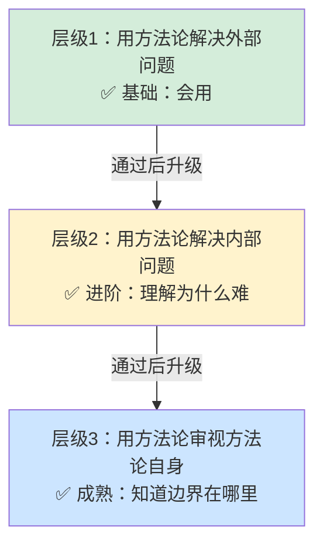

> **提炼自**：[第一性原理知识体系复盘关键洞察](../../../reports/project-reports/retrospective-first-principles-knowledge-system-20260710/supporting-analysis/key-insights.md#INSIGHT-004)

# 方法论自反性测试（Methodology Reflexivity Test）

## 模式类型

方法论模式（治理策略/方法论评估）

## 成熟度

L2 已验证（3次验证来源：第一性原理边界条件章节、check-links.py三层验证重构、v1.7自反性成熟跃迁）

## 适用场景

构建、评估或教授任何方法论、理论、框架、流程时，测试其成熟度和自洽性。适用于：

| 场景 | 适用度 | 说明 |
|------|--------|------|
| 新方法论/框架构建 | ✅✅✅ 核心场景 | 从一开始就纳入自反性，避免"万能论"偏差 |
| 现有方法论成熟度评估 | ✅✅✅ 核心场景 | 用三层自反性测试判断方法论处于哪个成熟阶段 |
| 教学/培训材料设计 | ✅✅✅ 核心场景 | 不仅教"什么时候用"，还要教"什么时候不用" |
| 工具/流程设计 | ✅✅ 强烈推荐 | 用方法论审视工具自身的边界和局限 |
| 决策框架评估 | ✅✅ 强烈推荐 | 避免决策框架成为"宗教"，保持批判性视角 |
| 纯执行性SOP | ⚠️ 间接适用 | 简单操作SOP不需要自反性，但复杂决策类SOP必须有 |
| 宗教/意识形态 | ❌ 不适用 | 本模式的本质是"可证伪性"，与信仰体系不兼容 |

## 问题背景

判断一个方法论是否成熟、是否真正被理解，最常见的误区是看"用它解决了多少问题"——但这是非常弱的测试。占星术也能"解释"很多事情，阴谋论也能"解决"很多疑问，但它们不是好的方法论。

更危险的是"方法论万能论"：学了第一性原理就认为什么问题都应该拆到本质，学了敏捷就认为所有项目都应该Scrum，学了TDD就认为所有代码都应该先写测试——这种原教旨主义的方法论应用，恰恰违背了方法论本身的精神。

从哥德尔不完备定理出发，我们知道：任何足够强的自指系统都无法完全自审——一个认知系统不能拽着自己的头发离开地面。但这并不意味着自反性不可能，而是说自反性必须是方法论的内置组成部分，而不是外部附加的"注意事项"。

### 反面教材："万能"方法论的特征

一个不成熟的、倾向于宗教化的方法论通常有这些特征：
1. 只讲"成功案例"，不讲"失败案例"
2. 只讲"什么时候用"，不讲"什么时候不要用"
3. 应用时出现问题，永远是"使用者水平不够"，不是方法论本身有局限
4. 声称能解决所有问题，或某个领域的所有问题
5. 无法用自身的方法分析自身
6. 批评竞争方法论，但从不反思自身

## 核心原则：自反性三层级模型

检验一个方法论是否成熟，最严格的测试是看它能否通过三层自反性测试：

### 层级1：用方法论解决外部问题

| 维度 | 说明 |
|------|------|
| **测试问题** | 这个方法论能不能有效解决它声称要解决的外部问题？ |
| **典型表现** | 能用第一性原理分析商业案例、能用敏捷方法管理项目、能用TDD写出高质量代码 |
| **通过标准** | 在多个场景中持续产生好的结果，有可验证的成功案例 |
| **未通过的表现** | 理论上很完美，但一用就出问题；只能在"完美条件"下工作 |
| **成熟度对应** | 初学者水平——"知道是什么、怎么用" |

这是最基础的层级，大部分方法论教学都停留在这一层。但仅仅通过层级1，只能说明你"会用"这个方法论，不能说明你"理解"它。

### 层级2：用方法论解决项目内部问题

| 维度 | 说明 |
|------|------|
| **测试问题** | 当应用这个方法论遇到困难、犯错误、效果不好时，能不能用这个方法论本身来分析为什么会出问题？ |
| **典型表现** | 用第一性原理分析"为什么我会犯类比错误"、用敏捷的回顾会议分析"为什么这个Sprint失败了"、用TDD的红绿重构分析"为什么这个测试写不出来" |
| **通过标准** | 不把失败归因为"我不够认真""执行不到位"，而是用方法论自身的框架分析根因，找到系统性的改进点 |
| **未通过的表现** | 出了问题就怪"人不行""执行力差"，不反思方法论本身的适用条件 |
| **成熟度对应** | 进阶水平——"理解为什么难、为什么会失败" |

通过层级2，说明你真正理解了方法论的运作机制，而不只是机械套用步骤。但这还不是最高层级。

### 层级3：用方法论审视方法论自身

| 维度 | 说明 |
|------|------|
| **测试问题** | 能不能用这个方法论本身，分析它自己的边界和局限？什么时候这个方法论不适用？有没有比它更好的方法？ |
| **典型表现** | 用第一性原理分析"什么场景下类比推理比第一性原理更高效"、用敏捷原则分析"什么项目不适合敏捷"、用TDD原则分析"什么代码不值得先写测试" |
| **通过标准** | 主动、系统地列出方法论的"不适用场景"、"失效条件"、"竞争/互补方法论"、"自身的理论局限"；不是被迫承认局限，而是主动把边界条件作为方法论的核心组成部分 |
| **未通过的表现** | "我的方法论万能，出问题都是因为用得不对"；无法想象什么场景下不用这个方法论 |
| **成熟度对应** | 专家水平——"知道什么时候不用，理解方法论本身的边界" |

### 核心洞察：主动展示局限是力量而非弱点

声称"万能"的方法论不是方法论而是宗教；可证伪性是科学理论的标志，也是方法论成熟的标志。主动展示"什么时候不要用我"，不是方法论的弱点，而是它真正有力量的证明——因为：
1. 它不害怕被质疑，因为它建立在坚实的逻辑基础上
2. 它能避免使用者犯"方法论万能论"的原教旨主义错误
3. 它知道自己在认知地图上的位置，不会越界使用
4. 它能与其他互补方法论共存，形成更完整的工具库

## 自反性测试检查清单

评估一个方法论是否成熟，可以用以下7项检查清单：

| 检查项 | 通过标准 | 不通过的危险信号 |
|--------|---------|----------------|
| 1. 有没有反例/失败案例？ | 系统地讨论了"什么时候用这个方法会失败" | 只有成功案例，没有失败案例；失败了永远怪使用者 |
| 2. 有没有明确的"不适用场景"？ | 清晰列出3种以上不适合使用该方法论的场景 | "这个方法放之四海而皆准" |
| 3. 有没有竞争/互补方法论？ | 客观讨论其他方法论的适用场景，以及什么时候应该用其他方法 | 贬低所有其他方法，"只有我的方法是对的" |
| 4. 能不能解释"为什么用了还会出错"？ | 用方法论自身的框架分析失效原因，不甩锅给"执行力" | "还是你用得不对/不够认真" |
| 5. 有没有自身理论局限的讨论？ | 明确说明这个方法论建立在什么假设之上，这些假设什么时候不成立 | "我们的方法是基于客观规律的，没有前提假设" |
| 6. 方法论本身能不能被这个方法论分析？ | 能用自己的方法分析自己（如用第一性原理分析第一性原理） | "我的方法是特殊的，不能用来分析自己" |
| 7. 有没有演化/迭代的历史？ | 展示方法论是如何在自我批判中演化的，而不是"终极真理" | "这是最终版本，永远不需要改进" |

评分标准：通过0-2项→宗教/意识形态；3-5项→有用但不成熟的工具；6-7项→成熟的、可证伪的科学方法论。

## 核心规则

### 规则1：构建方法论时，边界条件章节不是附录而是核心

写方法论文档/书籍/课程时，"不适用场景""边界条件""常见误区"这些章节不能放在最后作为"补充说明"，而要放在前面作为核心内容——和"是什么""怎么用"同等重要。

- ❌ 错误结构：是什么→为什么→怎么做→成功案例→（附录：注意事项）
- ✅ 正确结构：是什么→适用场景→**不适用场景**→怎么做→成功案例→**失败案例**→常见误区→与其他方法的关系

### 规则2：教授方法论时，先教"什么时候不要用"

教别人用一个方法论时，第一节课不应该教"怎么用"，而应该教"什么时候不要用"——这能从一开始就避免原教旨主义偏差。

就像教人开车，先教刹车在哪、什么天气不能开、什么情况要减速，而不是先教踩油门。

### 规则3：用方法论解决问题前，先做"适用性测试"

在应用任何方法论到具体问题前，先问三个问题：
1. 这个问题的特征是什么？符合方法论的适用场景吗？
2. 有没有什么信号表明这个问题可能是方法论的"不适用场景"？
3. 有没有其他更适合这个问题的方法论？

不要手里拿着锤子，看什么都是钉子。

### 规则4：应用出现问题时，先从方法论本身找原因，再怪执行力

当用了方法论但结果不好时，5-Whys根因分析的顺序是：
1. 是不是方法论的适用条件不满足？（层3）
2. 是不是我对方法论的理解有偏差？（层2）
3. 是不是执行步骤有遗漏？（层1）
4. 最后才是：是不是执行不到位？

直接跳到"执行力不够"是智力上的懒惰——这相当于把方法论变成了不可证伪的宗教。

## 反模式

| 反模式 | 为什么错误 | 正确做法 |
|--------|----------|---------|
| 方法论万能论 | 没有万能的方法论，所有方法论都有边界；声称万能恰恰说明不成熟 | 明确每个方法论的适用和不适用场景，建立工具箱思维 |
| 成功案例崇拜 | 只讲成功不讲失败，会导致幸存者偏差和过度自信 | 系统收集失败案例，失败案例比成功案例更有价值 |
| 执行力甩锅 | "还是用得不对"是不可证伪的辩解，让方法论无法进步 | 先假设是方法论/流程有问题，验证后再考虑执行因素 |
| 竞争方法论贬低 | 不理解其他方法论的价值，只会让自己的视野变窄 | 客观分析其他方法的适用场景，建立互补的工具库 |
| 终极真理幻觉 | 认为自己的方法论是"终极答案"，不需要改进，这是认知僵化的开始 | 把方法论视为持续演化的活文档，每次应用都在迭代 |
| 自指回避 | "我的方法特殊，不能用来分析自己"——这恰恰说明它不是科学方法论 | 主动用自己的方法"开刀"，这是最严格的成熟度测试 |

## 实际案例

### 案例1：第一性原理v1.7的自反性跃迁（本模式来源）

| 版本 | 自反性层级 | 表现 |
|------|-----------|------|
| v1.0-v1.5 | 层级1 | 讲第一性原理是什么、怎么用、有哪些成功案例；几乎没有讨论边界条件 |
| v1.7部分扩展 | 层级2 | 增加了认知科学基础，解释"为什么第一性原理难用"（双系统理论、认知负荷）；讨论了应用中的常见错误 |
| v1.7关键跃迁 | 层级3 | 新增16-boundary-conditions.md：系统研究"什么时候不用第一性原理、类比推理更高效"，提出5维度场景判断框架，明确列出类比推理更高效的6类场景、第一性原理更适用的5类场景；主动纳入More is Different对还原论的批评；讨论第一性原理在AI时代的局限 |

v1.7完成三层自反性测试后，整个知识体系从"有用的方法论"升级为"成熟的、可证伪的知识体系"，成熟度大幅提升。

### 案例2：check-links.py的自反性应用

这是本模式在工具开发中的小而典型的应用：
- 层1：用check-links.py检查文档链接（解决外部问题）
- 层2：发现目录链接"存在但不可用"问题，分析为什么之前没发现（解决内部问题——验证标准定义错了）
- 层3：用第一性原理重新思考"链接验证的本质目标是什么？"——不是"文件存在"，而是"用户点击能到达预期内容"；重构三层验证模型（用方法论审视工具自身的目标）

这本身就是第一性原理在工具开发中的自反性应用——不是加功能，而是回到本质目标重新设计。

## 与其他模式的关系

| 关联模式 | 关系类型 | 关系说明 |
|---------|---------|---------|
| [document-update-first-principles.md](../document-architecture/document-update-first-principles.md) | 方法论同源 | 文档更新第一性原理是本模式在文档领域的具体应用——用第一性原理重新思考文档更新的本质目标 |
| [knowledge-system-evolution-three-stages.md](../research-knowledge/knowledge-system-evolution-three-stages.md) | 演化关联 | 知识体系三阶段演化中的"阶段3：自反性成熟"，就是本模式的大规模应用 |
| [first-principles-decision-quality-gate.md](first-principles-decision-quality-gate.md) | 决策应用 | 决策质量门禁中应该包含自反性检查——这个决策框架本身的边界是什么？ |
| [seven-concepts-adversarial-review.md](seven-concepts-adversarial-review.md) | 工具支持 | 对抗性审查是发现方法论边界、进行自反性测试的有效工具 |
| [cognitive-practice-gap-recursive-defense.md](cognitive-practice-gap-recursive-defense.md) | 防御互补 | 认知偏差防御解释了为什么人们容易陷入方法论万能论——确认偏差让人只看见支持自己的证据 |

## Changelog

- 2026-07-13 | create | 初始版本，从第一性原理知识体系复盘关键洞察004沉淀，L2成熟度，3次验证实例
