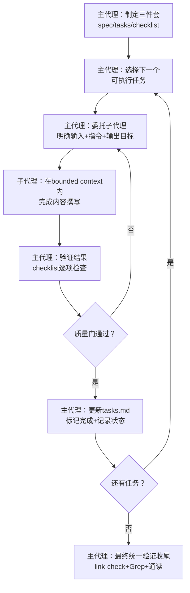

> **来源**：从 `retrospective-i-have-adhd-knowledge-crystallization-20260728` 元复盘中萃取，经 `retrospective-i-have-adhd-second-round-validation` 二次验证审计完善

# 编排-执行分层法

## 速查表（核心层）

| 维度 | 内容 |
|------|------|
| **一句话** | 复杂任务主代理做规划+状态追踪+质量门，子代理在bounded context内完成内容撰写，职责分离防上下文溢出 |
| **触发条件** | ≥5个子任务、涉及大量内容撰写、多阶段质量门、可能跨会话 |
| **不适用** | ≤3步简单任务、纯探索性研究（输出不确定无法委托）、需要连续思考链的深度推理 |
| **核心数** | 5步流程、3类反模式、1个关键补充（G4过程合规checklist） |

---

## 一、问题现象

在≥5个子任务的复杂文档/代码任务中，主代理直接执行所有步骤会遇到：

1. **上下文溢出**：单一会话承载过多内容，超出上下文窗口导致信息丢失
2. **状态管理混乱**：多个并行推进的任务互相干扰，已完成/待做/阻塞状态混淆
3. **质量门失效**：自己写自己审，缺乏外部视角，格式错误、强约束残留、风格漂移等问题直到最终验证才暴露
4. **跨会话恢复困难**：对话压缩后无法准确恢复未完成的任务状态

反模式是"主代理包办一切"——结果是对话膨胀、上下文溢出、质量失控。

## 二、核心思想

```
复杂任务质量 = 主代理编排质量 × 子代理执行质量
```

主代理专注于**做正确的事**（规划三件套、逐任务委托、质量门验证、状态追踪），子代理专注于**正确地做事**（在明确bounded context内完成内容撰写）。两者职责分离，主代理不亲自写长篇内容，子代理不做流程决策。



## 三、核心步骤（5步）

### Step 1：主代理制定三件套

任务开始前，主代理创建spec.md（需求）、tasks.md（分解）、checklist.md（验收标准），作为跨会话状态持久化基础。三件套是流程的"宪法"——所有后续操作以此为准。

**关键细节**：
- tasks.md每个任务有明确的Depends On关系和Acceptance Criteria
- 验证类任务不能只写"验证结果"，必须列出具体可检查项（如"验证x-toml-ref路径可解析""Grep强约束词无残留"）
- checklist.md对应每个Acceptance Criteria，有programmatic/human-judgment标记

### Step 2：逐任务委托子代理

按tasks.md依赖顺序，每次只委托1个当前可执行的任务给子代理。委托query必须包含：

| 委托要素 | 必须包含的内容 |
|---------|-------------|
| 输入文件 | 子代理需要读取的文件路径（绝对路径） |
| 操作指令 | 具体要做什么（撰写/修改/分析），不含模糊指令 |
| 输出目标 | 文件写入路径+格式要求+风格锚定参考 |
| 约束条件 | 输出格式安全约束（禁止工具标签/XML/对话式开头等） |
| bounded context | 子代理的职责边界——它只负责这个任务，不做其他决策 |

**反模式**：一次性并行委托多个无依赖任务，导致状态管理混乱。

### Step 3：主代理验证结果+G4过程合规检查

子代理返回后，主代理**不能信任自报告**（这是V2审计发现的关键弱点），必须用checklist逐项验证：

**G4过程合规检查清单**（子代理返回后主代理必填）：

| # | 检查项 | 检查方法 |
|---|--------|---------|
| 1 | YAML frontmatter字段完整 | 检查id/source/x-toml-ref/maturity等必填字段 |
| 2 | 文件路径正确可解析 | 验证相对路径可到达目标文件 |
| 3 | 风格与锚点文件一致 | 对比章节结构/表格格式/语言风格 |
| 4 | 无强约束词残留 | Grep"必须/禁止/绝不/一定"，逐条确认有例外说明 |
| 5 | 内容符合任务指令 | 对照委托query检查输出是否满足所有要求 |
| 6 | 无工具标签/对话残留 | Grep违禁关键词（参照dual-quality-gate-subagent） |

### Step 4：质量门通过后推进下一任务

验证通过后，更新tasks.md标记当前任务完成，然后回到Step 2选择下一个可执行任务。验证不通过则重新委托或主代理修正。

**关键原则**：不跳步——当前任务质量门未通过，不推进下一个任务。

### Step 5：最终统一验证收尾

所有任务完成后，主代理执行最终统一验证：
- link-check检查所有内部链接有效性
- Grep检查无file:///绝对路径引用
- 通读检查错别字和逻辑矛盾
- 更新checklist.md所有检查点状态
- Changelog记录完整

## 四、何时用/何时不用

### 适用场景

| 场景类型 | 示例 |
|---------|------|
| 知识沉淀/分析类 | 文章分析、竞品研究、代码审计 |
| 多模块文档生成 | 批量创建模式文档、API文档、报告 |
| 跨会话长任务 | 可能被上下文压缩打断的任务 |
| 多文件代码重构 | 涉及多个模块/文件的重构任务 |

### 不适用场景（直接执行，不走分层）

| 场景类型 | 原因 |
|---------|------|
| ≤3步简单任务 | 委托开销大于直接执行 |
| 纯探索/讨论 | 输出不确定，无法定义bounded context |
| 需要连续思考链 | 子代理打断推理连贯性 |
| 紧急hotfix | 流程开销不适用于时间敏感修复 |
| 强创意/头脑风暴 | 委托限制发散性思考 |

### 任务规模决策辅助

```
任务子任务数 < 3 → 主代理直接执行
任务子任务数 3-5 → 可选（视内容量决定）
任务子任务数 ≥ 5 → 应采用编排-执行分层
内容总量 < 500行 → 主代理直接执行
内容总量 500-2000行 → 可选
内容总量 > 2000行 → 应采用编排-执行分层
```

## 五、已知边界与失败案例

### V2审计发现的系统性弱点

基于i-have-adhd二次验证复盘审计，该模式在实际应用中表现为"前半段遵循好（Steps 1-2遵循度80%+），后半段闭环差（Steps 3-5遵循度30-50%）"：

| 步骤 | 遵循度 | 典型偏差 |
|------|--------|---------|
| Step 1 制定三件套 | 高 | spec/tasks/checklist三件套通常创建完整 |
| Step 2 委托子代理 | 中高 | 委托指令通常明确，但bounded context有时模糊 |
| **Step 3 验证结果** | **低** | **主代理信任子代理"已完成"自报告，不逐项checklist验证** |
| Step 4 质量门推进 | 中 | 通过后推进，但Step 3验证弱导致质量门形同虚设 |
| Step 5 最终验证 | 中 | 执行但可能遗漏某些维度（如强约束二次自检） |

**根因**：质量门体系是内容-centric而非过程-centric，验证步骤缺乏明确的完成判定标准。G4过程合规checklist（见Step 3）是针对此弱点的补充。

### 反模式清单

1. **主代理自己写所有长篇内容**：导致对话膨胀、上下文溢出
2. **一次性并行委托多个任务**：导致状态管理混乱，质量门失效
3. **委托时bounded context模糊**：如"帮我写一个文档"而不指定输入/输出/约束
4. **信任子代理自报告**：子代理说"已完成"就标记完成，不逐项验证
5. **跳步推进**：当前任务未通过质量门就开始下一个任务
6. **验证任务写"验证"无checklist**：tasks.md中验证任务只有"验证结果"二字，无具体检查项

## 六、迁移验证

| 迁移场景 | 验证状态 |
|---------|---------|
| 知识沉淀/文章分析 | ✅ i-have-adhd任务验证（遵循度55%，暴露闭环弱点） |
| 命令集/指令集编写 | ✅ action-first-bootstrap验证（未用子代理，属不适用场景正确决策） |
| 元复盘审计 | ✅ 本次二次验证复盘（主代理直接执行，任务规模<5子任务属正确决策） |
| 多模块代码重构 | ⚠️ 待验证 |
| 测试用例批量编写 | ⚠️ 待验证 |

> **关联模块**：
> - `docs/retrospective/patterns/methodology-patterns/governance-strategy/dual-quality-gate-subagent.md`（子代理双重质量门）
> - `docs/retrospective/patterns/methodology-patterns/governance-strategy/subagent-responsibility-layering.md`（子代理职责分层）
> - `docs/retrospective/patterns/methodology-patterns/governance-strategy/three-stage-content-validation.md`（三阶段内容验证）
