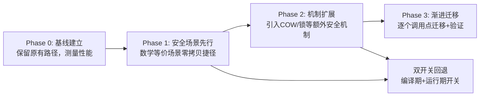

# 分层渐进优化策略（Phased-Incremental-Optimization）

## 模式概述

性能优化（尤其是涉及内存语义变更的底层优化）最常见的失败模式是"一步到位"：试图在单个版本中实现完整的最优方案，结果因为调试空间过大、故障无法定位而反复回滚。分层渐进优化策略要求：**先在数学上可证明安全的极简场景建立基线并充分验证，再逐步扩展到需要额外机制（如COW、锁）的复杂场景**。每个阶段独立可回退，前一阶段为后一阶段提供"对照组"，大幅降低调试复杂度。

## 问题现象

性能优化中常见的失败反模式：

1. **"一步到位"陷阱**：N=1和N≥2场景同时实现零拷贝+COW，出问题时无法区分是"共享机制错误"还是"COW触发时机错误"
2. **无基线对比**：优化前没有极简路径的性能基线，优化后无法量化收益也无法判断退化来源
3. **无安全网**：直接修改核心路径而不保留回退开关，出bug必须回滚整个版本
4. **批量修改引入回归**：一次性迁移所有调用点，一个bug导致多个模块同时失败

## 解决方案：四步渐进法



### 阶段定义

| 阶段 | 目标 | 选择标准 | 验证方式 | 回退策略 |
|------|------|---------|---------|---------|
| **Phase 0 基线** | 测量当前性能，建立对照组 | 不修改任何代码，仅加性能日志 | 性能基准测试 | 无需回退（无代码变更） |
| **Phase 1 极简路径** | 在**数学上等价于identity**的场景实现优化 | 场景必须满足：只有一个消费者、不存在写入冲突、优化前后语义完全一致 | 单元测试+集成测试+性能对比（与Phase 0基线对比） | 保留原有memcpy路径作为else分支，一键切换 |
| **Phase 2 机制扩展** | 引入处理复杂场景的安全机制（COW、锁等） | 机制必须独立于Phase 1代码路径，有编译期开关 | Phase 1测试必须全部通过（回归验证）+新增COW专项测试 | 编译期开关OFF完全移除新代码；运行期开关OFF跳过检查 |
| **Phase 3 渐进迁移** | 逐个调用点迁移到新API | 每个调用点独立迁移、独立验证、独立提交 | 每个迁移点配套测试，in-place Layer逐个验证 | 单个迁移点出问题只需回退该点，不影响整体 |

### 核心原则

1. **安全场景先行**：Phase 1选择的场景必须是**数学上不可能出错**的（如N=1 Split等价于identity），这样Phase 1出bug只能是共享机制本身错误，而非语义冲突
2. **前一阶段是后一阶段的对照组**：Phase 1验证通过后，Phase 2出bug时可以关闭COW开关验证是否回到Phase 1的正确状态
3. **双开关安全网**：编译期开关（二进制级别移除代码）+运行期开关（无需重编译即可回退），两层防护
4. **不破坏已有测试**：每个阶段开始时，前一阶段的所有测试必须继续通过，新增测试只覆盖新功能
5. **独立可回退**：每个阶段的代码路径独立，if-else分支明确，不相互纠缠

## 适用场景

- **内存语义变更**：零拷贝、COW、引用计数等涉及对象生命周期和内存共享的底层优化
- **API语义变更**：方法行为改变（如从"返回指针"变为"可能触发克隆"）时，需要新旧API共存过渡期
- **跨平台构建优化**：先在单一平台验证，再扩展到多平台
- **编译器/工具链升级**：先升级非核心模块验证兼容性，再升级核心路径
- **并发/锁机制引入**：先单线程验证正确性，再引入线程安全机制

## 实际案例

### 案例1：Split层零拷贝优化（首次验证，本次里程碑）

**Phase 0（基线）**：所有N都走memcpy路径，添加[SPLIT-PERF]日志测量基线性能

**Phase 1（N=1零拷贝捷径）**：
- 选择N=1场景：数学上等价于identity（top[0]就是bottom[0]），不存在写入冲突
- 实现`ShareData()/ShareDiff()`，仅一行Tensor句柄赋值
- 14个C++单元测试覆盖共享、生命周期、Reshape中断等场景
- N≥2路径**完全保留**原有memcpy逻辑，不做任何修改
- 结果：N=1路径耗时从~3μs降至~0.5μs，N≥2行为不变

**Phase 2（COW机制扩展）**：
- 新增`cpu_mutable_data()/cpu_mutable_diff()`方法（独立于原有`cpu_data()`）
- 实现refcount检查+克隆逻辑，编译期宏`CAFFE_FFI_ENABLE_COW`保护
- Phase 1的14个测试**全部保持通过**（验证无回归）
- 新增5个COW专项测试（const不触发COW、共享时触发COW、三路隔离等）
- 双开关：编译期OFF完全移除COW代码，运行期`SetCOWEnabled(false)`跳过检查

**Phase 3（渐进迁移）**：
- Split N≥2路径改为初始ShareData+COW
- 9个in-place Layer（ReLU/Dropout等）逐个迁移到`cpu_mutable_data()`
- 每个Layer迁移独立提交、独立测试
- 结果：N=2只读场景0 memcpy，一个分支写入仅1次memcpy

### 案例2：可推广的类似场景

- **PyTorch Tensor共享优化**：先做view()零拷贝（数学等价），再做in-place操作的COW
- **数据库连接池**：先做单连接复用（无竞争），再引入连接池+锁
- **缓存系统**：先做单级缓存（无一致性问题），再做多级缓存+失效机制

## 反模式

### 反模式1：一步到位
```cpp
// ❌ 错误：同时实现N=1共享和N≥2 COW，没有独立验证阶段
void SplitLayer::Forward(...) {
  for (int i = 0; i < num_top; ++i) {
    top[i]->ShareDataWithCOW(bottom[0]); // 共享+COW混合在一起
  }
}
```
出问题时无法定位：是ShareData错了？还是COW触发时机错了？还是refcount检查错了？

### 反模式2：无基线直接优化
优化前不测量性能，优化后声称"提升了X倍"但没有数据支撑。出现退化时也无法发现。

### 反模式3：只有编译期开关无运行期开关
COW有bug时必须重新编译整个项目才能回退，生产环境紧急修复需要30+分钟构建时间。

### 反模式4：批量迁移所有调用点
```
// ❌ 错误：一次性修改所有Layer使用mutable_data()
ReLU/Dropout/ELU/Sigmoid/Tanh/PReLU/Bias/Scale/BatchNorm 全部改完再测试
```
一个bug导致9个Layer同时失败，二分定位需要多次回滚。

## 失败案例

### 案例：Caffe Frontend RMSNorm冗余transpose——"一步到位"引入回归

在caffe-rmsnorm-transpose任务中，基于对API的错误假设，一次性在RMSNorm算子中引入了2个冗余transpose操作（输入→weight前transpose、输出后transpose）。由于没有先做Phase 0基线验证（对比优化前后语义），也没有Phase 1极简路径验证，直接"一步到位"实现了完整的"优化"，结果15行代码中有6行是冗余且错误的。验证后发现问题，移除后代码15行→6行。

**教训**：这是一个典型的"无基线→无分阶段→批量修改"三重反模式叠加。如果采用分层渐进策略：Phase 0先写测试记录原始RMSNorm行为，Phase 1在1个模型上验证transpose是否必要，就不会引入冗余transpose。

**根因分析**：违反了"数学可证性"原则——没有先证明transpose的必要性就直接添加，凭"API文档看起来是这样"的直觉操作。

## 反目标用户/场景（不适用边界）

| 场景类型 | 为什么不适用 | 替代方案 |
|---------|-------------|---------|
| **紧急Hotfix/P0线上故障** | 线上故障需要分钟级修复，分阶段验证的时间成本不可接受 | 直接修复+事后补测试；修复后再做预防措施（检查脚本/测试用例） |
| **纯重构/代码风格调整** | 不改变行为的重构（重命名、提取函数、格式调整）没有"数学等价"vs"复杂机制"的区分，所有改动语义等价 | 使用机械重构工具+回归测试即可，无需分阶段 |
| **配置/参数调优** | 超参数调整、阈值改变等不涉及代码逻辑/内存语义变更，回滚只需改配置 | A/B测试或网格搜索，单PR即可 |
| ** trivial bug修复（拼写/注释/格式）** | 一行明显的拼写错误或注释修正，出bug概率极低，分阶段是过度工程 | 直接修复+提交，遵循"平凡修复"豁免原则 |
| **全新功能开发（无现有路径）** | 从零构建的新功能没有"原有路径"可做基线，Phase 0/1失去意义 | 用feature flag做渐进发布，而非本模式的分阶段优化 |
| **文档/注释更新** | 纯文档变更不涉及代码行为，无回归风险 | 直接更新 |

**关键判断标准**：当变更涉及**内存语义变更、API行为变更、跨平台兼容性**等高风险维度时启用本模式；低风险变更不应强制套用。

## 早期预警信号

以下信号出现时，说明你正在偏离分层渐进策略，应立即暂停并回到上一个稳定阶段：

| 信号 | 含义 | 应采取行动 |
|------|------|-----------|
| 单次PR修改超过10个文件 | 可能在批量迁移调用点 | 拆分为≤3文件的独立PR |
| 无法用一句话说清"这个Phase改了什么" | Phase边界模糊，多件事混在一起 | 拆分Phase，确保每个Phase单一职责 |
| 关掉新代码开关后测试失败 | 新代码侵入了旧路径，不是增量添加 | 重构为if-else增量分支，确保旧路径完整可用 |
| 性能日志出现退化但无法定位来源 | 缺少Phase 0基线或阶段间对照 | 回退到上一个稳定Phase，补充基线测量 |
| 新增测试无法独立于新代码通过 | 测试和代码耦合太紧，Phase 1测试依赖Phase 2机制 | 重新设计测试，确保每个Phase的测试独立可运行 |
| 调试时发现"可能是A问题也可能是B问题" | 多个变量同时变化，调试空间爆炸 | 回退到单变量变化的阶段，逐个验证 |

## 检验标准

1. **Phase独立性**：每个Phase的代码有明确的if-else边界，关闭后一阶段开关能完整回到前一阶段行为
2. **测试金字塔**：Phase 1单元测试→Phase 2单元测试→集成测试→Python端到端测试，分层验证
3. **性能可量化**：每个Phase有[PERF]日志记录关键指标，可对比前后变化
4. **回退演练**：关闭COW开关后验证所有测试通过（模拟紧急回退场景）
5. **无批量修改**：调用点迁移逐个PR提交，每个PR不超过3个文件变更
6. **数学可证性**：Phase 1选择的场景必须有数学证明其安全性，不依赖"应该不会出事"的直觉

## 方法论质量门：G1-G4 在渐进优化中的落地

本模式严格遵循七概念方法论的四质量门（R-I-E-C链路），每个Phase推进都必须通过对应质量门：

| 质量门 | 在渐进优化中的具体要求 | Split零拷贝案例验证 |
|--------|----------------------|-------------------|
| **G1 事实门** | 每阶段结束后输出干净事实列表，剥离因果推断词 | 50条事实(F01-F50)全部使用陈述语气，无"因为/所以" |
| **G2 洞察门** | 四元组结构输出：陈述+证据+反常识+行动 | I1-I5每个洞察都包含"反常识"维度（如"零拷贝不需要自定义内存池"） |
| **G3 模式门** | 沉淀的模式必须验证跨场景迁移性，不是"只在此处有效" | P1-P4四个模式均标注适用场景和迁移验证清单，非Split专属 |
| **G4 行动门** | 行动项原子化、可执行、可验证，每项有明确完成标准 | 模式中的检验标准可直接作为行动项验收标准 |

**关键经验**：没有质量门的渐进优化容易退化为"盲目分阶段"——分阶段本身不保证安全，**每阶段通过质量门验证**才保证安全。

## 与其他模式的关系

| 模式 | 关系 |
|------|------|
| [bottleneck-first-refactoring](bottleneck-first-refactoring.md) | 互补：瓶颈优先决定"优化哪里"，分层渐进决定"怎么优化" |
| [fail-loud-over-silent-fallback](fail-loud-over-silent-fallback.md) | 配套：优化出问题时fail fast而非静默回退到错误状态 |
| [ffi-intrusive-refcount-zerocopy](../../code-patterns/ffi-intrusive-refcount-zerocopy.md) | 案例模式：Phase 1零拷贝具体实现 |
| [const-cow-trigger](../../code-patterns/const-cow-trigger.md) | 案例模式：Phase 2 COW具体实现 |
| [preflight-checks-script](../../code-patterns/preflight-checks-script.md) | 工程配套：预检脚本确保每阶段环境一致 |

## 来源

- [split_layer.cpp Phase 1+2实现](file:///d:/spaces/SpecWeave/projects/xuanspace/libs/caffe-ffi/src/caffe_ffi/layers/split_layer.cpp)
- [blob.hpp ShareData/COW实现](file:///d:/spaces/SpecWeave/projects/xuanspace/libs/caffe-ffi/include/caffe_ffi/blob.hpp)
- [test_blob_zerocopy.cpp 14+19个C++测试](file:///d:/spaces/SpecWeave/projects/xuanspace/libs/caffe-ffi/tests/cpp/test_blob_zerocopy.cpp)
- 复盘报告：[retrospective-split-zerocopy-cow-milestone-20260731](../../reports/code-optimization/retrospective-split-zerocopy-cow-milestone-20260731/README.md)

## Changelog

<!-- changelog -->
- 2026-07-31 | feat | 补充V2质量要求：失败案例(RMSNorm冗余transpose)、反目标场景(6类不适用场景)、早期预警信号(6个信号)
- 2026-07-31 | feat | 补充方法论质量门G1-G4在渐进优化中的落地章节，明确"分阶段≠安全，质量门验证才安全"
- 2026-07-31 | feat | 从Split层零拷贝优化Phase 1+2里程碑复盘萃取，四步渐进法+双开关策略+6条检验标准
