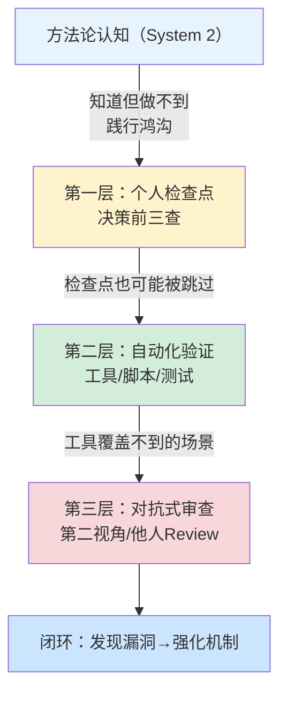

> **提炼自**：[第一性原理类比错误复盘](../../../reports/incident-reports/retrospective-first-principles-analogy-error-20260709/insight-extraction.md#洞察01)、[第一性原理驱动文档更新复盘](../../../reports/task-reports/retrospective-first-principles-vibe-coding-docs-update-20260710/insight-extraction.md#洞察1)

# 践行鸿沟与递归践行定律（Practice Gap & Recursive Practice Law）

## 模式类型

方法论模式（治理策略/认知科学）

## 成熟度

L3 反复验证（4次验证来源：2026-07-09格式修正批量套用错误、2026-07-10文档更新目录链接类比错误、2026-07-10路径层级直觉错误、2026-07-10改进check-links.py时第四次路径错误）

## 适用场景

学习或实践任何方法论时，理解并预防"知道但做不到"的践行鸿沟。适用于：

| 场景 | 适用度 | 说明 |
|------|--------|------|
| 新方法论学习推广 | ✅✅✅ 核心场景 | 解释为什么培训后仍然犯错，需要强制机制而非"努力记住" |
| 流程规范设计 | ✅✅✅ 核心场景 | 设计检查点、自动化验证等结构性保障 |
| 代码审查/质量保障 | ✅✅ 强烈推荐 | 解释为什么自审不够，需要对抗式审查 |
| AI协作Prompt设计 | ✅✅ 推荐 | 理解为什么加了Prompt仍可能得到类比推理结果 |
| 团队培训/Onboarding | ✅✅ 推荐 | 设置正确预期：反复掉坑是常态，不是没学会 |
| 简单机械性任务 | ⚠️ 间接适用 | 简单任务System1自动接管，正是践行鸿沟的高发区 |
| 创造性工作 | ❌ 不适用 | 创意场景依赖直觉和类比，强行慢思考反而抑制创造力 |

## 问题背景

方法论学习最危险的陷阱不是"不知道"，而是"知道了但没做到"——而且你会在刚学完之后立刻再犯一次同样的错误。

这不是学习态度问题，也不是"记性不好"，而是人类大脑的**双系统本能**导致的结构性问题：

1. **大脑默认走捷径**：System 1（快思考/类比/直觉）是默认模式，消耗极少认知资源；System 2（慢思考/推理/方法论）需要主动启动，消耗大量认知资源
2. **简单任务自动触发System 1**：任务越简单、越"不用想"，大脑越倾向于走捷径，方法论检查越容易被跳过
3. **"我已经知道了"是最危险的信号**：知道方法论的存在，反而让你放松警惕，以为"这次我会注意的"，但System 1根本不给你注意的机会
4. **错误本身构成递归验证**：刚写完"不要类比推理"的教训，下一个简单任务立刻犯类比推理错误——这恰恰证明了践行鸿沟的存在，形成递归闭环

### 递归践行定律

> **你刚把"不要做X"写入反面教材，下一个简单任务中你大概率会立刻再做一次X。**

这不是讽刺，是认知规律。四次实例：

| 时间 | 事件 | 类比推理错误内容 | 刚学过的教训 |
|------|------|----------------|------------|
| 2026-07-09 | 格式修正任务 | 看到`file:///`格式就批量套用到13个文件，没查开发规范 | "不要批量套用格式，先查规范" |
| 2026-07-10 | 文档更新（正文） | 看到README.md链接到目录，就类比套用到新链接中 | "IDE需要具体文件才能打开，不能链接目录" |
| 2026-07-10 | 路径计算（第一次修复） | 凭直觉数层级写了`../../`，没对照现有同类链接 | "路径计算要查实例不要数层数" |
| 2026-07-10 | 写复盘时 | 正在写"不要凭直觉数路径层级"的洞察，自己又凭直觉写错路径 | "不要凭直觉数路径层级"（自己正在写的教训） |
| **2026-07-10** | **改进验证工具时** | **用第一性原理改进防错工具时，创建新模式文件的相对路径又写错** | **"路径计算要查实例"（刚用来修复前一次错误的方法）** |

## 核心规则

### 规则1：区分"知道"和"做到"是两个完全不同的问题

| 维度 | 知道（认知层面） | 做到（执行层面） |
|------|----------------|----------------|
| 所需系统 | System 2（慢思考）一次即可 | System 2每次都需要战胜System 1 |
| 消耗资源 | 低（理解概念） | 高（每次执行都要主动启动慢思考） |
| 失败模式 | "我没理解" | "我理解了但没做"——这才是践行鸿沟 |
| 解决方法 | 学习、阅读、培训 | **结构性强制机制**，而非"努力记住" |

### 规则2：不要靠意志力，靠强制检查点

"下次注意"、"我记住了"、"这次不会了"都是无效策略——System 1不会因为你下了决心就放弃捷径。有效的应对策略是**建立不依赖意志力的结构性强制机制**：

| 机制 | 原理 | 示例 |
|------|------|------|
| **强制检查点** | 在关键决策点强制触发System 2 | [决策前三查模式](../ai-collaboration/pre-decision-three-checks.md)要求"查规范/查实例/查验证" |
| **自动化验证** | 用工具弥补人的确认偏差 | check-links.py自动检测断链和目录链接，不依赖人眼检查 |
| **对抗式审查** | 用第二视角发现自审盲区 | [对抗式审查模式](../ai-collaboration/adversarial-review-prompt-pattern.md)模拟攻击者视角 |
| **流程即安全网** | 将方法论嵌入流程，跳不过去 | 原子提交Skill强制三查暂存+预提交验证，无法`git add .`跳过 |

### 规则3：接受"反复掉坑"是常态

不要因为"我已经学过这个了"就放松警惕。正确的心态是：

- ❌ 错误心态："我学会了，以后不会犯了"
- ✅ 正确心态："我知道System 1会让我在简单任务中犯错，所以我需要在每个简单任务中都执行检查点"
- ❌ 错误归因："我太粗心了/记性不好"
- ✅ 正确归因："流程中缺少强制检查点，让System 1有机会走捷径"

### 规则4：递归践行是验证信号而非失败信号

当你发现自己"刚写完教训又犯同样错误"时，不要认为"我没救了"或"方法论没用"——这恰恰是：

1. **践行鸿沟存在的证明**：你的System 1在运行，这很正常
2. **方法论需要强制机制的证明**：光写在文档里不够，需要嵌入流程和工具
3. **改进强制机制的机会**：每次犯错都说明某个检查点不够强，应该加强机制而非"更努力记住"

## 三层防御模型

针对践行鸿沟，建立三层防御体系：

| 防御层 | 机制 | 可靠性 | 局限 |
|--------|------|--------|------|
| 第一层：个人检查点 | 决策前三查、启动协议、自问"这是类比还是推理" | 中（依赖主动执行） | 简单任务中System 1会自动跳过 |
| 第二层：自动化验证 | 链接检查、类型检查、单元测试、lint、CI | 高（不依赖人） | 只能覆盖工具能检查的维度 |
| 第三层：对抗式审查 | Code Review、对抗Prompt、他人验证 | 最高 | 成本最高，无法每次都用 |

## 反模式

| 反模式 | 为什么错误 | 正确做法 |
|--------|----------|---------|
| "我知道了，下次注意" | 靠意志力对抗System 1，成功率接近零 | 建立强制检查点，不依赖"注意" |
| 犯了错就"加强学习" | 问题不在认知层面而在执行层面，再学一遍还是会犯 | 加强自动化验证和流程强制 |
| 因为反复犯同样的错而否定方法论 | 方法论告诉你"应该做什么"，但不能保证"每次都做到" | 方法论+强制机制才是完整方案 |
| 认为"简单任务不需要检查" | 简单任务正是System 1最活跃、最容易走捷径的时候 | 简单任务更需要检查点，因为太容易跳过 |
| 把错误归因为个人疏忽 | "粗心"不是根因，缺少强制机制才是 | 用5-Whys追根因：为什么流程允许这个错误发生？ |
| 写了文档就等于执行了 | 文档被读到的概率远低于你以为的，被执行的概率更低 | 将规则嵌入工具/脚本/流程，而非只写在文档里 |

## 与其他模式的关系

| 关联模式 | 关系类型 | 关系说明 |
|---------|---------|---------|
| [first-principles-prompt-pattern.md](../ai-collaboration/first-principles-prompt-pattern.md) | 理论→应用 | 第一性原理是"如何让AI慢思考"的Prompt模式，本模式解释"为什么人自己也做不到慢思考"以及如何应对 |
| [pre-decision-three-checks.md](../ai-collaboration/pre-decision-three-checks.md) | 问题→对策 | 决策前三查是践行鸿沟的第一层防御方案，通过强制检查点触发System 2 |
| [adversarial-review-prompt-pattern.md](../ai-collaboration/adversarial-review-prompt-pattern.md) | 问题→对策 | 对抗式审查是践行鸿沟的第三层防御，用第二视角弥补自审盲区 |
| [availability-heuristic-structural-guard.md](availability-heuristic-structural-guard.md) | 认知同源 | 可得性启发解释了为什么人倾向于用直觉/经验做判断，本模式解释了这种倾向的递归特性和防御体系 |
| [process-vs-experience-intuition.md](process-vs-experience-intuition.md) | 互补 | 流程vs经验解释了"按流程做对vs凭经验做对"的区别，本模式解释了为什么凭经验（System1）总是倾向于接管 |
| [tool-self-validation.md](../tools-automation/tool-self-validation.md) | 问题→对策 | 工具自验证是践行鸿沟的第二层防御，用自动化代替人工检查 |
| [root-cause-diagnosis.md](root-cause-diagnosis.md) | 分析工具 | 5-Whys根因分析用于追溯"为什么System1接管了"——根因永远是流程缺失，不是个人疏忽 |

## Changelog

- 2026-07-10 | create | 初始版本，从first-principles-prompt-pattern.md中独立归档，L3成熟度，4次验证实例
