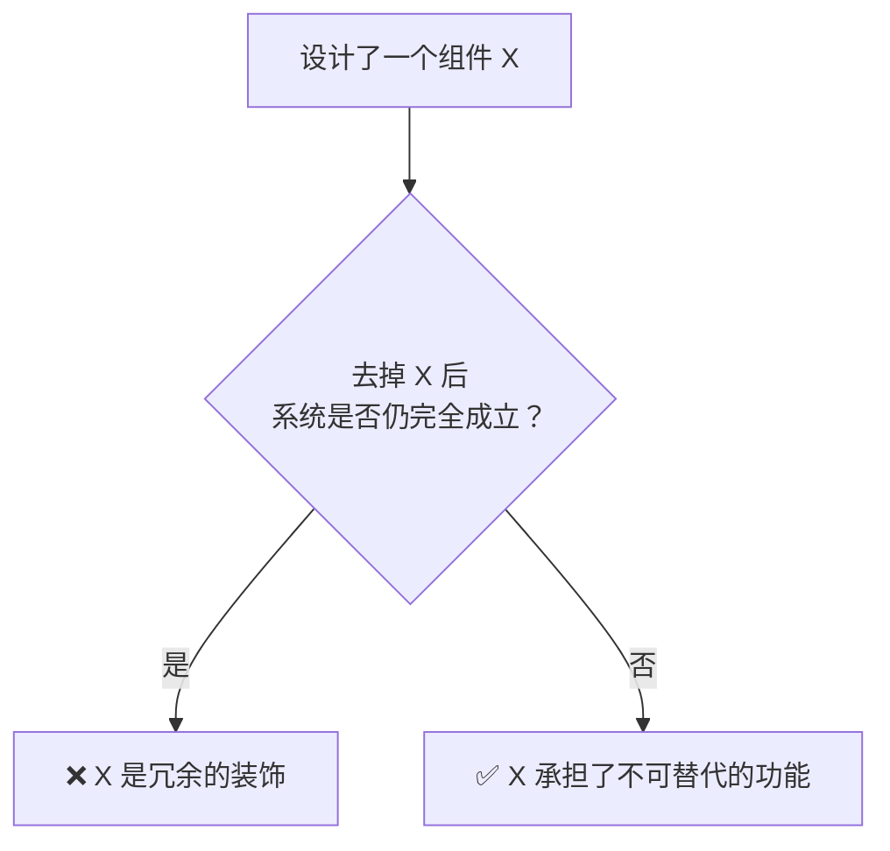

> **来源**：从 Ian Xiaohei Illustrations "去掉小黑画面仍然完全成立，说明小黑太装饰了"自检规则中提炼

# 证明有用性自检模式

## 核心概念

好的设计组件应该是**不可减去**的——去掉它系统就会功能缺失或价值降低。这条自检规则可以应用于 Skill 设计、文档结构、代码架构等任何需要判断"是否过度设计"的场景。

## 自检流程

## 应用场景

| 场景 | 自检问题 | 评估标准 |
|------|---------|---------|
| Skill 设计 | 去掉这个功能后 Skill 是否仍有价值？ | 功能移除后价值下降 |
| 角色设计 | 去掉这个角色后画面是否仍完整？ | 角色移除后信息缺失 |
| 文档结构 | 去掉这个章节后文档是否仍完整？ | 章节移除后逻辑断裂 |
| 代码架构 | 去掉这个模块后系统是否仍正常运行？ | 模块移除后功能受损 |

## 实施步骤

1. **识别待评估组件**：确定要检查的功能、角色、文档章节或代码模块
2. **模拟移除**：想象去掉该组件后的系统状态
3. **评估影响**：判断系统功能、价值或完整性是否受损
4. **决策**：
   - 如果系统仍完全成立 → 该组件是冗余装饰，考虑移除或重新设计
   - 如果系统功能受损 → 该组件承担了不可替代的功能，保留

## 核心价值

这条自检规则是一种**反直觉的设计思维**——它要求每个组件都必须证明自己的存在价值，而不是默认保留。这有助于：

- 减少过度设计
- 提升系统纯度
- 确保每个组件都有明确的职责
- 避免"为了设计而设计"的陷阱

## 适用场景

- AI Skill 设计中的功能评估
- 角色/Agent 设计中的必要性验证
- 文档体系的精简优化
- 代码架构的冗余清理
- 任何需要判断"是否过度设计"的场景

## 设计启示

"去掉 X 后系统是否仍成立"是一条简单但强大的设计原则。它迫使设计者思考每个组件的真实价值，而非被表面的"美观"或"完整性"所迷惑。
