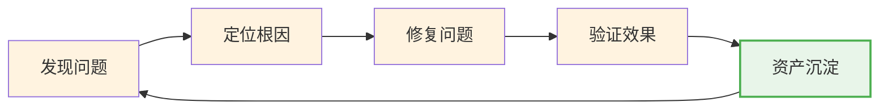
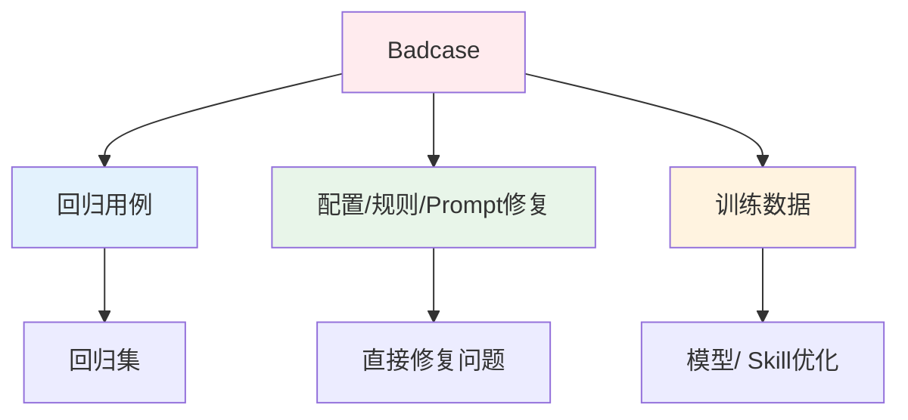

> **提炼自**：[Agent评测体系化建设方法论深度分析报告](../../../reports/insight-extraction/external-learning/retrospective-agent-eval-article-analysis-20260803/analysis-report.md)

# 质量资产沉淀闭环模式（Quality Asset Accumulation Loop）

## 模式类型

方法论模式（治理策略/持续改进/知识管理）

## 成熟度

L1 单案例验证（来源：孙敦灿《Agent评测体系化》文章方法论，待多场景验证）

## 适用场景

适用于任何需要持续迭代、问题重复出现、依赖个人经验会导致边际成本不下降的工程领域。核心适用场景：

| 场景 | 适用度 | 说明 |
|------|--------|------|
| AI/Agent质量保障体系 | ✅✅✅ 核心场景 | Badcase→修复→回归用例→资产沉淀的闭环 |
| 测试体系建设 | ✅✅✅ 核心场景 | Bug修复→测试用例沉淀→回归测试自动化 |
| 运维/SRE故障管理 | ✅✅✅ 核心场景 | 故障→根因→Runbook→监控告警→预防检查 |
| 代码审查/质量改进 | ✅✅ 推荐 | 代码问题→规则更新→静态检查/CI门禁 |
| 客户服务/知识库 | ✅✅ 推荐 | 用户问题→标准答案→FAQ→自助服务 |
| 一次性项目/无迭代需求 | ❌ 不适用 | 不需要持续迭代的场景不需要资产沉淀 |

## 问题背景

很多团队的质量改进停留在"发现问题→修复问题"的救火模式：
- **边际成本不递减**：每次遇到类似问题都要重新排查、重新修复，成本永远降不下来
- **经验不传承**：靠老员工记忆，人走了经验就没了，新人重复踩同样的坑
- **修复即终点**：问题修完就完事，没有想怎么防止下次再发生
- **资产变成垃圾**：虽然有"知识库"，但没有入库标准和治理，慢慢变成垃圾场找不到有用信息
- **报告好看但没用**：每次复盘都出一份好看的报告，但看完就归档，没有转化为可执行的改进

核心反常识：**发现问题本身不产生价值**，只有把问题转化为可复用资产，下一轮迭代成本才会指数下降。

## 术语速查（新人必读）

| 术语 | 解释 |
|------|------|
| **Golden Set（黄金集）** | 一组相对稳定、长期复用的核心测试样本，用于版本对比和发布门禁，初始建议50-200条 |
| **Trace（执行轨迹）** | Agent执行过程的完整记录，包括工具调用、参数、返回值、中间产物、异常等 |
| **RCA（根因分析）** | Root Cause Analysis，问题发生后定位根本原因的标准化流程 |
| **LLM-as-Judge** | 用大语言模型作为评判者，用于语义和策略类非确定性维度的评分 |
| **MTTR** | Mean Time To Repair，平均修复时间，衡量资产沉淀效果的核心量化指标 |
| **问题簇** | 同一根因、同一业务场景、同一工具、同一知识点的失败case自动聚类，而非零散列表 |

## 思想溯源

本模式的核心思想同样来自传统软件工程的成熟实践：
- 测试用例积累（Bug修复后必须加测试用例，防止回归）
- 知识库管理（Runbook、FAQ、操作手册的持续沉淀）
- 持续改进（PDCA循环：Plan-Do-Check-Act，每次改进都要标准化）
- 经验萃取（军队After Action Review、项目复盘的核心目的就是沉淀经验）

本模式的贡献是将这些原则应用到AI/Agent这个新领域，明确了AI系统特有的六类资产和"一条Badcase→三类反馈"的具体生产线。

## 核心原则：资产沉淀是质量体系的终点

**核心洞察**：评测/复盘/故障处理的终点不是出一份报告、不是修复一个bug、不是解决一个case——而是建立"发现→定位→修复→验证→沉淀"的持续运转机制，把单次问题转化为可复用的资产，让资产厚度越来越高，迭代越来越不依赖个人经验。

资产沉淀闭环的核心逻辑：

| 阶段 | 常见做法（反模式） | 资产化做法（本模式） |
|------|------------------|---------------------|
| 发现问题 | 发现一个修一个 | 发现一类问题，聚成问题簇 |
| 定位根因 | 凭经验排查，定位到"Prompt不好"这类泛泛之谈 | 追到具体责任模块和可修复原因，结构化标签化 |
| 修复问题 | 点修复，改完就完事 | 修复+预防双轨：既修当前问题，又加防线 |
| 验证效果 | 人工看一眼感觉没问题就行 | 自动化回归验证，确保真的修复且不引入新问题 |
| 资产沉淀 | 写一份复盘报告归档 | 转化为至少3类可复用资产，有入库标准，有治理 |

**关键认知**：资产沉淀不是"额外工作"，而是质量改进的"验收标准"——问题修完了但没沉淀资产，等于这个问题只解决了一半，下次还会再来。

## 核心做法：资产沉淀六步法

### 第一步：定义六类质量资产

先明确要沉淀哪些类型的资产，不是所有东西都要存：

| 资产类型 | 内容 | 用途 | 来源 |
|---------|------|------|------|
| **用例库** | Golden Set（黄金集）、分类采样集、长尾集、对抗集 | 版本对比、发布门禁 | 专家设计 + 线上回流 |
| **Trace库** | 完整执行轨迹、工具调用、参数、中间产物、异常 | 复盘、调试、根因分析、训练数据 | 评测/线上自动采集 |
| **根因标签库** | 稳定的问题分类体系、责任模块映射、问题现象→模块映射表 | 快速根因定位、统计分析 | 每次Badcase分析持续完善 |
| **修复建议库** | 针对各类问题的标准修复方案、典型案例、Checklist | 新问题快速匹配方案，新人上手 | 每次修复持续沉淀 |
| **Judge校准集** | 金标数据、few-shot示例、边界样本、COT判定逻辑 | 持续校准LLM Judge，保证评分一致性 | 人工标注 + 争议样本 |
| **回归集** | 自动化测试用例，覆盖历史Badcase | 版本回归验证，防止同类问题再发 | Badcase修复后自动转化 |

### 第二步：建立"一条Badcase→三类反馈"生产线

每一条Badcase不是只修复就完事，必须至少产出三类反馈：

1. **回归用例**：加入评测集/测试集，下次自动跑，防止同类问题再次出现
2. **直接修复**：配置/规则/Prompt/代码修复，解决当前问题
3. **训练数据**：如适用，加入训练集用于模型微调或Skill优化

### 第三步：制定严格的资产入库标准

不是所有失败都塞进资产库——垃圾进垃圾出，必须有入库门槛：

| 入库标准 | 说明 | 不满足的后果 |
|---------|------|-------------|
| **可复现** | 失败可稳定复现，或至少有完整Trace和人工确认 | 不可复现的环境抖动问题不入库，避免污染 |
| **期望明确** | 期望行为明确，可以写成规则、Judge标准或人工验收标准 | 没有明确对错标准的问题不入库，会变成争议 |
| **根因清楚** | 根因标签清楚，能归到具体能力域或业务流程 | 根因不明的问题先挂起，查清了再入库 |
| **有代表性** | 能覆盖一类问题，不是一次性的特殊情况 | 纯个例、无共性的问题不入库，避免冗余 |
| **合规脱敏** | 已完成脱敏，符合隐私和数据合规要求 | 含敏感数据的绝对不能入库 |

### 第四步：资产治理与生命周期管理

资产库不是只进不出，必须有持续治理机制：

1. **去重聚类**：同一根因、同一业务场景的Badcase自动聚成"问题簇"，同簇只保留代表例，避免冗余
2. **分级保留**：
   - P0/P1高风险样本：长期保留，永远在回归集里
   - 已稳定多版本通过且风险低的样本：降级为抽样集，不需要每次全跑
3. **主动更新**：
   - 线上出现新分布时，通过主动学习优先抽取低置信、高影响、新意图、新工具、新知识点的样本进入人工确认
   - 定期清理过时、冗余、重复的资产
4. **索引可查**：资产必须有标签、有索引、有搜索入口，不能变成堆文件的垃圾场

### 第五步：离线+线上三类信号联动闭环

资产沉淀不只是在离线评测阶段，要联动线上反馈形成完整闭环：

| 信号类型 | 具体指标 | 作用 |
|---------|---------|------|
| **离线质量信号** | 核心场景通过率、P0风险数、关键工具参数正确率 | 发布前门禁 |
| **线上体验信号** | 转人工率、重复追问率、投诉率、满意度变化 | 发布后监控 |
| **业务结果信号** | 任务完成率、工单闭环率、退款/赔付成功率 | 最终业务价值验证 |

**回滚机制**：如果离线评测提升但线上关键信号恶化，必须触发回滚或降级，不能"离线提升就万事大吉"。

### 第六步：把资产沉淀作为流程强制节点

不要靠人的自觉——把资产沉淀嵌入研发流程，成为强制节点：

- 修复Bug的PR/MR如果没有对应测试用例，CI直接打回
- Badcase分析报告如果没有产出三类反馈，不算闭环
- 版本发布门禁不仅看通过率，还要看新增回归用例数
- 定期（每周/每迭代）review资产库健康度，而不是只看项目进度

## 反模式

| 反模式 | 为什么错误 | 正确做法 |
|--------|----------|---------|
| 修复即终点，修完就完事 | 边际成本不递减，下次遇到同样问题还要重新排查、重新踩坑 | 修复只是中间节点，资产沉淀才是终点；一个bug至少产出三类反馈 |
| 所有失败都塞进资产库 | 垃圾进垃圾出，资产库慢慢变成垃圾场，想找的找不到，没用的一大堆 | 严格执行五条入库标准，不符合的不入库；定期治理去重 |
| 只写正确做法不记踩坑记录 | 反模式比正确做法更有价值——后人不知道哪里有坑，照样踩 | 反模式对等原则：每个最佳实践配3个踩坑记录/反模式 |
| 资产库只进不出，从不治理 | 冗余、过时、重复的资产越来越多，维护成本超过收益 | 生命周期管理：聚类去重、分级保留、定期清理 |
| 靠人自觉沉淀，没有流程强制 | 忙起来就忘了，资产沉淀永远是"有空再做"的低优先级 | 嵌入CI/CD、PR流程、发布门禁，成为强制节点，不做不能往下走 |
| 离线通过就上线，不看线上信号 | 离线评测分布和线上真实分布总有差异，离线好不代表线上好 | 三类信号联动，线上恶化必须回滚，线上Badcase持续回流离线 |
| 资产是"文档"，要"写得好看" | 资产不是写给人看的漂亮文档，是给机器/流程用的结构化数据 | 优先结构化、可机器读取、可自动化执行；人类可读文档是次要的 |
| 凭个人经验，不查资产库 | 老人踩过的坑新人再踩一遍，组织没有记忆 | 问题排查第一步先搜资产库/根因标签库，再开始排查；新人培训先学资产库 |

## 检验标准

做完之后怎么知道做对了？

1. **六类资产库齐全**：用例库、Trace库、根因标签库、修复建议库、Judge校准集、回归集都有，不是空架子
2. **Badcase三类反馈**：每个修复的Badcase都能对应到回归用例、修复方案、（如适用）训练数据
3. **入库标准执行**：有明确的五条入库标准，团队知道什么能进什么不能进
4. **边际成本递减**：同类问题出现第二次时，排查/修复时间比第一次明显缩短（量化指标：MTTR下降）
5. **回归自动化**：P0/P1的Badcase100%有自动化回归用例，版本发布时自动跑
6. **线上线下闭环**：线上Badcase能自动/半自动回流到离线评测集和资产库
7. **不依赖个人**：新人来了通过资产库能快速上手，不依赖某个老员工的经验
8. **资产库健康**：冗余率<10%，搜索命中率>80%，定期有治理记录

## 跨场景迁移示例

| 应用场景 | 发现→定位→修复→沉淀闭环 | 六类资产对应 | 边际成本递减效果 |
|---------|------------------------|-------------|-----------------|
| **Agent评测** | 离线/线上发现Badcase→RCA五步定位→规则/Prompt/代码修复→回归验证→三类反馈入库 | 用例库/Trace库/标签库/修复库/Judge集/回归集 | 每迭代一次，Badcase率持续下降，评测自动化率提升 |
| **传统软件测试** | 测试/用户发现Bug→调试定位→代码修复→单元/集成测试→测试用例沉淀 | 测试用例库/调试日志库/Bug分类库/解决方案库/Code Review Checklist/回归测试集 | 自动化测试覆盖率越来越高，回归发现问题越来越早 |
| **SRE运维故障** | 监控告警/用户报障→根因分析→故障修复→验证恢复→Runbook/监控更新 | 故障案例库/监控指标库/根因标签库/Runbook手册/告警规则库/应急演练剧本 | MTTR（平均修复时间）持续下降，重复故障发生率下降 |
| **代码审查** | CR发现问题→讨论根因→代码修改→验证通过→ESLint/规则更新 | 代码模式库/坏味道案例库/问题分类库/重构方案库/规则校准集/静态检查规则 | 静态检查自动拦截率越来越高，CR需要人工看的问题越来越少 |
| **客户服务** | 用户提问/投诉→定位问题→解答/处理→验证满意度→FAQ/知识库更新 | FAQ知识库/对话日志库/问题分类库/标准答案库/质检校准集/自助服务流程 | 转人工率持续下降，自助解决率提升，新人培训周期缩短 |

## 实际案例

### 案例：Agent评测Badcase资产化（本模式来源）

**原始状态（救火模式）**：
- 每次版本更新都有人工测试，跑几条case感觉还行就上线
- 线上出了问题大家一起查半天，查到最后发现"哦这个问题上次好像也见过"
- 修复完就完事，下次改Prompt又把同一个问题改坏了
- 评测全靠几个核心同学的个人经验，新人来了不知道怎么测

**应用本模式后**：

1. **六类资产从0到1建设**：
   - 先做50-200条Golden Set覆盖核心路径和高风险边界
   - 所有评测必须输出结构化Trace，存入Trace库
   - 根因标签体系建立，"问题现象×功能模块"映射表持续完善
   - 每类问题沉淀标准修复方案和Checklist
   - LLM Judge持续校准，校准集金标数据持续积累
   - 每个修复的Badcase自动加入回归集

2. **一条Badcase→三类反馈强制执行**：
   - 例："已发货订单退款未查状态就承诺"这个case
     1. 回归用例：加入评测集，检查"退款类问题必须先调用订单状态查询"
     2. 直接修复：Prompt里加规则，高风险操作前必须校验状态
     3. 训练数据：加入Skill训练样本，优化工具调用决策

3. **入库标准严格执行**：
   - 不可复现的环境抖动不入库
   - 根因没查清的挂起，不着急加回归
   - P0风险case永久保留，稳定多版本的低风险case降级抽样

4. **效果**（注：以下为行业经验估算值，实际效果取决于团队基线、执行力度、场景复杂度，需以实际测量为准）：
   - 适用场景：有持续迭代需求、Badcase重复出现、团队规模≥5人的AI Agent项目
   - 团队基线：成熟互联网团队，已有基本CI/CD流程
   - 测量方式：对比资产沉淀前后3个月的重复故障数、MTTR、新人上手周期
   - 预期收益：同类问题重复发生率可下降60-80%，MTTR缩短50%+，新人上手周期缩短50-70%

## 分阶段落地建议

不要一开始就建六库全流程，按阶段逐步推进：

| 阶段 | 推荐做什么 | 不推荐做什么 | 投入估算 | Owner建议 |
|------|-----------|-------------|---------|----------|
| **最小可行（2-3周）** | 只做"修复→回归用例"一条线：每个修复的bug/ badcase加一条自动化测试用例，其他都不做 | 不要一开始就建六类库，不要搞复杂的治理流程，不要追求大而全 | 1-2人周，就能看到重复问题减少 | 每个开发/测试对自己修复的问题负责 |
| **基础版（1-2月）** | 增加根因标签库和修复Checklist，开始聚类问题簇；回归集分P0/P1，P0每次发布必跑 | 不要一开始就做Trace库、Judge校准集这些重资产 | 3-5人月，基础闭环形成 | 指定1个兼职Owner负责资产治理（不要全职，容易脱离实际） |
| **完整版（3-6月）** | 六类资产逐步齐全，线上线下信号联动，入库标准和治理流程成熟，资产库成为团队共识 | 不要为了沉淀而沉淀，不要让资产维护变成比开发还重的负担 | 1-2个季度，成熟质量体系 | 质量/测试负责人牵头，每个模块Owner负责本领域资产 |

## Hello World 最小示例

**场景**：我们团队3-5人，刚开始做一个客服机器人，怎么开始资产沉淀？

1. **第一步（最小闭环）**：立一个简单规则——"谁修复一个线上问题，谁就加一条对应的测试用例，没有测试用例的修复不算完成"
2. **第二步（简单分类）**：测试用例按问题类型分个目录（比如"意图识别"、"工具调用"、"风险拦截"），不用复杂标签
3. **第三步（P0门禁）**：每次发版本前把所有历史P0问题的测试用例跑一遍，失败就不能发
4. **第四步（慢慢加）**：跑2-3个月后，自然会发现哪类问题重复出现，再针对性加Checklist、加根因标签，不要一开始就设计完美体系

**关键**：资产沉淀的核心是"养成习惯"，不是"建一个大系统"——最小版本只要一条规则就能开始。

## 什么情况下资产沉淀会"适得其反"？

资产沉淀不是银弹，以下情况简化或推迟：
- 团队≤3人、产品还在0→1探索期：快速试错优先，资产沉淀会拖慢速度，只要保证"修复加测试用例"这一条就够了
- 一次性交付项目（做完就交付不再维护）：不需要持续迭代就不需要长期资产沉淀，做好交付文档即可
- 业务快速变化、底层逻辑每周都在变：资产很快就过时，不要过度沉淀，只沉淀最核心的P0红线
- 没有明确Owner：人人有责就是人人无责，必须指定至少一个兼职Owner负责治理，否则资产库3个月就变成垃圾场

## 与其他模式的关系

| 关联模式 | 关系类型 | 关系说明 |
|---------|---------|---------|
| [layered-priority-dimension-reduction.md](layered-priority-dimension-reduction.md) | 互补 | 分层分级是质量体系的空间维度设计，资产沉淀是时间维度的持续积累 |
| [dialog-agent-four-layer-evaluation.md](../ai-collaboration/dialog-agent-four-layer-evaluation.md) | 领域应用 | 四层评测发现的问题最终要进入资产沉淀闭环 |
| [generation-validation-closed-loop.md](../ai-collaboration/generation-validation-closed-loop.md) | 思想同源 | 生成-验证闭环是单次开发循环，本模式是跨版本的持续积累闭环 |
| [bootstrap-driven-self-evolution.md](bootstrap-driven-self-evolution.md) | 上位模式 | 自举演进是系统自我进化的通用模式，本模式是质量领域的具体落地 |

## Changelog

- 2026-08-05 | create | 初始版本，从孙敦灿《Agent评测体系化》文章分析沉淀，L1成熟度，单案例验证
