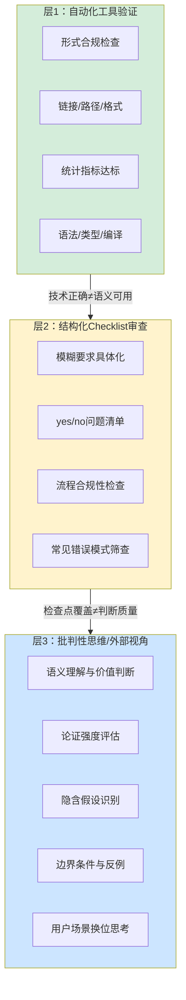

> **提炼自**：[第一性原理知识体系复盘关键洞察](../../../reports/project-reports/retrospective-first-principles-knowledge-system-20260710/supporting-analysis/key-insights.md#INSIGHT-003)

# 质量保证三层分工模型（Quality Assurance Three-Layer Model）

## 模式类型

方法论模式（治理策略/质量保障）

## 成熟度

L2 已验证（4次验证来源：v1.7新章节人工审查checklist、check-links.py三层验证模型、练习题库质量双维度、对抗性审查+外部评审+人工审查三级体系）

## 适用场景

为任何有质量要求的产出物（代码、文档、决策、设计、知识产品等）设计质量保证体系时。适用于：

| 场景 | 适用度 | 说明 |
|------|--------|------|
| 文档/知识生产质量保证 | ✅✅✅ 核心场景 | 区分形式合规与内容质量，分别设计验证机制 |
| 软件工程质量体系 | ✅✅✅ 核心场景 | 自动化测试、代码审查、架构评审分层设计 |
| AI辅助内容创作 | ✅✅✅ 核心场景 | 明确哪些能自动化检查，哪些必须人工判断 |
| 决策质量保证 | ✅✅ 强烈推荐 | 数据校验、checklist评审、批判性审视三层把关 |
| 产品设计评审 | ✅✅ 强烈推荐 | 规范检查、可用性checklist、战略层评审 |
| 纯机械性重复工作 | ⚠️ 间接适用 | 可只保留层1自动化，层2/3可简化 |

## 问题背景

知识生产（以及所有高认知负荷工作）的质量保证最常见的错误是"质量一元论"——试图用单一手段解决所有质量问题：
- 错误1："靠自觉保证质量"——完全依赖执行者的"认真""负责"，没有结构化检查
- 错误2："自动化万能论"——试图用AI或工具自动审查内容质量、批判性视角、论证强度
- 错误3："Checklist exhaustion"——用超长checklist试图覆盖所有质量维度，包括需要上下文判断的高阶问题
- 错误4："评审流于形式"——只有笼统的"注意质量""仔细审查"要求，没有明确审查什么

这些错误的共同根源是没有认识到：质量不是单一维度，不同质量维度需要完全不同的验证机制，三层之间存在不可逾越的边界，强行让某一层承担它边界之外的工作，质量保证体系必然失效。

## 核心原则：三层分工模型

质量保证存在三层不可替代的分工，每一层有明确的边界、能做什么、不能做什么：

### 层1：自动化工具验证——只能处理"形式合规"

| 维度 | 说明 |
|------|------|
| **能处理** | 有明确对错标准、不需要语义理解的形式化问题 |
| **典型检查项** | 链接是否存在、格式是否正确、路径层级是否正确、统计指标是否达标、语法/类型/编译是否通过、命名是否符合规范、测试是否通过 |
| **优势** | 100%可靠（只要规则写对）、速度快、成本低、可以高频运行、不依赖人的状态 |
| **根本局限** | 完全无法处理任何需要语义理解、上下文判断、价值判断的内容——技术上"通过"不等于用户实际可用（见[validation-semantic-gap.md](../tools-automation/validation-semantic-gap.md)） |
| **设计原则** | 能自动化的100%自动化，不要让人做机器能做的事 |

### 层2：结构化Checklist审查——弥补自觉的不可靠

| 维度 | 说明 |
|------|------|
| **能处理** | 将模糊的质量要求转化为具体、可检查的yes/no问题，覆盖常见错误模式 |
| **典型检查项** | "是否包含反例？""是否讨论了边界条件？""来源是否为一级？""是否存在利益冲突？""术语是否与定义一致？" |
| **优势** | 将"凭感觉审查"转化为"按清单检查"，大幅降低遗漏率；新人也能按清单做基础审查；可以覆盖自动化无法处理的半结构化问题 |
| **根本局限** | 无法覆盖需要深度上下文判断的高阶认知——清单上有"是否有批判性视角"，但什么是好的批判性视角、这个论证够不够深刻，无法用yes/no回答 |
| **设计原则** | 清单要具体、可操作、避免模糊词；不是越长越好，重点抓高频错误模式；定期从实际错误中更新清单 |

### 层3：批判性思维/外部视角——内容质量的最终保障

| 维度 | 说明 |
|------|------|
| **能处理** | 需要理解语义、判断价值、识别隐含假设、评估论证强度、换位思考用户场景等高阶认知任务 |
| **典型检查项** | 论证是否充分？有没有隐藏的逻辑漏洞？反例是否有力？边界条件讨论得够不够深？读者读完会有什么误解？这个结论在什么情况下不成立？ |
| **优势** | 这是真正决定内容质量的层级，也是短期内AI无法自动化、checklist无法穷尽的部分 |
| **根本局限** | 成本高、速度慢、依赖审查者的水平、无法100%覆盖、存在个体差异 |
| **设计原则** | 外部视角优于自审（当局者迷）；对抗性视角优于友好视角；不要让创作者自己做层3终审 |

## 核心规则

### 规则1：明确各层边界，禁止跨层甩锅

三层各有分工，不能互相替代：

| 错误做法 | 为什么错 | 正确做法 |
|---------|---------|---------|
| "这个问题让AI自动审查一下" | 层1工具无法处理层3的价值判断，AI会产生"已经审查过"的虚假安全感 | 层1做形式检查，层3必须人工做批判性审查 |
| "大家自觉保证质量，认真一点" | 自觉是最不可靠的，等于把质量交给随机事件 | 层1自动化+层2checklist把"认真"转化为可执行的步骤 |
| checklist列50项，连"有没有洞见"都要打勾 | "有没有洞见"是层3判断，列成yes/no问题毫无意义，反而让审查者疲劳 | checklist只列可明确判断的项，高阶判断留给层3 |
| 自动化覆盖率100%就认为质量好 | 层1覆盖的是形式问题，内容质量可能完全没保障 | 层1全绿只是质量的起点，不是终点 |

### 规则2：质量控制前置，层3越早介入越好

缺陷修复成本随阶段指数增长（见INSIGHT-005缺陷放大模型），层3的批判性视角不能等到最后才做：

- ❌ 错误流程：写完→层1检查→发布（层3完全缺失）
- ❌ 次优流程：写完→层1→层2checklist自己打勾→发布（自审偏差大）
- ✅ 推荐流程：大纲阶段就引入层3视角→写作中按层2checklist自检→写完层1自动化→层2交叉checklist→层3外部/对抗性审查→发布

### 规则3：层2checklist设计遵循"具体可判断"原则

好的checklist项 vs 坏的checklist项：

| ❌ 坏的checklist项 | ✅ 好的checklist项 |
|------------------|------------------|
| "内容要有深度" | "是否至少讨论了2个反例？" |
| "来源要可靠" | "一级来源占比是否≥70%？是否引用了原始文献而非二手转述？" |
| "要有批判性视角" | "是否明确列出了本结论不适用的3种场景？" |
| "逻辑要清晰" | "每一个论断是否都有证据支撑？是否存在跳跃推理？" |

判断标准：一个对领域不熟悉的新人，拿到清单也能明确判断"是"或"否"，不需要"我觉得"。

### 规则4：层3审查要用"对抗+外部"视角

自审存在天然盲区（当局者迷），层3审查的两个关键设计：
1. **对抗性视角**：审查者不是来"提建议"的，是来"挑毛病"的——假设这个内容是错的，努力找漏洞、找反例、找不成立的场景
2. **外部视角**：让没有参与创作的人做终审，创作者自己不能做自己内容的层3终审

### 规则5：从实际错误中反向迭代质量体系

质量体系不是一次设计完美的，而是在错误中持续迭代：
- 每次发现质量问题，先问：这个问题应该在哪一层被捕获？
- 如果层1能捕获但没捕获→升级自动化工具
- 如果层2能捕获但没捕获→更新checklist
- 如果只有层3能捕获→优化审查流程（增加外部视角、对抗性要求）

## 反模式

| 反模式 | 为什么错误 | 正确做法 |
|--------|----------|---------|
| 自动化万能论 | 层1工具只能检查形式合规，无法判断内容质量，100%自动化覆盖率≠高质量 | 层1自动化减负，层2checklist防漏，层3人工保质量 |
| 自觉可靠论 | "大家认真一点"是最无效的质量要求，认知偏差和自审盲区是系统性问题 | 把质量要求转化为可执行的检查点、自动化规则和审查流程 |
| Checklist大而全 | 超过20项的checklist会导致审查疲劳，后面的项全部打勾走过场 | 清单精简到10项以内，只抓最高频、最严重的错误模式 |
| 自己写的自己审 | 创作者对自己的内容太熟悉，会自动脑补逻辑、跳过漏洞，自审发现率不足30% | 层3终审必须由非创作者执行，最好用对抗性视角 |
| 质量问题追责个人 | "这么明显的错误你怎么没看出来？"——如果错误能被层1/层2捕获，根因是体系缺失不是个人疏忽 | 质量问题先追体系漏洞：哪一层没拦住？为什么？怎么加固？ |
| 最后才做质量检查 | 写完才发现基础概念错了，返工成本极高 | 质量左移：大纲阶段就做层3评审，写的过程中层2自检，写完层1自动检查 |

## 实际案例

### 案例1：第一性原理知识体系v1.7质量体系（本模式来源）

| 层级 | 机制 | 效果 |
|------|------|------|
| 层1自动化 | check-links.py三层验证、文件名规范检查、frontmatter格式检查 | 捕获了所有路径错误、格式错误、链接错误 |
| 层2 Checklist | 新章节5项人工审查清单： 1.是否包含反例？ 2.是否讨论边界条件？ 3.来源是否一级？ 4.术语是否一致？ 5.有没有类比推理误用？ | v1.7新章节质量显著提升，术语漂移、来源不可靠等问题大幅减少 |
| 层3批判性审查 | 对抗性审查（从"找漏洞"视角评审）+ 外部评审（非作者视角）+ 边界条件专项审查 | 发现了"方法论万能论"倾向，催生了16-boundary-conditions.md章节，完成"建构→解构→自反"的成熟跃迁 |

对比：v1.0只有层1基础检查+作者自审，出现了术语歧义、来源质量参差不齐、案例偏向科技行业等问题，v1.7三层体系后这些问题系统性解决。

### 案例2：check-links.py的三层验证演进

从单一的层1验证进化到完整三层，正是本模式在工具设计中的体现：
- L1（技术层）：路径存在？（层1自动化）
- L2（应用层）：是可打开的文件而非目录？（层1+层2边界）
- L3（约定层）：符合项目链接约定？（层2规则）

## 与其他模式的关系

| 关联模式 | 关系类型 | 关系说明 |
|---------|---------|---------|
| [validation-semantic-gap.md](../tools-automation/validation-semantic-gap.md) | 层1组件 | 验证语义缺口解释了为什么层1"技术正确"不等于"用户可用"，层1需要从用户视角持续升级 |
| [cognitive-practice-gap-recursive-defense.md](cognitive-practice-gap-recursive-defense.md) | 理论基础 | 认知偏差防御解释了为什么"靠自觉"不可靠——必须有结构化的三层防御 |
| [adversarial-review-prompt-pattern.md](../ai-collaboration/adversarial-review-prompt-pattern.md) | 层3组件 | 对抗性审查Prompt是层3批判性视角的具体实现方法 |
| [three-stage-content-validation.md](three-stage-content-validation.md) | 流程关联 | 三阶段内容验证是本模型在内容创作流程中的具体应用 |
| [human-ai-collaboration-70-30-rule.md](../ai-collaboration/human-ai-collaboration-70-30-rule.md) | 人机分工 | 70/30定律解释了层1/层2/层3中哪些适合机器做，哪些必须人做 |
| [simple-task-high-risk.md](simple-task-high-risk.md) | 防御重点 | 简单任务最容易跳过层2和层3，直接层1过了就发布，是质量事故高发区 |

## Changelog

- 2026-07-13 | create | 初始版本，从第一性原理知识体系复盘关键洞察003沉淀，L2成熟度，4次验证实例
