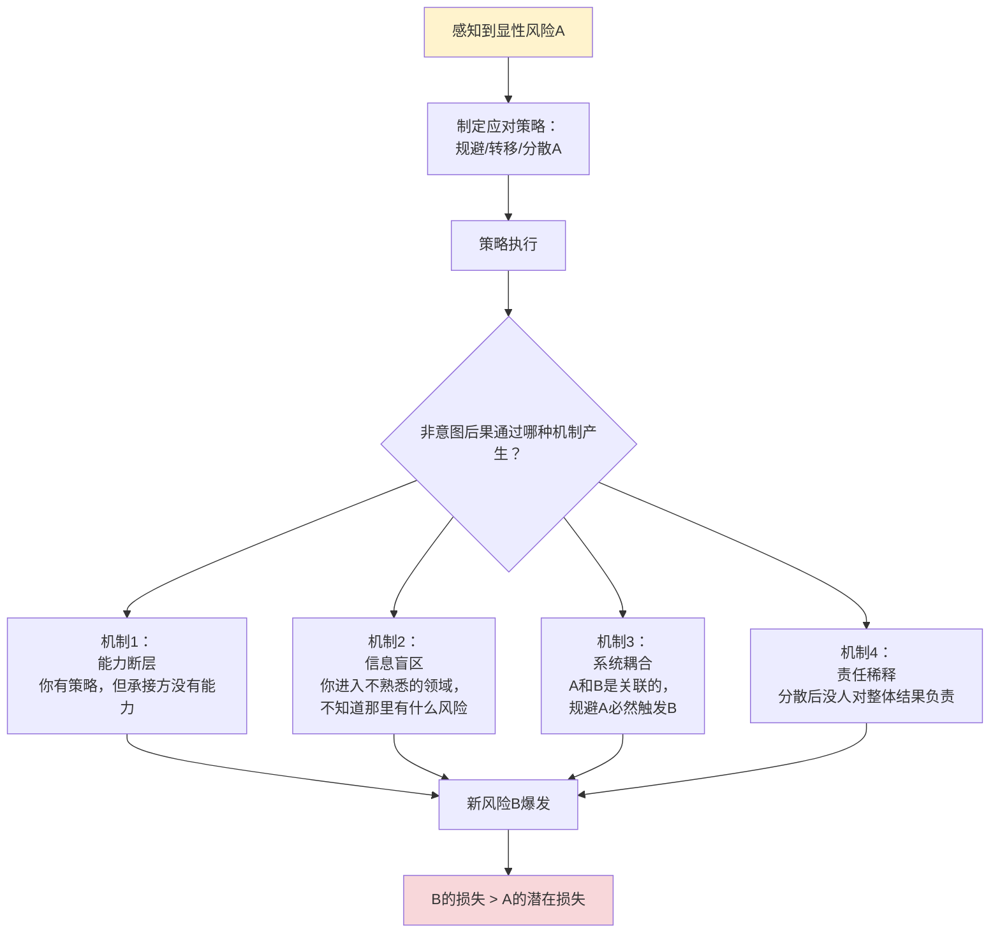
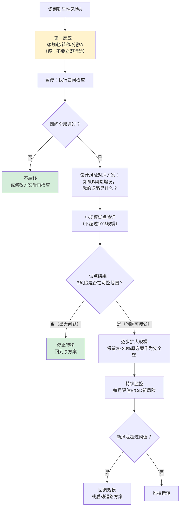

> **来源**：从华商韬略苹果630GB泄密事件洞察中萃取
> **原始案例**：苹果为规避"过度依赖中国供应链"的地缘政治风险，将产能转移印度"多元化分散风险"，结果引入更致命的工业能力断层风险和信息安全风险，630GB核心数据泄露

# 风险转移非意图后果模型

## 一、来源

2018年美国对华关税落地后，苹果启动"供应链多元化"战略，加速将iPhone产能从中国转移到印度。苹果的决策逻辑非常清晰：

```
感知风险：过度依赖中国供应链 → 地缘政治风险（关税/制裁/断供）
应对策略：产能转移印度 → 多元化分散风险 → "不要把鸡蛋放在一个篮子里"
```

按照教科书式的风险管理理论，这是一个无比正确的决策。但实际结果是：
- 印度塔塔工厂iPhone外壳良品率仅50%（苹果标准是零缺陷）
- 630GB、超过20万份核心数据从塔塔电子泄露，挂上暗网出售
- 被迫将部分装配产线从印度搬回中国
- 富士康仓促召回300名中国工程师赴印度救火

**苹果成功规避了A风险（中国地缘风险），却引入了更致命的B风险（工业能力断层+信息安全失守）。这就是风险转移的非意图后果。**

## 二、核心思想

当你试图规避一个显性风险（A）时，你的应对措施本身往往会引入一个或多个你看不见的隐性风险（B、C...）。这些新风险可能比原来的风险更致命，因为：

1. **你只盯着A**：注意力聚焦在要规避的风险上，对新风险视而不见
2. **B是隐性的**：新风险不是一开始就暴露的，它有潜伏期
3. **你不了解B**：进入新领域/新地区/新合作方，你对那里的风险没有认知
4. **B可能更致命**：原来的A风险是"可能发生"，新引入的B风险是"必然发生"

**核心教训**：风险分散不是简单的"不要把鸡蛋放在一个篮子里"——你得先确认新篮子本身是不漏的。

## 三、非意图后果的四种典型机制



### 机制1：能力断层（最常见）

你有完美的风险规避策略，但你选择的承接方/新方案没有能力承载这个策略。

**案例**：苹果把产能转移到印度，塔塔集团是印度第一财团，但它的工厂管理能力、质量控制能力、信息安全能力都达不到苹果的标准。你以为"只要把工厂建起来就行"，但建工厂只是L1层能力，L3-L5层能力承接方根本没有。

**本质**：你规避的是"供应链集中"风险，但你没评估"承接方能力"风险。

### 机制2：信息盲区

当你离开熟悉的领域/地区/合作方，进入一个新环境，你对那里的"潜规则"、"常见坑"、"实际运作方式"完全没有认知。你用原来环境的经验去判断新环境，必然踩坑。

**案例**：苹果在中国做了26年供应链，对中国工厂的运作方式、地方政府的配合模式、工人的熟练度了如指掌。但在印度，它不了解：当地劳工法的实际执行情况、供应商的真实管理水平、网络安全的实际防护能力、政府效率和腐败程度。这些信息盲区，不是靠尽职调查就能完全覆盖的。

**本质**：熟悉环境的风险是"已知的未知"，新环境的风险是"未知的未知"。

### 机制3：系统耦合

风险A和风险B不是独立的，它们是系统中耦合在一起的两个部分。你想把A去掉，结果B也跟着出问题——因为它们本来就是一体的。

**案例**：苹果想把"制造"从中国"供应链生态"中剥离出来，单独搬到印度。但"制造"和"生态"是深度耦合的——72小时响应速度依赖于深圳/东莞一小时供应链圈，质量稳定依赖于中国工程师20年的经验积累，保密安全依赖于26年形成的信任共生关系。你把制造搬走了，但你搬不走生态，结果制造本身也运转不灵。

**本质**：你以为你在转移"一个环节"，实际上你在破坏"一个系统"。

### 机制4：责任稀释

当你把风险分散/转移给多个合作方后，"人人有责"变成了"人人无责"，整体风险反而上升。

**案例**：如果苹果100%产能都在富士康，富士康有100%的动力保证质量和安全——出了任何问题都是它的责任。但当产能分散到5家供应商、3个国家后，每家都觉得"我只是其中一部分，出问题也不全是我的责任"，责任心下降，整体风险控制水平反而降低。

**本质**：风险分散的同时，也分散了责任感和关注度。

## 四、风险转移前的四问检查清单

在执行任何"规避/转移/分散风险"的决策前，先回答以下四个问题：

| # | 问题 | 如果答不上来/答案是"否" |
|---|------|-----------------------|
| 1 | 新方案/新合作方/新地区**真实能力水平**到底如何？有没有做过**独立第三方**的能力验证？不是看PPT/资质/规模，而是看**实际执行结果**（良品率、交付准时率、安全记录） | 不要转移！先做小规模试点验证能力 |
| 2 | 新环境的**"未知的未知"**是什么？找在那个环境里真正待过3年以上的人聊过吗？知道那里最容易踩的3个坑是什么吗？ | 不要转移！先做深度调研，找"过来人"取经 |
| 3 | 我要转移的这个环节，和系统中其他环节是**松耦合**还是**紧耦合**？转移它会不会破坏整个系统的运转？ | 不要只转移单个环节！要么转移整个生态（成本极高），要么保留关键环节 |
| 4 | 转移后，谁对最终结果**负100%责任**？会不会出现"三个和尚没水喝"的责任稀释？ | 明确总负责人，建立整体结果问责机制 |

## 五、操作步骤



## 六、典型迁移案例

### 案例A：供应链多元化（原始案例）

- **规避的A风险**：过度依赖中国供应链 → 地缘政治风险
- **引入的B风险**：印度供应商能力不足 → 50%良品率 + 630GB数据泄露
- **触发机制**：机制1（能力断层）+ 机制2（信息盲区）+ 机制3（系统耦合）
- **教训**：新篮子本身是漏的，而且漏得比旧篮子还厉害

### 案例B：企业IT上云"降本"

- **规避的A风险**：私有云运维成本高、扩容慢
- **引入的B风险**：数据安全风险、vendor lock-in风险、网络延迟风险、云厂商涨价风险
- **触发机制**：机制1（以为云厂商都能搞定，实际安全配置是自己的责任）+ 机制2（不了解云安全的"责任共担模型"）
- **常见结果**：算下来云成本比原来私有云还高，还多了一堆安全事故

### 案例C：团队"去关键人依赖"做AB角

- **规避的A风险**：某关键岗位只有一个人会 → 人员离职风险
- **引入的B风险**：AB角都觉得"对方会负责" → 责任稀释，关键事情没人做；沟通成本翻倍
- **触发机制**：机制4（责任稀释）
- **常见结果**：关键人风险没完全解决，整体效率反而下降30%

### 案例D：个人"分散投资"买10只基金

- **规避的A风险**：单只基金波动大 → "鸡蛋不放在一个篮子里"
- **引入的B风险**：过度分散导致收益平庸；管理10只基金的时间精力成本；选到差基金的概率上升
- **触发机制**：机制4（责任稀释？不，是注意力稀释）
- **常见结果**：忙活半天，收益还不如沪深300指数基金

### 案例E：为"安全"禁止员工用U盘/外网

- **规避的A风险**：数据泄露、病毒感染
- **引入的B风险**：员工用微信/个人邮箱传文件，反而更不安全；工作效率大幅下降；员工满意度降低
- **触发机制**：机制3（系统耦合：数据流动是工作的必要部分，你堵了正门，大家就走邪门）
- **常见结果**：名义上安全了，实际上更不安全了

## 七、反模式识别

### 反模式1："鸡蛋篮子"隐喻滥用

**表现**：张口就是"不要把鸡蛋放在一个篮子里"，把这句话当成风险管理的万能公式。

**纠正**：这句话只说对了一半——分散确实能降低"单个篮子破了全碎"的风险，但它没说：
- 新篮子可能本身就是漏的（能力问题）
- 你可能根本不会照看10个篮子（注意力问题）
- 多个篮子之间可能会互相碰撞（系统耦合问题）
- 篮子越多，坏蛋混进来的概率越高（引入新风险）

### 反模式2：风险清单只列A，不列B

**表现**：做风险评估时，只列"我们要规避什么风险"，不列"我们的应对措施会带来什么新风险"。

**纠正**：任何风险应对措施都必须附带"副作用评估"——执行这个措施后，可能会引入哪些新风险？这些新风险的概率和影响有多大？有没有对冲方案？

### 反模式3："先转了再说，出问题再解决"

**表现**：觉得"风险转移是大方向，出点小问题很正常，到时候再解决"。

**纠正**：有些风险一旦爆发是不可逆的——数据泄露了收不回来，品牌砸了很难重建，核心技术人员走了很难再招。对于不可逆的风险，必须先做小规模验证，不能"先转了再说"。

### 反模式4：把"所有鸡蛋放一个篮子"等同于"高风险"

**表现**：认为"集中=高风险，分散=低风险"是普世真理。

**纠正**：要看你对这个篮子有多了解、有多强的掌控力。如果你对一个篮子知根知底、有20年合作经验、能深度影响它的运作，那么把鸡蛋放这个篮子里，反而比分散到10个你不了解的篮子里更安全。**熟悉的魔鬼比陌生的魔鬼好**。

## 八、正确的风险管理姿势

1. **风险不是用来"消灭"的，是用来"选择"的**：你不可能没有风险，你只能选择承担哪种风险。A风险和B风险，选哪个你更能接受、更能掌控？

2. **保留安全垫**：不要100%转移，保留20-30%在原来的地方。万一新方案出大问题，你有退路。苹果如果一开始只把20%产能转移印度，这次泄密事件的损失就会小很多。

3. **能力评估先于风险转移**：先确认新承接方有能力，再谈转移。看实际案例，看良品率，看安全记录，不要看PPT和资质。

4. **找"过来人"做预警**：进入新领域/新地区前，一定要找在那里真正踩过坑的人聊。他们告诉你的3个坑，比100页尽职调查报告还有用。

5. **监控新风险指标**：转移后，不要只监控原来的A风险有没有缓解，更要重点监控新引入的B风险有没有爆发。

## 九、验证标准

使用本模型后，决策质量提升的标志：

| 标志 | 说明 |
|------|------|
| 决策前明确列出B风险 | 不仅说"我们要规避A风险"，还说"我们的应对措施可能引入B/C风险，概率X%，影响Y级" |
| 有试点验证阶段 | 不搞"大干快上"，先小范围（<10%）试点，验证没问题再扩大 |
| 保留安全垫 | 不100%转移，保留20-30%原方案作为退路 |
| 有明确的退路方案 | 如果B风险爆发，知道怎么撤回来，损失有多大 |
| 持续监控新风险 | 转移后持续跟踪B/C/D新风险指标，不是"一转了之" |

## 十、关联模式

- [capability-replication-boundary.md](capability-replication-boundary.md) — 能力复制边界判断法：风险转移前先用五问法判断承接方是否有能力承载
- [phased-rollout-validation.md](phased-rollout-validation.md) — 分阶段推出验证：小范围试点验证后再扩大，本模型的操作步骤核心
- [pre-decision-three-checks.md](../ai-collaboration/pre-decision-three-checks.md) — 决策前三查：查权威/查案例/查本质，避免被"鸡蛋篮子"这类简单隐喻误导
- [mvp-unvalidated-code-debt.md](mvp-unvalidated-code-debt.md) — MVP未验证债务：不仅代码有技术债务，决策也有"决策债务"——不经验证的风险转移就是高息决策债务

> 来源验证：本模式从苹果印度泄密事件单一案例萃取，maturity=L1。需要在更多IT上云、组织变革、投资决策等场景中验证和完善。
