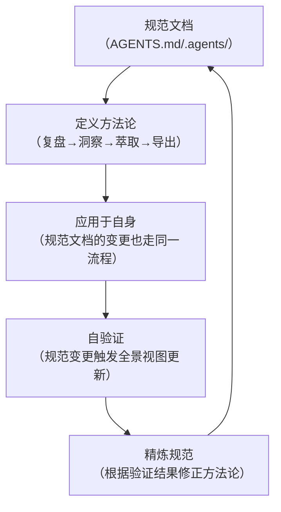

> **来源**：从 `docs/retrospective/reports/retrospective-comprehensive-20260623/insight-extraction.md` 三、3.1 发现一 拆分

# 自指性规范体系（Self-Referential Specification System）

## 模式类型
方法论模式

## 成熟度
L1 实验性（1 次成功案例：本项目的 AGENTS.md + 自我演进八模块体系）

## 适用场景
构建 AI 智能体开发规范体系或类似的自描述系统时，需要评估规范设计的完整性与自验证能力。

## 问题背景

大多数规范体系的定义者与被规范者是分离的——规范文档定义了"应该怎么做"，但规范文档本身的编写过程并不遵循它定义的方法论。这种"元级断裂"导致规范失去自我验证能力。

自指性规范体系的关键特征是：**规范定义自身**——规范文档的编写、版本控制、验证和演进过程，完全遵循规范自身定义的方法论。

## 核心机制

## "规范即测试"效应

当规范体系具备自指性时，每个规范变更都会产生级联验证效果：

| 变更类型 | 触发的验证 | 示例 |
|---------|-----------|------|
| 新增角色定义 | 角色权限验证脚本自动检测新角色是否符合规范 | check-role-permissions.py |
| 修改文档结构 | 链接有效性检查全量扫描受影响引用 | check-links.py |
| 更新复盘模板 | 所有派生产物的溯源链接被重新验证 | check-source-traceability.py |
| 修改协作协议 | 团队管理模块的一致性被自动校验 | check-spec-consistency.py |

## 本案例验证

**支撑事实**：本项目的八模块自我演进体系不仅是被定义的功能模块，其定义方式本身（使用 TOML frontmatter）就应用了项目自身的 source 溯源机制——项目不仅定义了"怎么做复盘"，项目自身就是按照它所定义的复盘方法论来执行的。

**具体表现**：
- AGENTS.md 使用 TOML frontmatter 声明来源，与所有派生产物一致的格式
- 自我演进模块（self-insight/self-retrospective/...）的定义文件也遵循模块定义规范
- 复盘报告（docs/retrospective/reports/）采用同一种四章结构（复盘→洞察→萃取→导出）

## 设计原则

| 原则 | 说明 | 实施方式 |
|------|------|---------|
| **格式统一** | 规范文档与派生产物使用相同的元数据格式 | TOML frontmatter 的 source 字段 |
| **流程闭环** | 规范自身的变更也走同一套验证流程 | CI 脚本对 .agents/ 目录同等检测 |
| **溯源可见** | 每个规范的来源和变更历史可追溯 | source 字段 + Git 提交记录 |
| **自验证优先** | 规范定义的方法论必须先在自己身上验证 | 新方法论先在项目内部实践再推广 |

## 实施检查清单

- [ ] 规范文档是否使用与被规范产物相同的元数据格式？
- [ ] 规范文档的变更是否触发相同的验证流程？
- [ ] 是否存在"规范说了但规范自身没做到"的反例？
- [ ] 规范的方法论是否在项目内部有可验证的成功案例？

## 不适用场景

- 一次性使用的临时规范（不需要自指性）
- 纯粹的外部标准文档（定义者无控制权）
- 规模极小的项目（自指性成本 > 收益）

> **关联模块**：
> - `spec-driven-development.md`
> - `review-insight-export-loop.md`
