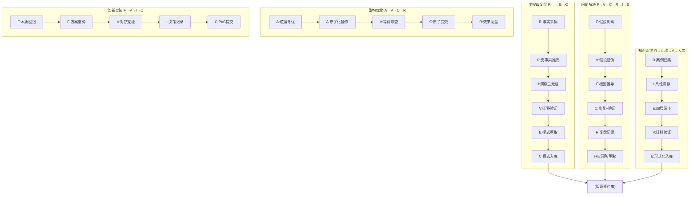

# 七概念五种核心组合应用流程

> 概念缩写：R=复盘 | I=洞察 | E=萃取 | C=原子提交 | A=原子化 | F=第一性原理 | V=对抗性审查

## 统一流程全景图

---

## 流程1：里程碑复盘闭环（R→I→E→C）

| 维度 | 内容 |
|------|------|
| **触发** | Sprint结束、版本交付、里程碑达成、周期节点（≥2周） |
| **输入** | 周期git log、变更记录、事件时间线、度量数据 |
| **步骤** | 1.R事实采集→2.R反事实推演→3.I洞察四元组→4.V对抗审查→5.E模式萃取→6.C模式入库提交 |
| **RACI** | R:参与者/A:复盘Owner/C:成员/I:相关团队 |
| **输出** | 复盘报告、≥1条洞察（里程碑复盘≥3条）、L1模式文件、模式入库 |
| **质量门** | G1:事实无因果词（因为/所以/导致） G2:洞察≥1条（里程碑≥3条），四元组完整可证伪 G3:模式通过V审查，无反例击破，完成入库 |

---

## 流程2：问题解决闭环（F→V→C→R→I→E）

| 维度 | 内容 |
|------|------|
| **触发** | P1+故障、线上Bug、根因不明、知其然不知其所以然 |
| **输入** | 故障现象、复现路径、错误日志、监控数据 |
| **步骤** | 1.F假设剥离→2.V假设证伪→3.F根因推导→4.C修复+验证→5.R复盘记录→6.I+E预防萃取入库 |
| **RACI** | R:排查人/A:技术负责人/C:模块Owner/I:运维产品 |
| **输出** | 修复代码（已验证）、根因报告、预防机制、同类pattern入库 |
| **质量门** | G1:根因可复现，修复100%验证通过 G2:修复通过后才复盘，含预防措施（非点修复） G3:同类pattern入库，反模式同步 |

---

## 流程3：重构优化闭环（A→V→C→(R)）

| 维度 | 内容 |
|------|------|
| **触发** | 技术债偿还、结构优化、无功能变更、文件>500行 |
| **输入** | 待重构代码/文档、粒度评估、依赖关系图 |
| **步骤** | 1.A粒度寻优→2.A原子化操作→3.V等价审查→4.C原子提交→5.(R)效果复盘 |
| **RACI** | R:执行人/A:模块Owner/C:开发者/I:测试 |
| **输出** | 重构产物、原子提交序列、断链修复记录 |
| **质量门** | G1:功能100%等价，测试无回归 G2:链接完整无断链，路径正确 G3:单文件≤500行，职责单一 |

---

## 流程4：知识沉淀闭环（R→I→E→V→入库）

| 维度 | 内容 |
|------|------|
| **触发** | 同类经验≥2次、可复用规律、重复踩坑 |
| **输入** | ≥2份同类复盘、案例集、事件记录 |
| **步骤** | 1.R案例归集→2.I共性洞察→3.E四层漏斗→4.V迁移验证→5.E形式化入库 |
| **RACI** | R:萃取人/A:方法论Owner/C:贡献者/I:全体 |
| **输出** | L1/L2模式、反模式案例、成熟度标注 |
| **质量门** | G1:≥2个独立案例来源 G2:配套≥1个反模式案例 G3:成熟度标注，validation_count≥2 |

---

## 流程5：创新突破流程（F→V→I→C）

| 维度 | 内容 |
|------|------|
| **触发** | 新架构探索、新方法验证、未知领域、现有方案局限 |
| **输入** | 问题陈述、约束条件、现有方案局限、边界定义 |
| **步骤** | 1.F本质回归→2.F方案重构→3.V对抗论证→4.I决策记录→5.C PoC提交 |
| **RACI** | R:探索者/A:技术负责人/C:架构组/I:相关团队 |
| **输出** | PoC原型、ADR决策记录、假设清单、风险分析 |
| **质量门** | G1:明确列出所有假设与边界 G2:≥3个失败场景已识别防御 G3:PoC验证关键假设，数据支撑 |

---

## 流程索引

| 流程 | 链路 | 步骤 | 质量门 | 场景 |
|------|------|------|--------|------|
| 1里程碑复盘 | R→I→E→C | 6 | 3 | 周期节点、版本交付 |
| 2问题解决 | F→V→C→R→I→E | 6 | 3 | 故障、Bug、未知问题 |
| 3重构优化 | A→V→C→(R) | 5 | 3 | 技术债、结构优化 |
| 4知识沉淀 | R→I→E→V→入库 | 5 | 3 | 经验复用、模式归档 |
| 5创新突破 | F→V→I→C | 5 | 3 | 新架构、新方法探索 |
| **合计** | - | **27** | **15** | - |
