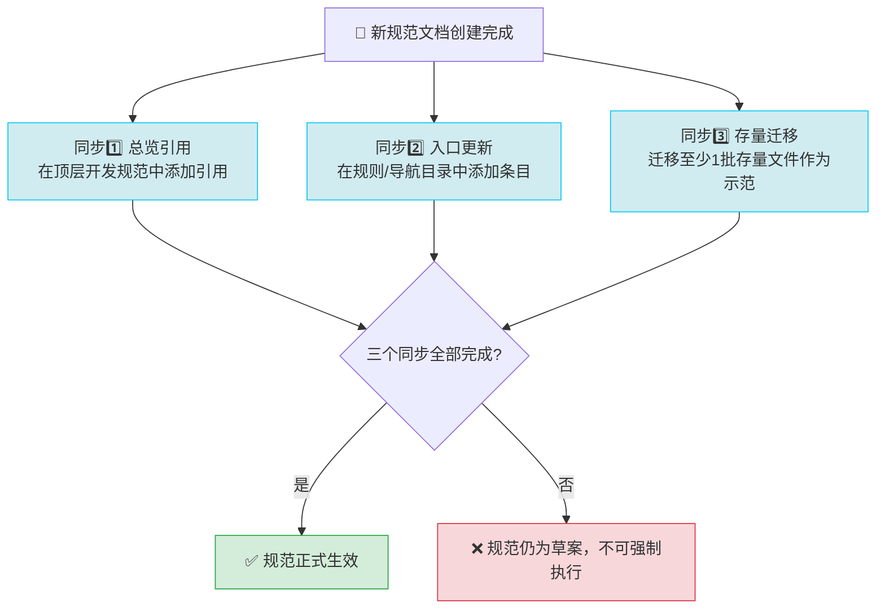

# 规范三同步原则：新规范落地必须完成的三个同步动作

## 模式概述

制定新规范/新标准/新约定后，不能只创建一个规范文档就结束——必须立即完成三个同步动作：① 开发规范总览引用 ② 导航/规则目录入口更新 ③ 存量文档迁移示范。三个动作缺一不可，否则规范会成为"藏在深闺人未识"的死文档，没人看得到、没人知道、没人遵循。

## 问题现象

很多团队制定规范后会遇到"规范悬空"问题：

1. **规范写了但没人看**：创建了规范文档，但没有在任何入口链接到它，没人知道它存在
2. **看到了但不知道什么时候用**：规范文档孤立存在，没有和开发流程/现有规范体系整合，开发者不知道该什么时候参考它
3. **想用但不知道怎么用**：规范只有原则说明，没有实际的存量代码/文档作为示范，开发者不知道正确写法是什么样
4. **新旧规范并存冲突**：只写了新规范，没有迁移存量内容，导致存量内容不符合新规范，新人不知道该遵循哪个
5. **规范逐渐过时**：因为没有入口也没有示范，几个月后连制定者都忘了有这个规范，又重新发明一遍

本次任务中观察到：如果只创建frontmatter-metadata-standard.md而不同步更新development-standards.md和rules/README.md，后续的开发者很可能继续使用旧的TOML frontmatter格式，新规范形同虚设。

## 解决方案

新规范发布后**必须立即完成三个同步动作**：



### 同步1：总览规范引用

在项目的顶层开发总览规范中（如`.agents/docs/development-standards.md`）：
- 添加新规范的一句话说明
- 添加指向详细规范文档的链接
- 说明这个规范适用的场景和时机
- 如果替换/废弃了旧约定，明确标注旧约定已废弃

**作用**：让阅读开发总览的人知道有这个规范存在，了解什么时候该去看详细规范。

### 同步2：导航入口更新

在对应的规则/文档目录索引中（如`.agents/rules/README.md`、`docs/`对应子目录的README）：
- 在"规则文档清单"表格中添加新规范条目（一句话说明用途、适用阶段、适用角色）
- 在"快速导航/场景导航"中添加"遇到XX问题看这个规范"的场景化入口
- 在"按角色导航"中为相关角色添加该规范引用

**作用**：让通过目录导航和场景查找的人能找到这个规范，提供场景化入口而非孤立文档。

### 同步3：存量迁移示范

选择至少一批有代表性的存量文档/代码，按照新规范完成迁移：
- 数量不需要多，但要有代表性（覆盖不同类型/深度/场景）
- 迁移后验证所有检查通过（链接、格式、测试）
- 可以在规范文档中以这些迁移后的文件作为"正确示例"

**作用**：提供可参考的活样本，证明规范是可执行的；消除存量与新规范不一致导致的困惑；提前发现规范中不合理的地方。

## 适用场景

- ✅ 制定新的代码规范/文档规范/流程规范后
- ✅ 引入新的文件格式/目录结构/元数据约定后
- ✅ 重构现有规范、废弃旧约定后
- ✅ 添加新的Skill/工具/脚本到工作流后
- ✅ 发布新的架构模式/最佳实践后

**不适用场景**：
- ❌ 草稿/讨论中的规范（还没定稿不需要同步，等正式发布再做）
- ❌ 个人笔记/临时记录（不需要团队遵循的不需要）
- ❌ 非常小的约定（如某个词的拼写，在总览中提一句即可，不需要独立文档）

## 实际案例

### 案例：Frontmatter元数据规范发布

**背景**：制定了新的frontmatter规范（YAML核心+TOML外部），需要确保后续都遵循。

**执行三同步**：

1. **同步1：总览规范引用**
   - 更新`.agents/docs/development-standards.md`的Frontmatter章节
   - 将原来的详细说明精简为一句话+引用新规范
   - 明确标注"TOML frontmatter已废弃，新文档统一使用YAML+x-toml-ref"

2. **同步2：导航入口更新**
   - 更新`.agents/rules/README.md`
   - 在"规则文档清单"表格中添加frontmatter-metadata-standard.md条目
   - 在"按场景导航"中添加3个场景化入口：
     -      - "Markdown文档frontmatter怎么写才规范？"
     -      - "x-toml-ref路径怎么计算？"
     -      - "哪些元数据字段放YAML，哪些放TOML？"

3. **同步3：存量迁移示范**
   - 批量迁移了29个存量Markdown文件到新格式
   - 包含学习资料、技术报告、规范文档等不同类型
   - 覆盖0-6层不同目录深度
   - 所有链接验证通过
   - 在新规范文档中引用这些迁移后的文件作为示例

**效果**：规范发布后，后续编写新文档时可以直接参考示例、查表计算路径、通过场景导航快速找到规范，避免了"规范悬空"问题。

## 反模式

### 反模式1：只创建规范文档，不做任何同步

```
完成：创建了 .agents/rules/new-standard.md
（结束，不做其他改动）
```

**为什么错**：没有入口，没有引用，没有示范，这个文档相当于不存在——除了创建者没人知道它，三个月后创建者自己也忘了。

**后果**：规范成为"僵尸文档"，代码库中实际还是旧写法，规范只是写给自己看的。

### 反模式2：只更新导航不更新总览

只在rules/README.md加了条目，但development-standards.md（开发者最先看的地方）没更新。

**为什么错**：大多数人读开发规范是从顶层总览开始的，不会逐个翻rules目录。总览没更新等于切断了最主要的发现路径。

### 反模式3：规范发布后不迁移存量，要求"以后新文件遵循就行"

**为什么错**：
1. 没有存量迁移就没有真实示例，新人看了规范还是不知道实际怎么写
2. 存量文件都是旧格式，会形成"旧格式才是主流"的心理暗示
3. 批量迁移过程是对规范最好的验证——能发现规范中考虑不周的地方
4. 存量和新规范不一致会导致工具检查时大量告警，最终要么关闭检查要么忽略规范

**正确做法**：至少迁移一批有代表性的存量文件，不要求全量一次性迁移，但必须有示范样本。

### 反模式4：一次性做完全量迁移再发布规范

**为什么错**：规范还没发布就先改所有存量文件，改的过程中发现规范不合理需要调整时，已经改了的文件还要再改一遍，返工成本高。

**正确顺序**：制定规范→三同步（含小批量示范迁移）→收集反馈→优化规范→批量推广。

## 与其他模式的关系

| 相关模式 | 关系 | 说明 |
|---------|------|------|
| three-layer-rule-enforcement | 治理思想 | 三层规则执行需要规范能被发现，三同步确保可发现性 |
| spec-discoverability-guarantee | 上层模式 | 规范可发现性保障，三同步是具体落地手段之一 |
| compliance-driven-rule-building | 互补 | 合规驱动规则建设需要规范可被遵循，三同步确保可执行性 |
| learn-validate-adopt | 流程一致 | 学习-验证-采纳流程，存量迁移是"验证"环节 |
| metadata-layering | 配套 | 元数据分层模式通过三同步落地到实际项目 |

## 边界与选型

### 三同步是"规范正式发布"的完成定义

三个同步全部完成，才能算规范正式发布：
- 规范文档写完 = 草案完成
- 总览引用+入口更新+存量迁移 = 正式发布

缺少任何一个同步，规范都还处于"草案"状态，不应该要求其他人强制执行。

### 存量迁移的规模怎么把握？

- 小型规范（如某个字段的写法）：迁移3-5个有代表性的文件即可
- 中型规范（如frontmatter格式）：迁移10-30个文件，覆盖主要场景和目录深度
- 大型规范（如全新的架构模式）：先迁移1-2个典型模块作为试点，验证后再推广

不需要在规范发布当天就完成100%存量迁移，但必须有**足够的示范样本**证明规范可行。

### 什么时候可以不做全三同步？

只有一种例外：讨论中的草案/WIP文档。这类文档明确标注"草稿/讨论中"，放在drafts或类似目录下，不要求遵循，等正式发布时再做三同步。

任何标注为"正式"、"生效"、"必须遵循"的规范，都必须完成三同步。
