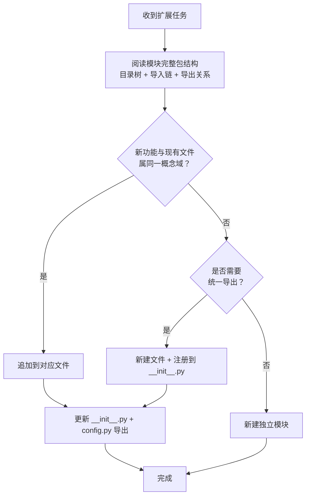

> **来源**：从 `docs/retrospective/reports/retrospective-insight-extraction-comprehensive-20260623.md` 六、高优先级改进建议执行 — S3 执行萃取 拆分

# 结构阅读先行（Structure-First Extension）

## 模式类型
方法论模式

## 成熟度
L3 可复用（3 次验证：prompt_extraction constants/ 扩展 + lib/ 公共库创建 + lib/markdown.py 新增；1 次复用：大规模共享库提取任务）

## 适用场景
对已有模块进行功能扩展时，需要判断"追加到现有文件"还是"新建独立模块"。

## 问题背景

在成熟的代码库中进行功能扩展时，常见两种决策失误：

- **过早新建**：未充分理解包结构就创建新模块，导致概念域碎片化、导入链冗余
- **错误追加**：将不相关的新功能塞入已有文件，导致文件膨胀、职责混乱

两种失误的根因相同：**未先阅读目标模块的完整包结构**。

## 操作流程

## 步骤详解

### 步骤 1：阅读模块完整包结构

| 读取内容 | 目的 | 工具/手段 |
|---------|------|----------|
| 目录树 | 了解现有文件组织 | LS / Glob |
| 导入链 | 了解各文件间的依赖关系 | Read `__init__.py` |
| 导出关系 | 了解对外暴露的接口 | Read `config.py`（若存在） |

### 步骤 2：判断概念域归属

| 判断条件 | 决策 | 示例 |
|---------|------|------|
| 新功能与现有文件属于同一概念域 | 追加到该文件 | `AGENTS_DIR` 与 `DEFAULT_OUTPUT_DIR` 同属"路径"概念域 |
| 新功能是独立概念域 | 判断是否需要统一导出 | `writeback` 方法与 `Pipeline` 同属"流水线操作"概念域 |
| 同一概念域但文件已过长（>300 行） | 考虑拆分为子模块 | 暂不适用 |

### 步骤 3：执行扩展

按决策结果执行追加或新建，并同步更新导出层和兼容层。

## 关键原则

1. **阅读先于决策**：禁止在未阅读完整包结构前做出"新建"或"追加"的判断
2. **概念域是唯一的锚点**：同概念域→追加，异概念域→新建
3. **三层结构是效率杠杆**：分离定义 + 统一导出 + 向后兼容 → O(1) 接入成本
4. **约定驱动是此模式的前置条件**：只有在包结构已按约定组织的前提下，概念域判断才有效

## 成功案例

| 任务 | 新增功能 | 判断依据 | 决策 | 结果 |
|------|---------|---------|------|------|
| prompt_extraction 绑定 .agents/ | 4 个路径常量 | 与 `DEFAULT_OUTPUT_DIR` 同属"路径"概念域 | 追加到 `paths.py` | 26 行代码，零破坏 |
| prompt_extraction 新增 writeback | Pipeline.writeback 方法 | 与 `Pipeline` 同属"流水线操作"概念域 | 追加到 `pipeline.py` | 65 行代码，单文件完成 |
| 验证脚本公共库创建 | project/frontmatter/cli 三个模块 | 三个独立概念域 | 新建三个文件 | lib/ 三层模块 |
| lib/markdown.py 新增 | 5 个 Markdown 处理函数 | "Markdown 处理"是独立概念域，不属于 cli/link_fixer/spec | 新建 `lib/markdown.py` | 145 行，6 个函数引用 |

## 反例警示

| 错误操作 | 后果 |
|---------|------|
| 不读包结构直接新建模块 | 概念域碎片化，导入链冗余 |
| 将不相关功能塞入已有文件 | 文件职责混乱，难以维护 |
| 跳过兼容层更新 | 旧调用方无法使用新功能 |

## 与现有模式的关系

是 `convention-driven-creation`（先读范例再扩展）在代码级的具体实现——"先阅读完整包结构（读范例），再按概念域归类决定追加或新建（填充内容）。"

> **关联模块**：
> - `convention-driven-creation.md`
> - `spec-driven-development.md`
