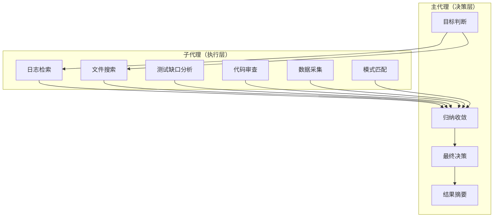

> **来源**：从《新ClaudeCode和Codex变得越来越强的5个Harness设计》洞察中萃取
> **原始案例**：Subagent机制的本质是对Agent runtime进行职责分层，实现上下文污染隔离——主代理专注做判断和归纳，子代理负责高噪音、强搜索、弱决策的工作

# 子代理职责分层模式

## 一、来源

Claude Code、Codex等AI编程工具普遍引入了子代理（subagent）机制，但行业普遍将其理解为"加人手、并行处理"。真正的价值在于保护主代理的认知资源——不让边缘I/O细节淹没核心决策过程。

**核心反常识结论**：Subagent不是"多代理=并行干活"，而是"多代理=职责隔离，保护主代理注意力"。主代理最宝贵的不是"亲自搜100个文件"，而是"做判断、做归纳、做收敛"。

## 二、核心思想

### 职责分层架构



### 分层原则

| 层级 | 角色 | 核心职责 | 认知特点 |
|------|------|---------|---------|
| 主代理 | 决策者 | 判断、归纳、收敛、决策 | 低噪音、高决策、弱搜索 |
| 子代理 | 执行者 | 搜索、采集、分析、审查 | 高噪音、弱决策、强搜索 |

### 核心机制：上下文污染隔离

主代理不应该被大量低价值的搜索结果、日志内容、代码片段直接污染上下文。子代理专门处理这些高噪音任务，最后只把摘要结果传递给主代理。

这被类比为网关或异步任务编排——主流程不应该被边缘I/O细节淹没。

## 三、操作步骤

### 步骤1：定义子代理角色

根据任务特点，定义标准化的子代理角色：

| 子代理类型 | 职责描述 | 输出格式 |
|-----------|---------|---------|
| 事实采集代理 | 从文章、文档中提取客观事实 | 事实清单（编号列表） |
| 洞察分析代理 | 基于事实提取核心洞察 | 洞察四元组 |
| 代码审查代理 | 审查代码质量、安全性、规范性 | 审查报告 |
| 日志检索代理 | 搜索和分析系统日志 | 日志摘要 |
| 测试缺口代理 | 发现测试覆盖缺口 | 缺口清单 |
| 模式匹配代理 | 在知识库中匹配可复用模式 | 模式列表 |

### 步骤2：建立摘要传递协议

子代理完成任务后，必须以结构化摘要形式返回结果，而非原始数据：

```
摘要结构：
1. 核心发现（3-5条）
2. 关键证据（引用来源）
3. 风险提示（不确定或有争议的点）
4. 建议行动（下一步做什么）
```

### 步骤3：实现上下文污染隔离

- 子代理的执行过程不写入主代理的上下文
- 只有子代理的最终摘要进入主代理上下文
- 子代理之间的执行相互隔离

## 四、典型误判与反模式

### 反模式1：子代理=并行加速

**表现**：引入子代理只是为了并行处理任务，提高执行速度。

**纠正**：子代理的核心价值是职责分层和上下文污染隔离，并行加速只是副产品。主代理的认知资源是稀缺的，应该保护其注意力不被边缘I/O淹没。

### 反模式2：主代理亲自做搜索

**表现**：主代理直接执行所有任务，包括高噪音的搜索、日志分析等。

**纠正**：大量高噪音、强搜索、弱决策的工作应该下放给子代理。主代理的价值在于做判断和归纳，而非亲自搜索。

### 反模式3：子代理返回原始数据

**表现**：子代理把完整的搜索结果、日志内容直接返回给主代理。

**纠正**：子代理必须返回结构化摘要，而非原始数据。否则会导致主代理上下文被污染，影响决策质量。

## 五、迁移验证

### 迁移场景1：七概念执行流程

- **适用度**：高
- **说明**：七概念流程中的R（事实采集）、I（洞察分析）、V（对抗审查）可以分别由专门的子代理执行，主代理负责最终收敛和决策

### 迁移场景2：代码审查平台

- **适用度**：高
- **说明**：代码审查需要多维度分析（安全性、规范性、性能），适合由多个子代理并行执行，主代理汇总审查意见

### 迁移场景3：数据分析报告生成

- **适用度**：中
- **说明**：数据采集和初步分析可由子代理完成，但最终报告撰写需要主代理的归纳能力

### 迁移场景4：团队项目管理

- **适用度**：中
- **说明**：项目经理作为"主代理"负责决策和协调，团队成员作为"子代理"负责具体执行——需求分析、技术方案设计、代码实现、测试验证等工作可以由不同的"子代理"完成，项目经理只接收关键摘要并做最终决策

## 六、验证标准

使用本模式后，系统能力提升的标志：

| 标志 | 说明 |
|------|------|
| 主代理上下文干净 | 只包含关键摘要，不包含大量原始数据 |
| 决策质量提升 | 主代理能专注于核心判断，不受噪音干扰 |
| 任务可扩展 | 新增任务只需添加新的子代理，不影响主代理架构 |
| 执行可追踪 | 各子代理的执行过程可独立追踪和调试 |

## 七、关联模式

- [harness-architecture-layered-model.md](harness-architecture-layered-model.md) — Harness架构分层模式：子代理是Harness架构的关键组成部分
- [dual-quality-gate-subagent.md](dual-quality-gate-subagent.md) — 子代理双重质量门：为子代理输出提供质量保障
- [elastic-workflow-classification.md](elastic-workflow-classification.md) — 弹性流程分级：决定哪些任务需要子代理

> 来源验证：本模式从Harness Engineering文章单一案例萃取，maturity=L1。需要在七概念执行流程、代码审查平台、数据分析等场景中验证和完善。
