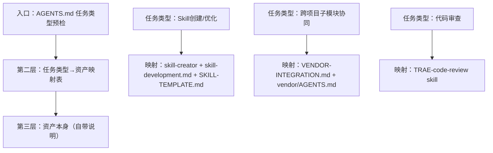

> **提炼自**：[export-suggestions.md 经验教训12/15](../../../reports/project-governance/tools-and-automation/retrospective-forum-posting-skill-optimization-20260629/export-suggestions.md) + vendor/AGENTS.md 实践 —— forum-posting Skill 优化复盘

# 任务类型优先索引模式（Task-Type-First Indexing）

## 模式类型

方法论模式（知识组织/可发现性设计）

## 成熟度

L1 首次提炼（vendor/AGENTS.md 按任务类型索引实践验证）

## 适用场景

组织知识资产索引（规范文档、工具、Skill、脚本、模板等）时，目标是让使用者在启动阶段就能"零摩擦"找到正确的资产，不需要先知道资产叫什么名字、放在哪里。

常见场景：
- 设计启动协议的路由表
- 组织知识库/Skill库的索引
- 设计文档导航结构
- 创建工具/脚本的入口说明

## 问题背景

知识组织最常见的反模式是**按资产类型分类**：
- Skills/ 放所有Skill
- scripts/ 放所有脚本
- rules/ 放所有规则
- docs/ 放所有文档

这种分类方式**对资产管理者友好**（整理的时候知道放哪），但**对使用者不友好**——因为使用者启动任务时的问题是"我要做XX事，需要用什么？"，而不是"我要找一个Skill"。

典型问题：
- 接到"优化Skill"任务，不知道要去vendor/目录找skill-creator方法论
- 只在工作目录是vendor/时才读vendor/AGENTS.md，根目录任务就漏掉vendor资产
- - "就近直觉"：只看眼前目录下的文件，不知道跨边界还有更权威的方法论
- 知道有个东西叫"skill-creator"，但不知道它在哪个目录下

## 核心规则

### 规则 1：按使用场景组织，而非按资产形式组织

索引的第一维度应该是**"任务类型"**（你要做什么），而不是**"资产类型"**（它是什么）。

| 按资产类型组织（反模式） | 按任务类型组织（推荐） |
|------------------------|----------------------|
| 第二章：所有Skill列表 | 如果你要创建/优化Skill → 用skill-creator |
| 第三章：所有脚本列表 | 如果你要做代码审查 → 用TRAE-code-review |
| 第四章：所有规则列表 | 如果你要操作论坛 → 用forum-posting |
| 第五章：vendor资产 | 如果你在vendor/目录工作 → 先读vendor/AGENTS.md |

> **为什么？** 使用者的认知起点是"我要做什么事"，不是"我要找什么类型的文件"。按任务类型索引，匹配的是使用者的思考路径，而不是管理者的整理路径。

### 规则 2：三层路由索引结构

好的任务索引应该包含三层：



1. **入口层**：在最显眼的位置（如AGENTS.md启动协议步骤2.0）放任务类型预检
2. **映射层**：一张大表，"如果任务是X → 你需要读/用Y、Z、W"
3. **资产层**：每个资产自己说明怎么用，不需要索引里重复内容

### 规则 3：跨边界资产必须显式索引

不能假设使用者"会自己找到"其他目录/其他子模块下的资产：
- vendor/下的方法论资产必须在根AGENTS.md中显式索引
- 不能只在vendor/AGENTS.md里写"这里有skill-creator"，根目录的任务类型预检表也必须写"优化Skill → vendor/flexloop/.../skill-creator"
- - "external: 不存在-工作目录在X才读X的AGENTS.md"是错误设计——**资产在哪里不重要，任务类型命中了就必须索引到**

> **为什么？** 这是对抗"就近直觉"认知偏差的结构性机制——使用者不需要"记得"去看其他目录，索引表会直接告诉他。

### 规则 4：模式聚合原则

知识/模式入库时也要遵循任务导向：
- 相关模式聚合在一起，不要碎片化
- 如果几个小模式都是同一个大主题的组成部分，应该整合为一个模式，而不是分成多个独立条目
- 例如：Description SEO和双方案决策树都是Skill五要素模型的一部分，就整合到五要素模型里，不需要单独建3个模式
- 判断标准："使用者做X事的时候，需要同时知道这些吗？"——如果是，就聚合。

### 规则 5：Why解释配套

每个映射条目最好带一句简短的Why解释，说明"为什么做X必须用Y"：
| 任务类型 | 必读资产 | Why |
|---------|---------|-----|
| Skill创建/优化 | vendor/.../skill-creator | Skill开发方法论权威来源，避免凭经验写Skill |
| 跨项目协同 | VENDOR-INTEGRATION.md | 三层路由和边界规范，避免跨子模块混乱 |

> **为什么？** 即使索引是强制性的，解释Why能减少抵触情绪，也帮助使用者在边界情况判断。

## 实施检查清单

设计索引时自问：
- [ ] 索引的第一维度是"你要做什么"（任务类型）吗？
- [ ] 还是"这是什么"（资产类型）？
- [ ] 跨边界资产（如vendor/）是否在主入口显式索引了？
- [ ] 每个映射条目有简短Why解释吗？
- [ ] 使用者不需要先知道资产名字，就能从任务类型找到正确资产吗？
- [ ] 相关模式是否聚合在一起了？有没有不必要的碎片化？
- [ ] 索引表是否放在启动协议的必经路径上？

## 反例警示

| 错误索引方式 | 问题 |
|------------|------|
| 根AGENTS.md只写"如果在vendor/工作，读vendor/AGENTS.md" | 根目录的"优化Skill"任务不会读vendor/AGENTS.md，漏掉vendor方法论资产 |
| 按Skills/Scripts/Rules分类组织文档 | 使用者不知道自己要找的是Skill还是Script，找不到 |
| 索引只写"相关工具：skill-creator"，不说什么时候用 | 使用者不知道"什么情况下我需要skill-creator" |
| 每个小洞察都单独建一个模式文件 | 模式库碎片化，使用者找不到完整的方法论，只见树木不见森林 |
| 索引藏在附录或者不显眼的地方 | 启动协议不经过索引，等于没有索引 |

## 正例

AGENTS.md中的vendor方法论资产表：
```
| 任务类型 | 必读入口 |
|---------|---------|
| Skill 创建/优化/调试 | vendor/.../skill-creator/SKILL.md |
| 跨项目子模块协同 | .agents/VENDOR-INTEGRATION.md |
```
- 第一列是任务类型（你要做什么）
- 第二列直接映射到资产位置
- 放在启动协议步骤2.0，是执行任务的必经路径
- 不要求使用者"记得"去看vendor/目录
- 不管工作目录在哪里，只要任务类型命中，就能找到正确资产

## 与现有模式的关系

- `availability-heuristic-structural-guard.md`：本模式是对抗"就近直觉"认知偏差的具体结构性手段——任务类型索引让正确的资产自动出现在使用者面前，不需要依赖记忆或主动搜索
- `context-recovery-protocol.md`：Context恢复后重新执行启动协议，其中就包括重新走任务类型预检，利用本模式快速重建正确的资产视野
