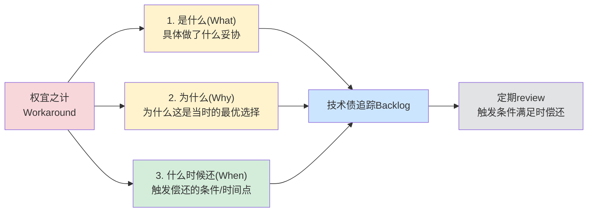

> **提炼自**：[第一性原理知识体系复盘关键洞察](../../../reports/project-reports/retrospective-first-principles-knowledge-system-20260710/supporting-analysis/key-insights.md#INSIGHT-006)

# 权宜之计技术债追踪（Technical Debt Workaround Tracking）

## 模式类型

方法论模式（治理策略/技术债管理）

## 成熟度

L1 实验性（4次验证来源：v1.2 B级案例权宜之计、原子化拆分引入断链问题、外部评审机制空转、v1.4知识图谱专用脚本）

## 适用场景

在时间/资源约束下，不得不采用权宜之计（workaround/临时方案）交付时，管理技术债、防止债务隐形累积。适用于：

| 场景 | 适用度 | 说明 |
|------|--------|------|
| 项目里程碑压力下交付 | ✅✅✅ 核心场景 | deadline前必须上线，来不及做完美方案 |
| MVP/原型验证阶段 | ✅✅✅ 核心场景 | 快速验证假设，允许技术债存在 |
| 紧急问题修复 | ✅✅✅ 核心场景 | 线上事故先止血，后续再根治 |
| 跨团队依赖阻塞时 | ✅✅ 强烈推荐 | 依赖方交付延迟，先做mock/临时适配层 |
| 需求不明确时 | ✅✅ 推荐 | 先做简单方案，需求清晰后再重构 |
| 核心架构设计 | ❌ 不适用 | 基础架构层不能用权宜之计，债务成本太高 |
| 安全/合规相关代码 | ❌ 不适用 | 安全合规没有"临时方案"，必须一次做对 |

## 问题背景

在真实项目中，受时间、资源、信息完整性约束，采用权宜之计是不可避免的——"完美的方案以后做"永远比"不完美的方案现在不做"好。但绝大多数团队对权宜之计的管理存在三个致命问题：

### 问题1：把权宜之计当成"问题的解决"，而不是"问题的延迟和变形"

权宜之计的本质不是"解决了问题"，而是"把问题推迟到未来，并且改变了问题的形态"。几乎所有权宜之计都会带来新的问题，而且这些新问题往往是反直觉的、与初衷相反的。

### 问题2：未记录的权宜之计是双重负债

如果不明确记录"这是权宜之计、为什么用、什么时候还"，权宜之计会被误认为是"已经解决的问题"，人们会在它的基础上继续构建——直到新问题爆发时，需要偿还连本带利的技术债，而且没有人记得这里埋了雷。

### 问题3：权宜之计的反直觉连锁反应

权宜之计带来的新问题往往和初衷完全相反：
- 初衷：减少偏见 → 实际：强化偏见（B级案例问题）
- 初衷：提升质量 → 实际：产生虚假安全感（外部评审空转）
- 初衷：解决可维护性 → 实际：引入新问题（原子化拆分引入断链）
- 初衷：快速交付 → 实际：后续无法复用（专用脚本问题）

这些连锁反应在采用权宜之计的时候是完全看不见的，只有当债务累积到爆发时才会显现。

### 权宜之计连锁反应定律

> **权宜之计几乎都会带来新问题，且新问题常与初衷相反。未记录的权宜之计是双重负债。**

本项目四个验证实例：

| 权宜之计 | 初衷 | 实际带来的新问题 | 与初衷的关系 |
|---------|------|----------------|------------|
| v1.2补充传统行业B级案例 | 减少科技行业案例偏向 | B级案例可信度和深度不足，读者可能误以为"传统行业的第一性原理应用本身就证据不足"，反而强化而非削弱偏见 | **完全相反** |
| v1.5原子化拆分2108行单文件 | 解决大文件可维护性问题 | 引入跨文件断链问题，需要专门提交批量修复 | 带来新问题 |
| v1.6建立外部评审机制框架 | 提升质量保证 | 空转机制造成"已经过外部评审"的虚假安全感，让作者放松自审要求——未执行的机制比没有机制更危险 | **反效果** |
| v1.4知识图谱专用脚本 | 优先交付可用版本 | 专用脚本无法复用，中间所有需要知识图谱的场景都无法复用，直到v1.7才通用化重构 | 带来维护成本 |

## 核心原则：权宜之计三要素记录法

采用权宜之计不是问题——**不记录、不追踪、不偿还**才是问题。每个权宜之计必须明确记录三个要素：



### 要素1：是什么（What）——明确妥协的具体内容

不要模糊地写"这里做了临时方案"，要具体写清楚：
- 具体在哪些地方做了妥协？（文件/模块/代码段）
- 正确的/理想的方案应该是什么样的？
- 当前方案有哪些已知的局限和问题？

**坏例子**："这里做了临时处理，后面再优化"
**好例子**："`scripts/kg-builder.py` 是专用脚本，硬编码了节点类型和关系类型；理想方案是配置与代码分离，支持自定义节点类型；当前局限：新增节点类型需要改代码，无法复用到其他知识库。"

### 要素2：为什么（Why）——记录当时的决策背景

为什么这是当时的最优选择？记录：
- 时间/资源约束是什么？（deadline？人力？）
- 当时有哪些可选方案？为什么选了这个？
- 如果不做这个权宜之计，代价是什么？

记录"为什么"的重要性：
1. 避免后面的人"这什么垃圾代码，谁写的"——理解当时的约束
2. 避免在约束还存在的时候盲目"优化"，反而破坏交付
3. 当约束解除时（时间充裕了、需求清晰了），可以及时识别这是可以偿还的债务

### 要素3：什么时候还（When）——明确偿还触发条件

不要写"后面有空再改"——"后面"永远不会来。要写具体的触发条件：
- 时间触发："v1.7版本必须重构"
- 事件触发："当需要第二个知识图谱场景时，必须通用化"
- 指标触发："当这个模块的bug数≥3个时，必须重构"
- 成本触发："当维护这个临时方案的时间超过重构时间的2倍时，立即重构"

触发条件必须是可观测、可验证的，不能是主观的"有空"。

## 风险预判检查清单

采用权宜之计前，先问5个问题，预判连锁反应：

| 检查项 | 说明 |
|--------|------|
| 1. **反效果检查** | 这个方案有没有可能产生和初衷完全相反的效果？（如：想减少偏见反而强化偏见） |
| 2. **依赖检查** | 未来的代码/内容会不会在这个权宜之计的基础上构建？如果会，必须把接口设计成未来可替换的 |
| 3. **虚假安全感检查** | 这个方案会不会让人误以为"问题已经解决了"，从而放松警惕？如果会，必须加上醒目的警告标识 |
| 4. **偿还成本递增检查** | 这个债务每放一个月，偿还成本会增加多少？如果成本递增很快，要把偿还时间点设得更近 |
| 5. **"没有方案"反事实检查** | 如果现在不做这个权宜之计（完全不解决这个问题），后果是什么？如果后果可以接受，宁可不做也不要做有反效果的权宜之计 |

## 核心规则

### 规则1："完美是好的敌人"≠"不记录是可接受的"

追求完美导致不作为是错误的，但以此为借口不记录技术债也是错误的：
- ✅ 正确：接受"不完美的方案现在做"，但明确记录这是债务、什么时候还
- ❌ 错误1：追求完美，迟迟不交付
- ❌ 错误2："先做了再说"，不记录、不追踪，假装没有债务

### 规则2：权宜之计的代码/文档必须加上醒目标记

代码注释、文档开头必须加上醒目的标记，避免后面的人误以为这是"正确方案"：

```python
# ==============================================
# WARNING: 这是权宜之计(Workaround)
# What: 硬编码节点类型，不支持自定义配置
# Why: v1.4需要快速交付可用版本，来不及做通用化
# When: 需要第二个知识图谱场景时，必须重构为配置驱动
# ==============================================
```

或者在文档开头加警告块，明确说明这部分内容的局限性。

### 规则3：空转机制比没有机制更危险——不要建立你不打算执行的流程

如果建立了一个质量保证机制（外部评审、Code Review流程、检查清单），但实际上不打算真正执行它，那么**不要建立这个机制**。

因为：
- 没有机制：大家知道需要自己把关，会保持警惕
- 空转机制：大家以为"已经过了XX机制"，放松警惕，反而更容易出问题

如果暂时没有资源执行完整机制：
- ✅ 正确：明确说明"本版本仅执行层1检查，层2/3检查暂不执行，请勿放松自审"
- ❌ 错误：建立完整的三层审查框架，但实际只跑层1，让大家以为已经过了三层审查

### 规则4：定期技术债回顾——每个迭代留20%时间还债

不要等到技术债爆发才偿还：
- 每个迭代/版本规划时，留15-20%的时间专门偿还技术债
- 回顾所有标记为"权宜之计"的项，检查触发条件是否满足
- 偿还时优先偿还"反效果风险高"和"偿还成本递增快"的债务

### 规则5：权宜之计的接口必须面向未来设计

即使内部实现是临时的，对外暴露的接口/格式必须设计成未来重构时不需要修改调用方：
- 内部可以硬编码，但API/数据格式要和未来通用方案一致
- 这样未来重构时只需要改内部实现，不需要改所有依赖方

## 反模式

| 反模式 | 为什么错误 | 正确做法 |
|--------|----------|---------|
| "先做了再说，后面再改" | "后面"永远不会来，债务会越积越多 | 采用权宜之计的同时就记录三要素，设置明确的偿还触发条件 |
| 权宜之计不做标记 | 后面的人不知道这是临时方案，会在上面继续构建 | 代码/文档加醒目的WARNING标记，明确说明是权宜之计 |
| 建立空转的质量机制 | 未执行的机制产生虚假安全感，比没有机制更危险 | 要么真正执行，要么明确说明"本版本暂不执行该机制"，不要假装执行了 |
| 为了"快速交付"在核心架构上作权宜之计 | 架构层的债务偿还成本是指数级的，会拖垮整个项目 | 核心架构、安全、合规层没有权宜之计，必须一次做对 |
| 偿还技术债时追求"一步到位完美重构" | 完美主义导致技术债永远还不完，反而累积更多 | 每次偿还一部分，持续迭代，和新功能开发平衡推进 |
| 把权宜之计的责任推给"当时写的人" | 权宜之计是约束下的理性选择，追责只会导致大家以后不记录债务 | 对事不对人，专注于"现在触发条件满足了吗？怎么偿还？" |

## 实际案例

### 案例1：v1.4知识图谱专用脚本→v1.7通用化重构

| 阶段 | 做法 | 问题 |
|------|------|------|
| v1.4（权宜之计） | 为了快速交付，写了专用脚本，硬编码所有节点类型和关系类型 | 符合MVP原则，但没有记录为技术债 |
| v1.4-v1.6 | 其他场景需要知识图谱时，发现专用脚本无法复用，但没有人记得"这是临时方案" | 每个场景都写一次专用脚本，重复代码，维护成本高 |
| v1.7（偿还） | 需要第三个知识图谱场景时，终于触发了重构阈值，重构为配置驱动架构（决策11） | 重构花了额外时间，但如果v1.4就记录了触发条件"需要第二个场景时重构"，可以少走很多弯路 |

教训：如果v1.4就明确记录"当需要第二个知识图谱场景时必须通用化"，v1.5就可以重构，避免v1.6的重复工作。

### 案例2：外部评审机制空转问题

| 阶段 | 做法 | 反效果 |
|------|------|--------|
| v1.6 | 建立了外部评审框架，写在流程文档里，但实际上没有资源真正执行 | 作者自己写文档时，想到"已经有外部评审机制了"，反而放松了自审要求 |
| 复盘发现 | 对比v1.6和v1.5的内容质量，发现v1.6的自审严格度反而下降 | 未执行的机制比没有机制更危险——虚假安全感 |
| 修正 | v1.7明确区分"本版本实际执行的检查"和"未来计划的机制"，不把未执行的机制写在流程里给人虚假预期 | 自审严格度恢复，内容质量回升 |

## 与其他模式的关系

| 关联模式 | 关系类型 | 关系说明 |
|---------|---------|---------|
| [mvp-unvalidated-code-debt.md](mvp-unvalidated-code-debt.md) | 概念关联 | MVP未验证代码是技术债的一种，本模式提供通用的权宜之计追踪框架 |
| [immutable-constraint-documentation.md](immutable-constraint-documentation.md) | 记录方法 | 不可变约束文档化也适用于权宜之计——把"这是临时方案"作为明确的约束记录下来 |
| [phased-rollout-validation.md](phased-rollout-validation.md) | 方法论互补 | 渐进式推广可以降低权宜之计的影响范围，出问题时回滚成本更低 |
| [nonlinear-correction-cost.md](nonlinear-correction-cost.md) | 理论基础 | 非线性修复成本解释了为什么技术债放得越久还得越贵——必须设置明确的偿还时间点 |
| [exemption-mechanism-legalization.md](exemption-mechanism-legalization.md) | 机制互补 | 豁免机制合法化是权宜之计的治理框架——允许例外，但必须显式记录和追踪 |

## Changelog

- 2026-07-13 | create | 初始版本，从第一性原理知识体系复盘关键洞察006沉淀，L1成熟度，4次验证实例
