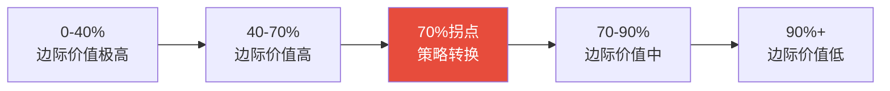

# 测试覆盖率边际收益递减拐点

## 模式概述

测试覆盖率提升过程中存在清晰的边际收益递减规律：从0%到70%投入产出比极高，70%到90%难度急剧上升但发现的问题价值下降，90%以上投入产出比极低。在70%拐点附近，应从"追求覆盖率数字"转向"关注关键路径测试质量"。

## 边际收益递减模型

| 覆盖率区间 | 提升难度 | 发现的问题类型 | 边际价值 | 策略 |
|-----------|---------|--------------|---------|------|
| 0% → 40% | 低 | happy path核心功能 | 极高 | 优先覆盖核心路径 |
| 40% → 70% | 中 | mock数据不匹配、返回值类型不一致、集成问题 | 高 | 补充边界条件和集成测试 |
| 70% → 90% | 高 | 错误处理分支、边界条件、输出格式 | 中 | 按风险选择性补充 |
| 90%+ | 极高 | 防御性代码、罕见错误路径、平台特定分支 | 低 | 仅覆盖关键防御性代码 |



## 问题现象

测试覆盖率追求中的常见误区：

| 误区 | 表现 | 后果 |
|------|------|------|
| 唯数字论 | 追求100%覆盖率 | 大量低价值测试，维护成本高 |
| 拐点前停止 | 70%就认为"够了" | 关键错误处理分支未覆盖 |
| 拐点后强攻 | 90%→100%投入大量精力 | 投入产出比极低，挤占其他改进时间 |
| 忽视测试质量 | 高覆盖率但测试断言弱 | 覆盖率虚高，实际防护力不足 |

## 解决方案

### 1. 识别拐点信号

当出现以下信号时，说明已接近边际收益递减拐点：

- 新增测试发现的**实际问题数量下降**（不是覆盖率增长放缓）
- 未覆盖代码集中在**错误处理分支**和**防御性代码**
- 提升1%覆盖率所需的**测试用例数是之前的3倍+**
- 未覆盖代码主要是**Rich输出格式**、**日志格式**等非核心逻辑

### 2. 分阶段策略

**阶段一（0%→70%）：广度优先**
- 覆盖所有 happy path
- 补充主要错误处理分支
- 集成测试覆盖关键工作流
- 目标：快速建立安全网

**阶段二（70%拐点）：策略转换**
- 从"追求覆盖率"转向"追求测试质量"
- 评估每个未覆盖分支的**实际风险**
- 对高风险路径补充**深度测试**（多场景、多边界）
- 对低风险路径（如日志格式）**有意放弃**

**阶段三（70%→90%）：风险驱动**
- 仅补充**有实际bug风险**的未覆盖代码
- 重点关注：外部输入处理、权限校验、状态转换
- 跳过：纯展示逻辑、不可能到达的防御性代码

### 3. 测试质量评估标准

覆盖率拐点后，用以下标准评估测试质量（而非覆盖率）：

| 维度 | 问题 | 评估方法 |
|------|------|---------|
| 断言强度 | 测试是否真正验证了行为？ | 检查断言数量和深度 |
| 场景覆盖 | 是否覆盖了关键边界场景？ | 列举关键场景清单核对 |
| 变异测试 | 删除被测代码测试是否失败？ | 手动变异关键逻辑 |
| 回归价值 | 历史bug是否有对应测试？ | bug→test 映射检查 |

## 适用场景

- **新项目测试体系建设**：规划覆盖率目标和投入策略
- **现有测试体系评估**：判断是否处于拐点，调整策略
- **技术债优先级排序**：测试覆盖率提升 vs 其他改进的优先级
- **团队资源分配**：测试投入的边际收益评估

## 实际案例

### 案例1：llvm-dev 工具链测试覆盖率提升（首次验证）

覆盖率从 58% → 69% → 77% 的提升过程：

| 区间 | 难度 | 发现的问题 | 边际价值 |
|------|------|-----------|---------|
| 58% → 69% | 中 | mock数据不匹配、返回值类型不一致 | 高 |
| 69% → 77% | 中高 | 权限校验分支、用户身份映射bug | 高 |
| 77% → 90%（预估） | 高 | Rich输出格式、日志格式、防御性代码 | 中-低 |

**拐点判断**：77%处于边际收益递减拐点，剩余未覆盖代码主要为：
- `cli/main.py` 的 Rich Console 输出格式分支
- `utils/workflow_steps.py` 的第135行
- `utils/verification.py` 的第152行
- 未进行单元测试的 `workflows/dev_env_workflow.py`

**策略转换**：此时更应关注关键路径测试的质量，而非数字上的覆盖率。

## 反模式

### 反模式1：唯数字论
```
目标：100%覆盖率 → 为每行代码写测试 → 大量测试仅断言"不报错"
```
结果：覆盖率虚高，但测试防护力不足，回归bug仍然逃逸。

### 反模式2：拐点前停止
```
覆盖率达到50% → 认为差不多了 → 停止补充测试
```
结果：关键错误处理分支未覆盖，生产环境暴露边界bug。

### 反模式3：拐点后强攻
```
覆盖率77% → 强行提升到95% → 投入2周写低价值测试
```
结果：投入产出比极低，挤占了本可用于功能开发或基础设施优化的时间。

## 与其他模式的关系

- **与 governance-tier-priority 配合**：治理层级优先级提供"防复发→提效率→拓边界"框架，测试覆盖率属于"防复发"层
- **与 bottleneck-first-refactoring 互补**：瓶颈优先法确定"改什么"，本模式确定"测试投入多少"
- **与 toolchain-five-stage-evolution 衔接**：测试体系是阶段3的核心，本模式指导阶段3的投入策略

## 边界与选型

本模式适用于**有测试覆盖率度量工具的项目**。判断信号：
- ✅ 项目已有测试体系，覆盖率可度量
- ✅ 团队在讨论"要不要继续提升覆盖率"
- ✅ 覆盖率在50%-90%之间，需要决策投入策略
- ❌ 无测试的项目（应先从0%→40%，本模式不适用）
- ❌ 安全关键系统（要求100%覆盖率，不适用边际收益分析）
- ❌ 纯前端展示项目（测试策略不同）
