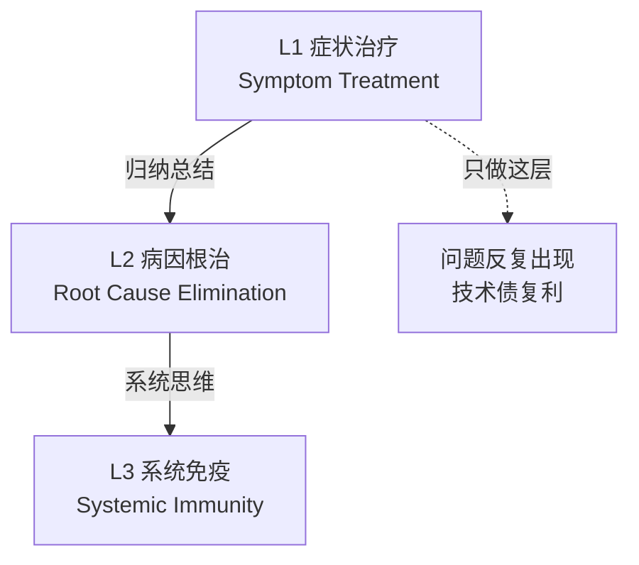

# 问题解决三层跃迁范式（Three-Level Problem Solving Paradigm）

## 模式类型
方法论模式

## 成熟度
L1 实验性（1次案例：断链修复从手动14个到系统免疫）

## 适用场景
面对重复性问题、系统性故障、技术债治理时，评估当前解决层级并规划跃迁路径。

## 问题背景

大多数人面对问题时停留在"修复症状"层面，导致同样的问题反复出现，总工作量不减反增。优秀的工程师能做到"消除病因"，但只有架构师/治理者会思考"建立免疫"。

## 核心模型

问题解决有三个层级，每向上跃迁一层，问题的复发概率呈数量级下降：

| 层级 | 行为特征 | 思维模式 | 复发概率 | 典型行动 |
|------|---------|---------|---------|---------|
| **L1 症状治疗** | 发现问题→手动修复 | 被动响应 | 高（同类问题必然再发） | 手动改14个断链、逐个修bug、临时打补丁 |
| **L2 病因根治** | 分析模式→写出通用解法 | 归纳总结 | 低（同类问题不再需要手动处理） | 写自动修复算法、重构消除根因、写通用脚本 |
| **L3 系统免疫** | 建立防线→让问题不可能发生 | 系统思维 | 接近零（从流程/架构层面阻断问题入口） | CI门禁拦截、操作工具链自动处理、事前影响评估 |

## 跃迁判断口诀

遇到问题时，问自己三个问题：

1. **L1**：如果只修这个症状，同类问题下次还会出现吗？→ 会，所以必须做到L2
2. **L2**：如果只有自动修复，新的同类问题还是会流入主干吗？→ 会，所以必须做到L3
3. **L3**：建立什么防线可以让这类问题根本不可能进入系统？

## 跃迁路径示例

断链修复的跃迁路径：
- L1：手动修复14个断链 → 下次原子化还会产生新断链
- L2：`try_adjust_relative_depth`算法自动修复 → 不需要手动算层级，但新断链还是会进入仓库
- L3：CI门禁（check-links阻断断链提交）+ finalize-atomization（操作时自动修链接）+ build-ref-index（事前评估影响面）→ 断链几乎不可能大规模出现

## 三层与治理优先级的关系

本模式与 `governance-tier-priority.md`（防复发→提效率→拓边界）互补：
- 三层跃迁是**分析框架**：判断你在哪一层
- 治理优先级是**行动指南**：决定先做什么
- L3系统免疫 = 🔴高优先级（防复发）
- L2病因根治 = 🟡中优先级（提效率）
- L1症状治疗 = 🟢低优先级（只能作为应急，不能作为长期策略）

## 检查清单

- [ ] 当前问题处理停留在L1还是已经跃迁到L2/L3？
- [ ] 如果只做L1，同类问题的复发频率是多少？累计成本是多少？
- [ ] L2的通用解法是否覆盖了所有已知场景？
- [ ] L3的防线是否建立？（CI门禁/自动处理/事前评估）
- [ ] 是否有度量指标证明L3防线有效？（如CI拦截次数）

## 反例警示

| 陷阱 | 后果 |
|------|------|
| 以L1的速度为荣（"我修bug很快"） | 修得越快，产生得越多，总工作量上升 |
| 停在L2认为"自动化了就够了" | 新问题仍持续流入，只是修得更快了 |
| 跳过L2直接做L3 | 没有L2的通用解法，L3防线缺乏基础 |
| L3防线没有度量 | 不知道防线是否有效，可能形同虚设 |
