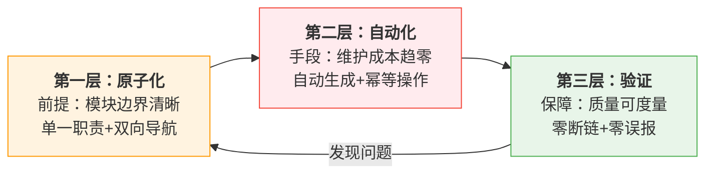

# 三层治理模型：原子化→自动化→验证

## 模式类型
治理策略模式

## 成熟度
**L3 标准化**（150+自动化脚本验证 + SpecWeave 13天793次提交大规模实践验证）

## 量化验证结论
- **脚本规模**：150+ Python自动化脚本形成完整防护网，全部零第三方依赖
- **跨平台验证**：Windows/macOS/Linux三平台即用，无环境依赖
- **治理覆盖**：原子化拆分→导航自动生成→链接验证→提交检查全链路覆盖
- **质量门禁**：pre-commit/CI集成，问题在提交前被拦截

## 待跨场景验证项
- [ ] 在团队规模>10人的多人协作场景中验证
- [ ] 在非文档类项目（纯代码项目、产品项目）中验证
- [ ] 验证治理层级膨胀的边界——多少层后治理本身成为负担

## 模型概述
文档治理的三层递进模型，三层之间存在严格的依赖关系，必须同时存在才能形成闭环。本模型是治理三阶段（修复→预防→闭环）在工程实践中的具体落地架构。

## 第一层：原子化（前提）
- **目标**：将大型文档拆分为独立模块，建立清晰的模块边界
- **方法**：按主题拆分，每文件单一职责，保持文件大小限制（L0<100行、L1<500行）
- **输出**：独立可引用的 .md 文件，每个文件自包含frontmatter元数据
- **验证标准**：每个文件可被独立理解，无需阅读其他文件；双向导航链完整（prev/next/目录）

## 第二层：自动化（手段）
- **目标**：消除手动维护，通过脚本自动生成和维护
- **方法**：导航表自动生成（docgen）、路径迁移（finalize-atomization）、链接自动修复
- **关键**：使用 HTML 注释标记（<!-- NAV_TABLE_START -->）定位更新区域，幂等执行
- **验证标准**：文档新增/移动/删除后，运行自动化脚本即可完成同步；人工只做决策，不做机械重复操作

## 第三层：验证（保障）
- **目标**：保证链接正确性和内容完整性
- **方法**：链接检查器（check-links.py）、规格一致性检查（check-spec-consistency.py）、Mermaid检查（check-mermaid.py）、模式成熟度追踪
- **关键**：验证必须覆盖所有本地引用，支持模板占位符过滤，零误报原则
- **验证标准**：零断链，零误报，检查脚本自生验证通过

## 依赖关系

## 与治理三阶段的映射

| 治理三阶段 | 三层治理模型 | 核心动作 |
|-----------|-------------|---------|
| 修复（Fix） | 原子化 | 拆分大文档、修复断链、解决当前问题 |
| 预防（Prevent） | 自动化 | 自动生成导航、自动修复路径、消除手动操作 |
| 闭环（Close） | 验证 | 持续检查、门禁拦截、质量度量 |

## 支撑证据（SpecWeave实践）

### 第一层原子化验证
- 2773+核心文件全部原子化，单文件职责清晰
- 59个Wiki教程全部遵循原子化规范
- 234个方法论模式每个独立文件，可单独引用

### 第二层自动化验证
- docgen-cmd：导航表和执行看板自动生成
- finalize-atomization：原子化收尾一键完成（断链修复+导航更新+看板刷新）
- 所有150+脚本遵循零依赖原则，跨平台即用

### 第三层验证验证
- check-links.py：链接有效性全量扫描
- check-mermaid.py：Mermaid语法安全检查
- check-duplication.py：跨文件重复代码检测
- ci-check-cmd：8项检查流水线一键执行

## 实施检查清单
- [ ] Layer 1：所有文档已原子化，L0入口<100行、L1门面<500行，双向导航链完整
- [ ] Layer 2：导航表自动生成脚本就绪，文件移动工具就绪，幂等执行可重复
- [ ] Layer 3：链接检查器覆盖所有 .md 文件，CI/pre-commit集成就绪，零误报
- [ ] 三层形成闭环：验证发现问题→原子化调整→自动化同步→重新验证

## 关联模式
- [governance-three-stage-evolution.md](governance-three-stage-evolution.md)：治理演化三阶段是本模型的理论基础
- [fix-prevent-close-loop.md](../../../../../rules/fix-prevent-close-loop.md)：Bug修复闭环SOP
- [dry-run-first.md](../tools-automation/dry-run-first.md)：自动化修改dry-run安全原则
- [spec-as-code-automated-gates.md](../tools-automation/spec-as-code-automated-gates.md)：规范即代码自动化门禁
- [toolchain-maturity.md](toolchain-five-stage-evolution.md)：工具链五阶段成熟度模型
