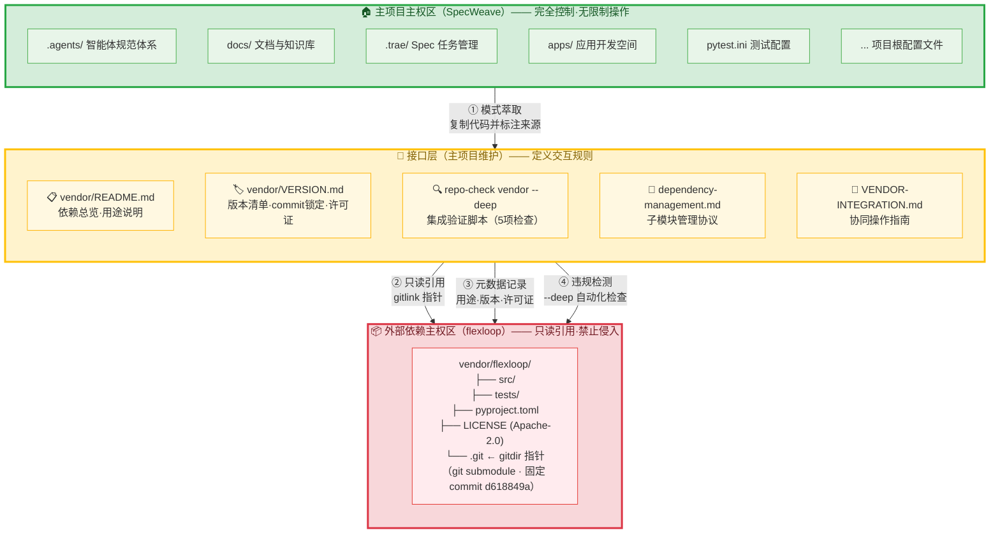
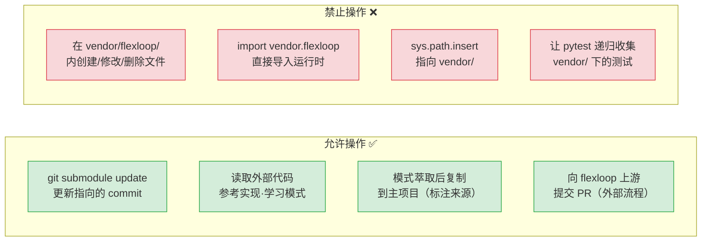
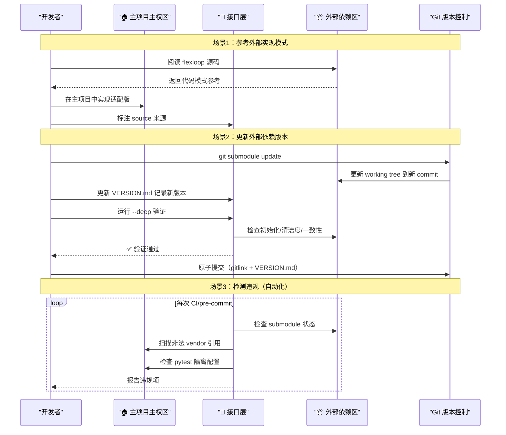

# 三区域边界模型：外部代码依赖的主权划分

## 模式类型
治理策略模式

## 成熟度
L2 已验证（flexloop vendor集成 + SpecWeave四不原则+零依赖原则落地验证）

## 模型概述

管理外部代码依赖（git submodule、vendored library 等）时，将文件系统划分为三个主权区域，每个区域有明确的权责和操作规则，确保主项目与外部代码库在保持独立的前提下高效协同。

## 区域划分

### 架构总览

### 权限边界矩阵

### 代码流向与数据流

### 区域 1：主项目主权区（🏠 完全控制）
- **范围**：`.agents/`、`docs/`、`.trae/`、`apps/`、项目根配置文件等
- **规则**：完全自主控制，可以任意创建、修改、删除
- **操作权限**：无限制

### 区域 2：接口层（🔌 主项目维护）
- **范围**：`vendor/README.md`、`vendor/VERSION.md`、验证脚本、协议文档、测试配置
- **规则**：由主项目维护，定义主项目如何与外部依赖交互
- **关键约束**：接口层文件必须**位于外部依赖目录之外**
- **操作权限**：可以创建、修改，但必须记录变更原因

### 区域 3：外部依赖主权区（📦 只读引用）
- **范围**：`vendor/flexloop/` 等 git submodule 目录、手动管理库的 vendor 子目录
- **规则**：视为只读，不做任何侵入式创建或修改
- **关键约束**：
  - 不在外部目录内创建主项目维护的文件
  - 不直接 import 外部代码到运行时
  - 不手动修改外部目录内容（修改应通过 submodule update 或上游 PR）
- **操作权限**：仅通过 git submodule 命令更新指向的 commit

## 交互规则

| 交互类型 | 正确做法 | 错误做法 |
|---------|---------|---------|
| 引用代码 | 通过模式萃取复制到主项目，标注来源 | `import vendor.flexloop.xxx` 或 `sys.path.insert` |
| 更新版本 | `git submodule update` 后更新 VERSION.md | 手动修改外部目录文件 |
| 元数据管理 | 在 vendor/ 根级 README.md/VERSION.md 记录 | 在外部目录内创建 README.md |
| 测试隔离 | pytest.ini norecursedirs 排除 vendor/ | 让 pytest 递归收集 vendor/ 下的测试 |
| 添加元信息 | 接口层文档记录用途、许可证、来源 | 修改外部仓库的 LICENSE 或元数据文件 |

## 实施检查清单

- [ ] 外部依赖通过 git submodule（gitlink）或明确协议管理
- [ ] 主项目元数据（版本、用途、许可证）存放在外部目录之外
- [ ] 验证脚本覆盖：初始化状态、工作树清洁度、元数据一致性、非法引用
- [ ] 测试配置排除外部依赖目录
- [ ] 项目中无 `sys.path.insert/append` 指向 vendor/ 的代码
- [ ] 项目中无 `import vendor.` 或 `from vendor.` 的 import 语句

## 适用场景

- Git submodule 管理外部框架/参考实现
- Vendored library（复制到 vendor/ 但不修改的第三方库）
- 多个独立代码库之间的引用协同

> 来源：establish-vendor-collaboration-framework spec 实践
> 关联：[VENDOR-INTEGRATION.md](../../../../knowledge/VENDOR-INTEGRATION.md)、[外部依赖四不原则](four-negatives-external-dependency.md)
