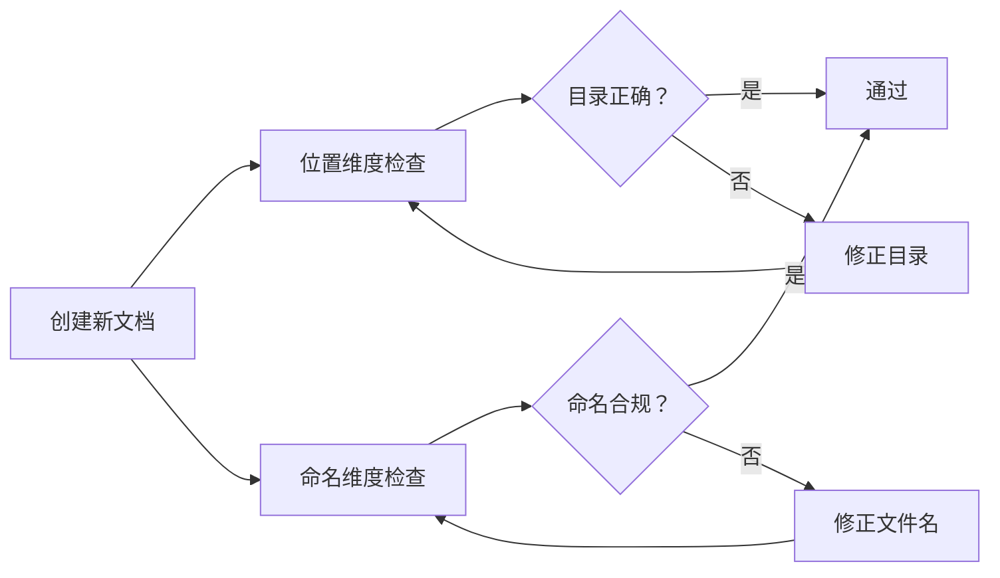

> **来源**：从 TuyaOpen 学习报告优化任务规律2拆分

# 文档治理双维度检查模型（Two-Dimension Document Governance Model）

## 模式类型
方法论模式 → 治理策略

## 成熟度
L2 已验证（基于 TuyaOpen 学习报告优化任务实践验证）

## 适用场景
- 创建新文档时的合规检查
- 文档重构和迁移
- CI/CD 流程中的文档检查
- 文档归档和整理

## 问题背景

单一违规可能是偶然疏忽，双重违规必然是流程漏洞。创建新文档时缺乏系统性的检查流程，容易同时违反文件放置规范和文件名命名规范。

## 核心模型

创建新文档时必须同时检查两个维度——位置维度和命名维度。

### 维度一：位置维度
- **检查项**：文件放置目录
- **合规标准**：文件必须放在 `docs/knowledge/` 下的正确分类目录（如 `learning/`、`operations/`、`troubleshooting/`）
- **验证工具**：查阅 `docs/knowledge/README.md` 确定归属目录

### 维度二：命名维度
- **检查项**：文件名称格式
- **合规标准**：kebab-case、纯英文、无中文、无空格
- **验证工具**：运行 `check-filename-convention.py`

## 检查维度表

| 检查维度 | 检查项 | 合规标准 | 验证工具 |
|---------|--------|---------|---------|
| 位置维度 | 文件放置目录 | 是否在 docs/knowledge/ 下的正确分类目录 | 查阅 docs/knowledge/README.md |
| 命名维度 | 文件名称格式 | kebab-case、纯英文、无中文、无空格 | check-filename-convention.py |

## 双重违规判断标准

| 情况 | 位置维度 | 命名维度 | 判定 |
|------|---------|---------|------|
| 正常 | ✅ | ✅ | 通过 |
| 单一违规 | ❌ | ✅ | 可能是偶然疏忽 |
| 单一违规 | ✅ | ❌ | 可能是偶然疏忽 |
| 双重违规 | ❌ | ❌ | **流程漏洞**，需要检查创建流程 |

## 实施检查清单

- [ ] 位置维度：文件是否放在知识分类体系定义的对应目录下？
- [ ] 位置维度：目录是否符合项目约定的分类结构？
- [ ] 命名维度：文件名是否使用 kebab-case？
- [ ] 命名维度：文件名是否为纯英文？
- [ ] 命名维度：文件名是否通过 check-filename-convention.py 检查？
- [ ] 双重违规：是否同时违反两个维度？如果是，需要检查创建流程

## 价值

- **全面检查**：确保文档在位置和命名两个维度都符合规范
- **问题定位**：双重违规可以快速定位流程漏洞
- **流程改进**：基于检查结果优化文件创建流程
- **一致性保障**：确保所有文档符合统一的分类和命名规范

## 失败案例与边界强化（V2）

### 失败案例

| 案例 | 失败表现 | 根因 | 教训 |
|------|---------|------|------|
| MopMonk 任务双维度全过但仍返工（2026-07-04，本模式真实漏检事故） | MopMonk Wiki 文件位置正确（位置维度✅）、文件名合规（命名维度✅），但 frontmatter 用了 TOML（+++）而非项目统一的 YAML（---），仍返工约 8 分钟 | 双维度检查模型的维度覆盖不全：格式维度不在检查范围内，"两维度都过"被误当成"文档合规" | 双维度模型只保证"已覆盖维度"的合规，不保证整体合规；维度集合必须按错误类型持续扩展（催生了 wiki-pre-creation-three-checks 的三查流程） |

### 反目标用户/反目标场景

| 反目标用户/场景 | 不适用原因 | 适配策略 |
|----------------|-----------|---------|
| 代码文件创建 | 命名规范（snake_case/kebab-case 因语言而异）与文档不同，维度标准不通用 | 中度：切换到对应语言的命名规范作为第二维度 |
| 已采用更全面检查体系（file-creation-precheck 四步/三查流程）的场景 | 双维度是其子集，重复检查无增量收益 | 轻度：作为四步流程内的两个检查项存在，不独立执行 |
| 单维度即可自动判定的 CI 流水线 | 流水线按规则逐条判定，无需"双维度关联推断" | 不适用：直接跑脚本检查 |
| 样本量极小时推断"流程漏洞" | 一次双重违规也可能是两次独立偶然叠加，归因过早 | 中度：双重违规先记录，同类复发才升级为流程审查 |
| 非知识库文件（.temp 临时产物等） | 位置与命名维度的合规标准均不适用 | 不适用：走 file-creation-precheck 第零步判断 |

### 早期预警信号

| 预警信号 | 含义 | 应对 |
|---------|------|------|
| 同类违规在多次任务中重复出现 | 检查模型维度覆盖或执行率有问题 | 扩展维度或强化卡点 |
| 双重违规出现但无法定位到具体流程环节 | 归因链条断裂 | 补充执行记录（谁在哪个步骤创建） |
| 验证工具（check-filename-convention.py 等）长期未运行 | 双维度检查被形式化 | 将脚本运行纳入提交前钩子 |
| 出现第三类高频错误（如 frontmatter 格式） | 维度集合过时的信号 | 评估新增维度，考虑升级为三查流程 |
| 位置与命名维度结果长期全部✅ | 检查可能未覆盖新文件类型 | 抽样核对✅结论的真实性 |

### 适用前提

- 检查对象为需要纳入知识体系的正式文档；临时产物与代码文件不适用
- 存在权威的分类索引（docs/knowledge/README.md）与命名规范文档可供两维度对照
- 配套验证脚本可用且实际被执行（模型依赖工具验证而非肉眼）
- "双重违规→流程漏洞"的推断需要多次样本支持，单次事件仅作记录

## 关联资源

- [文件命名规范](../../../../../rules/file-naming-convention.md)
- [文件名检查脚本](../../../../../scripts/check-filename-convention.py)
- [知识库入口](../../../../../../docs/knowledge/README.md)
- [文件创建前置检查模式](file-creation-precheck-pattern.md)