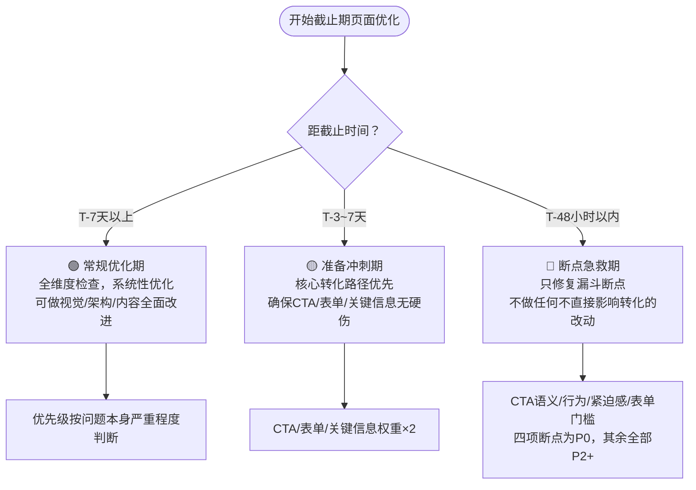
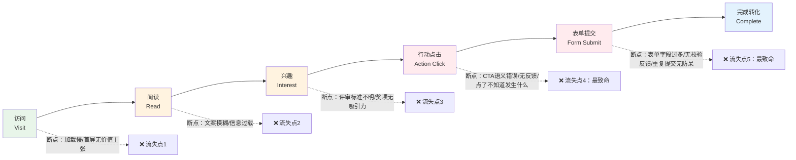
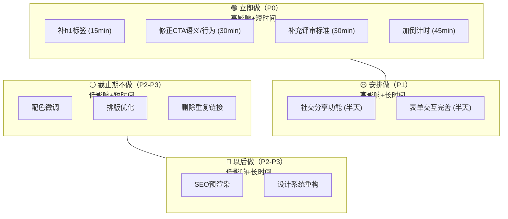

> **提炼自**：秒悟（Meoo）产品启航赛活动落地页七维度分析（2026-07-14，投稿截止前2天）——在时间紧迫条件下识别4项P0级转化断点
> **⚠️ 成熟度声明**：L1-draft，基于单案例提炼，尚未经第二案例验证。在新场景应用时需注意适用性验证，欢迎补充验证案例。

# 时效断点优先（Deadline Breakpoint First）

## 模式类型
方法论模式（产品增长 / 落地页分析与优化）

## 成熟度
L1-draft（单案例，待验证）

## 触发场景

| 场景 | 是否适用 | 说明 |
|------|---------|------|
| 活动/赛事落地页截止前优化 | ✅ 核心场景 | 投稿截止、报名截止、活动结束前的紧急优化 |
| 限时促销/闪购页面优化 | ✅ 核心场景 | 促销倒计时阶段的转化率急救 |
| 产品发布会/注册页倒计时阶段 | ✅ 适用 | 发布会前、产品上线前的落地页优化 |
| 常规产品页/官网日常优化 | ⚠️ 部分适用 | 无明确截止日时，"时效"维度权重降低，断点分析仍适用 |
| 长期存在的常绿页面（Evergreen） | ❌ 不适用 | 无截止时间压力时，应使用系统化全维度优化而非断点急救 |
| 页面从零开始设计 | ❌ 不适用 | 本模式是分析/优化方法论，不是设计方法论；设计阶段请用 [multi-touchpoint-aida-conversion.md](multi-touchpoint-aida-conversion.md) |

## 问题背景

截止期临近时优化转化页面，最容易犯两个错误：

1. **静态优先级，忽略时间维度**：用同一套检查清单评估页面，不管距离截止还有2天还是2个月。"倒计时紧迫感"这类元素在活动初期是锦上添花（P2），但在截止前48小时是致命缺失（P0）。
2. **平均用力，忽略断点**：按检查清单逐项优化，花时间调整配色、排版、配图等表面问题，却放过了CTA按钮语义错误、评审标准缺失、表单行为不明确等直接导致用户放弃的断点。

**核心洞察**：截止期页面优化不是"把页面做得更完美"，而是"找到漏斗上正在大量漏水的洞，用最少的时间堵住最大的漏洞"。

---

## 核心做法

### 一、时间敏感度校准（第一步）

在开始分析前，先确定当前所处的时间窗口，据此动态调整问题优先级：

**时间窗口的关键变量**：

| 时间窗口 | 紧迫感元素优先级 | 可优化范围 | 典型P0问题 |
|---------|----------------|-----------|-----------|
| T-7天+ | P3（低） | 全维度 | 取决于页面本身问题 |
| T-3~7天 | P1（中） | 转化路径+核心内容 | 评审标准缺失、CTA位置不合理 |
| T-48小时内 | P0（最高） | 仅4项断点 | 无倒计时、CTA行为不明确、关键规则缺失、表单门槛过高 |

### 二、漏斗断点追踪（第二步）

沿用户旅程逐段排查断点，而非按维度平均检查：

**四大末端断点**（截止期最优先检查）：

| 断点位置 | 检查项 | 典型问题 | 影响 |
|---------|--------|---------|------|
| CTA按钮语义 | 是否用正确的HTML元素？文案是否明确告知点击后会发生什么？ | `<a href="#">` 当button用；文案"立即投稿"但点了不知道去哪 | 用户不敢点，或点后困惑直接离开 |
| CTA行为反馈 | 点击后是否有即时反馈？弹窗/跳转/滚动是否符合预期？ | 点击无反应、弹窗无关闭提示、加载无状态 | 点击后无反馈，用户以为坏了 |
| 紧迫感营造 | 截止前是否有明确倒计时？是否在多个位置强调？ | 截止前2天无任何倒计时/提醒 | 用户觉得"还有时间"，拖延直到忘记 |
| 决策关键信息 | 评审标准/获奖规则/参与门槛是否清晰？ | 评审标准完全模糊、获奖条件藏在细则里 | 有兴趣但不知道怎么准备，放弃 |

### 三、优先级矩阵（第三步）

按"影响程度"和"修复时间"快速分类，只做快速取胜项：

**截止期铁律**：T-48小时内，只做Q2象限（P0快速取胜），Q1和Q3全部延后，Q4直接砍掉。

---

## 反模式（不要这么做）

| 反模式 | 表现 | 为什么错 | 正确做法 |
|--------|------|---------|---------|
| ❌ **全维度平均优化** | 按检查清单逐项改，调配色、修排版、优化配图，每个维度花同样时间 | 截止前时间极度有限，表面优化不直接提升转化 | 先画转化漏斗，沿漏斗找断点，只修断点 |
| ❌ **静态优先级判断** | 不管距离截止还有多久，"添加倒计时"永远是P2或P3 | 倒计时在截止前7天是锦上添花，在截止前48小时是致命缺失 | 先做时间窗口校准，动态调整优先级 |
| ❌ **CTA审美优先于功能** | 花时间美化CTA按钮样式、调整颜色、加动画，但CTA用`<a href="#">`语义错误、点击后无明确反馈 | 按钮再好看，点了没反应或不知道发生什么，用户照样流失 | CTA先确保语义正确、行为明确、反馈清晰，再考虑美观 |
| ❌ **完美主义延迟上线** | "要改就改好"，花3天做完整改版，结果改版上线时活动已经结束 | 截止期优化的核心是"在截止前修复最致命的问题"，不是"做出完美页面" | 最小可行修复：P0项2-4小时内上线，其余后续迭代 |
| ❌ **忽略末端断点** | 花大量时间优化首屏视觉、配图选择、文案润色，但表单提交有bug、CTA指向404 | 漏斗末端（点击→提交→完成）的断点流失率最高，微小问题导致大量放弃 | 从漏斗末端往回检查，先确保"点了能提交，提交能成功" |
| ❌ **凭直觉排优先级** | "我觉得这个配色不好看先改配色"，"感觉排版有问题先调排版" | 直觉关注的是视觉表层，而转化流失在交互逻辑层 | 用数据（点击行为、表单放弃率、控制台错误）和漏斗追踪定位断点，不凭感觉 |

## 检验标准

做完截止期优化后，怎么知道做对了？

- ✅ **时间窗口已校准**：明确标注当前是T-几，每个P0项都有"为什么现在是P0"的理由
- ✅ **四大断点已排查**：CTA语义/行为/紧迫感/决策信息四项已全部检查，问题项已修复
- ✅ **P0修复时间可控**：所有P0项修复总时间不超过4小时
- ✅ **没有做无关改动**：优化diff只包含直接影响转化的修改，不包含配色调整、排版微调等表面改动
- ✅ **CTA点击可验证**：每个CTA按钮点击后都有明确反馈，不存在"点了不知道会发生什么"的情况
- ✅ **紧迫感在多位置出现**：倒计时/截止提醒至少出现在首屏CTA附近和底部CTA区域两个位置

## 迁移示例

这个模式还能用在什么场景？

- **场景1（非软件）：会议注册截止前3天**——检查注册按钮是否正常、注册表单字段是否过多、议程/嘉宾信息是否完整、倒计时是否醒目，而不是花时间重做会议官网视觉设计
- **场景2（跨领域）：电商大促倒计时24小时**——检查"立即购买"按钮是否正常跳转、优惠券领取是否有bug、库存显示是否准确、倒计时是否在商品页/购物车/结算页都可见，而不是调整商品详情页的排版
- **场景3（内部工具）：内部系统报名培训截止前1天**——检查报名链接是否可访问、报名表单是否提交成功、培训时间地点是否明确，而不是优化报名页面的UI风格
- **场景4（极端场景）：产品发布前2小时发现注册页bug**——只检查注册表单提交是否成功、确认邮件是否发送、错误提示是否友好，其余所有问题全部延后到发布后修复

## 验证记录

| 验证次序 | 产品/场景 | 时间窗口 | 断点发现 | 验证结果 |
|---------|---------|---------|---------|---------|
| 第1次 | 秒悟产品启航赛落地页 | T-48小时 | 4项P0断点（无h1/CTA语义错误/评审标准缺失/无倒计时） | 识别出2-4小时可修复的高影响问题，验证了时间敏感度和断点追踪两个核心概念 |

## 待验证场景（欢迎补充）

- [ ] 限时促销/闪购页面（电商场景）
- [ ] Webinar/会议注册截止期页面
- [ ] 产品Beta测试招募截止前页面
- [ ] 众筹项目最后48小时页面
- [ ] 常绿页面（无明确截止期）——验证"时间敏感度"维度如何降权处理

## 与其他模式的关系

| 关系模式 | 关系类型 | 说明 |
|---------|---------|------|
| [multi-touchpoint-aida-conversion.md](multi-touchpoint-aida-conversion.md) | 互补关系 | 多触点AIDA是**设计模式**（怎么从零设计好的CTA布局），本模式是**优化方法论**（截止期怎么快速找到并修复断点）。设计阶段用AIDA，急救阶段用本模式 |
| [contest-funnel-aperture.md](contest-funnel-aperture.md) | 上下游关系 | 赛事漏斗孔径解决的是赛事规则/评审流程的漏斗设计（运营层），本模式解决的是活动落地页的转化漏斗修复（页面层） |
| [b2b-product-page-ux-five-dimensions.md](../research-knowledge/b2b-product-page-ux-five-dimensions.md) | 适用范围区分 | B2B五维框架是ToB产品页的**系统化分析框架**（全维度、无时间压力），本模式是**截止期急救方法论**（时间有限、只抓断点）。常规分析用五维，截止期急救用本模式 |
| [pain-point-first-entry.md](pain-point-first-entry.md) | 原则同源 | 痛点先行是首屏设计原则，本模式的"漏斗断点优先"是优化阶段的痛点优先——两者核心都是"先解决最痛的问题"，但应用阶段不同 |

---

*模式创建时间：2026-07-14*
*首次案例：秒悟产品启航赛落地页七维度分析*
*成熟度：L1-draft（待第二案例验证后升级为L2-validated）*
