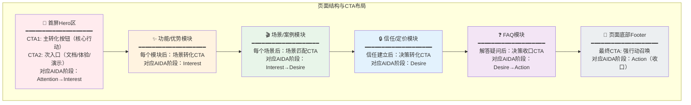

> **提炼自**：KickArt（火山引擎电商营销AI视频创作）产品深度分析（2026-07-06）——多触点AIDA转化设计
> **验证产品**：KickArt官网、所有成熟SaaS官网、Stripe/飞书/AWS等产品着陆页

# 多触点AIDA转化设计（Multi-Touchpoint AIDA Conversion）

## 模式类型
方法论模式（产品开发与竞争策略 / 营销设计）

## 成熟度
L4 标准化（营销设计经典方法论，所有成熟SaaS官网普遍采用）

## 适用场景

| 场景 | 是否适用 | 说明 |
|------|---------|------|
| SaaS/ToB产品着陆页 | ✅ 核心场景 | 产品官网、功能介绍页、营销落地页 |
| 电商详情页 | ✅ 核心场景 | 商品详情页、活动落地页 |
| 付费转化页面 | ✅ 核心场景 | 会员开通页、升级页、购买页 |
| 功能/文档页面 | ⚠️ 部分适用 | 文档页CTA应更克制（1-2个即可） |
| 纯内容/博客页面 | ⚠️ 谨慎使用 | 内容页面CTA过多影响阅读体验 |
| 工具/应用内界面 | ❌ 不适用 | 应用内已经是激活用户，不需要着陆页式转化设计 |

## 问题背景

营销页面CTA（Call to Action，行动召唤按钮）设计的常见错误：

1. **只有底部一个CTA**：用户滚动到底部才有"立即使用"按钮，中途想转化找不到入口
2. **CTA文案千篇一律**：所有CTA都是"立即使用"或"免费试用"，和上下文无关
3. **CTA数量过多或过少**：要么满屏都是按钮造成选择瘫痪，要么只有一个错过转化时机
4. **不匹配决策阶段**：用户刚进来还没建立兴趣就放"立即购买"，或者看完了所有内容还只有"了解更多"
5. **所有CTA指向同一个动作**：不区分"想试用"、"想咨询"、"想看文档"的不同用户需求

用户在页面的不同位置处于不同的心理决策阶段，需要匹配对应的行动召唤。

## 核心模式：AIDA漏斗+多触点CTA

经典AIDA模型描述用户购买决策的四个阶段：
- **A**ttention（注意）：我知道这个产品了
- **I**nterest（兴趣）：这个产品看起来有点意思
- **D**esire（欲望）：这正是我需要的，我想要
- **A**ction（行动）：我现在就要用/买

多触点AIDA转化设计 = 在用户决策旅程的每个心理转折点设置对应CTA，而不是只在底部放一个按钮。

### 页面CTA分布图

### 不同位置CTA设计指南

| 页面位置 | AIDA阶段 | 用户心理 | CTA类型 | 文案建议 | CTA数量 |
|---------|---------|---------|---------|---------|---------|
| **首屏Hero区** | Attention→Interest | "这是什么？能帮我做什么？" | 主CTA（核心转化）+ 次CTA（探索入口） | 主："免费试用"/"立即体验" 次："观看演示"/"查看文档" | 2-3个（1主+1-2次） |
| **功能/优势模块之间** | Interest | "这个功能不错，还有吗？" | 间隔CTA（顺势转化） | "了解更多"/"体验此功能" | 1个（文字按钮或次要按钮） |
| **场景/解决方案模块后** | Interest→Desire | "这就是我的场景！我想要这个" | 场景CTA（精准匹配） | "立即体验XX场景"/"获取XX方案" | 每个场景卡片1个 |
| **信任背书/定价后** | Desire | "看起来靠谱，多少钱？" | 决策CTA（欲望转化） | "立即购买"/"联系销售"/"开始免费试用" | 1-2个 |
| **FAQ后** | Desire→Action | "我的疑问解答了" | 收口CTA（最终推动） | "免费开始"/"立即注册" | 1个强CTA |
| **页面底部Footer** | Action（收口） | "我决定了" | 最终CTA（兜底转化） | "立即开始"/"免费试用" | 1个主CTA |

### CTA设计四原则

#### 原则1：文案差异化，和上下文匹配

- ✅ 看完"爆款裂变"功能后CTA："立即体验爆款裂变"
- ✅ 看完电商场景后CTA："开始制作电商带货视频"
- ❌ 所有CTA都是"立即使用"——用户看到第8个"立即使用"时已经麻木了

#### 原则2：层级区分，不是所有CTA都一样大

| CTA层级 | 视觉样式 | 使用场景 |
|---------|---------|---------|
| **主按钮** | 填充色、大尺寸、高对比度 | Hero区主CTA、底部最终CTA |
| **次按钮** | 描边/浅色、中等尺寸 | Hero区次入口、功能模块间隔CTA |
| **文字链接** | 纯文字、带下划线或颜色区分 | 了解更多、查看详情等弱转化 |

#### 原则3：覆盖不同角色的不同需求

一个B端产品页至少要覆盖三类角色的入口：
- **业务决策者**："立即咨询"/"联系销售"/"申请试用"
- **技术评估者**："查看文档"/"API文档"/"技术白皮书"
- **想直接体验的用户**："免费体验"/"控制台"/"在线Demo"

#### 原则4：CTA总数适中，不是越多越好

| 页面长度 | 建议CTA总数 | 过少问题 | 过多问题 |
|---------|------------|---------|---------|
| 短页面（3-5屏） | 4-6个 | 转化入口不足，用户想行动找不到按钮 | 视觉噪音，选择瘫痪 |
| 长页面（8-15屏） | 8-12个 | 用户滚动很久看不到CTA，中途流失 | 满屏按钮，显得廉价和急切 |

## CTA文案优化方向

| 文案类型 | 低效文案 | 高效文案 | 为什么高效 |
|---------|---------|---------|-----------|
| **以产品为中心** | "立即使用我们的产品" | "免费制作带货视频" | 不说"我们的产品"，说用户能做什么 |
| **模糊不清** | "了解更多" | "查看爆款裂变演示" | 明确告诉用户点击后能看到什么 |
| **缺乏 urgency** | "免费试用" | "今天免费开始——无需信用卡" | 降低顾虑，增加即时性 |
| **面向所有人** | "立即注册" | "电商商家免费开始" | 精准匹配目标用户身份 |
| **只有行动没有价值** | "立即购买" | "开始提升视频转化率" | 强调用户获得的价值，不是购买动作 |

## 反模式警示

| 反模式 | 表现 | 问题 |
|--------|------|------|
| **底部唯一CTA** | 整个页面只有最底部有一个"立即使用"按钮 | 用户滚动中途想转化时找不到入口，直接离开 |
| **CTA文案千篇一律** | 所有CTA都是"立即使用"/"了解更多" | 和上下文不匹配，用户在最被打动的时刻没有精准的行动出口 |
| **所有CTA都是大按钮** | 满屏都是醒目的填充色按钮 | 视觉噪音，主CTA不突出，用户不知道该点哪个 |
| **CTA过少或过多** | 整个页面只有2个CTA 或 每段文字后都有CTA | 过少错过转化时机，过多造成选择瘫痪 |
| **不匹配决策阶段** | 首屏就放"立即购买"，底部还是"了解更多" | 刚进来还没建立兴趣就让人买，看完了还不给明确行动入口 |
| **CTA点了没反应/找不到页面** | CTA指向404、指向无关页面、需要登录才能看但没提示 | 用户被勾起兴趣后点了发现不行，挫败感极强 |
| **强迫用户先联系销售** | 所有"试用"按钮实际上都是"联系销售预约演示" | 想自助体验的用户直接流失 |
| **定价页CTA缺席** | 讲了半天价值、列了所有功能，看完想购买了找不到购买按钮 | 临门一脚没有CTA，之前所有转化努力白费 |

## 实施检查清单

- [ ] Hero区是否有2-3个CTA（1主+1-2次），覆盖不同意向用户？
- [ ] 每个主要功能/场景模块后是否有对应的CTA？
- [ ] CTA文案是否和上下文内容匹配（不是千篇一律的"立即使用"）？
- [ ] CTA是否有清晰的视觉层级（主/次/文字链接区分）？
- [ ] 是否同时覆盖业务决策者、技术评估者、自助体验者三类角色？
- [ ] CTA总数是否适中（长页面8-12个，短页面4-6个）？
- [ ] 页面底部是否有一个强CTA收口？
- [ ] 每个CTA点击后是否有明确的落地页（不是404或无关页面）？
- [ ] 是否有"免费体验"等低门槛入口，不强迫所有用户都联系销售？

## 实施步骤

1. **用户决策旅程映射**：画出用户从进入页面到转化的心理旅程，标记关键决策点
2. **CTA分布规划**：在页面的哪些位置放置CTA，对应AIDA哪个阶段
3. **文案差异化设计**：为每个位置的CTA设计和上下文匹配的文案
4. **视觉层级设计**：定义主按钮、次按钮、文字链接的视觉样式
5. **角色覆盖检查**：确保三类角色（业务/技术/自助）都有对应入口
6. **CTA数量检查**：控制CTA总数在合理范围
7. **落地页验证**：点击每个CTA验证落地页正确、流程顺畅
8. **A/B测试优化**：上线后通过A/B测试持续优化CTA文案、位置、样式

## 验证记录

| 验证次序 | 产品/场景 | CTA触点数 | AIDA覆盖 | 验证结果 |
|---------|---------|----------|---------|---------|
| 第1次 | KickArt产品页 | 6-8个 | ✅ 首屏主CTA + 模块间隔CTA + 场景后CTA + 底部收口 | 不同位置CTA文案差异化设计，匹配用户决策阶段 |
| 第2次 | 火山引擎SearchInfinity页 | 10个 | ✅ 四层CTA（主转化+自助体验+开发者文档+场景转化） | 10个CTA分4层设计，覆盖不同角色和决策阶段 |
| 第3次 | Stripe官网 | 8-10个 | ✅ 全链路CTA分布 | 全球支付处理标杆SaaS，CTA设计是行业范本 |
| 第4次 | 飞书/钉钉官网 | 6-8个 | ✅ 多触点分层 | 国内企业协作SaaS标杆，多触点CTA设计成熟 |

## 与其他模式的关系

| 关系模式 | 关系类型 | 说明 |
|---------|---------|------|
| [b2b-product-page-ux-five-dimensions.md](../research-knowledge/b2b-product-page-ux-five-dimensions.md) | 分析框架 vs 设计模式 | b2b-product-page-ux-five-dimensions是**UX分析框架**（怎么分析好的产品页），其中维度3是CTA策略分析；本模式是**具体设计模式**（怎么设计CTA），两者互补 |
| [intentional-friction-design.md](../creative-design/intentional-friction-design.md) | UX原则补充 | 刻意摩擦设计提醒我们——不是所有CTA都应该越顺畅越好，高价值转化前适当增加确认摩擦可以提高转化质量 |
| [pain-point-first-entry.md](pain-point-first-entry.md) | 入口设计原则 | 痛点先行是首屏CTA的设计原则——先戳痛点再给行动入口 |
| [contest-funnel-aperture.md](contest-funnel-aperture.md) | 漏斗思想同源 | 赛事漏斗孔径和AIDA漏斗都是转化漏斗思想在不同场景的应用 |
| [saas-hardware-three-layer-funnel.md](saas-hardware-three-layer-funnel.md) | 漏斗模型补充 | 三层漏斗模型是整体用户增长漏斗，本模式是着陆页内的微型转化漏斗 |
