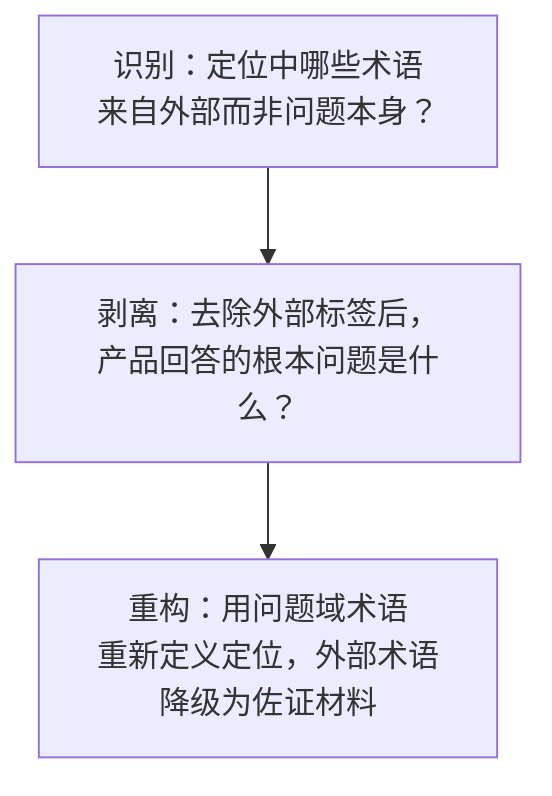

# 定位漂移修正法

## 核心原则

当产品定位中使用的核心术语来自**外部环境**（平台标签、赛事话题、流行概念）而非来自**问题本身**时，存在"定位漂移"风险——外部术语的生命周期短于问题域，产品可能被错误归类为"某个热词的又一个应用"，而非"某个根本问题的方法论"。修正方法是：**用问题域定义产品，用外部术语作为佐证而非主标签**。

## 成熟度评估

| 维度 | 评估 | 依据 |
|------|------|------|
| 实践验证 | 低 | 1 次实践（SpecWeave 定位从 Vibe Coding → AI 智能体协作） |
| 可复用性 | 高 | 适用于任何需要对外展示产品定位的场景 |
| 通用性 | 高 | 不限于特定领域——产品定位/品牌叙事/投资 pitch 均可复用 |

## 三阶段修正流程



### 阶段一：识别（Detection）

**触发信号**：出现以下任一信号时，启动定位漂移检查：

| 信号 | 说明 | 示例（SpecWeave） |
|------|------|------------------|
| 外部依赖 | 定位词来自平台/赛事/流行词，而非产品本身解决的问题 | "Vibe Coding" 是大赛话题标签，不是 SpecWeave 解决的问题 |
| 范畴收窄 | 定位词暗示的范围比产品实际解决的问题小 | Vibe Coding 暗示"写代码"，但 SpecWeave 覆盖所有深度 AI 协作 |
| 时效风险 | 定位词有明显的"流行周期"，过期后产品定位随之失效 | 5 年后可能没人说 Vibe Coding，但"AI 协作"是长期命题 |
| 降维效应 | 定位词让评审/用户以一个更窄的框架评判产品 | "Vibe Coding 方法论" → 评审会问"这和写代码有什么关系"，而非"这如何改变 AI 协作" |

### 阶段二：剥离（Distillation）

**操作**：在思维中完全移除外部术语，用"如果这个词不存在，你的产品解决什么问题"回答三个问题：

```
问题 1：用户的核心痛点是什么？（不用任何外部术语描述）
问题 2：你的产品改变了用户做哪件事的方式？
问题 3：这件事在 5 年后还会存在吗？
```

SpecWeave 的剥离过程：

| 问题 | Vibe Coding 答案（漂移） | 剥离后答案（锚定） |
|------|------------------------|-----------------|
| 核心痛点 | Vibe Coding 质量不稳定 | 当 AI 胜任多角色时，100 次对话后它还能理解你的意图吗？ |
| 改变了什么 | Vibe Coding 的方式 | 人与 AI 持续协作的方式——从"每次对话是一次性事件"到"每次对话在前序知识基础上进行" |
| 5 年后存在吗 | 可能不存在（术语更替） | 必然存在（AI 协作只会更深） |

### 阶段三：重构（Reconstruction）

**操作**：用阶段二的问题域答案作为主定位，将外部术语降级为"这些标签也在描述同一个问题"的佐证位置。

**重构模板**：

```
原定位（漂移）：
  "XXX 是 [外部标签] 领域的 [第一/最好/系统化] 的 [产品类型]"

新定位（锚定）：
  "当 [根本问题描述] 时，XXX 提供了 [解决方案]。
  不管这个问题叫 [外部标签 A]、[外部标签 B] 还是别的名字——
  它回答的是问题本身，不止是其中一个标签。"
```

**SpecWeave 的重构对比**：

| 维度 | 漂移版 | 锚定版 | 差异 |
|------|--------|--------|------|
| 标题 | "Vibe Coding 工程方法" | "AI 智能体协作规范体系" | 从标签到问题域 |
| 问题引入 | "Vibe Coding 产出质量取决于上下文" | "当 AI 能胜任多角色时，如何确保 100 次对话中始终理解你的意图？" | 从特例到普遍 |
| 一句话定位 | "Vibe Coding 领域第一套方法论" | "当所有人用 AI 做东西时，你在研究如何与 AI 更好地协作" | 从竞争到定义 |
| 产品名 | "TRAE 智能体协作的工程化方法" | "AI 智能体协作的工程化方法" | 去平台绑定 |

## 修正深度判断

并非所有外部术语都需要移除。修正深度的决策矩阵：

| 外部术语角色 | 修正策略 | 示例 |
|------------|---------|------|
| 作为核心定位词 | **必须剥离**——用问题域术语替换 | Vibe Coding → AI 智能体协作 |
| 作为行业背景切面 | **保留**——作为"问题引入"的切口 | "随着 Vibe Coding 等 AI 协作范式……" |
| 作为大赛话题标签 | **保留**——用于 SEO/分发/流量匹配 | #vibe coding 大赏 话题参与 |
| 作为竞品参照 | **保留**——但需说明"这些都在同一个问题域中" | "不论叫 Vibe Coding 还是 Prompt Engineering" |

## 适用条件

- 产品定位中使用了来自平台方/赛事方的术语
- 产品解决的问题大于该术语暗示的范围
- 外部术语有明显的流行周期，产品定位需要长期稳定
- 评审/用户可能因外部术语对产品产生错误归类

## 不适用场景

- 产品恰好是该外部术语的典型实例（如"一个 Vibe Coding 的产物"——但 SpecWeave 不是）
- 外部术语是行业标准而非流行词（如 CI/CD、微服务）
- 产品定位不需要对外展示的技术内部项目

## 与其他方法论的关系

| 方法论 | 关系 |
|--------|------|
| `multi-source-intelligence-iteration.md` | 定位漂移修正常发生在多源分析的中后期——当外部数据源足够多时，外部标签的"引力"更强，漂移风险更高 |
| `insight-iceberg-model.md` | 剥离阶段本质上是"从现象到原理"的逆向操作 |

> 来源：来自 SpecWeave v11 迭代中 Vibe Coding → AI 智能体协作的全局定位修正过程
> 关联模块：`multi-source-intelligence-iteration.md`、`root-cause-diagnosis.md`
