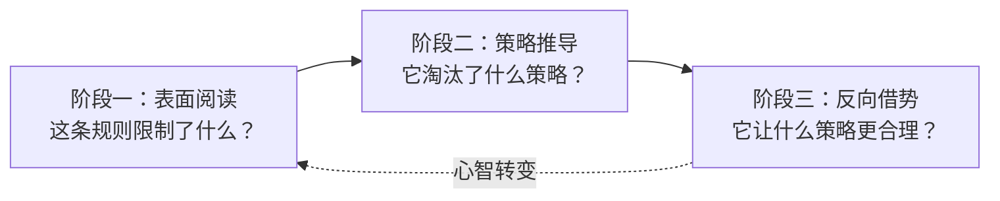

# 反向借势——从规则约束中读出最优解

## 核心原则

竞争性场景中的限制性规则（如单作品Best Shot、统一提交格式、固定维度评审）在表面上是障碍，在深层是**策略导航**——它通过排除分散选项来暗示最优路径。识别并主动拥抱这种约束，将"规则限制我"转变为"规则帮我排除了低效选项"。

## 成熟度评估

| 维度 | 评估 | 依据 |
|------|------|------|
| 实践验证 | 低 | 1次实践（TRAE大赛单作品规则的反向借势） |
| 可复用性 | 高 | 适用于任何有明确约束条款的竞争场景 |
| 通用性 | 高 | 赛事策略/招投标/资源分配/优先级决策 |

## 三阶段解读法

### 阶段一：表面阅读——"这条规则限制了什么？"

识别规则中的约束性表述："只能/只取/不超过/仅支持/不重复/不累加"。

TRAE大赛示例：
> "同一账号下只取得分最高的1个作品晋级"
> 表面阅读：不能多投多个作品。

### 阶段二：策略推导——"它淘汰了什么样的参赛策略？"

对每条约束执行"如果这条规则生效，它禁止了什么策略？"推导，看清所有被关闭的路径，然后**接受这些路径的不可行性**。

TRAE大赛示例：
- 禁止了"多作品分散投稿增加概率"（FOMO消除）
- 禁止了"两个作品在两条通道分别冲击"（双通道FOMO消除）
- 禁止了"A作品冲创新性、B作品冲完成度"的互补策略

### 阶段三：反向借势——"它让什么策略变得更合理？"

将"唯一剩下的选择"转化为策略上的相对优势。所有竞争对手面临同样约束，但并非所有人都能将约束转化为聚焦优势。

TRAE大赛示例：
- 剩下的唯一选择：Best Shot模式——把唯一作品做到极致
- 反向借势：Best Shot模式下边际投入回报率递增，142次对话积累的深度资产的相对优势被放大
- 进一步推导：第二作品无法独立晋级→让它作为主作品某关键维度的证据放大器→双作品交叉叙事策略

## 关键心智转变

| 心智模式 | 反向借势前 | 反向借势后 |
|---------|-----------|-----------|
| 规则感知 | "规则在限制我" | "规则在帮我做选择" |
| 决策空间 | "我需要在所有可能性中找最优" | "规则已经把最优圈定在一小片区域内" |
| 竞争认知 | "这个限制很烦" | "这个限制也在限制我的竞争对手——但只有我从中读出了策略" |

## 与zero-sum-rule-inversion的关系

本模式与`zero-sum-rule-inversion.md`（零和规则反利用）有邻近关系但侧重点不同：

| 维度 | zero-sum-rule-inversion | reverse-leverage-rule-constraints |
|------|------------------------|----------------------------------|
| 聚焦 | 限制条款=策略聚焦器（消除FOMO） | 三阶段解读法（表面→推导→反利用）+心智转变框架 |
| 操作 | 三阶段操作流（识别→推导→转换） | 三阶段解读+心智模式对比表 |
| 案例 | 单作品Best Shot→Best Shot模式 | 单作品Best Shot→双作品交叉叙事策略 |

> **注**：建议在后续迭代中合并两个模式为统一框架。当前阶段保留两个文件以完整记录萃取路径。

## 适用条件

- 竞争场景有明确的"限制性条款"（名额/取最优/排他）
- 限制条款对所有参与者一视同仁（公平约束）
- 你在限制生效前已积累特定维度的先发优势

## 不适用场景

- 限制条款仅针对特定参与者（不平等约束）
- 限制条款可以通过其他方式绕过（规则漏洞）
- 你在任何维度上都无先发优势——此时Best Shot只是"全力以赴的平庸"

> 来源：TRAE大赛"同一账号只取最高分1个作品晋级"规则下的双作品交叉叙事策略设计
> 关联模块：`zero-sum-rule-inversion.md`、`multi-source-intelligence-iteration.md`
