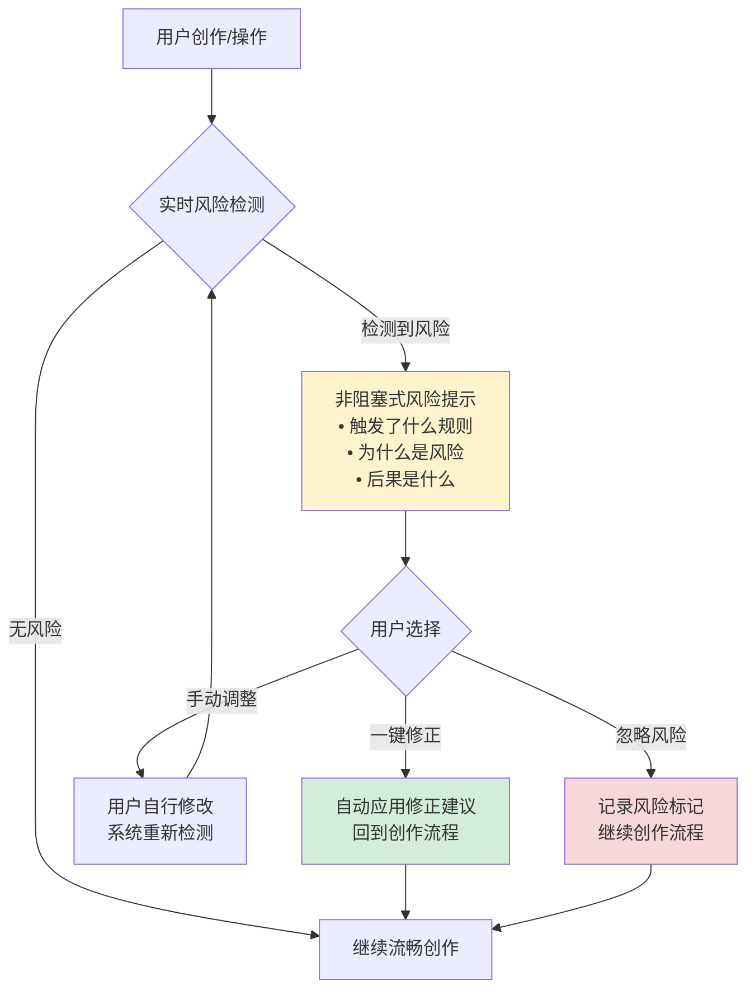

> **提炼自**：KickArt（火山引擎电商营销AI视频创作）产品深度分析（2026-07-06）——风控前置副驾驶模式
> **验证产品**：KickArt（投前预审）、各类内容审核系统（实时风险提示）

# 风控前置副驾驶模式（Risk Control Copilot: Pre-positioned）

## 模式类型
方法论模式（产品开发与竞争策略）

## 成熟度
L2 已验证（2个以上高合规场景验证）

## 适用场景

| 场景 | 是否适用 | 说明 |
|------|---------|------|
| 内容创作/营销平台 | ✅ 核心场景 | 视频/图文/广告内容需要过审才能发布 |
| 金融科技产品 | ✅ 核心场景 | 交易/转账/投资操作有严格合规要求 |
| 医疗AI产品 | ✅ 核心场景 | 医疗建议/诊断辅助有极高合规要求 |
| 低风险消费工具 | ❌ 不适用 | 笔记/画图/计算器等工具没有强合规要求 |
| 事后监管即可的场景 | ❌ 不适用 | 某些场景事后审计比事前预防成本更低 |

## 问题背景

传统风控/合规模块的设计定位是"流程末端的守门员"：
1. 用户花30分钟创作内容/填写表单/配置参数
2. 点击提交/发布/确认
3. 系统弹出审核不通过，告诉你哪里有问题
4. 用户返回修改，可能修改后又不通过，反复返工

这种模式的问题：
- **风控是成本中心**：它不创造价值，只是避免损失
- **用户体验差**：投入大量时间后被告知不行，挫败感强
- **返工成本高**：完成后修改比过程中调整成本高很多
- **转化率低**：用户在最后一步被拦截，直接流失

在高合规场景中，"内容/操作能通过审核"是前置条件——做得再好，过不了审/合规等于零。

## 核心模式：从守门员到副驾驶

```
风控前置 = 规则引擎内嵌创作流程 ⊕ 实时风险提示 ⊕ 一键自动修正 ⊕ 平台规则同步更新
```

### 两种风控设计对比

| 维度 | 传统末端守门员 | 前置副驾驶（本模式） |
|------|--------------|-------------------|
| **介入时机** | 用户完成所有操作后，提交时审核 | 用户创作/操作过程中实时检测 |
| **用户感知** | "你做的东西不行，回去改"（挫折感） | "这里可能有问题，建议这样调整"（辅助感） |
| **修正成本** | 高——完成后大改 | 低——过程中小调整 |
| **定位** | 成本中心（避免损失） | 价值中心（提升通过率/效率） |
| **用户体验** | 阻塞式——被拦截后无法继续 | 非阻塞式——提示但不强制中断，用户可选择采纳或忽略 |
| **规则透明度** | 黑盒——只告诉你不通过，不告诉你为什么 | 白盒——明确告诉你哪条规则触发了风险、为什么、怎么改 |

### 风控前置四层模型

| 层级 | 做法 | KickArt示例 |
|------|------|------------|
| **L1 规则内嵌** | 将审核/合规规则引擎嵌入创作流程，而非放在末端 | 视频脚本生成阶段就嵌入各平台审核规则库 |
| **L2 实时提示** | 检测到风险时立即提示，不是等全部做完才说 | 输入文案时实时提示"该表述可能涉及夸大宣传" |
| **L3 一键修正** | 不仅提示问题，还提供修正建议甚至一键自动修正 | 检测到违规词自动建议替换词，点击即可替换 |
| **L4 规则同步** | 与监管/平台规则保持同步更新，避免用旧规则误导用户 | 各平台审核规则变化时24小时内同步更新到预审引擎 |

### 副驾驶交互三原则

1. **非阻塞**：提示风险但不强制中断流程，用户可以选择忽略（但要明确告知忽略的后果）
2. **可解释**：明确说明"哪条规则触发了风险、为什么这是风险、可能导致什么后果"
3. **可行动**：不仅指出问题，还要提供解决方案（建议修改方向或一键修正）



## 反模式警示

| 反模式 | 表现 | 问题 |
|--------|------|------|
| **过度阻塞** | 检测到一点小问题就强制中断流程，不修改就不能继续 | 严重破坏创作心流，用户感觉被"管教"而不是被协助 |
| **只说不行不说怎么行** | 只提示"内容违规"，不说明哪里违规、违反哪条、怎么改 | 用户只能盲目修改试错，体验极差 |
| **规则黑盒** | 审核规则不透明，用户不知道边界在哪里 | 用户不敢创作，担心动辄得咎 |
| **规则过时** | 平台规则已经更新，但审核引擎还在用旧规则 | 提示错误的风险，或漏过真正的风险 |
| **前置但不智能** | 把末端审核简单搬到前面，弹出模态框打断用户 | 只是把"最后一步被拒"变成"每一步被拒"，体验更差 |
| **把风控做成卖点过度宣传** | 反复强调"我们有风控"，让用户感觉这个平台风险很高 | 最好的风控是让用户感觉不到风控的存在——他们只是顺畅地完成了任务 |

## 实施检查清单

- [ ] 风控/合规模块是否嵌入创作/操作流程中，而非仅在提交时检查？
- [ ] 风险提示是否是非阻塞的（不强制中断流程）？
- [ ] 是否明确说明触发了什么规则、为什么是风险？
- [ ] 是否提供一键修正建议或具体修改方向？
- [ ] 规则是否与监管/平台要求保持同步更新？
- [ ] 是否记录用户忽略的风险标记（用于后续审核或用户教育）？
- [ ] 正常无风险的创作流程是否顺畅不被打扰？

## 实施步骤

1. **规则梳理**：梳理该场景所有合规要求和平台规则，形成结构化规则库
2. **风险分级**：将风险分为不同等级（提示/警告/禁止），不同等级不同干预强度
3. **嵌入点设计**：在创作流程的哪些节点嵌入检测（如文案输入时、脚本生成时、导出前）
4. **提示文案设计**：设计友好、可解释、可行动的提示文案，不要用"错误！违规！"这类生硬词汇
5. **修正建议库**：为常见风险场景预设修正建议和替换方案
6. **规则同步机制**：建立规则更新机制，确保与最新要求同步
7. **用户反馈循环**：收集用户对风控提示的反馈（误报、漏报、提示是否有用），持续优化

## 验证记录

| 验证次序 | 产品/场景 | 风控层级 | 验证结果 |
|---------|---------|---------|---------|
| 第1次 | KickArt（电商营销视频） | L1-L4全覆盖（规则内嵌+实时提示+一键修正+多平台规则同步） | "投前预审"作为六大核心能力之一，在生成阶段嵌入各平台审核规则预检，不是生成完被拒再修改 |
| 第2次 | 内容创作平台（通用） | L1-L3（内嵌检测+实时提示+修正建议） | 写作平台实时提示敏感词和违规表述，比写完审核不通过体验显著提升 |

**待验证**：需在金融/医疗等高合规场景验证1次后方可升级L3。

## 与其他模式的关系

| 关系模式 | 关系类型 | 说明 |
|---------|---------|------|
| [vertical-scenario-ai-three-elements.md](vertical-scenario-ai-three-elements.md) | 组成部分 | 风控前置副驾驶是垂直场景AI三要素模型中"领域合规风控"维度的详细展开 |
| [compliance-pre-positioning.md](compliance-pre-positioning.md) | 互补模式 | compliance-pre-positioning关注**市场/品牌层面**的合规资质前置展示（信任建立），本模式关注**产品/体验层面**的风控能力内嵌（流程优化） |
| [compliance-driven-rule-building.md](../governance-strategy/compliance-driven-rule-building.md) | 跨层关联 | compliance-driven-rule-building关注**开发流程层面**的合规规则门禁，本模式关注**用户产品层面**的合规体验设计 |
| [non-intrusive-security-ux.md](../ai-collaboration/non-intrusive-security-ux.md) | UX原则支撑 | 非侵入式安全UX是风控前置交互设计的UX原则 |
| [full-workflow-closed-loop.md](full-workflow-closed-loop.md) | 闭环关键节点 | 风控前置是全链路闭环中避免最后一公里返工的关键节点设计 |
