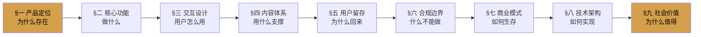

# Spec 九节叙事弧：产品定义的完整 Checklist

## 模式概述

产品规格文档的九节标准结构（产品定位→核心功能→交互→内容→留存→合规→商业→技术→社会价值），形成完整叙事弧，强制产品设计者回答九个独立问题，避免"只定义功能不思考留存/合规/商业"的常见陷阱。竹简悟道验证单日可填充完成。

## 九节结构（从内向外）

## 四层分组设计原则

1. **内核三节（§一-§三）**：定义产品本质——定位、功能、体验
2. **支撑两节（§四-§五）**：定义产品粘性——内容、留存
3. **边界两节（§六-§七）**：定义产品生存——合规、商业
4. **实现两节（§八-§九）**：定义产品落地——技术、意义

## 行业适配

| 产品类型 | §四替换为 | §五替换为 |
|---------|----------|----------|
| AI应用/文化产品/工具类 | 内容体系（默认） | 用户留存（默认） |
| 交易类/电商类 | 交易体系 | 增长模型 |
| SaaS/企业服务 | 服务体系 | 客户成功 |
| 社交/社区类 | 内容生态 | 网络效应 |

## 使用方式

1. 不需要每节都写很长——九个问题都要回答，但每节回答3-5个关键点即可
2. 顺序不要乱——从内核向外推导，不要先写技术方案再找定位
3. 可以跳过的节：纯内部工具可简化§六（合规）和§七（商业）
4. 不可跳过的节：§一（定位）和§二（功能）是必答项

## 与 spec-driven-development 的关系

`spec-driven-development` 是"先设计后实施"的开发流程理念；本模式是该理念在**产品Spec文档**层面的具体模板——提供了Spec文档应该包含哪些章节的checklist。

> 来源：竹简悟道产品Spec单日产出实践
> 关联模式：`spec-driven-development`、`five-layer-document-architecture`（作为L1规格层的具体实现）
