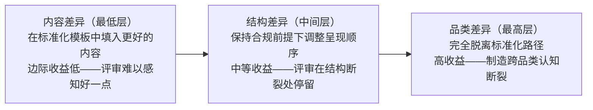

# 模板同质化避让策略

## 核心原则

当竞赛/投标/申请场景中官方提供了标准化模板（如报名帖模板、Prompt模板、格式规范），大多数参与者会严格遵循——导致所有提交物在结构上高度同质化。此时，差异化不是"比别人的模板填得更好"——而是"在关键维度上脱离标准化路径"，制造结构性差异。

## 成熟度评估

| 维度 | 评估 | 依据 |
|------|------|------|
| 实践验证 | 中 | 2次验证（TRAE大赛报名帖HTML同质化识别+v12公益叙事差异化） |
| 可复用性 | 高 | 适用于所有提供标准化模板的竞赛/投标/申请场景 |
| 通用性 | 中 | 需要场景中存在"可选的差异化维度"——如果规则强制要求所有材料格式完全一致，则无操作空间 |

## 三层差异化空间

| 差异层 | 操作 | 效果 | ROI |
|--------|------|------|-----|
| **内容差异**（最低层） | 在标准化模板中填入更好的内容 | 边际收益低——评审在大量同结构帖子中难以感知"好一点"的差异 | 低 |
| **结构差异**（中间层） | 在保持模板合规的前提下，调整信息呈现顺序或增加差异化章节 | 中等收益——评审在结构断裂处停留，形成记忆锚点 | 中 |
| **品类差异**（最高层） | 在关键交付物上完全脱离标准化路径，用不同的媒介形态制造品类断裂 | 高收益——如手动构建交互式HTML替代TRAE Work自动生成的页面 | 高 |

## 判断何时脱离标准化路径

三项判断标准（全部满足→ROI为正）：

1. **同质化风险**：官方工具/模板是否会让大多数产出物"长得像"？
   - 检测信号：是否提供可复制粘贴的Prompt模板？是否自动生成标准格式产出？是否有"3-5分钟生成"的低门槛引导？
   
2. **差异杠杆**：脱离标准化路径后的效果差异是否足够显著？
   - 检测信号：该维度是否是评审必看的关键交付物？差异是否"一眼可辨"（不需要仔细对比就能发现不同）？
   
3. **合规性**：脱离是否仍在规则框架内？
   - 检测信号：规则是否规定了产出物的具体生成方式（如"必须用TRAE Work生成"）？还是只规定了格式要求（如"HTML ZIP上传"）？后者允许脱离标准化生成路径。

## 实践案例：TRAE大赛HTML差异化

| 维度 | 分析 |
|------|------|
| 同质化风险检测 | 创意文档学习资料提供3套标准Prompt模板，TRAE Work从创意Doc自动生成HTML→大量参赛者HTML结构/风格高度一致 |
| 差异杠杆检测 | HTML是评审的第一视觉接触点，手动构建的四层架构可视化页面与AI自动生成页面在视觉认知上形成跨品类断裂→差异"一眼可辨" |
| 合规性检测 | 规则仅要求"HTML ZIP打包上传"，未规定必须使用TRAE Work生成→脱离标准化生成路径合规 |
| 结论 | 三条件全部满足→手动构建HTML，脱离TRAE Work自动生成路径 |

## 配套策略：公益叙事的差异化构建

v12迭代提供了第二个案例：社会公益叙事不应是"打个标签"（内容差异层），而应是"用独立段落构建完整公益故事"（结构/品类差异层）：

- 内容差异层："本作品也具有社会公益价值"（一句话带过→被忽略）
- 结构差异层：在§3价值与意义中专门用段落展开公益维度（评审停留→形成印象）
- 品类差异层：将公益叙事构建为独立的"精神庇护所"故事线（评审情感共鸣→独立奖项通道）

## 反模式

- **为了不同而不同**：脱离标准化路径但没有制造实质性的认知差异（如换一个颜色但结构完全相同）
- **脱离合规边界**：差异化导致违反规则（如不按规定格式提交）
- **所有维度都差异化**：差异化资源分散，没有在关键维度上形成压倒性差异

## 与其他方法论的关系

| 方法论 | 关系 |
|--------|------|
| `multi-source-intelligence-iteration.md` | 子模式5（结构性差异化策略）的独立扩展——本模式提供了更精细的三层差异化模型和三项判断标准 |
| `zero-sum-rule-inversion.md` | 互补——zero-sum讲"在规则约束内找最优"，本模式讲"在标准模板外找差异" |

## 适用条件

- 竞赛/投标/申请场景中存在官方提供的标准化模板或自动化生成工具
- 参赛者/投标者数量大，评审面临同质化疲劳
- 规则仅约束产出物格式，不约束具体生成方式

## 不适用场景

- 规则强制要求所有材料使用统一格式和生成方式
- 评审标准完全量化（如纯客观打分），无主观印象分
- 参赛者数量极少（<50），同质化疲劳不构成问题

> 来源：TRAE大赛创意文档标准化Prompt模板的同质化风险识别+v12社会公益叙事差异化实践
> 关联模块：`multi-source-intelligence-iteration.md`、`zero-sum-rule-inversion.md`
