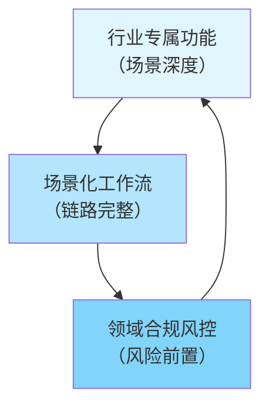

> **提炼自**：KickArt（火山引擎电商营销AI视频创作）产品深度分析（2026-07-06）——垂直场景AI产品三要素模型
> **验证产品**：KickArt（电商营销视频）、WPS Comate（办公场景AI）、ViitorVoice（语音交互场景）

# 垂直场景AI产品三要素模型（Vertical Scenario AI: Three Elements）

## 模式类型
方法论模式（产品开发与竞争策略）

## 成熟度
L3 可复用（3个以上跨领域产品验证）

## 适用场景

| 场景 | 是否适用 | 说明 |
|------|---------|------|
| AI应用层产品设计 | ✅ 核心场景 | 面向特定行业/场景的AI SaaS产品 |
| B端垂直SaaS | ✅ 核心场景 | 电商营销、医疗AI、金融科技、法律AI等 |
| 通用大模型应用层封装 | ✅ 适用 | 基于通用API构建场景化解决方案 |
| AI基础设施/模型层产品 | ❌ 不适用 | 底层模型平台卖的是通用性，不是场景深度 |
| ToC泛娱乐工具 | ⚠️ 部分适用 | 若目标是特定人群的特定需求可参考 |

## 问题背景

AI应用层产品竞争的常见陷阱是"模型能力竞赛"——比拼谁的模型参数更大、生成时长更长、分辨率更高、风格更多样。但2025-2026年的市场趋势表明：
1. 通用指标的边际效益快速递减（视频生成从10秒到30秒是质变，从5分钟到10分钟感知差异不大）
2. 通用模型无法通过堆参数获得垂直场景的行业know-how
3. 用户买的不是"AI能力"，而是"我的问题被解决了"

垂直场景的深度价值密度远高于通用能力的广度覆盖。

## 核心模型：三要素公式

```
垂直场景AI产品竞争力 = 行业专属功能 ⊕ 场景化工作流 ⊕ 领域合规风控
```

### 三要素详细说明

| 要素 | 定义 | KickArt示例 | 反例（通用工具） |
|------|------|------------|----------------|
| **行业专属功能** | 该场景特有的、通用工具不会做的功能 | 爆款裂变（拆解爆款元素批量生成变体）、投前预审（嵌入各平台审核规则）、商品卡挂载、多平台规格适配 | 通用视频生成工具只有文生视频/图生视频，没有电商专属能力 |
| **场景化工作流** | 围绕用户"完成一件事"的完整链路设计，而非单点功能堆砌 | 对话一键成片（输入商品链接→自动完成全流程）、从创意到分发的完整链路 | 通用工具只做"生成视频"这一个环节，用户需要自己剪、自己审、自己改尺寸、自己分发 |
| **领域合规风控** | 该场景特有的合规/风控要求内嵌到产品中 | 投前预审在生成阶段就预检审核规则，实时提示风险并自动修正 | 通用工具不做审核预检，用户生成完投出去被拒才知道有问题 |

**关键洞察**：这三个要素构成的壁垒不是模型能力，而是**行业know-how的产品化沉淀**——什么内容能过审、什么结构容易爆、各平台规格差异、用户工作流的真实痛点，这些是通用模型无法通过堆参数获得的。

## 要素间协同关系



- **没有专属功能**：和通用工具没有差异，沦为"又一个套壳应用"
- **没有场景化工作流**：只是功能堆砌，用户需要自己拼凑工具链
- **没有合规风控**：生成的内容无法在真实场景使用，价值归零
- **三者协同**：形成真正的场景壁垒——竞争对手即使有同样的模型，也无法复制你的行业know-how

## 与"通用能力竞赛"的对比

| 维度 | 通用能力竞赛路线 | 垂直场景深耕路线 |
|------|----------------|----------------|
| **竞争焦点** | 模型参数、生成质量、风格多样性 | 场景理解深度、工作流完整性、合规风控 |
| **壁垒来源** | 技术/算力/数据规模 | 行业know-how产品化 |
| **用户价值** | "AI很厉害"（技术惊叹） | "我的问题解决了"（业务价值） |
| **护城河强度** | 弱——大模型厂商迭代快容易被超越 | 强——行业know-how需要时间和客户沉淀 |
| **典型阶段** | 2023-2024年AI视频生成"技术秀场期" | 2025-2026年"生产工具期" |
| **代表产品** | 即梦、可灵、Sora（通用视频生成） | KickArt（电商营销）、 Harvey（法律AI）、Insilico Medicine（药物发现AI） |

## 落地实施步骤

1. **场景选择**：选择一个足够窄、痛点足够尖锐、付费意愿足够强的垂直场景（不要试图服务所有人）
2. **know-how收集**：深入目标用户群体，通过访谈/观察/试用理解他们的真实工作流、痛点、合规要求
3. **专属功能识别**：找出该场景特有的、通用工具不会做的3-5个核心功能点
4. **工作流闭环**：围绕用户"完成一件事"设计端到端工作流，而不是罗列功能点
5. **合规风控内嵌**：识别该场景的合规要求，将其设计为创作过程中的"副驾驶"而非末端"守门员"
6. **持续迭代**：通过用户使用数据持续沉淀行业know-how，形成数据飞轮

## 反模式警示

| 反模式 | 表现 | 问题 |
|--------|------|------|
| **伪垂直** | 声称是垂直产品，但只是通用能力+该场景的prompt模板 | 没有真正的专属功能，用户很快发现用通用工具+好prompt也能做到 |
| **功能堆砌** | 做了很多功能，但没有围绕完整工作流串联起来 | 用户需要在多个功能间切换，整体效率没有提升 |
| **合规外挂** | 合规是最后一步的"审核不通过"提示，没有嵌入创作过程 | 用户体验差——生成完了才告诉你不行，返工成本高 |
| **场景过宽** | 试图同时服务5个以上行业 | 资源分散，每个场景都做不深，无法建立壁垒 |
| **忽视最后一公里** | 只做到"生成"，不考虑生成之后的环节（审核、分发、数据回流） | 生成的内容无法直接投入使用，用户还是要跳出产品 |

## 实施检查清单

- [ ] 是否选择了一个足够窄、痛点明确的垂直场景？
- [ ] 是否识别出3-5个该场景独有的功能点（通用工具不会做的）？
- [ ] 产品是否覆盖了用户从"开始"到"完成"的完整工作流？
- [ ] 合规/风控是否内嵌到创作过程中，而非末端检查？
- [ ] 用户是否不需要跳出产品就能完成整个任务？
- [ ] 是否有数据回流机制持续沉淀行业know-how？
- [ ] 核心价值主张是否是"解决业务问题"而非"AI能力强"？

## 验证记录

| 验证次序 | 产品/场景 | 三要素覆盖情况 | 验证结果 |
|---------|---------|--------------|---------|
| 第1次 | KickArt（电商营销视频） | ✅ 爆款裂变等专属功能 ✅ 创意到分发全链路 ✅ 投前预审风控 | 聚焦电商营销场景，与通用视频工具形成差异化，六维能力矩阵覆盖完整营销链路 |
| 第2次 | WPS Comate（办公场景AI） | ✅ 办公文档专属功能（排版/公式/会议纪要）✅ 办公场景工作流 ✅ 企业数据安全合规 | 深度集成WPS办公生态，不是通用代码助手 |
| 第3次 | ViitorVoice（语音交互场景） | ✅ 语音交互专属设计 ✅ 语音交互工作流 ✅ 语音数据合规 | 针对语音场景优化交互范式 |

## 与其他模式的关系

| 关系模式 | 关系类型 | 说明 |
|---------|---------|------|
| [three-layer-delivery-pipeline.md](three-layer-delivery-pipeline.md) | 上下游衔接 | 三层交付管道是场景化工作流的具体实现框架 |
| [scenario-naming-user-language.md](scenario-naming-user-language.md) | 具体技巧 | 用用户语言命名场景是行业专属功能的表达原则 |
| [scenario-driven-parameter-tradeoff.md](scenario-driven-parameter-tradeoff.md) | 方法论支撑 | 场景驱动的参数取舍是三要素模型中功能设计的决策方法 |
| [compliance-pre-positioning.md](compliance-pre-positioning.md) | 相关模式 | 合规资质前置是市场层面的合规策略，本模式关注产品层面的合规风控内嵌 |
| [full-workflow-closed-loop.md](full-workflow-closed-loop.md) | 互补模式 | 全链路闭环原则是三要素中"场景化工作流"的详细展开 |
| [risk-control-copilot-pre-positioned.md](risk-control-copilot-pre-positioned.md) | 组成部分 | 风控前置副驾驶模式是三要素中"领域合规风控"的详细展开 |
