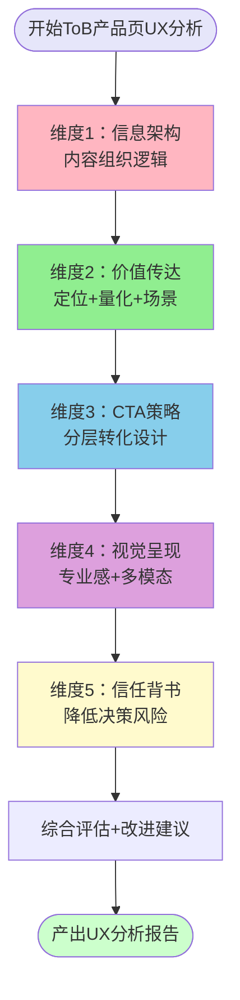
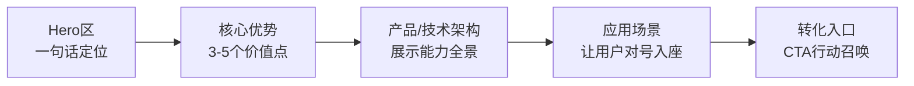
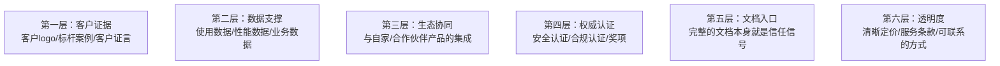

> **首次验证**：火山引擎豆包搜索（SearchInfinity）产品页深度分析复盘（2026-07-06）——在950行学习笔记中系统拆解了ToB AI产品页的设计逻辑，提炼出信息架构/价值传达/CTA策略/视觉呈现/信任背书五维分析框架
> **二次验证**：火山引擎ACEP云手机产品页分析（2026-07-07）——在1076行学习笔记中完整应用五维框架，验证了框架对基础设施类产品的适用性，并萃取了"价值量化与案例验证双闭环"子模式
> **验证次数**：2次（AI搜索API产品 + 云手机基础设施产品）

# ToB产品页UX分析五维框架

## 模式类型
方法论模式（外部研究与产品分析）

## 成熟度
L2 已验证（2次成功实战验证，覆盖API产品和基础设施产品两类B端技术产品，普适性初步确认）

## 适用场景

| 场景 | 是否适用 | 说明 |
|------|---------|------|
| ToB/SaaS产品着陆页分析 | ✅ 核心场景 | 云服务、API产品、企业软件官网产品页 |
| AI基础设施产品页分析 | ✅ 核心场景 | 大模型API、AI Agent平台、搜索API等 |
| 竞品产品页UX拆解 | ✅ 核心场景 | 系统性学习竞争对手产品页设计 |
| 自有产品页评估优化 | ✅ 核心场景 | 评估转化效果、识别优化空间 |
| 产品营销/着陆页设计参考 | ✅ 核心场景 | 设计新产品页时参考优秀实践 |
| 开源项目官网/文档首页 | ⚠️ 部分适用 | 开源项目更侧重文档和快速开始，CTA策略不同 |
| ToC消费产品页 | ❌ 不适用 | ToC产品页逻辑不同（冲动消费、视觉驱动），本框架针对理性决策的B端场景 |

## 问题背景

分析ToB产品着陆页时常见的问题：

1. **分析浮于表面**：只看配色、配图好不好看，不分析信息架构和转化逻辑
2. **维度缺失**：只关注功能介绍，忽略CTA设计、信任背书、用户引导等关键转化要素
3. **缺乏框架**：凭感觉分析，每次分析的维度不一致，无法横向对比不同产品
4. **忽略决策路径**：不理解B端用户决策周期长、多角色参与的特点，用ToC思维分析ToB页面
5. **CTA分析缺失**：很多分析完全不看CTA按钮，而CTA是转化的核心入口

**根本原因**：缺乏专门针对ToB产品页的系统化分析框架。ToB产品购买决策是理性、长周期、多角色参与的，与ToC冲动消费逻辑完全不同，需要专门的分析维度。

---

## 使用元原则：范式趋同，结构不创新

在使用本框架进行ToB产品页设计或分析时，需要理解一个重要的行业趋势：**优秀的ToB AI产品着陆页UX设计正在趋同，形成了标准化范式**。

### 趋同的四个原因

1. **B端决策模式标准化**：B端采购和评估流程有共性（认知→兴趣→评估→试用→采购），对应的页面结构自然趋同
2. **开发者群体习惯趋同**：全球开发者浏览技术产品页的行为模式相似（先看Quick Start→看定价→看文档→试Playground）
3. **最佳实践快速传播**：经过A/B测试验证的高转化设计被快速复制，结构创新风险高
4. **设计系统成熟**：Tailwind、shadcn等设计系统让标准设计易于实现，降低了结构创新的动力

### 核心设计原则

> **差异化不应体现在页面结构和信息架构上，而应体现在定位精准度、价值传达清晰度、场景匹配度上。**

| 应该差异化 | 不应该"创新" |
|-----------|------------|
| 一句话定位的精准度 | 页面基本信息架构（Hero→优势→架构→场景→CTA） |
| 价值量化的具体数字 | 首屏CTA数量和层级（至少3类入口） |
| 场景与目标用户的匹配度 | 价值传达逻辑（不要把场景放在价值之前） |
| 信任背书的选择和展示 | 信任建立路径（Logo→数据→生态→文档→定价） |

**这意味着**：
- 设计ToB产品页时，不必"重新发明轮子"——先研究行业标准范式（Stripe、飞书、AWS等），在标准结构上做好内容质量
- 分析ToB产品页时，"结构偏离标准"本身就是问题信号——如果一个产品页跳过了某些标准模块（如没有定价、没有文档入口、场景展示缺失），那通常是设计缺陷而非创意
- 结构层面的"创意性偏离"在ToB页面上往往是负分——它增加了开发者的认知负担，降低了转化效率

---

## 核心框架：五个分析维度

### 框架总览

### 五个维度详细说明

| 维度 | 核心问题 | 分析要点 | 对应AIDA阶段 |
|------|---------|---------|-------------|
| **1. 信息架构** | 内容如何组织？用户按什么路径浏览？ | Hero区定位→核心优势→产品架构→应用场景→转化入口，是否符合"定位→价值→证明→行动"逻辑 | Attention（注意） |
| **2. 价值传达** | 用户能否快速理解产品价值？ | 定位是否一句话讲清？价值点是否量化（数字/参数）？是否有具象场景？ | Interest（兴趣） |
| **3. CTA策略** | 不同阶段用户如何转化？ | CTA数量/位置/文案层级，是否覆盖不同决策阶段和不同角色？ | Desire→Action（欲望→行动） |
| **4. 视觉呈现** | 视觉是否传达专业感？ | 配图与文案匹配度、视觉层级清晰度、多模态展示（图表/截图/视频） | 全阶段 |
| **5. 信任背书** | 如何降低用户决策风险？ | 客户logo/案例、数据支撑、生态协同展示、权威认证、文档入口 | Desire（欲望） |

---

## 维度一：信息架构分析

### 分析要点

信息架构是页面的骨架，决定用户的浏览路径和认知顺序。优秀ToB产品页普遍遵循以下逻辑链条：

### 检查清单

- [ ] **Hero区定位**：是否一句话讲清"这是什么、为谁服务、解决什么问题"？
- [ ] **优势模块数量**：核心优势是否控制在3-5个？过多会稀释记忆点
- [ ] **架构图/全景图**：是否有产品能力全景图或技术架构图，让用户建立整体认知？
- [ ] **场景数量**：典型场景是否3-5个？是否覆盖核心目标用户群体？
- [ ] **内容重复策略**：核心信息是否在多个位置"换框架"重复（而非简单复制）？
- [ ] **信息密度**：是否有适当留白，还是内容堆砌让人喘不过气？

### 火山引擎案例

- Hero区："专为AI Agent打造的信息获取引擎"——一句话讲清定位
- 四大优势模块：海量资源/灵活配置/维度全面/多模态检索
- 产品架构图：API接入→配置→检索→AI处理→输出五层架构
- 四大场景：智能客服/内容创作/市场调研/行业研报
- 重复策略：四大优势在"产品优势"和"AI专属设计"两个模块从不同视角重复阐述

---

## 维度二：价值传达分析

### 核心原则：价值量化+场景具象黄金组合

ToB产品价值传达最常见的问题是"空洞形容词堆砌"——"强大的"、"灵活的"、"先进的"、"智能的"，这些词没有任何信息含量。优秀的产品页用两种方法解决：

1. **价值量化**：用具体数字、参数替代形容词
2. **场景具象**：展示典型用户在具体场景下如何使用产品

### 检查清单

- [ ] **定位清晰度**：是否避免了"赋能"、"助力"、"生态"等空洞词汇？
- [ ] **数字支撑**：核心能力是否有具体数字？（如"1-50条返回量"而非"灵活的返回配置"）
- [ ] **场景结构**：每个场景是否遵循"什么用户→什么痛点→用什么能力→获得什么价值"结构？
- [ ] **反空洞检测**：圈出所有形容词（强大的/灵活的/智能的/先进的），看是否有对应的具体支撑？
- [ ] **用户语言**：是讲产品功能（"我们有XX功能"），还是讲用户价值（"你可以用它做XX"）？

### 反模式识别

| 反模式 | 问题 | 改进方向 |
|--------|------|---------|
| 形容词堆砌 | "强大的检索能力"、"灵活的配置选项"——用户不知道具体意味着什么 | 改为"支持1-50条结果自定义返回"、"支持域名白名单/黑名单/时效过滤" |
| 功能列表 | 罗列十几个功能点，用户不知道哪个重要 | 提炼3-5个核心优势，每个配具体场景说明 |
| 自说自话 | "我们是行业领先的XX提供商"——自封的领先没有说服力 | 用客户案例、数据、权威认证替代自夸 |

---

## 维度三：CTA策略分析（核心维度）

CTA（Call to Action，行动召唤按钮）是转化的核心入口。ToB产品决策周期长、多角色参与，单一CTA远远不够。优秀的产品页采用**分层CTA策略**，为不同决策阶段、不同角色的用户提供对应入口。

### 分析框架：CTA四层分类

| CTA层级 | 典型文案 | 目标用户 | 决策阶段 | 位置分布 |
|---------|---------|---------|---------|---------|
| **主转化按钮** | 立即咨询、联系销售、申请试用 | 初步了解，需要销售跟进 | Attention→Interest | Hero区主按钮、页面底部 |
| **自助体验入口** | 控制台、免费体验、立即测试 | 已有意向，想亲自体验 | Interest→Desire | Hero区次按钮 |
| **开发者文档** | 接口文档、技术文档、开发指南 | 技术人员，想评估技术可行性 | Interest→Desire | Hero区次按钮、导航栏 |
| **场景转化按钮** | 申请测试、了解更多、查看案例 | 被具体场景打动，想深入了解该场景方案 | Desire→Action | 每个场景卡片 |

### 检查清单

- [ ] **CTA数量**：整个页面CTA数量是否在6-15个之间？过少转化入口不足，过多造成选择瘫痪
- [ ] **CTA层级**：是否覆盖上述4类CTA？是否区分主按钮/次按钮视觉样式？
- [ ] **文案差异**：不同位置CTA文案是否与上下文匹配？（场景卡片处不应放"立即购买"）
- [ ] **角色覆盖**：是否同时覆盖业务决策者（咨询/试用）和技术决策者（文档/控制台）？
- [ ] **首屏CTA**：Hero区是否有2-3个CTA，覆盖不同意向用户？
- [ ] **重复但有差异**：同类CTA在不同位置出现时，文案是否有细微调整以适配上下文？

### 火山引擎案例（10个CTA，4个层级）

| CTA文案 | 数量 | 位置 | 层级 |
|---------|------|------|------|
| 立即咨询 | 多个 | Hero区主按钮、优势模块、底部 | 主转化 |
| 控制台 | 1个 | Hero区次按钮 | 自助体验 |
| 接口文档 | 1个 | Hero区次按钮 | 开发者 |
| 申请测试 | 4个 | 四大场景卡片各1个 | 场景转化 |

---

## 维度四：视觉呈现分析

### 分析要点

ToB产品视觉的核心目标是传达**专业感、可信感、科技感**，而非炫酷或艺术感。

### 检查清单

- [ ] **配图表意**：配图是否辅助理解内容，还是仅作装饰？（避免"两个人握手"、"向上的箭头"这类无意义的商业图库图片）
- [ ] **架构图清晰度**：产品架构图/技术架构图是否清晰传达核心概念，还是过于复杂让人看不懂？
- [ ] **多模态展示**：是否有截图、图表、代码示例、demo演示等多模态内容？
- [ ] **视觉层级**：字号、颜色、间距是否建立清晰的视觉层级，引导用户视线按重要性流动？
- [ ] **设计一致性**：配色、字体、圆角、按钮样式是否统一，符合品牌设计语言？
- [ ] **配图问题识别**：是否存在"配图表意不清"、"配图与文案无关"的问题？

---

## 维度五：信任背书分析

ToB产品购买决策是高风险决策（企业花钱、影响业务），用户需要足够的信任信号才会行动。

### 信任背书六层模型

### 检查清单

- [ ] **客户logo/案例**：是否有标杆客户logo或成功案例？（B端最强信任信号）
- [ ] **数据支撑**：是否有具体的使用效果数据？（如"响应时间<100ms"、"准确率99%"）
- [ ] **生态展示**：是否展示与其他产品的协同关系？（如"与豆包大模型深度整合"）
- [ ] **定价透明度**：是否有价格信息或定价说明？（价格模糊增加决策焦虑）
- [ ] **文档完备性**：是否容易找到技术文档/API文档？
- [ ] **联系方式**：是否有清晰的联系/咨询/支持入口？
- [ ] **信任缺口识别**：哪些信任背书缺失？这可能就是转化漏斗的流失点

### 常见信任缺口（优化方向）

| 缺失元素 | 影响 | 优先级 |
|---------|------|--------|
| 客户案例/logo | 新用户不敢第一个吃螃蟹 | 🔴 高 |
| 价格信息 | 用户担心"价格不透明，问了会被骚扰" | 🟡 中 |
| 在线试用/demo | 用户想先体验再联系销售 | 🟡 中 |
| 详细技术参数 | 开发者无法评估技术可行性 | 🟡 中 |
| 服务SLA | 企业用户关心稳定性保障 | 🟢 低（早期产品可暂缓） |

---

## 综合评估输出模板

完成五维分析后，按以下结构输出UX分析报告：

### 1. 设计优势总结
- 列出3-5个做得最好的设计点，每个点配具体页面元素举例

### 2. 待优化点识别
- 列出发现的问题，按影响程度排序（高/中/低优先级）
- 每个问题说明"问题是什么→为什么是问题→建议怎么改"

### 3. 可复用模式提炼
- 从该页面中总结可在其他地方复用的设计模式

---

## 实际应用案例

### 案例1：火山引擎豆包搜索（SearchInfinity）产品页分析（2026-07-06）

**分析执行**：
- 使用五维框架系统分析了火山引擎SearchInfinity产品页
- 识别出6个设计优势、6个待优化点
- 提炼出分层CTA、价值量化+场景具象、有策略的内容重复等可复用模式

**核心发现**：
1. **信息架构**：严格遵循"定位→优势→架构→场景→转化"的经典B端页面逻辑
2. **价值传达**："1-50条返回量"等量词用得好，但部分模块仍有"权威""海量"等空洞词汇
3. **CTA策略**：10个CTA分4层设计优秀，但场景区"申请测试"到实际测试入口路径不清晰
4. **视觉呈现**：简洁专业，但部分优势模块配图与文案关联度不高
5. **信任背书**：有生态协同展示（豆包大模型），但缺客户案例、价格信息、在线demo

**结果**：
- 产出950行学习笔记，包含10大章节、4个Mermaid图表
- CTA策略分析成为笔记中最有价值的洞见之一
- 验证了五维框架的完整性和实用性

### 案例2：火山引擎ACEP云手机（2026-07-07）

**分析执行**：
- 使用五维框架完整分析了火山引擎ACEP云手机基础设施产品页
- 识别出5个核心设计优势、8个待优化点
- 进一步萃取了"价值量化与案例验证双闭环"子模式（已独立归档为L2模式）

**核心发现**：
1. **信息架构**：严格遵循七段式认知递进架构（Hero→能力→优势→场景→架构→案例→CTA），是该架构模式的教科书级案例
2. **价值传达**：四大硬指标（<70ms/<50ms/24h/24h）量化精准，且每个指标都有客户案例验证，形成完美双闭环
3. **CTA策略**：三层CTA（控制台/文档/体验中心）设计经典，覆盖不同决策阶段，但缺定价入口
4. **视觉呈现**：架构图清晰专业，八大模块分层展示，但缺产品实际运行截图
5. **信任背书**：四个标杆客户设计优秀（快盘/中科深智/巨量引擎/吉利），巨量引擎"自用案例"是信任背书设计典范

**结果**：
- 产出1076行/13章学习笔记（含复盘新增章节）
- 验证了五维框架对基础设施类产品（非纯API产品）的适用性
- 从框架中进一步萃取出独立子模式：[b2b-value-quantification-case-validation.md](./b2b-value-quantification-case-validation.md)

---

## 反模式与注意事项

### 绝对禁止的分析反模式

| 反模式 | 为什么错误 | 正确做法 |
|--------|----------|---------|
| **只看视觉不看转化** | 评价"配色好看""配图高级"但完全不分析CTA和转化逻辑 | 先分析信息架构和CTA策略，视觉是最表层的 |
| **用ToC思维分析ToB** | 关注"炫酷动画""视觉冲击力"忽略信任背书和决策路径 | ToB核心是降低决策风险、传达专业可信 |
| **只挑毛病不总结优势** | 为了显得专业而挑错，忽略值得学习的优秀设计 | 先总结做得好的地方，再提改进建议 |
| **空泛评价** | "体验不错""设计挺好"这类没有依据的评价 | 每个评价都要有具体页面元素做证据 |
| **忽略CTA** | 完全不统计和分析CTA按钮——这是转化的核心 | 统计CTA数量/位置/文案/层级是必做项 |

### 注意事项

1. **框架灵活应用**：不是每个页面都必须五维全分析，根据分析目的侧重不同维度
2. **不要生搬硬套**：这是分析框架不是评分表，重点是理解设计意图而非机械打勾
3. **结合产品阶段**：早期产品可能没有客户案例，这不是设计问题而是产品阶段问题
4. **对比分析**：同时分析2-3个竞品，横向对比更容易看出设计差异和优劣
5. **截图+标注**：分析时配合截图和标注，比纯文字描述更清晰
6. **Mermaid可视化**：每个维度都可以用Mermaid画出分析结论，提升可读性

---

## 与其他模式的关系

| 关联模式 | 关系类型 | 关系说明 |
|---------|---------|---------|
| [extraction-four-layer-funnel.md](../retrospective-knowledge/extraction-four-layer-funnel.md) | 上游 | 信息萃取四层漏斗用于从产品页中提取关键洞察，本框架是分析维度 |
| [spec-nine-section-narrative.md](../product-growth/spec-nine-section-narrative.md) | 思想同源 | PRD九段叙事与本框架都遵循"定位→价值→证明→行动"的叙事逻辑 |
| [scenario-naming-user-language.md](../product-growth/scenario-naming-user-language.md) | 互补 | 场景命名用用户语言是"价值传达"维度的具体技巧 |
| [multi-product-comparison-structure.md](../document-architecture/multi-product-comparison-structure.md) | 下游 | 对比多个竞品产品页时，本框架提供统一的对比维度 |
| [external-website-analysis-fallback-strategy.md](./external-website-analysis-fallback-strategy.md) | 前置依赖 | 先成功获取网页内容（本模式解决），再进行UX五维分析 |
| [vendor-product-learning-twelve-step-template.md](./vendor-product-learning-twelve-step-template.md) | 包含关系 | 产品学习十二步模板的步骤7（UX分析）使用本框架 |
| [b2b-product-seven-segment-ia.md](./b2b-product-seven-segment-ia.md) | 互补 | UX五维框架是分析维度，七段式是信息架构标准；五维框架的"维度一：信息架构"直接使用七段式作为检查标准 |
| [b2b-value-quantification-case-validation.md](./b2b-value-quantification-case-validation.md) | 子模式 | 本框架"维度二：价值传达"和"维度五：信任背书"的具体落地方法论，提供量化指标+案例验证的双闭环操作指南 |
| [b2b-ai-developer-experience-six-elements.md](../product-growth/b2b-ai-developer-experience-six-elements.md) | 上下游衔接 | UX五维框架解决产品营销页（转化前）的体验，DX六要素解决开发者接入后（转化后）的体验，共同构成完整的B2B AI产品开发者旅程体验 |
| [ai-reliability-four-layer-defense.md](../product-growth/ai-reliability-four-layer-defense.md) | 信任背书关联 | 四层防御模型中L4数据源层的质量信号（权威评级、可靠性指标）是UX五维"信任背书"维度中"数据支撑"的重要内容 |

---

## 模式演进方向

当前版本为L2（2次验证，覆盖API产品和基础设施产品），后续可在以下方向迭代：
1. 验证非火山引擎产品（阿里云/AWS/Stripe等），确认跨厂商普适性，向L3演进
2. 补充CTA按钮视觉层级分析（主按钮/次按钮/文字链接的视觉权重）
3. 增加移动端适配分析维度
4. 制作UX分析评分表（五维各20分，量化评估产品页质量）
5. 补充不同类型ToB产品（API产品/无代码平台/企业SaaS/开源商业产品）的差异化分析要点
6. 增加"优秀ToB产品页参考清单"
7. 持续从五维框架中萃取高价值子模式（如本次萃取出的价值量化双闭环模式）
