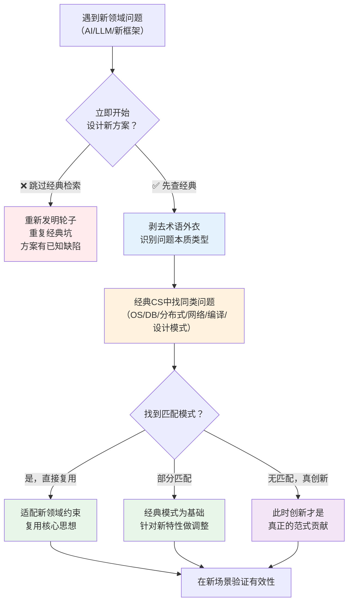

> **提炼自**：6个独立案例（Headroom冷热分层复用Cache思想、RAG复用虚拟内存、拦截器中间件复用HTTP中间件、内容路由复用策略模式、可逆设计复用事务/WAL、MoE复用微服务路由）

# 经典模式优先复用启发式（Classic Patterns First Heuristic）

## 模式类型

方法论模式（问题解决/创新思维/知识迁移）

## 成熟度

L2 已验证（6次验证来源：2026-08 Headroom CCR冷热分层、2026-07 AI上下文层缓存、2026-08 中间件模式复用、2026-08 内容路由复用策略模式、2026-08 可逆设计复用事务WAL、通用MoE架构复用微服务）

## 适用场景

遇到新领域（如AI）的问题，感觉需要"发明"新方案时，先停下来问：**经典计算机科学（或其他成熟领域）中，是否已经有解决同类问题的成熟模式？**

| 场景 | 适用度 | 经典对应领域 |
|------|--------|------------|
| AI/LLM系统架构设计 | ✅✅✅ 核心场景 | 操作系统/数据库/分布式系统/编译原理 |
| 性能/容量瓶颈优化 | ✅✅✅ 核心场景 | 体系结构（Cache/流水线/分支预测） |
| 系统可靠性/容错设计 | ✅✅✅ 核心场景 | 数据库事务/分布式一致性/容错计算 |
| 新功能/新模块设计 | ✅✅ 推荐 | 设计模式（GoF）/架构模式（POSA） |
| 算法/数据处理Pipeline | ✅✅ 推荐 | 编译原理/数据库查询优化/流处理 |
| Agent/MCP工具调用架构 | ✅✅ 推荐 | RPC/微服务/API网关/ORB |
| 完全无先例的全新范式 | ⚠️ 酌情 | 如果真的是范式级变革（如Transformer本身），经典模式可能不够，但实现细节仍大量复用经典思想 |
| 纯算法创新（全新数学模型） | ❌ 不太适用 | 新算法本身可能是创新，但工程实现仍可借鉴经典模式 |

## 问题背景

技术领域快速发展时（如当前AI浪潮），工程师容易陷入两种认知陷阱：

1. **新领域崇拜**：认为"AI是全新的东西，旧经验不适用"，从零开始发明方案，结果重复了经典领域早已解决的坑
2. **术语壁垒**：新领域用了新术语（如"上下文窗口"、"RAG检索"、"Agent工具调用"、"MoE路由"），让人误以为这是全新概念，但剥去术语外衣，底层问题与经典CS完全一致
3. **重新发明轮子**：投入大量精力设计"创新方案"，后来发现经典CS中几十年前就有成熟模式，且比自己设计的更完善

经典反例：
- 上下文窗口管理时"发明"冷热分层 → 实际就是CPU Cache的L1/L2/L3/内存/磁盘五级分层，1980年代就已成熟
- AI Agent工具调用"发明"工具注册/路由/错误重试机制 → 实际就是RPC/微服务架构的服务发现/负载均衡/熔断降级
- RAG检索"发明"按需加载上下文 → 实际就是操作系统虚拟内存/页面置换算法（1960年代）

## 核心原则：剥去术语外衣，识别问题本质



**核心洞察**：太阳底下没有新鲜事——绝大多数"新"问题，只是经典问题在新领域的重新包装。**术语是理解的障碍，而非创新的标志。**

**为什么经典模式值得优先复用？**
1. **经过时间检验**：经典模式在几十年工程实践中被反复验证，边界条件和陷阱已被充分理解
2. **文档/案例丰富**：有大量成熟的最佳实践、反模式、故障案例可供参考
3. **降低认知负担**：复用已知模式比从头设计更快、更可靠
4. **便于沟通**：经典模式有通用名称（如"Cache"、"事务"、"中间件"），团队成员容易理解

## 核心做法：问题-经典映射三步法

### 第一步：剥术语——用通用语言重述问题

遇到新领域术语时，先把它翻译成通用CS问题语言：

| AI/新领域术语 | 经典CS问题本质 | 经典模式 |
|-------------|-------------|---------|
| 上下文窗口（Context Window） | 有限高速存储 vs 海量数据 | CPU Cache分层（L1/L2/L3/RAM/Disk） |
| RAG检索增强 | 按需加载/页面置换 | 虚拟内存/Paging/页面置换算法 |
| Agent工具调用 | 远程过程调用/服务编排 | RPC/微服务/API网关 |
| 模型路由（大小模型选择） | 任务调度/资源分配 | 多级存储/计算卸载 |
| MCP Server | 中间件/协议适配 | ORB/ESB/HTTP中间件 |
| Prompt/System Prompt | 配置/策略注入 | 配置管理/依赖注入 |
| 上下文压缩 | 数据压缩/摘要 | 无损/有损压缩/编码理论 |
| MoE（Mixture of Experts） | 服务路由/负载均衡 | 微服务/策略路由/内容分发 |
| LoRA微调 | 增量更新/差分编码 | Delta编码/Patch/写时复制 |
| Agent Memory | 持久化/状态管理 | 数据库/Cache/状态机 |
| AI 工作流/Chain | 数据处理Pipeline | 编译器Pipeline/Unix管道/ETL |
| 多模态Embedding | 统一表示 | 数据抽象/接口多态 |
| Guardrails/内容安全 | 输入验证/访问控制 | Firewall/ACL/WAF |

**关键问题清单**（剥术语时问自己）：
1. 这个问题的**本质约束**是什么？（如"有限高速存储"、"不可靠网络"、"需要增强功能但不能修改两端"）
2. 在经典领域中，**什么场景有相同的本质约束**？
3. 去掉所有新领域特有的术语，用**最朴素的CS语言**描述这个问题是什么？

### 第二步：查经典——从经典模式库中找匹配

按以下顺序检索经典CS知识：

| 经典领域 | 适合解决的问题类型 | 经典模式/概念 |
|---------|-----------------|-------------|
| **操作系统** | 存储层次、资源调度、并发、隔离、IO | Cache分层、虚拟内存、进程/线程、调度算法、文件系统 |
| **数据库系统** | 数据持久化、一致性、并发控制、查询优化 | ACID事务、WAL、索引、查询优化器、MVCC、复制 |
| **分布式系统** | 网络不可靠、容错、一致性、服务发现 | CAP定理、一致性协议、熔断器、负载均衡、重试/幂等 |
| **计算机网络** | 协议分层、路由、可靠传输、代理 | OSI七层模型、TCP/IP、HTTP中间件、CDN、DNS |
| **编译原理** | 代码转换、优化Pipeline、中间表示 | Lexer/Parser/AST、优化Pipeline、IR、JIT |
| **设计模式（GoF）** | 代码组织、解耦、扩展 | 策略模式、观察者、工厂、代理、装饰器、中间件链 |
| **架构模式（POSA）** | 系统级架构 | 分层架构、管道-过滤器、MVC、微内核、发布-订阅 |
| **软件工程** | 开发流程、质量保障、协作 | CI/CD、测试金字塔、版本控制、代码审查 |

```
检索路径建议：
1. 先想操作系统/数据库——它们解决的是最基础的资源管理问题，很多AI系统问题本质是资源管理
2. 再想设计模式——代码组织层面的问题大多有现成模式
3. 再想分布式系统——涉及多组件协作的问题多有对应模式
4. 最后查架构模式文档和论文——确认是否已有命名的架构模式
```

参考模式：[architecture-over-algorithm.md](../governance-strategy/architecture-over-algorithm.md)（架构先于算法）

### 第三步：适配——将经典模式映射到新领域约束

找到经典模式后，不是生搬硬套，而是：

| 步骤 | 说明 | 示例（Headroom冷热分层） |
|------|------|----------------------|
| **提取核心不变量** | 经典模式中不随领域变化的核心机制 | 热数据速度快但容量小、冷数据容量大但速度慢，根据访问频率自动调度 |
| **识别领域差异** | 新领域与经典场景的不同约束 | 经典Cache由硬件自动管理，LLM上下文需要软件主动控制；页面大小固定，token粒度不一 |
| **针对性调整** | 在核心不变量基础上适配新约束 | 用分类器+路由器替代硬件Cache的自动映射；添加检索增强（RAG-style）替代硬件预取 |
| **验证有效性** | 在新领域验证适配后的模式是否有效 | 实测压缩率87.6%同时保持质量，证明Cache分层思想在上下文管理中有效 |

**关键提醒**：适配 ≠ 放弃经典核心。如果为了适配新领域而抛弃经典模式的核心机制，可能会重新踩坑。

## 反模式

| 反模式 | 为什么错误 | 正确做法 |
|--------|----------|---------|
| 术语壁垒：用了新术语就认为是新问题 | 新术语只是新包装，底层问题本质可能和30年前一样 | 强迫自己用朴素CS语言重述问题，剥离术语 |
| 重新发明轮子：从零设计不查经典 | 你遇到的性能/可靠性问题，OS/DB/分布式领域几十年前就遇到并解决了 | 设计前花30分钟搜索经典方案，比花3天踩坑高效得多 |
| 生搬硬套：不做适配直接套用经典模式 | 新领域有不同约束，硬套会导致水土不服（如把CPU Cache直接套LLM不做粒度调整） | 提取核心不变量，适配领域差异，保留核心机制 |
| 经典万能论：所有问题都能在经典中找到答案 | 有些问题确实是新范式带来的（如Transformer注意力机制本身是创新） | 经典查不到时才真正创新，但工程实现层面仍大量复用经典 |
| 只看术语表面相似就套用 | 类比不当会导致错误设计（如把"AI Agent Memory"直接等于"数据库"忽略了语义检索的特殊性） | 映射时关注"本质约束是否相同"而非"术语是否相似" |
| 过度崇拜新框架/新论文 | 很多AI论文的"创新"实质是经典思想的重新包装，换了术语 | 读论文/新框架时问：去掉新术语，核心机制是否在经典CS中存在？ |
| 忽略反模式和已知陷阱 | 只复用经典模式的"正确做法"，忽略经典中记录的"不要做什么" | 经典模式的反模式/已知缺陷和最佳做法同样重要，一起迁移 |

## 检验标准

做完之后怎么知道做对了？

1. **能说出经典对应**：设计方案时能明确说"这里用了XX经典模式，核心机制是YY"
2. **术语已剥离**：能用朴素语言向不了解AI的人解释系统架构，对方也能理解
3. **没有重复已知陷阱**：经典模式中记录的反模式/坑，在新设计中已规避
4. **适配有理由**：对经典模式的每处调整/偏离，都能说出"因为新领域有XX约束所以这样调整"
5. **命名借用经典**：如果合适，直接借用经典模式名称（如Cache、Pipeline、Middleware）帮助团队理解
6. **创新点明确**：真正的新东西只占整体设计的一小部分（<20%），80%以上是经典模式的适配复用

## 跨场景迁移示例

| AI/新领域场景 | 经典模式来源 | 复用方式 |
|-------------|------------|---------|
| **LLM上下文窗口管理** | CPU Cache分层（L1/L2/L3/RAM/Disk） | 热token常驻窗口，冷历史归档向量库，按需检索加载 |
| **RAG检索增强生成** | 虚拟内存/Paging | 工作集在上下文窗口，不常用的"换出"到向量库，访问时"换入" |
| **Headroom中间件模式** | HTTP中间件/RPC拦截器 | 透明代理层插入调用链，不修改两端实现横切关注点 |
| **内容感知压缩路由** | 策略模式/API网关路由 | 分类器+路由表+多策略，不同类型用最优算法 |
| **CCR可逆压缩** | 数据库WAL/事务回滚 | 原始数据保留，压缩版为"已提交"状态，需要时可"回滚"到原始 |
| **MoE混合专家** | 微服务/负载均衡/CDN | 路由器将请求分发到最合适的专家模型，类似服务路由 |
| **LoRA低秩适配** | Delta编码/写时复制 | 只存储与基础模型的差异，类似增量补丁 |
| **Agent工作流编排** | 编译器Pipeline/Unix管道 | 多个处理阶段串联，每阶段单一职责 |
| **AI Guardrails** | Firewall/WAF/输入验证 | 输入/输出检查规则链，逐层过滤 |
| **多模型A/B测试** | 灰度发布/金丝雀部署 | 小流量验证新版本，逐步扩大，有问题快速回滚 |

## 实际案例

### 案例1：Headroom冷热分层（本模式直接来源）

- **问题**：LLM上下文窗口有限（如128K tokens），但会话历史可能很长，如何管理？
- **术语陷阱**："上下文窗口管理"听起来像新问题
- **剥术语后**：本质是"高速存储（窗口）容量有限，大量数据（历史）需要分层存储，按需加载"——这就是Cache分层问题
- **经典对应**：CPU Cache层次结构（寄存器→L1→L2→L3→内存→磁盘），1970-80年代已成熟
- **适配**：压缩摘要=热Cache（常驻窗口），原始上下文=冷存储（本地向量库），检索=Cache Miss时加载
- **效果**：10144→1260 tokens（87.6%压缩率）且保留回溯能力
- **教训**：Headroom设计团队没有"发明"新概念，而是直接复用了计算机体系结构中最经典的Cache思想

### 案例2：拦截器中间件模式（Headroom Proxy）

- **问题**：想给LLM调用增加压缩/缓存/日志/限流功能，但不想修改应用代码也不想修改LLM本身
- **术语陷阱**："Harness Engineering"、"AI中间件"听起来像新概念
- **剥术语后**：本质是"在调用链中插入透明层增强功能，不侵入两端"——这就是中间件/拦截器模式
- **经典对应**：HTTP中间件（Express/Koa middleware链）、RPC拦截器、AOP面向切面编程，2000年代已成熟
- **教训**：P1洞察（拦截器中间件模式）在Headroom中看起来是"AI领域创新"，实际上是经典模式在AI调用链上的直接复用

### 案例3：内容感知路由（多算法组合）

- **问题**：单一压缩算法处理所有类型内容效果差，如何优化？
- **剥术语后**：本质是"不同类型输入需要不同处理策略，先分类再分发"——这是策略模式+路由
- **经典对应**：GoF策略模式（1994）、API网关路由、邮件MIME类型路由
- **教训**：P2洞察（多算法组合+路由层）本质上是经典策略模式在压缩场景的应用

### 案例4：CCR可逆设计

- **问题**：压缩可能丢失信息，如何保留回溯能力？
- **剥术语后**：本质是"操作前保留原始状态，需要时可恢复"——这是事务/WAL/备份思想
- **经典对应**：数据库ACID事务、Write-Ahead Logging、文件系统快照，1980-90年代已成熟
- **教训**：I5洞察（可逆设计）是数据库事务思想在上下文压缩场景的直接复用

### 案例5：RAG检索增强（行业广泛案例）

- **问题**：LLM知识有限，如何让它访问私有/最新数据？
- **剥术语后**：本质是"主存不够用时，把不常用的数据放到辅存，需要时再加载"——这是虚拟内存
- **经典对应**：虚拟内存/分页/页面置换算法（LRU等），1960年代Multics系统已实现
- **教训**：RAG的核心思想和虚拟内存完全一致——"按需加载"是1960年代就有的思想

### 案例6：MoE混合专家（行业架构案例）

- **问题**：单一模型难以同时处理所有类型任务，如何组合多个专家模型？
- **剥术语后**：本质是"请求分发到多个服务实例，根据请求类型选择最合适的处理器"——这是服务路由
- **经典对应**：微服务架构、负载均衡、CDN内容路由、CORBA ORB
- **教训**：MoE架构中"Router+Experts"的组合与微服务网关+服务集群的架构完全同构

## 与其他模式的关系

| 关联模式 | 关系类型 | 关系说明 |
|---------|---------|---------|
| [experience-transfer-mapping.md](../retrospective-knowledge/experience-transfer-mapping.md) | 方法论支撑 | 本模式是经验迁移映射在"经典CS→AI新领域"方向的具体化；经验迁移是通用方法，本模式是特定方向的启发式 |
| [reverse-adaptation-innovation.md](../creative-design/reverse-adaptation-innovation.md) | 反向关系 | 逆向适配是从极端/辅助领域借约束创新；本模式是从经典成熟领域借模式复用，方向相反但都是跨领域迁移 |
| [cross-domain-semantic-drift.md](cross-domain-semantic-drift.md) | 防御配套 | 跨领域复用时要警惕语义漂移——同一术语在不同领域含义不同，剥术语时要确认核心约束确实一致 |
| [architecture-over-algorithm.md](../governance-strategy/architecture-over-algorithm.md) | 理念一致 | 架构先于算法强调架构选择的重要性；本模式提供了"从经典架构库中选择"的具体路径 |
| [reversibility-guarantee.md](../../architecture-patterns/reversibility-guarantee.md) | 案例来源 | I5可逆设计模式是本启发式的一个验证案例——从事务/WAL经典思想复用而来 |
| [content-type-routing.md](../../architecture-patterns/content-type-routing.md) | 案例来源 | I4内容类型路由是本启发式的验证案例——从策略模式/API网关经典思想复用而来 |
| [data-lifecycle-economic-stratification.md](../../architecture-patterns/data-lifecycle-economic-stratification.md) | 案例来源 | 数据冷热分层是Cache思想在数据生命周期管理的复用 |
| [layered-caching-pattern.md](../ai-collaboration/layered-caching-pattern.md) | 同领域实例 | AI上下文分层缓存是Cache思想在AI协作场景的具体应用模式 |
| [knowledge-system-five-foundations.md](knowledge-system-five-foundations.md) | 原则支撑 | 知识系统五维根基强调从基础学科原理推导设计，本模式是其在问题解决维度的具体启发式 |

## Changelog

- 2026-08-03 | create | 初始版本，从Headroom冷热分层洞察（I6）+ 5个经典模式复用案例沉淀，L2成熟度，6次验证实例
